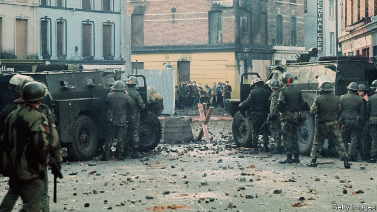

###### Northern Ireland

# A prosecution over Bloody Sunday is announced 

##### One British soldier will be tried over the killings 

 

> Mar 14th 2019 

FOR NEARLY half a century, John Kelly has been recalling the day when his teenage brother Michael died after British soldiers fired on a civil-rights march. In his role as education officer at the Free Derry Museum, describing every detail has become his job. On March 14th campaigners like him received a limited vindication when the public prosecutor announced that one former soldier would be prosecuted in connection with the 13 killings in 1972 known as Bloody Sunday. 

The prospect of a trial appals Britain’s military establishment, including veterans, who are a vocal group in the Conservative Party. “British soldiers are being hung out to dry while those they fought are treated by different rules,” said Bob Seely, an ex-soldier and Tory MP, as arguments raged in advance of the announcement. As the Bloody Sunday news was released in Derry, former comrades were gathering in London in support of Dennis Hutchings, an ex-soldier who is appealing to the Supreme Court to quash charges of attempted murder in relation to a fatal shooting in County Tyrone in 1974. 

Wounds are reopening among all the parties to a 30-year war which claimed more than 3,500 lives before it ended in 1998. On March 11th people bereaved by paramilitary groups told heart-rending stories when a European organisation commemorating “victims of terrorism” brought its annual meeting to Belfast. It heard bitter complaints that demands for the trial of soldiers were obscuring the crimes perpetrated by their enemies. 

Meanwhile, among those who want redress against the British state, there is a feeling that the Bloody Sunday prosecution should be only the start. In Belfast, an emotionally charged inquest is currently probing ten killings by the army in the city’s Ballymurphy district in August 1971. It was told this week by a retired general, Sir Geoffrey Howlett, that most victims were not terrorists. He voiced “enormous sympathy” for the bereaved. 

All this creates a challenge to Northern Ireland’s peace process, already shaken by Brexit, which only deft handling can overcome. In Derry, city elders already work hard behind the scenes to limit the fallout from periodic recurrences of violence, such as a bomb which went off outside a court on January 20th. 

But the government has not been deft. Karen Bradley, the Northern Ireland secretary, had to apologise after she told Parliament that security forces had always behaved in a “dignified and appropriate” way. For nationalists in Derry, these words are a fresh sign of how little Britain even tries to understand them. 

-- 

 单词注释:

1.prosecution[.prɒsi'kju:ʃәn]:n. 执行, 经营, 起诉 

2.bloody['blʌdi]:a. 血腥的, 嗜杀的, 有血的 

3.killing['kiliŋ]:n. 谋杀, 杀戮 a. 杀害的, 疲惫的, 迷人的 

4.john[dʒɔn]:n. 盥洗室, 厕所, 嫖客 

5.Kelly['keli]:n. 凯利（男子名）；[古]战士 

6.teenage['ti:nidʒ]:a. 十三岁到十九岁的 

7.michael['maikl]:n. 迈克尔（男子名） 

8.Derry['deri]:n. 民谣, 歌谣 

9.campaigner[kæm'peinә]:n. 从军者, 老兵, 竞选者 

10.vindication[.vindi'keiʃәn]:n. 辩护, 证明无辜, 辩明 [法] 辩明, 辩白, 辩护 

11.prosecutor['prɒsikju:tә]:n. 实行者, 告发者, 公诉人 [法] 原告, 起诉人, 检举人 

12.prosecute['prɒsikju:t]:vt. 告发, 起诉, 彻底进行, 执行, 从事 vi. 告发, 起诉, 作检察官 

13.appal[ә'pɒ:l]:vt. 使惊骇, 使吓坏 

14.vocal['vәukl]:a. 嗓音的, 声音的, 有声的, 歌唱的 n. 元音, 声乐作品 

15.bob[bɒb]:vt. 剪短, 敲击 vi. 振动, 上下跳动 n. 短发, 悬挂的饰品, 浮子, 摆动, 轻敲, 5便士 

16.seely['si:li]:可怜的, 令人怜悯的 

17.Tory['tɒ:ri]:n. 托利党党员, 保守党员, 亲英分子 a. 保守分子的 

18.MP[]:国会议员, 下院议员 [计] 宏处理程序, 维护程序, 线性规划, 微程序, 多处理器 

19.dennis['denis]:n. 丹尼斯（男子名） 

20.hutching[hʌtʃ]:n. 笼；小屋；贮藏箱；矿车 vt. 把…装箱 

21.quash[kwɒʃ]:vt. 撤销, 平息, 镇压 [法] 撤销, 废止, 宣布无效 

22.Tyrone[ti'rәun]:蒂龙(男子名) 

23.reopen[.ri:'әupәn]:v. 重开, 再开始, 再开 

24.bereaved[bi'ri:vd]:a. 丧失亲人的 bereave的过去式和过去分词 

25.paramilitary[.pærә'militәri]:a. 辅助军事的 

26.organisation[,ɔ: ^әnaizeiʃən; - ni'z-]:n. 组织, 团体, 体制, 编制 

27.commemorate[kә'memәreit]:vt. 纪念 

28.terrorism['terәrizm]:n. 恐怖主义, 恐怖统治, 恐怖状态 [法] 胁迫, 暴政, 恐怖政治 

29.Belfast[.belfɑ:st]:n. 贝尔法斯特 

30.perpetrate['pә:pitreit]:vt. 做(恶), 犯(罪), 胡说, 恶劣地做 [法] 犯, 作, 行 

31.redress[ri'dres]:n. 赔偿, 补救, 矫正 vt. 纠正, 赔偿, 救济 

32.emotionally[i'mәuʃәnәli]:adv. 在情绪上 

33.inquest['inkwest]:n. 审讯, 讯问, 验尸 [医] 验尸 

34.currently['kʌrәntli]:adv. 现在, 当前, 一般, 普通 [计] 当前 

35.probe[prәub]:n. 探索, 调查, 探针, 探测器 v. 用探针探测, 调查, 探索 

36.Ballymurphy[]:巴利墨非 

37.geoffrey[]:n. 杰弗里（男子名） 

38.Howlett[]:n. (Howlett)人名；(英)豪利特 

39.terrorist['terәrist]:n. 恐怖分子 [法] 恐怖份子, 恐怖主义 

40.Brexit[]:[网络] 英国退出欧盟 

41.deft[deft]:a. 敏捷熟练的, 灵巧的 

42.fallout['fɒ:laut]:n. 原子尘的降下, 辐射性微尘, 原子尘, 附带结果 [医] [放射尘]回降 

43.periodic[.piәri'ɒdik]:a. 周期的, 定期的, 间歇(性)的, 循环的, 用完整句的, 高碘的 [医] 周期性的 

44.recurrence[ri'kʌrәns]:n. 再现, 再发生, 反复, 循环 [医] 复发, 再发 

45.karen['kɑ:rәn]:n. 凯伦（人名）；克伦邦（缅甸邦名） 

46.bradley['brædli]:n. 布兰得利（男子名） 

47.apologise[ә'pɔlәdʒaiz]:vi. 道歉（等于apologize） 

48.alway['ɔ:lwei]:adv. 永远；总是（等于always） 

49.dignify['dignifai]:vt. 增威严, 使高贵, 故作显贵 

50.nationalist['næʃәnәlist]:n. 国家主义者, 民族主义者 

