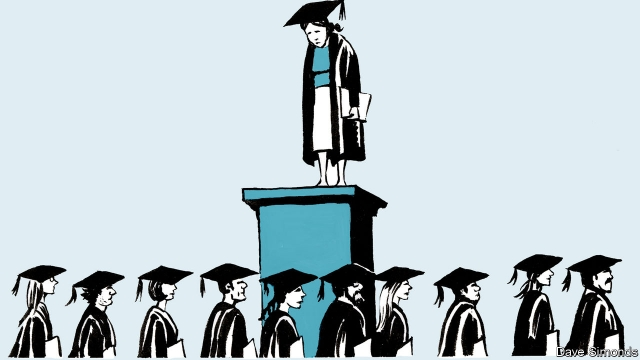

###### Last women standing

# Another women-only Cambridge college goes mixed 

##### Do the remaining ones have a future? 

 

> Mar 14th 2019 

LUCY CAVENDISH is different from other Cambridge colleges, both in its modest appearance and its character. “We’re not hierarchical, we’re very open and friendly, we’re not pretentious,” says Dame Madeleine Atkins, its president. Yet it is soon to become a bit less distinctive. On March 12th the college announced that from 2021 it will accept men. (It will also admit under-21s for the first time.) That will leave only two women-only colleges in Cambridge: Murray Edwards and Newnham. Oxford lost its last in 2008, when St Hilda’s opened its gates to men. 

The colleges were set up to end the male monopoly at the universities, with Girton College the first in 1869, some 79 years before women could officially be awarded Cambridge degrees. At Newnham and Lucy Cavendish all fellows are women, but male ones are allowed at Murray Edwards. None of the colleges has the sort of restrictions on male guests that once forced amorous visitors to vault college walls. Still, in an article in Varsity, a student newspaper, a columnist recalls telling teachers about her destination: “They thought I wanted to become a nun or was a ‘full-on feminist’.” 

The colleges have made much progress in their founding mission: 49.5% of the Cambridge undergraduate intake is female, and women are now more likely than men to attend university. It was this that prompted the change of policy, says Dame Madeleine. In addition, the number of mature students has recently plummeted, partly because of higher fees, making life tricky for a college dedicated to them. 

Few applicants are keen on women’s colleges, either. Two-thirds of the most recent undergraduate intake at Murray Edwards originally applied to a different college. “The biggest challenge is getting across the idea that students are not cut off from men,” says Dame Barbara Stocking, its president. She believes that the college’s job is to prepare young women for a working world dominated by men by encouraging them to take risks, and that it will only be finished when there is true gender equality. 

To inspire students, Murray Edwards has a collection of more than 500 works by women artists, including Tracey Emin and Barbara Hepworth, as well as an “enrichment programme” that builds connections with alumnae. Students at Newnham are encouraged to take a similar approach. Visitors to the college’s website are greeted with a quote from a recent graduate: “I am now part of Newnham’s tradition of producing strong, witty and rebellious women.” It is, however, a tradition that is becoming increasingly unusual. 

-- 

 单词注释:

1.Cambridge['keimbridʒ]:n. 剑桥 

2.lucy['lu:si]:n. 露西（女子名） 

3.cavendish['kævәndiʃ]:n. 板烟 

4.hierarchical[,haiә'rɑ:kikәl]:[计] 分级的, 分层的, 层次的 

5.pretentious[pri'tenʃәs]:a. 自负的, 自命不凡的, 夸耀的 

6.dame[deim]:n. 夫人 

7.Madeleine['mædәlin, -lein]:n. 马德琳（女子名） 

8.Atkin[]:n. (Atkin)人名；(英)阿特金 

9.les[lei]:abbr. 发射脱离系统（Launch Escape System） 

10.distinctive[di'stiŋktiv]:a. 有特色的, 出众的 

11.murray['mʌri, 'm\\:-]:n. 默里（男子名）；墨累河（澳大利亚东南部一条河流） 

12.edward['edwәd]:n. 爱德华（男子名） 

13.Newnham[]:n. (Newnham)人名；(英)纽纳姆 

14.Oxford['ɒksfәd]:n. 牛津, 牛津大学 

15.ST[]:[计] 段表, 状态, 系统测试, 直端连接器 [化] 磺胺噻唑 

16.monopoly[mә'nɒpәli]:n. 垄断, 专卖权, 独占事业 [经] 垄断, 专利品, 垄断(权)独占 

17.Girton[]:n. (Girton)人名；(英)格顿 

18.officially[ә'fiʃәli]:adv. 作为公务员, 职务上, 官方地 

19.lucy['lu:si]:n. 露西（女子名） 

20.cavendish['kævәndiʃ]:n. 板烟 

21.amorous['æmәrәs]:a. 多情的, 表示爱情的, 恋爱的 

22.vault[vɒ:lt]:n. 拱顶, 窖, 地下室, 撑竿跳, 穹窿 vt. 做成圆拱形, 撑竿跳过 vi. 成穹状弯曲, 跳跃 

23.varsity['vɑ:sәti]:n. 大学运动代表队；大学 

24.columnist['kɒlәmist]:n. 专栏作家 

25.nun[nʌn]:n. 修女, 尼姑 

26.intake['inteik]:n. 入口, 吸入, 吸入量 [医] 摄取量 

27.plummete[]:[网络] 直线下降 

28.tricky['triki]:a. 狡猾的, 机敏的 

29.dedicate['dedikeit]:vt. 献出, 贡献 

30.originally[ә'ridʒәnli]:adv. 本来, 原来, 最初, 就起源而论, 独创地 

31.barbara['bɑ:bәrә]:n. 芭芭拉（女子名） 

32.gender['dʒendә]:n. 性 vt. 产生 

33.Tracey[]:n. 特蕾西（女子名） 

34.emin[]:abbr. Eminence 出众，显赫 

35.Hepworth[]:n. (Hepworth)人名；(英)赫普沃思 

36.enrichment[in'ritʃmәnt]:n. 丰富, 肥沃 [化] 富集 

37.alumna[ә'lʌmnә]:n. 女毕业生, 女校友 

38.witty['witi]:a. 富于机智的, 诙谐的 

39.rebellious[ri'beljәs]:a. 造反的, 反抗的 [法] 造反的, 反抗的, 反判的 

