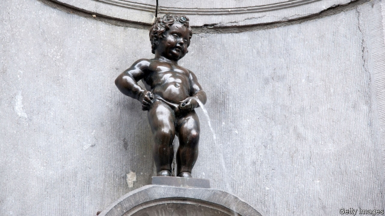

###### Extend, but don’t pretend

# The EU is willing to extend Article 50—as long as Britain has a plan 

##### Patience for “the same old stuff” is running out 

 

> Mar 14th 2019 

THE MORNING after Theresa May’s Brexit deal was defeated, 27 fed-up ambassadors from across the European Union gathered in Brussels for yet another meeting on Brexit. But, for once, there was something to discuss: whether to grant an extension to the Article 50 deadline. 

Delaying Brexit beyond March 29th requires the unanimous approval of heads of government at the EU summit, set for March 21st. The parameters of any extension are already becoming clear. Britain must offer a “credible” reason, in the words of Donald Tusk, the European Council president, which were echoed by leaders from across the block. And if it wishes to hang on as a member beyond the European elections at the end of May it must elect a new batch of MEPs. 

But what counts as “credible”? A long delay so that Britain could have a general election or a second referendum would almost certainly cover it, say diplomats and EU officials. Likewise, a fundamental change in Britain’s Brexit strategy. 

A short extension to avoid Britain crashing out comes with little cost to the EU. A no-deal exit may be worse for Britain, but it is hardly a good outcome for the EU either, point out diplomats. Most predict that the EU will happily offer a short extension until the European elections. 

Mr Tusk has urged members to be “open” to a longer delay. But there is reluctance to give extra time purely so that Mrs May can continue banging her head against a wall, or to allow MPs to propose ideas already dismissed by Brussels. France is firm on this, calling any such extension “totally unacceptable”. It is not alone. “If it is the same old stuff, why would we give any extension?” asks one commission official. 

Other than demanding unanimous agreement, Article 50 is silent on what terms must be offered. EU leaders can be as strict or as lenient as they like. An extension that bleeds into the EU’s next budget period would be too complicated, say some diplomats, suggesting a natural upper limit of 2020. It may be a strict one-off or more open-ended. Whatever happens will be a nakedly political decision taken by 27 leaders, all with their own national concerns, round a table in Brussels. 

Patience is not infinite. Throughout the negotiations, heads of government have tended to be tougher than their ministerial underlings. All 27 leaders face the ballot box in the upcoming elections, where a gamut of populists and radicals are expected to sweep up seats, turning the European Parliament into a political zoo. A firm line with Britain may help some EU leaders fend off this domestic populist menace. 

When it comes to the European elections, the main concern is legal rather than political. If Britain is still in the EU by the time elections roll around, the country will be obliged to elect new MEPs, insist diplomats. Any doubts about the legality of a European Parliament constituted without British MEPs while Britain is still a member risks legal challenge, destroying the quarantine maintained between Brexit and other policy areas in the EU. 

An election campaign in the dog days of Brexit wrangling is the last thing many MPs want. The proportional representation system for European elections would probably boost a populist, Brexit-supporting party, and allow insurgent Remainers, such as the Independent Group of MPs, to gain a foothold. Brexit could yield a final irony: British voters may, for the first time, pay attention to European elections. 

-- 

 单词注释:

1.EU[]:[化] 富集铀; 浓缩铀 [医] 铕(63号元素) 

2.theresa[ti'ri:zә]:n. 特丽萨（女子名） 

3.Brexit[]:[网络] 英国退出欧盟 

4.Brussel[]:n. 布鲁塞尔（比利时首都） 

5.unanimous[ju:'nænimәs]:a. 意见一致的, 无异议的 

6.parameter[pә'ræmitә]:n. 参变数, 参变量, 参数, 参量 [计] 参量; 参数 

7.credible['kredәbl]:a. 可信的, 可靠的 [法] 可信的, 可靠的 

8.tusk[tʌsk]:n. 长牙, 獠牙, 尖物 vt. 以长牙刺戳, 以长牙掘 

9.batch[bætʃ]:n. 一次所烘的面包, 一次所制之量, 一组, 批, 成批, 分批 v. 成批, 分批处理 [计] 一批 

10.MEP[]:[化] 最低能量途径 

11.referendum[.refә'rendәm]:n. （就重大政治或社会问题进行的）全民公决，全民投票 

12.diplomat['diplәmæt]:n. 外交官, 有外交手腕的人 [法] 外交家, 外交官, 有权谋的人 

13.reluctance[ri'lʌktәns]:n. 不情愿, 勉强 [电] 磁阻 

14.Mr['mistә(r)]:先生 [计] 存储器回收程序, 多重请求 

15.MP[]:国会议员, 下院议员 [计] 宏处理程序, 维护程序, 线性规划, 微程序, 多处理器 

16.unacceptable[.ʌnәk'septәbl]:a. 无法接受的, 不受欢迎的 [法] 不能接受的, 不受欢迎的, 难以承认的 

17.lenient['li:njәnt]:a. 宽大的, 温和的, 慈悲为怀的 [法] 宽大的, 仁慈的 

18.nakedly[]:adv. 裸体地；露出地 

19.negotiation[ni.gәuʃi'eiʃәn]:n. 谈判, 磋商, 交涉 [经] 谈判, 协商 

20.ministerial[.mini'stiәriәl]:a. 部长的, 内阁的, 执政的 [法] 部长的, 部的, 公使的 

21.underling['ʌndәliŋ]:n. 部下, 下手, 下属 

22.ballot['bælәt]:n. 投票, 投票用纸, 抽签 vi. 投票, 抽签 vt. 投票选出, 拉选票 

23.upcoming['ʌp.kʌmiŋ]:a. 即将来临的, 即将出现的 

24.gamut['gæmәt]:n. 音阶, 整个范围, 全部, 音域 

25.Populist['pɔpjulist]:n. 民粹派的成员 

26.fend[fend]:vt. 击退, 保护, 供养 

27.menace['menis]:n. 威胁, 胁迫 v. 威吓, 胁迫 

28.legality[li:'gæliti]:n. 合法, 正当 [经] 合法性 

29.constitute[kәn'stitjut]:vt. 构成, 组成, 任命 [建] 构造, 组成 

30.quarantine['kwɒrәnti:n]:n. 隔离, 封锁交通, 检疫期 vt. 隔离, 排斥 

31.wrangle['ræŋgl]:vi. 争论, 口角 vt. 辩驳, 放牧 n. 口角, 吵嘴 

32.representation[.reprizen'teiʃәn]:n. 表示法, 表现, 陈述, 代表 [计] 表示法指定 

33.insurgent[in'sә:dʒәnt]:a. 谋叛的, 起义的, 澎湃的 n. 起义者, 叛乱者 

34.remainers[]:[网络] 剩余物 

35.foothold['futhәuld]:n. 立足处, 据点, 根据地 

36.voter['vәutә]:n. 选民, 投票人 [法] 选民, 选举人, 投票人 

