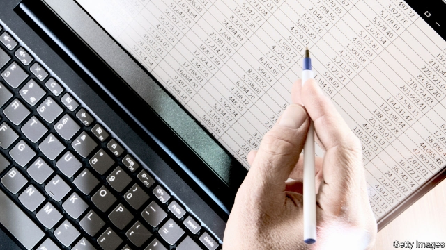

###### From cosy to nosy

# The government announces plans for a mightier audit regulator 

##### Goodbye FRC, hello ARGA 

 

> Mar 14th 2019 

THE COLLAPSE of Carillion, a construction firm with many public-sector contracts, catapulted auditors into the glare of public scrutiny last year. Angry parliamentarians, anxious to know why auditors had failed to raise the alarm, accused the Big Four accounting networks—Deloitte, EY, KPMG and PwC—of being too cosy with the firms they were meant to be scrutinising. The Financial Reporting Council (FRC), which regulates auditors and oversees corporate reporting, also came under fire for its “feebleness and timidity”. 

The government has since launched several reviews of the audit industry. The first to conclude, in December, was an inquiry into the FRC led by Sir John Kingman, the chairman of Legal & General, an insurer. On March 11th Greg Clark, the business secretary, said he would take forward most of Sir John’s recommendations. Chief among them is the replacement of the FRC with a more powerful regulator, to be named the Audit, Reporting and Governance Authority (ARGA). 

Sir John’s inquiry identified so many flaws with the current set-up that he proposed a whopping 83 recommendations. One problem is that the FRC has no clear statutory duties or powers. If it wants a company to restate its accounts, it must seek a court order. Bizarrely, it can take action against a company’s directors only if they are qualified accountants. Sir John also worried that the regulator has been too close to the accountants. It is partly funded through voluntary contributions from listed companies, and rarely advertises senior positions publicly, sometimes relying on the Big Four’s networks. 

ARGA will be tasked with promoting the interests of the consumers of financial information, and will be able to demand that companies comply with its directives immediately. Funding will rely on compulsory levies from companies, and senior positions will be publicly advertised. (Stephen Hadrill, the FRC’s chief executive, has already said he will step down this year.) Sir John wants the new regulator to be able to investigate and correct accounts as they are prepared, rather than conducting retrospective reviews. 

It seems sensible to create a more muscular regulator with a clear purpose. But Karthik Ramanna of Oxford University argues that cosiness is always a risk, given the close-knit nature of the audit industry. Continued public scrutiny could remind both auditors and their regulator of their responsibilities to investors and to society. It might help that ARGA’s bosses will be asked to appear in front of MPs every year. The FRC was hauled in front of lawmakers only after things had gone wrong. 

Mr Clark plans to press forward with the proposals after a few weeks’ consultation. And with other reviews into the audit industry under way, further changes are still to come. The Competition and Markets Authority is investigating ways to invigorate competition in the sector, which could include splitting accounting firms’ auditing arms from their consulting businesses, and forcing the Big Four to conduct joint audits with challenger firms. A parliamentary inquiry will work out how to implement its recommendations. And a further review is mulling the deeper question of whether the scope of an audit needs rethinking. Bean-counters will be in the spotlight for a while yet. 

-- 

 单词注释:

1.nosy['nәuzi]:a. 大鼻子的, 好管闲事的, 爱打听的 n. 大鼻者 

2.mighty['maiti]:n. 有势力的人 a. 有势力的, 强大的, 有力的 adv. 很, 极 

3.audit['ɒ:dit]:n. 审计, 查帐 vt. 查(帐), 旁听 vi. 查账 [计] 查帐; 审查; 检查 

4.regulator['regjuleitә]:n. 调整者, 校准者, 校准器, 调整器, 标准钟 [化] 调节剂; 调节器 

5.FRC[]:abbr. 货物交与承运人价格（Free Carrier-Named Point）；阻燃粘胶纤维 

6.arga[]:abbr. appliance; range; adjust (data processing) 用具; 范围 

7.catapult['kætәpʌlt]:n. 弹射器, 弹弓, 弩炮 vt. 发射 

8.auditor['ɒ:ditә]:n. 审计员, 听者, 旁听生 [经] 审计(查帐)员, 审计师, 会计检查员 

9.scrutiny['skru:tini]:n. 细看, 仔细检查, 监视, 选票检查 [经] 复查, 评核, 仔细检查 

10.parliamentarian['pɑ:lәmen'teәriәn]:n. 议会法规专家, 国会议员, 熟悉议会法规而又有经验的议员 

11.ey[]:abbr. 医院；阿联酋阿提哈德航空公司 

12.KPMG[]:abbr. 毕马威会计事务所 

13.scrutinise[]:vt.vi. 细看, 仔细检查, 审查, 细阅 [经] 详细检查, 细细地看 

14.oversee[.әuvә'si:]:vt. 向下看, 了望, 监督, 偷看到 [法] 监察, 监督, 俯瞰 

15.corporate['kɒ:pәrit]:a. 社团的, 合伙的, 公司的 [经] 团体的, 法人的, 社团的 

16.feebleness['fi:blnis]:n. 弱, 微弱 

17.timidity[ti'miditi]:n. 胆小, 胆怯, 羞怯 

18.john[dʒɔn]:n. 盥洗室, 厕所, 嫖客 

19.kingman[]: [人名] [英格兰人姓氏] 金曼来源于King,含义是“金之仆”(servant of King); [地名] [加拿大、美国] 金曼 

20.insurer[in'ʃuәrә]:n. 保险公司 [法] 保险人, 承保人, 保险公司 

21.greg[greg]:n. 格雷格（男子名, 等于Gregory） 

22.clark[]:n. 克拉克（男子名） 

23.replacement[ri'pleismәnt]:n. 归还, 更换, 代替者 [医] 复位, 置换 

24.audit['ɒ:dit]:n. 审计, 查帐 vt. 查(帐), 旁听 vi. 查账 [计] 查帐; 审查; 检查 

25.governance['gʌvәnәns]:n. 统治, 统辖, 管理 [法] 统治, 管理, 支配 

26.flaw[flɒ:]:n. 缺点, 裂纹, 瑕疵, 一阵狂风 [化] 划痕; 裂缝; 裂纹 

27.whop[hwɒp]:v. 打, 抽出, 打败, 征服 n. 重击, 打击声 

28.statutory['stætjutәri]:a. 法令的, 法定的, 可依法惩处的 [经] 法定的 

29.restate[.ri:'steit]:vt. 重新叙述, 重申 [法] 重新陈述, 再申明, 重申 

30.bizarrely[bɪ'zɑ:lɪ]: 古怪地; 怪诞地 

31.comply[kәm'plai]:vi. 顺从, 依从 [法] 遵守, 承诺, 照做 

32.directive[di'rektiv]:a. 指导的, 指挥的, 方向的 n. 指令 [计] 指令; 命令 

33.levy['levi]:n. 税款, 所征的人数, 征收 vi. 征税, 课税 vt. 征收, 强求, 召集 

34.stephen['sti:vn]:n. 斯蒂芬（男子名） 

35.hadrill[]: [人名] [英格兰人姓氏] 哈德里尔 Hatherell的变体 

36.retrospective[.retrә'spektiv]:a. 回顾的, 怀旧的, 在后面的 n. 回顾展 

37.muscular['mʌskjulә]:a. 强壮的, 肌肉发达的, 有力的 [医] 肌的; 肌肉发达的 

38.ramanna[]:拉曼纳 

39.Oxford['ɒksfәd]:n. 牛津, 牛津大学 

40.cosiness['kəʊzɪnəs]:n. 舒适, 安逸 

41.alway['ɔ:lwei]:adv. 永远；总是（等于always） 

42.investor[in'vestә]:n. 投资者 [经] 投资者 

43.MP[]:国会议员, 下院议员 [计] 宏处理程序, 维护程序, 线性规划, 微程序, 多处理器 

44.haul[hɒ:l]:n. 用力拖拉, 拖运, 强拉, 捕获量, 拖运距离 vi. 拖, 拉, 改变方向, 改变主意 vt. 拖拉, 拖运 

45.lawmaker[lɒ:'meikә]:n. 立法者 

46.consultation[.kɒnsәl'teiʃәn]:n. 请教, 咨询, 磋商会 [医] 会诊 

47.invigorate[in'vigәreit]:vt. 使精力充沛, 鼓舞, 搞活, 使健壮 

48.sector['sektә]:n. 扇形, 部门, 部分, 函数尺, 象限仪, 段, 区段 vt. 把...分成扇形 [计] 扇面; 扇区; 段; 区段 

49.challenger['tʃælindʒә]:n. 挑战者 [经] 申请回避的人 

50.parliamentary[.pɑ:lә'mentәri]:a. 国会的, 议会的, 议会制度的 

51.mull[mʌl]:n. 软薄布, 混乱 vt. 研磨, 细想 vi. 深思熟虑 

52.rethink[ri:'θiŋk]:v. 再想, 重想 

53.spotlight['spɒtlait]:n. 照明灯, 反光灯, 聚光灯 

