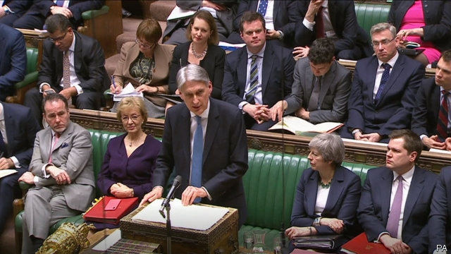
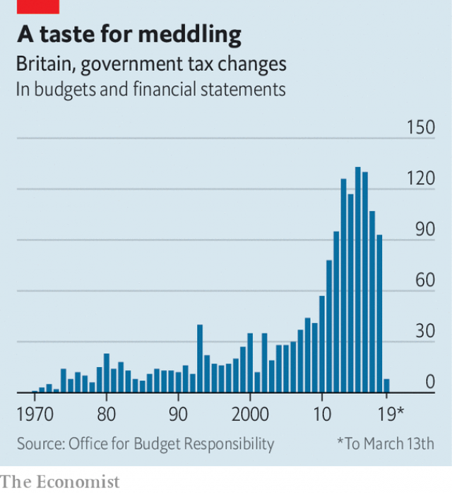

###### Fiscal frippery

# The spring statement combined surreal economics with blunt politics 

##### Brexit makes a mockery of fiscal forecasting 

 

> Mar 16th 2019 

THE CHANCELLOR’S half-yearly statement on the public finances is usually one of the biggest events in the political calendar. Not so on March 13th, when Philip Hammond rose in the House of Commons to deliver his spring statement. The chamber was far from full. Conservative MPs sitting directly behind Mr Hammond checked their phones as he delivered his speech. “I am acutely conscious of the fact that the House has other pressing matters on its mind today,” Mr Hammond began. 

Brexit is not just a distraction. It also makes a mockery of the process of fiscal forecasting. The Office for Budget Responsibility, the fiscal watchdog, makes its projections based on current government policy. For now it assumes a smooth exit from the EU on March 29th. Yet after a week of Commons defeats the government looks set to request an extension to the exit date. And although MPs have also voted against a no-deal exit, that is not enough to stop such an outcome happening by accident. Since no one has the foggiest idea how Brexit will pan out, fiscal forecasts are barely worth the paper they are written on. 

Yet the government is required to deliver two fiscal updates a year. Mr Hammond also loves his numbers. MPs were therefore treated to the chancellor reeling off forecast after forecast, often with an absurd level of precision. By 2023, Mr Hammond claimed, the economy will have 600,000 more jobs. GDP growth that year will be 1.6%—no more, no less. To pad out the speech the chancellor chucked in a few cheap but crowd-pleasing announcements: an extra £100m ($130m) for the police in 2019-20 to tackle a surge in knife crime, and free sanitary products in secondary schools. 

 

The real meat in this year’s spring statement was not policy but politics. Mr Hammond, normally not a very political chancellor, spent a lot of his speech attacking Labour. He claimed that John McDonnell, his opposite number, views business as “the enemy”. The message was clear: the Tory government might be making a pig’s ear of Brexit, but under Labour everything would be even worse. 

The attacks on the opposition, however, concealed subtler criticisms of Theresa May. Mr Hammond argued that if MPs approved a withdrawal deal with the EU the economy would pick up and he would be able to loosen the fiscal purse-strings—what he calls his “deal dividend”. No-deal, by contrast, “would mean significant disruption in the short and medium term.” 

Mrs May’s attempts to get her withdrawal agreement through Parliament have failed. Yet as Britain edges ever closer to the cliff edge, she has shown little desire to adapt the agreement to win Labour support. The only solution, Mr Hammond proclaimed, was to reach “a consensus across this House for a deal we can collectively support, to exit the EU in an orderly way.” Two years ago rumours swirled that Mrs May was to sack Mr Hammond over his pro-EU views. That he now feels free to tell her publicly how to do her job is a measure of how much authority she has lost. 

-- 

 单词注释:

1.fiscal['fiskәl]:a. 财政的, 国库的 [经] 财政上的, 会计的, 国库的 

2.frippery['fripәri]:n. 便宜而俗艳的服装, 无用的东西 

3.surreal[sә'riәl]:a. 超现实主义的；离奇的；不真实的 

4.blunt[blʌnt]:a. 钝的, 坦率的, 麻痹的 

5.politic['pɒlitik]:a. 精明的, 明智的, 策略的 

6.Brexit[]:[网络] 英国退出欧盟 

7.mockery['mɒkәri]:n. 嘲弄, 笑柄, 歪曲 

8.fiscal['fiskәl]:a. 财政的, 国库的 [经] 财政上的, 会计的, 国库的 

9.philip['filip]:n. 菲利普（男子名） 

10.hammond['hæmәnd]:n. 哈蒙德（美国城市） 

11.MP[]:国会议员, 下院议员 [计] 宏处理程序, 维护程序, 线性规划, 微程序, 多处理器 

12.acutely[ә'kju:tli]:adv. 尖锐地, 剧烈地 

13.distraction[dis'trækʃәn]:n. 娱乐, 分心的事物, 分心 [医] 注意力分散, 内脱位, 牙弓过宽 

14.watchdog['wɒtʃdɒg]:n. 看门狗, 监察人 [化] 监控设备; 监视器 

15.projection[prә'dʒekʃәn]:n. 发射, 计划, 突出部分, 设计, 推测 [计] 投影 

16.EU[]:[化] 富集铀; 浓缩铀 [医] 铕(63号元素) 

17.update[ʌp'deit]:vt. 更新, 使现代化 n. 更新 [计] 更新 

18.chancellor['tʃɑ:nsәlә]:n. 大臣, 总理, 首相, 大使馆/领事馆的一等秘书, 司法官, 大学校长 

19.les[lei]:abbr. 发射脱离系统（Launch Escape System） 

20.chuck[tʃʌk]:n. 抚弄, 赶走, 抛掷, 咯咯声, 颈肉, 卡盘 vt. 轻拍, 抛掷, 驱逐, 丢弃, 用卡盘夹住 vi. 咯咯叫 

21.tackle['tækl]:n. 工具, 复滑车, 滑车, 装备, 扭倒 vt. 固定, 处理, 抓住 vi. 扭倒 

22.surge[sә:dʒ]:n. 巨涌, 汹涌, 澎湃 vi. 汹涌, 澎湃, 颠簸, 猛冲, 突然放松 vt. 使汹涌奔腾, 急放 [计] 电压尖峰 

23.sanitary['sænitәri]:a. 卫生的 n. 公共厕所 

24.john[dʒɔn]:n. 盥洗室, 厕所, 嫖客 

25.McDonnell[]:麦克唐奈（人名） 

26.Tory['tɒ:ri]:n. 托利党党员, 保守党员, 亲英分子 a. 保守分子的 

27.opposition[.ɒpә'ziʃәn]:n. 反对, 敌对, 相反, 在野党 [医] 对生, 对向, 反抗, 反对症 

28.subtl[]:[网络] 隐晦的 

29.theresa[ti'ri:zә]:n. 特丽萨（女子名） 

30.withdrawal[wið'drɒ:l]:n. 提款, 撤退, 退回, 撤消, 退隐, 戒毒过程 [医] 戒除, 脱瘾 

31.dividend['dividend]:n. 被除数, 股利 [计] 被除数 

32.disruption[dis'rʌpʃәn]:n. 分裂, 崩溃, 瓦解 

33.Mr['mistә(r)]:先生 [计] 存储器回收程序, 多重请求 

34.collectively[]:adv. 集合, 聚合性, 共同, 集体主义, 集团, 集体 

35.swirl[swә:l]:n. 漩涡, 涡动 vt. 使成漩涡 vi. 打漩, 盘绕, 眩晕 

