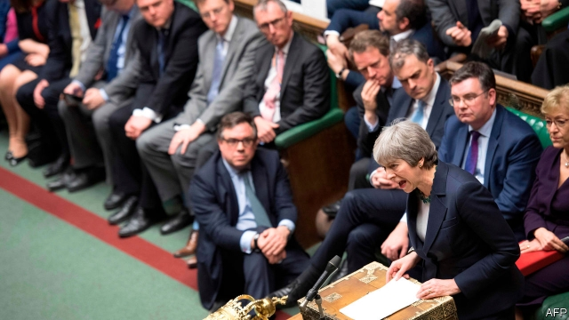

###### Three strikes

# Theresa May is set to beg the EU for more time. What will she do with it? 

##### After losing yet another vote in Parliament, the prime minister will be forced to try to delay Brexit 

 

> Mar 14th 2019 

THE SYMBOLISM was painful. Facing the reality of another lost vote in the Commons on March 12th, Theresa May lost her voice too. The prime minister croaked that, now that MPs had decisively rejected her Brexit deal for a second time, by 149 votes, they faced “unenviable choices”. But the truth is that, along with her voice, she has lost control of the Brexit process. 

That was brought home a day later when MPs voted against leaving the European Union with no deal, on a motion proposed by cross-party backbenchers rather than the government. In a further sign of lost control, four cabinet ministers defied their party whip, yet escaped sanction. The motion does not eliminate the risk of a no-deal Brexit, since under both British and EU law this remains the default course. But it shows that MPs have rejected not just Mrs May’s Brexit plan but also her mantra that no deal is better than a bad deal. 

Hostility to a no-deal Brexit is understandable. The government’s analysis shows it would inflict heavy economic damage, disrupting supply chains and causing chaos in ports, airports and on roads. Brexiteers say the EU would immediately offer Britain a series of mini-deals. But the EU is clear that contingency plans for no-deal protect its 27 members, not Britain. As if to confirm this, Brussels expressed concerns about British plans this week to cut most tariffs and impose no customs controls on the Irish border in the event of a no-deal Brexit. Such a smugglers’ charter would, the EU thinks, breach World Trade Organisation rules. 

After such a difficult week the prime minister must sympathise with Shakespeare’s character Dick, who declares that “the first thing we do, let’s kill all the lawyers.” For it was her own attorney-general, Geoffrey Cox, who scuppered the chances of winning recalcitrant MPs over to her deal, precipitating her Commons defeat. 

It was not meant to be like this. Late on March 11th Mrs May had rushed to Strasbourg to meet the European Commission president, Jean-Claude Juncker, and win some last-minute concessions from the EU over the Irish “backstop”, an insurance policy to avoid a hard border in Ireland by keeping the entire United Kingdom in a customs union with the EU. The fear of Tory Brexiteers and of the Northern Irish Democratic Unionist Party (DUP) was of being stuck in this backstop with no escape. Mr Juncker duly agreed to a new legal text promising not only that the backstop would be temporary but also that the EU would do its utmost not to use it. And Mrs May appended a unilateral declaration, which the EU agreed not to oppose, asserting Britain’s right to exit the backstop. 

Her hope was that these new texts would allow Mr Cox to soften the warning he gave about the backstop in November, when he concluded that there was no mechanism giving Britain a unilateral right of exit. Mr Cox duly advised that the new texts had indeed reduced the risk of being stuck in the backstop. But he went on explicitly to repeat his earlier conclusion that Britain would still have no lawful means of exiting the backstop save by agreement with the EU. This was enough for the DUP and most Tory hardliners to reiterate their opposition to the deal, despite Mrs May’s efforts. 

What now? Almost incredibly, Mrs May plans another vote on her deal next week. She may press Mr Cox to amplify his advice by noting that the Vienna convention on international treaties can allow countries to pull out of them. She will defy a convention against repeated votes on the same measure. She will lobby the DUP hard. Yet for all such efforts, the voting arithmetic still seems stacked against her. 

If she loses again, the focus will switch to the need for delay. Shortly after we went to press MPs were due to vote on motions asking the government to seek more time. Brexit day is March 29th, two years after Mrs May triggered Article 50 of the EU treaty. But there is provision for extending the deadline, subject to the unanimous approval of other EU governments. Mrs May is expected to take a request for such an extension to the EU summit that convenes in Brussels on March 21st. 

Most observers believe the EU will agree. But its approval cannot be taken for granted (see article). Other governments will want to debate how long any extension should be and what it will be used for. EU leaders will also be anxious to avoid British participation in the European elections in late May. So their instinct will be to offer Britain no more than two or three extra months. 

Mrs May might use the extra time to keep trying to get her deal through Parliament. After all, as both she and the EU insist, it is still the only one on the table. She may take comfort from the fact that it was defeated by “only” 149 votes this week, down from a record-breaking 230 in January, and may be defeated by even fewer next week. Yet the EU has made clear that it will not reopen negotiations on any aspect of the deal. So unless she can lure over more Brexiteers fearful of losing their goal altogether, or more MPs still worried by the no-deal risk in May or June, Mrs May’s deal could just keep failing. 

That means searching for an alternative way forward. In the Commons this week the prime minister asked if MPs wanted to revoke the Article 50 letter, to hold a second referendum or to have an entirely different Brexit deal. Several Tories have openly floated the idea of replacing her as prime minister, preferably with a more fervent believer in Brexit (see article). And the leader of the opposition, Jeremy Corbyn, argued as ever that the solution was another general election, followed by a magical Labour Brexit that would be easy and quick to negotiate. 

There are three big problems with any of these ideas. The first is that, although MPs have made it obvious that they do not support Mrs May’s deal, there is no clear majority for a different one. This might not change even if “indicative votes” on potential alternatives were held, as was suggested this week by the Commons Brexit committee. Second, any other Brexit deal, such as a permanent customs union or the Norwegian option of joining the European Economic Area, would still require the passage of the withdrawal agreement, including the Irish backstop. And third, a short extension will not allow enough time for most possible alternatives, including holding another referendum. 

It is tempting to blame the EU’s tough negotiating stance for the mess. Yet the real culprit was Mrs May’s incompatible goals. She wanted to leave the single market and customs union, to have no hard border in Ireland and to impose no new barriers between Northern Ireland and the British mainland. But an independent trade policy and open borders are incompatible. Refusal to accept the trade-offs inherent in leaving the EU bedevils the whole process, no matter who is in charge of it. 

-- 

 单词注释:

1.theresa[ti'ri:zә]:n. 特丽萨（女子名） 

2.EU[]:[化] 富集铀; 浓缩铀 [医] 铕(63号元素) 

3.Brexit[]:[网络] 英国退出欧盟 

4.symbolism['simbәlizm]:n. 象征主义, 符号论 [医] 象征主义 

5.croak[krәuk]:n. 呱呱叫声, 哇哇声 vi. 呱呱地叫, 发牢骚 vt. 用嘶哑的声音说 

6.MP[]:国会议员, 下院议员 [计] 宏处理程序, 维护程序, 线性规划, 微程序, 多处理器 

7.decisively[]:adv. 果断地；决然地 

8.unenviable[.ʌn'enviәbl]:a. 不值得羡慕的, 尴尬的, 不会引起嫉妒的 

9.backbencher['bækbentʃә]:n. 后座议员 

10.defy[di'fai]:vt. 藐视, 挑衅, 使落空 n. 挑战 

11.sanction['sæŋkʃәn]:n. 核准, 制裁, 处罚, 约束力 vt. 制定制裁规则, 认可, 核准, 同意 

12.default[di'fɒ:lt]:n. 违约, 不履行责任, 缺席, 默认值 v. 疏怠职责, 缺席, 拖欠, 默认 [计] 默认; 默认值; 缺省值 

13.Mr['mistә(r)]:先生 [计] 存储器回收程序, 多重请求 

14.mantra['mʌntrә, 'mæn-]:颂歌, 咒语(尤指四吠陀经典内作为咒文或祷告唱念的) 

15.hostility[hɒs'tiliti]:n. 敌意, 敌对, 反对 

16.understandable[.ʌndә'stændәbl]:a. 可以理解的 

17.inflict[in'flikt]:vt. 施以, 加害, 使承受 [法] 处, 加, 予以 

18.disrupt[dis'rʌpt]:a. 分裂的, 中断的 vt. 使分裂, 使瓦解 

19.chao[]:n. 钞（货币） 

20.Brexiteers[]:支持英国退欧的人（Brexiteer的复数） 

21.sery[]:n. (Sery)人名；(俄)谢雷；(科特)塞里 

22.contingency[kәn'tindʒәnsi]:n. 偶然性, 可能性, 意外事故 [经] 意外事故, 意外开支, 偶然事故 

23.Brussel[]:n. 布鲁塞尔（比利时首都） 

24.tariff['tærif]:n. 关税, 关税表, 价格表, 收费表 vt. 课以关税 [计] 价目表 

25.charter['tʃɑ:tә]:n. 特许状, 执照, 宪章 vt. 特许, 发给特许执照 

26.breach[bri:tʃ]:n. 裂口, 违背, 破坏, 违反, 突破, 破裂 vt. 攻破, 突破 vi. 跳出水面 

27.organisation[,ɔ: ^әnaizeiʃən; - ni'z-]:n. 组织, 团体, 体制, 编制 

28.sympathise['simpәθaiz]:vi. 同情, 表示同情, 同感, 一致, 共鸣, 同意, 赞同, 赞成, 吊唁, 吊慰 

29.dick[dik]:n. 家伙, 词典, 誓言(书) [医] 二氯乙胂(毒气) 

30.geoffrey[]:n. 杰弗里（男子名） 

31.cox[kɒks]:n. 舵手 v. 做舵手 

32.scupper['skʌpә]:n. 甲板排水孔, 泄水口 

33.recalcitrant[ri'kælsitrәnt]:a. 反抗的, 反对的, 顽抗的 n. 反抗者, 顽抗者 

34.precipitate[pri'sipiteit]:n. 沉淀物, 凝结物, 结果 vt. 猛抛, 使陷入, 促成, 使沉淀 vi. 猛地落下 a. 突然的, 猛地落下的, 轻率的 

35.strasbourg['stræsb\\:^, strɑ:z'bu:r]:n. 斯特拉斯堡（法国东北部城市） 

36.juncker[]:[网络] 容克；欧元集团现任主席容克；欧元区主席容克 

37.concession[kәn'seʃәn]:n. 特许, 让步, 认可 [经] 核准, 许可, 特殊(权) 

38.backstop['bækstɒp]:n. 挡球网, 接球手 [电] 背向停止 

39.Tory['tɒ:ri]:n. 托利党党员, 保守党员, 亲英分子 a. 保守分子的 

40.unionist['ju:njәnist]:n. 工会会员, 工联主义者 [法] 工会会员, 工会主义者 

41.dup[dʌp]:vt. 打开；重复 

42.duly['dju:li]:adv. 恰当地, 充分地, 适当地, 及时地 

43.append[ә'pend]:vt. 附加, 增补, 盖章 [计] DOS外部命令:为数据文件(非执行文件)设定一个或多个磁盘路径 当程序执行时, DOS将在所设定的磁盘路径中查找不在当前路径下的文件 

44.unilateral[.ju:ni'lætәrәl]:a. 单方面的, 单边的, 片面的 [医] 单侧的, 一侧的 

45.declaration[.deklә'reiʃәn]:n. 宣告, 说明, 宣布 [计] 说明 

46.assert[ә'sә:t]:vt. 主张, 坚称, 断言 [法] 宣称, 断言, 维护 

47.soften['sɒftn]:v. (使)变柔软, (使)变柔和 

48.mechanism['mekәnizm]:n. 机械, 机构, 结构, 机理, 技巧 [化] 机理; 历程; 机构 

49.explicitly[]:adv. 明确地；明白地 

50.lawful['lɒ:ful]:a. 法律许可的, 守法的, 合法的 [经] 合法的, 法定的 

51.hardliner[ˌhɑ:d'laɪnə(r)]:n. 强硬路线者 

52.reiterate[ri:'itәreit]:vt. 反复地说, 重申, 反复地做 [法] 重述, 重申, 反覆地做 

53.opposition[.ɒpә'ziʃәn]:n. 反对, 敌对, 相反, 在野党 [医] 对生, 对向, 反抗, 反对症 

54.incredibly[in'kredәbli]:adv. 不能相信地 

55.Vienna[vi'enә]:n. 维也纳 

56.lobby['lɒbi]:n. 大厅, 休息室, 游说议员者 vi. 游说议员, 游说 vt. 游说 

57.trigger['trigә]:n. 触发器, 扳机 vt. 触发, 发射, 引起 vi. 松开扳柄 [计] 切换开关 

58.unanimous[ju:'nænimәs]:a. 意见一致的, 无异议的 

59.convene[kәn'vi:n]:vt. 集合, 召集, 召唤 vi. 聚集, 集合 

60.cannot['kænɒt]:aux. 无法, 不能 

61.participation[.pɑ:tisi'peiʃәn]:n. 参与, 分享 [经] 参与, 参股 

62.reopen[.ri:'әupәn]:v. 重开, 再开始, 再开 

63.negotiation[ni.gәuʃi'eiʃәn]:n. 谈判, 磋商, 交涉 [经] 谈判, 协商 

64.lure[luә]:n. 饵, 诱惑 vt. 引诱, 诱惑 

65.revoke[ri'vәuk]:vt. 撤回, 废除 vi. 藏牌 n. 藏牌 [计] 取消权限程序 

66.referendum[.refә'rendәm]:n. （就重大政治或社会问题进行的）全民公决，全民投票 

67.entirely[in'taiәli]:adv. 完全, 全然, 一概 

68.Tory['tɒ:ri]:n. 托利党党员, 保守党员, 亲英分子 a. 保守分子的 

69.openly['әjpәnli]:adv. 公开地, 坦率地, 直率地, 公然地 

70.preferably['prefәrәbli]:adv. 更可取地, 更好地, 更合意地 

71.fervent['fә:vәnt]:a. 热的, 炎热的, 热心的 

72.believer[bi'li:vә]:n. 信徒 

73.jeremy['dʒerimi]:n. 杰里米（男子名） 

74.Corbyn[]:科尔宾（人名） 

75.magical['mædʒikәl]:a. 魔术的, 有魔力的, 不可思议的 

76.indicative[in'dikәtiv]:a. 指示的, 象征的, 表示...的 [经] 指标的 

77.Norwegian[nɒ:'wi:dʒәn]:n. 挪威人, 挪威语 a. 挪威的, 挪威人的, 挪威语的 

78.withdrawal[wið'drɒ:l]:n. 提款, 撤退, 退回, 撤消, 退隐, 戒毒过程 [医] 戒除, 脱瘾 

79.stance[stæns]:n. 准备击球姿势, 站立的姿势, 位置, 姿态 [经] 地位, 形势 

80.culprit['kʌlprit]:n. 犯人, 罪犯, 刑事被告 [法] 犯罪者, 犯人, 罪犯 

81.incompatible[.inkәm'pætәbl]:a. 不相容的, 不能并存的, 矛盾的 [化] 不协调 

82.inherent[in'hiәrәnt]:a. 固有的, 与生俱来的 [医] 固有的, 生来的 

83.bedevil[bi'devl]:vt. 使痛苦, 使苦恼, 虐待 

