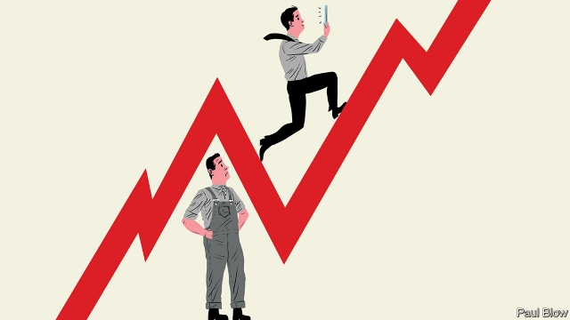

###### Bartleby

# How the internet led to greater wage inequality 

##### Training can help solve the problem 

 

> Mar 16th 2019 

THE GREAT detective has summoned everyone to the library. “I was asked to identify the culprit behind the growing wave of wage inequality” he says. “I can reveal that the offender is there.” And the assembled suspects gasp as he points, not at a human, but at the computer in the corner. 

In real life, few would be too be surprised at that verdict. Economists have long pointed to “skill-biased technological change” as one of the driving forces behind inequality. But demonstrating the influence of technology is important in an era when politicians routinely blame immigration or cut-price competition from imports instead. And the evidence that technology is indeed the perpetrator is getting stronger as academics look at its impact on inequality within individual firms, as well as across the broader economy. 

A new working paper* by Christopher Poliquin of the University of California, Los Angeles, examined the effect on wages at Brazilian firms that adopted broadband between 2000 and 2009. The average employee experienced a 2.3% cumulative gain in real wages, relative to workers at firms without broadband. But managers at the firm gained 8-9% while executive directors enjoyed an 18-19% boost. Mr Poliquin thinks that the internet allowed skilled workers to be much more productive than before. 

His suggestion chimes with a previous study** of Norwegian companies which found that the arrival of broadband improved the relative position of skilled employees. That study found that the internet made it easier for them to do “non-routine abstract tasks” such as problem-solving, while allowing the company to automate routine tasks and replace unskilled workers. 

What happens inside firms is only part of the story, however. Research*** published in the Quarterly Journal of Economics suggests that around two-thirds of the rise in inequality is the result of wage differentials between firms, rather than within them. Workers are being “sorted” into two groups; those who work for high-wage firms in sectors like technology and those who work for low-wage businesses in sectors like retailing. Outsourcing may also be playing a part, with large firms spinning off low-wage activities like cleaning and catering, thus constraining the level of in-firm inequality. 

The pay gap may be related to education and training. A survey of OECD countries in 2016 found that, on average, more than half of adults could, at best, carry out no more than the simplest digital tasks, such as writing an email. Only a third had the kind of “advanced cognitive skills” that would allow them to flourish. 

However, this seems a little odd. On the one hand, a moral panic has swept nations over adults glued to smartphones and teenagers obsessed with digital games or online make-up tips from the Kardashian clan. At the same time, people are apparently unable to use digital technology to boost their careers. 

This suggests that neither schools nor employers are striving hard enough to translate consumers’ familiarity with using technology for leisure into workers’ or students’ ability to use it in the office or classroom. More inventive ways of teaching skills, perhaps with virtual reality or video games, may be in order. 

For the corporate sector, this ought to be a win-win proposition. A more productive workforce means bigger profits and faster growth, and thus higher earnings for managers as well as employees. 

Maybe executives fear that money spent on training will be wasted, as workers take their newly honed skills to companies offering higher pay. But like sweeping statements about tech illiteracy, the claim that millennials (those born after 1982) are particularly disloyal to employers also turns out to be something of a myth. Figures from America’s Bureau of Labour Statistics show that the average job tenure for American workers in January 2018 was 4.2 years, compared with 4.1 years in January 2008. A higher proportion of thirty-somethings had worked for the same employer for a decade in 2018 than had been the case ten years earlier. Technology may be to blame for the historic rise in inequality. But with the right training for users, it could yet redeem its reputation. 

* The Effect of the Internet on Wages**The Skill Complementarity of Broadband Internet by Anders Akerman, Ingvil Gaarder and Magne Mogstad, The Quarterly Journal of Economics, 2015*** Firming Up Inequality, February 2019 

-- 

 单词注释:

1.bartleby[]:[网络] 巴特比；巴特白；老板是空气 

2.inequality[.ini'kwɒliti]:n. 不平等, 不同, 不平坦, 不平均 n. 不平等, 不等式 [计] 不等式 

3.summon['sʌmәn]:vt. 召唤, 召集, 号召, 振奋, 唤起, 鼓起 [经] 传唤, 传讯 

4.culprit['kʌlprit]:n. 犯人, 罪犯, 刑事被告 [法] 犯罪者, 犯人, 罪犯 

5.offender[ә'fendә]:n. 罪犯, 无礼的人, 得罪人的人 

6.verdict['vә:dikt]:n. 裁决, 判决, 判断性意见, 定论, 结论 [法] 定论, 判断, 意见 

7.economist[i:'kɒnәmist]:n. 经济学者, 经济家 [经] 经济学家 

8.technological[.teknә'lɒdʒikl]:a. 技术的 [经] 工艺的, 技术的 

9.routinely[]:adv. 日常, 乏味, 常规, 例行 

10.perpetrator[]:n. 作恶者, 犯罪者, 行凶者 [法] 作恶者, 行凶者, 犯罪者 

11.christopher['kristәfә]:n. 克里斯多夫（男子名） 

12.California[.kæli'fɒ:njә]:n. 加利福尼亚 

13.los[lɔ:s]:abbr. 月球轨道航天器（Lunar Orbiter Spacecraft）；视线（Line of Sight） 

14.angeles[]:n. 安杰利斯（姓氏）；天使城（菲律宾地名） 

15.Brazilian[brә'ziljәn]:n. 巴西人 a. 巴西的, 巴西人的 

16.broadband['brɔ:dbænd]:[计] 宽带 

17.cumulative['kju:mjulәtiv]:a. 累积的 [医] 蓄积的, 累积的 

18.chime[tʃaim]:n. 钟声, 钟, 和谐 vi. 鸣, 奏出谐和的乐声, 和谐 vt. 敲出和谐的声音, 打钟报时, 重复说 

19.Norwegian[nɒ:'wi:dʒәn]:n. 挪威人, 挪威语 a. 挪威的, 挪威人的, 挪威语的 

20.automate['ɔ:tәmeit]:vt.vi. (使)自动化 [计] 自动化 

21.unskilled[.ʌn'skild]:a. 无(特殊)技能的, 不熟练的, 拙劣的 

22.differential[difә'renʃәl]:a. 差别的, 特异的, 微分的 n. 差别, 两路线运费差额, 工资差额 

23.sector['sektә]:n. 扇形, 部门, 部分, 函数尺, 象限仪, 段, 区段 vt. 把...分成扇形 [计] 扇面; 扇区; 段; 区段 

24.outsource[aut'sɔ:s]:vt. 把…外包 

25.constrain[kәn'strein]:vt. 强迫, 限制, 关押 

26.Oecd[]:[经] 已开发国家组织 

27.cognitive['kɒgnitiv]:a. 认知的, 认识的 

28.smartphones[]: 智能手机（smartphone的复数） 

29.obsess[әb'ses]:vt. 迷住, 使困扰 

30.online[]:[计] 联机 

31.kardashian[]:n. 卡戴珊（人名） 

32.clan[klæn]:n. 氏族, 宗族, 集团 [医] 支 

33.apparently[ә'pærәntli]:adv. 表面上, 清楚地, 显然地 

34.strive[straiv]:vi. 努力, 奋斗, 斗争 

35.familiarity[fә.mili'æriti]:n. 熟悉, 精通, 亲密 

36.inventive[in'ventiv]:a. 善于创造的, 发明的 

37.corporate['kɒ:pәrit]:a. 社团的, 合伙的, 公司的 [经] 团体的, 法人的, 社团的 

38.proposition[.prɒpә'ziʃәn]:n. 建议, 命题, 主张 vt. 向...提议, 向...提出猥亵的要求 

39.earning['ә:niŋ]:n. 收入（earn的现在分词） 

40.hone[hәun]:n. 磨刀石, 抱怨, 想念 vt. 用磨刀石磨, 磨练 

41.tech[tek]:n. 技术学院或学校 

42.illiteracy[i'litәrәsi]:n. 文盲, 无知 

43.millennials[mɪ'leniəl]:adj. 一千年的；一千年至福的 [网络] 千禧世代；千禧之子；千禧一代 

44.disloyal[dis'lɒiәl]:a. 不实的, 不义的, 不忠的 

45.myth[miθ]:n. 神话, 虚构的事, 虚构的人 

46.statistic[stә'tistik]:n. 统计量 a. 统计的, 统计学的 

47.tenure['tenjuә]:n. 享有, 保有期 [经] (财产,职位等的)占有, 占有权 

48.historic[hi'stɒrik]:a. 历史上著名的, 有历史性的 

49.redeem[ri'di:m]:vt. 赎回, 挽回, 恢复, 偿还, 补偿 [经] 履行(契约), 买回, 赎回 

50.complementarity[.kɒmplimen'tæriti]:n. 互补性, 互为补充 [经] 互补性 

51.broadband['brɔ:dbænd]:[计] 宽带 

52.ander[]:n. (Ander)人名；(匈)翁代尔；(瑞典、英)安德 

53.akerman[]: [人名] 阿克曼 

54.gaarder[]:[网络] 贾德 

55.magne[]:n. 玛格尼（森林之神） 

56.inequality[.ini'kwɒliti]:n. 不平等, 不同, 不平坦, 不平均 n. 不平等, 不等式 [计] 不等式 

