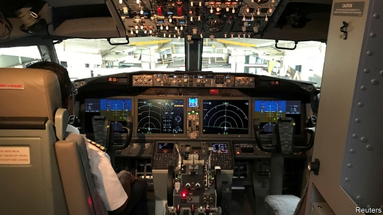

###### The computer in the cockpit

# Humans struggle to cope when automation fails 

##### The perils of the human-machine interface 

 

> Mar 14th 2019 

ONE WAY to tell who made the aircraft you are boarding is to steal a glimpse of the cockpit. A traditional control yoke in front of the pilots suggests a Boeing; a joystick beside each seat, an Airbus. Pilots argue about which system is better; neither is considered safer than the other. Each exemplifies a different approach to a problem that manufacturers of not just aircraft but also cars, trains and ships must grapple with as long as human operators handle increasingly automated machines. 

The challenge of what engineers call the “human-machine interface” has tragically gained attention after the crash of an Ethiopian Airlines Boeing 737 MAX 8 on March 10th. Eyewitnesses reported that shortly after departing Addis Ababa, the aircraft climbed and dived repeatedly. Similarities were drawn with a fatal crash in Indonesia in October last year. That time, the pilots of a Lion Air MAX 8 struggled, also soon after take-off, with an automated safety system that erroneously tried to prevent the aircraft from stalling by lowering its nose. 

Although authorities around the world have grounded the model, Boeing insists that it is airworthy. The company is updating the MAX’s automated flight-control software to make it easier for pilots to assume manual control. Boeing and Airbus both pack their planes with computers that do most of the flying. Each, though, espouses a different philosophy on how a pilot reacts to them, says Mudassir Lone of Cranfield University in Britain. Boeings are designed to make the pilot feel like the aviator in charge. Although the control yoke looks and feels like something from the analogue era, the way it behaves—including shaking when approaching a stall—is created digitally by a computer. Airbus’s joystick is seldom used besides take-off and landing. A sound alerts the pilot to trouble; in an Airbus, he is more supervisor than airman. 

The big worry is what happens if a sensor feeds the flight-control system the wrong data. This might have happened in the Lion Air crash, according to a preliminary report. Something similar downed an Air France Airbus A330 over the Atlantic in 2009: an airspeed sensor iced over and the ensuing loss of data caused the autopilot to disengage. Unable to work out what was happening, the pilots lost control. 

Switching from automatic to manual is not straightforward. Flight-control systems may not disengage entirely. Instead, they might continue to assist the pilot in an attempt to prevent a dangerous manoeuvre. When things do go wrong, it is critical that pilots follow the correct procedures, which are different for each model of aircraft. Pilots learn these and carry checklists spelling them out. Proliferation of systems necessitates frequent retraining. To make life easier for pilots, the MAX 8 employs a system that makes it feel to them like older, more familiar versions of the 737. But this adds another layer of complexity. 

Incidents are not confined to aviation. In Washington, DC, automated trains have largely been out of service since 2009, when a faulty circuit made a stationary train invisible to the safety system on the one behind it. The driver was unable to brake in time; the resulting crash killed nine people. Ships may soon face similar problems. Some ferries and offshore support vessels have already replaced ship’s wheels with computer-assisted joysticks. A series of accidents involving self-driving cars may have been caused by sensors’ failure to recognise objects in the road, and drivers failing to respond fast enough. 

Studies have shown that when people have to wrest control from an automated system, it can take them around five seconds to grasp what is happening. The monotony of monitoring a semi-automated vehicle may reduce vigilance by provoking what psychologists refer to as “passive” fatigue. Such concerns have led some carmakers, Ford among them, to consider skipping semi-automation and go straight to something closer to full autonomy, cutting people out of the loop. That would remove the human-machine interface—but not humans’ machine-induced fears. 

-- 

 单词注释:

1.cockpit['kɒkpit]:n. 驾驶员座舱, 战场 

2.peril['peril]:n. 危险, 冒...之险, 险境, 险因 vt. 置...于险境, 冒险, 危及 

3.interface['intәfeis]:n. 分界面, 接触面, 界面 [计] 接口, 界面 

4.yoke[jәuk]:n. 轭, 牛轭, 束缚 vt. 给...上轭, 连接, 结合, 使匹配 vi. 结合, 匹配 [计] 磁轭; 磁头组; 偏转线圈 

5.boe[bəu]:abbr. back outlet eccentric 后偏心（轮）出口 

6.joystick['dʒɔi,stik]:n. (飞机的)操纵杆 [计] 控制杆, 操纵杆 

7.airbus['eәbʌs]:空中客车 

8.exemplify[ig'zemplifai]:vt. 例证, 例示 [法] 制作经公章证明的誊本, 例证 

9.grapple[græpl]:v. 抓住, 掌握 n. 抓住, 系紧, 掌握, 与...扭打 

10.automate['ɔ:tәmeit]:vt.vi. (使)自动化 [计] 自动化 

11.tragically['trædʒɪklɪ]:adv. 悲剧地, 悲惨地 

12.Ethiopian[.i:θi'әupiәn]:a. 埃塞俄比亚的 n. 埃塞俄比亚人 

13.MAX[mæks]:[计] 最大 

14.addis['ædis]:n. 艾缔思（姓氏） 

15.Ababa[]:n. (Ababa)人名；(塞)阿巴巴 

16.similarity[.simi'læriti]:n. 类似, 类似处 [法] 类似, 相似, 类似事例 

17.Indonesia[.indәu'ni:ʒә]:n. 印尼 

18.erroneously[]:adv. 错误, 不正确 

19.stall[stɒ:l]:n. 厩, 停车处, 牧师职位, 货摊, 托辞, 拖延 vt. 关入厩, 停顿, 推托, 支吾, 使陷于泥中 vi. 被关在厩内, 陷于泥中, 停止, 支吾 

20.airworthy['єәwә:ði]:a. 飞行性能好的, 适宜航空的 

21.update[ʌp'deit]:vt. 更新, 使现代化 n. 更新 [计] 更新 

22.espouse[i'spauz]:vt. 支持, 赞成, 嫁, 娶 [法] 娶, 出嫁, 信奉 

23.lone[lәun]:a. 孤单的, 孤立的, 单身的, 寂寞的 

24.Cranfield[]:n. (Cranfield)人名；(英)克兰菲尔德 

25.boeing[]:n. 波音（客机） 

26.aviator['eivieitә]:n. 飞行员 

27.analogue['ænәlɒg]:n. 类似物, 相似情况 [医] 类似物, 同型物, 相似器官, 同功异质体 

28.digitally[]:adv. 数位 

29.supervisor[.sju:pә'vaizә]:n. 管理者, 监督者, 指导者, 视导员 [计] 管理程序 

30.airman['єәmәn]:n. 飞行员, 空军士兵 

31.sensor['sensә]:n. 传感器 [计] 检测器 

32.datum['deitәm]:n. 论据, 材料, 资料, 已知数 [医] 材料, 资料, 论据 

33.airspeed['єәspi:d]:n. 空速 

34.ensuing[]:a. 接著发生的 

35.autopilot['ɔ:tәpailәt]:[化] 自动驾驶仪 

36.disengage[.disin'geidʒ]:vt. 使脱离, 使松开, 使摆脱约束(或义务等) vi. 脱离, 解脱 

37.entirely[in'taiәli]:adv. 完全, 全然, 一概 

38.manoeuvre[mә'nu:vә]:n. 调遣, 演习, 策略 vi. 调动, 演习, 用策略 vt. 调动, 操纵 

39.checklist[]:n. 清单, (美)选举人名单, 名册, 目录册 

40.proliferation[.prәulifә'reiʃәn]:n. 增殖, 激增 [医] 增生, 增殖 

41.necessitate[ni'sesiteit]:vt. 迫使, 使成为必需, 需要 

42.retrain[ri:'trein]:vt. 重新训练, 再训练 

43.complexity[kәm'pleksiti]:n. 复杂, 复杂性, 复杂的事物 

44.Washington['wɒʃiŋtn]:n. 华盛顿 

45.DC[]:直流电 [计] 数据单元, 数据中心, 数据代码, 数据通信, 数据控制, 数字控制, 直流 

46.stationary['steiʃ(ә)nәri]:a. 不动的, 静止的, 不变的, 固定的, 停留的 [计] 定常, 定态, 固定的 

47.sery[]:n. (Sery)人名；(俄)谢雷；(科特)塞里 

48.wrest[rest]:n. 扭, 拧 vt. 夺取, 猛扭, 歪曲, 费力取得 

49.monotony[mә'nɒtәni]:n. 单调, 缺乏变化 

50.vigilance['vidʒilәns]:n. 警戒, 警觉, 失眠症 [医] 不眠症, 警醒症 

51.provoke[prә'vәuk]:vt. 激怒, 惹起, 诱导 [法] 刺激, 煽动, 激怒 

52.psychologist[sai'kɒlәdʒist]:n. 心理学家 [医] 心理学家 

53.carmaker['kɑ:,meikә(r)]:n. 汽车制造商 

54.ford[fɒ:d]:n. 浅滩, 福特汽车 v. 涉过, 涉水 

55.autonomy[ɒ:'tɒnәmi]:n. 自治, 自治权 [医] 自主性 

