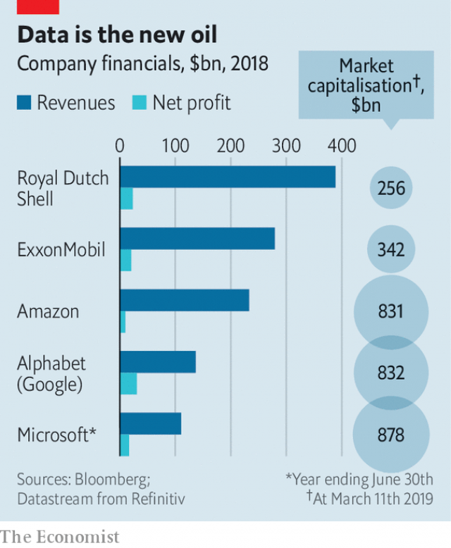

###### Oil rush

# Tech firms ramp up efforts to woo the energy industry 

##### Amazon, Google and Microsoft see old industrial giants as a new source of income 

 

> Mar 16th 2019 

A  GIANT HOTEL in Houston teemed with oil-and-gas executives on March 11th, the start of a CERAWeek. IHS Markit, a research firm which organised the shindig, lined up America’s energy secretary, the chief executives of BP and Chevron (two of the world’s largest oil companies), and other luminaries. Among the dark suits was an open-collared newcomer: Andy Jassy, head of Amazon Web Services. Speaking to a vast ballroom, he extolled the cloud-computing giant’s virtues of moving quickly and learning from failure. Mr Jassy was there not just to offer management advice to what were once the world’s most valuable companies. He was also after their custom. 

Energy companies are keen to produce oil and gas more efficiently, as they grapple with volatile prices and uncertain long-term demand. Digital investments promise to cut costs and boost output. Tech giants like Amazon, Microsoft and Alphabet, as well as a clutch of startups, want to help. For all of Silicon Valley’s professed support for clean power over fossil fuels, the energy industry represents a huge opportunity. Oil companies’ valuations are dwarfed by tech firms’, but their coffers remain deep (see chart). 

Countless industries claim that big data and artificial intelligence (AI) will usher in new prosperity. The trend in oil and gas is nevertheless notable, partly because it is marked, partly because it comes late. For years, many companies remained focused on increasing reserves of oil, not extracting it cost-efficiently. Managers struggled to use data siloed in different parts of the company or in different parts of the world. 

 

That is changing. Abundant shale oil has made the hunt for reserves less urgent than the need to protect profits. Shale also highlights the utility of new analytics, says Paul Goydan of BCG, a consultancy, as data gush from thousands of wells studded through Texas, North Dakota and other rich fields. Falling costs of sensors, storage and computing power have made digital investments even more attractive. 

Early projects are starting to bring results. BP is combining real-time information from sensors with its own models and analytics to optimise output—it estimates such digital tools boosted oil production by more than 30,000 barrels per day last year. Yuri Sebregts, the chief technology officer for Shell, says it could take months for a geoscientist to map faults underground. Software can now sort through seismic data, performing the same task in a few hours for about $20. 

As such efforts ramp up, energy firms are pairing in-house expertise with that of the tech industry. Microsoft has courted them the longest. In February ExxonMobil announced that its sprawling shale operations in the Permian basin, in Texas, would use Microsoft’s cloud, AI and other services. That may help ExxonMobil to drill and deploy staff more efficiently, and limit methane leaks. Amazon is trying to catch up. The size of its oil-and-gas team has tripled in recent years, and the company is working with energy giants such as Halliburton and Shell. In Houston it showed off data-storage kit that was continuously showered with water, to prove its mettle in inhospitable oilfields. 

Alphabet, Google’s parent company, is a relative laggard, but hopes to change that. Last year Google Cloud hired Darryl Willis, a former BP executive, to lead a new energy group. He estimates that the industry is using 1-5% of available data. Alphabet has signed deals with Total of France, as well as Anadarko, an American oil company that is testing automated drilling and has an AI specialist on its board of directors. 

Energy companies feel somewhat jittery about working with large tech firms—and not just because the Silicon Valley stars have outshone them. Automation raises the risk of hacking. Tech firms’ ballooning ambitions raise eyebrows. One questioner asked Mr Jassy if Amazon would itself start producing oil and gas. He said no, as the room giggled nervously. 

It is not just the oilmen who are uneasy about the partnerships. Amazon, Microsoft and Google rely on clever young coders, who dislike working for controversial industries. “We are a partner and we follow the energy partner’s needs,” says Caglayan Arkan, who oversees Microsoft’s work with the energy sector. But in February Microsoft employees demanded that it cancel a contract to sell augmented-reality headsets to America’s military. Last year Google decided not to renew a contract with the Pentagon, after some staff argued the company should not be in the “business of war”. Tech workers may yet insist they not be in the business of fossil fuels either. 

-- 

 单词注释:

1.tech[tek]:n. 技术学院或学校 

2.ramp[ræmp]:n. 斜坡, 坡道, 敲诈 vi. 狂跳乱撞, 乱冲, 敲诈, 蔓延 vt. 使有斜面, 敲诈 

3.amazon['æmәzɒn]:n. 亚马孙河 [医] 无乳腺者 

4.google[]:谷歌；搜索引擎技术；谷歌公司 

5.Microsoft[]:n. (美国)微软公司 [电] 微软公司 

6.Houston['hju:stәn]:n. 休斯敦 

7.teem[ti:m]:vi. 充满, 充足, 倾注 vt. 倒出 

8.ih[]:abbr. 测量端（Instrument Head）；间接加热（Indirect Heating）；反时针（Inverted Hour） 

9.Markit[]:un. 拍号 [网络] 麦盖提；马基特经济研究公司；编撰机构 

10.shindig['ʃindig]:n. 喧哗, 盛大舞会 

11.bp[]:[化] 碱基对 

12.chevron['ʃevrәn]:n. V形袖章, 锯齿形花饰 [计] 人字形 

13.luminary['lu:minәri]:n. 发光体, 杰出人物 

14.andy['ændi]:n. 安迪（男子名, 等于Andrew） 

15.Jassy['jɑ:si]:n. 雅西（德国人名） 

16.ballroom['bɒ:lrum]:n. 舞厅, 跳舞场 

17.extol[ik'stәul]:vt. 颂扬, 称赞, 吹捧 

18.quickly['kwikli]:adv. 很快地 

19.efficiently[i'fiʃәntli]:adv. 生效, 能胜任, 有能力, 效率高, 有效 

20.grapple[græpl]:v. 抓住, 掌握 n. 抓住, 系紧, 掌握, 与...扭打 

21.volatile['vɒlәtail]:a. 挥发性的, 可变的, 不稳定的, 飞行的, 轻快的, 爆炸性的 n. 有翅动物, 挥发物 [计] 易失的 

22.clutch[klʌtʃ]:n. 抓紧, 掌握, 离合器, 一窝小鸡 vt. 抓住, 踩汽车离合器踏板 vi. 抓 [计] 联轴器; 离合器 

23.startup[]:[计] 启动 

24.silicon['silikәn]:n. 硅 [化] 硅Si 

25.profess[prә'fes]:vt. 声称, 以...为业, 伪称, 讲授 vi. 表白, 承认, 当教授 

26.fossil['fɒsәl]:n. 化石, 古物 a. 化石的, 陈腐的, 守旧的 

27.valuation[.vælju'eiʃәn]:n. 评价, 估价, 价值判断 [经] 估价, 计价, 评价 

28.dwarf[dwɒ:f]:n. 矮子, 侏儒 v. (使)变矮小 

29.tech[tek]:n. 技术学院或学校 

30.coffer['kɒfә]:n. 保险箱, 金库 vt. 把...锁进箱子 

31.countless['kauntlis]:a. 数不尽的, 无数的 

32.datum['deitәm]:n. 论据, 材料, 资料, 已知数 [医] 材料, 资料, 论据 

33.AI[ai]:[计] 附加信息, 人工智能 [化] 人工智能 

34.usher['ʌʃә]:n. 引座员, 招待员 vt. 引导, 招待 vi. 作招待员 

35.notable['nәutәbl]:n. 著名人士, 值得注意之事物 a. 值得注意的, 显著的 

36.extract[ik'strækt]:n. 榨出物, 精汁, 摘录, 选段 vt. (费力地)取出, 采掘, 榨取, 摘录, 吸取 [计] 提取 

37.siloed['saɪləʊ]:n. 筒仓；青贮窖；飞弹发射井 vt. 把…存入青贮窖；把…储存在筒仓内 n. (Silo)人名；(意、西、芬、瑞典)西洛 

38.shale[ʃeil]:n. 页岩 

39.les[lei]:abbr. 发射脱离系统（Launch Escape System） 

40.shale[ʃeil]:n. 页岩 

41.analytic[.ænә'litik]:a. 分析的, 善于分析的, 解析的 [医] 分析的 

42.paul[pɔ:l]:n. 保罗（男子名） 

43.BCG[]:卡介苗 [化] 卡介苗 

44.consultancy[]:n. 商量, 协商, 磋商, 会诊, 与...商量, 咨询, 请教, 找(医生)看病, 查阅, 考虑 [经] 咨询业务, 咨询服务 

45.gush[gʌʃ]:n. 涌出, 滔滔不绝地讲话 v. 涌出, 迸出, 滔滔不绝的讲话 

46.stud[stʌd]:n. 装饰钮扣, 大头钉, 领扣, 种马 vt. 镶嵌, 点缀, 散布 

47.Texas['teksәs]:n. 德克萨斯 

48.dakota[dә'kәutә]:n. 达科他（美国过去一地区名, 现分为南、北达科他州） 

49.sensor['sensә]:n. 传感器 [计] 检测器 

50.computing[kәm'pju:tiŋ]:[计] 计算 

51.optimise['ɒptɪmaɪz]:vt. 使最优化, 使尽可能有效 

52.yuri[]:n. 尤里（男子名）；坂崎由莉（游戏拳皇中的女性角色） 

53.geoscientist[,dʒi(:)ә'saiәntist]:地球学家 

54.seismic['saizmik]:a. 地震的 

55.expertise[.ekspә:'ti:z]:n. 专家意见, 专门技术 [法] 专门知识, 专家意见 

56.exxonmobil[]:n. 埃克森美孚国际公司 

57.sprawl[sprɒ:l]:vi. 伸开手足躺, 爬行, 蔓生, 蔓延 vt. 懒散地伸开, 使蔓生, 使不规则地伸展 n. 伸开手足躺卧姿势 

58.Permian['pә:miәn]:a. 二叠纪的, 二叠纪岩的 n. 二叠纪(岩) 

59.deploy[di'plɒi]:v. 展开, 配置 

60.methane['meθein]:n. 甲烷, 沼气 [化] 甲烷; 沼气 

61.triple['tripl]:n. 三倍数, 三个一组 a. 三倍的 vt. 使增至三倍 vi. 增至三倍 

62.halliburton[]:n. 哈利伯顿（财富500强公司之一, 总部位于美国） 

63.kit[kit]:n. 装备, 工具箱, 成套工具 [计] 成套部件; 成套零件 

64.continuously[kәn'tinjuәsli]:adv. 不断地, 连续地 [电] 连续地 

65.mettle['metl]:n. 气质, 耐力, 勇气 

66.inhospitable[in'hɒspitәbl]:a. 冷淡的, 不适于居住的, 不相容的 

67.laggard['lægәd]:n. 迟钝者, 落后者 a. 迟钝的, 落后的 

68.Darryl[]:n. 达瑞尔（男子名） 

69.willis['wilis]:n. 威利斯（姓氏, 男名） 

70.anadarko[]:[网络] 阿纳达科；纳达科；阿纳达科公司 

71.automate['ɔ:tәmeit]:vt.vi. (使)自动化 [计] 自动化 

72.jittery['dʒitәri]:a. 极度紧张不安的 

73.outshine[.aut'ʃain]:vt. 光亮强过..., 使相形见绌, 使失色 vi. 发光 

74.hack[hæk]:n. 劈, 砍, 砍痕, 出租车, 干咳, 晒架, 鹤嘴锄 vt. 劈, 砍, 出租, 用旧 vi. 劈, 砍, 干咳, 驾驶出租车 a. 出租的 

75.eyebrow['aibrau]:n. 眉毛 [医] 眉 

76.questioner['kwestʃәnә]:n. 质问者, 发问者 [法] 质问者, 询问者 

77.giggle['gigl]:v. 吃吃地笑, 咯咯地笑 n. 咯咯笑, 傻笑 

78.nervously[]:adv. 焦急地；神经质地；提心吊胆地 

79.oilman['ɒilmәn]:n. 石油工人, 石油商 

80.partnership['pɑ:tnәʃip]:n. 合伙, 合股, 合作关系 [经] 合伙(合作)关系, 全体合伙人 

81.coder['kәudә]:n. 编码器 [计] 编码员 

82.arkan[]:n. (Arkan)人名；(阿拉伯、土、俄)阿尔坎 

83.oversee[.әuvә'si:]:vt. 向下看, 了望, 监督, 偷看到 [法] 监察, 监督, 俯瞰 

84.sector['sektә]:n. 扇形, 部门, 部分, 函数尺, 象限仪, 段, 区段 vt. 把...分成扇形 [计] 扇面; 扇区; 段; 区段 

85.headset['hedset]:n. (一副)耳机 [电] 头载机组 

86.pentagon['pentәgәn]:n. 五角形, 五边形 [经] 五角平台 

