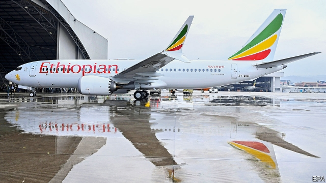
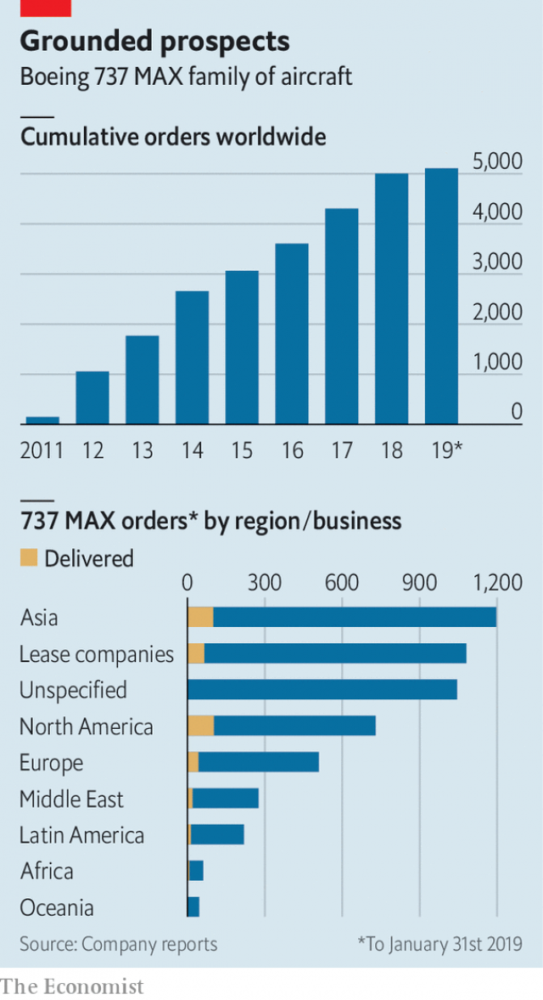

###### A crisis of confidence

# Two tragic air disasters may not down Boeing 

##### Reputational damage, together with protectionism and rising debt, herald troubled times for America’s aerospace giant 

 

> Mar 14th 2019 

BOEING WAS hoping for good headlines on March 13th, the day on which it planned the glitzy unveiling of its new long-haul 777X jetliner at its factory outside Seattle. Instead, tragic events three days earlier in Ethiopia prompted it to cancel the event. On March 10th a Boeing 737 MAX 8 crashed near the capital, Addis Ababa, killing all 157 people aboard. The apparent similarities between this crash and one five months ago involving a MAX 8 operated by Lion Air in Indonesia raised concerns among aviation authorities around the world. By March 13th virtually all the world’s fleet of MAX 8s had been grounded by airlines or regulators. The tragedy has also frightened Boeing’s investors. Within days its share price fell by more than 10%, wiping nearly $30bn off its market value. 

Accidents, even tragic ones, do not usually have such a chilling effect on planemakers’ shareholders. The crash last month off the coast of Texas of a Boeing 767 carrying cargo had virtually no impact on its maker’s share price, despite claiming three lives. As Howard Wheeldon, an aerospace analyst, explains, this is because most crashes are caused by human error. Airlines who hired those humans therefore get most of the blame. 

This time is different. It is the second crash in less than a year involving a brand-new MAX 8. As in Indonesia, the Ethiopian airliner crashed within minutes of take-off. Both appeared to stall, nosedived and hit the ground at speed. A preliminary report into the earlier disaster, which killed 189 passengers and crew, said that pilots struggled to maintain control following an equipment malfunction (see article). Tewolde GebreMariam, the chief executive of Ethiopian Airlines, has claimed that something similar happened in the moments before the latest accident. If investigators prove him right, that could mean not humans were at fault, but the jet itself. 

No definitive conclusions can yet be drawn about the causes of either crash. Investigators are still at work in Indonesia. In Ethiopia, they have barely begun. Yet the accidents in both places look so alike that authorities are not taking any chances. China’s regulator was the first to act, instructing its domestic airlines on March 11th to ground all 737 MAX aircraft, not just version 8. Authorities in Australia, Britain, France and Germany banned the jets from their airspace the next day, as did Europe’s aviation-safety regulator. On March 13th President Donald Trump announced that the Federal Aviation Administration (FAA) would halt all flights of MAX 8s and newer MAX 9s over America. 

This came as a blow to Boeing. The FAA had resisted the global moves to ground the MAX, given uncertainty over the causes of the latest tragedy. After the crash on March 11th it reaffirmed its airworthiness. If the model remains grounded for a prolonged period, airlines may not accept deliveries of new planes. Boeing gets paid for each one on delivery, so this would hurt its bottom line. 

The 737 is Boeing’s most important plane, generating 30% of the company’s revenues and 35% of its profits, according to George Ferguson of Bloomberg Intelligence, a research firm. It first took to the sky in 1967. A year ago Boeing delivered its 10,000th 737. The MAX 8 is the latest, re-engined version of the aeroplane, which entered service into May 2017. Airlines have already purchased over 5,000 of them, accounting for around 80% of Boeing’s entire order book of civil aircraft. Mr Trump said that the FAA and Boeing were “in agreement” with his decision to ground the aircraft temporarily. On March 13th the company reiterated it had “full confidence in the safety of the 737 MAX”. 

The long-term damage to Boeing will not be clear until investigators complete their work. Carter Copeland of Melius Research estimates that the direct cost of the crash in terms of compensation and fixing faulty planes could be as little as $1bn. If a software problem caused the crash, it should be easy to fix. Boeing has promised to update the code suspected of having contributed to the Lion Air crash by next month. Whether this reassures airlines and passengers remains to be seen. 

A hardware problem would be costlier to fix—and demands for reassurance, louder. Boeing’s boosters believe that even then the long-term damage could be contained. Mr Copeland points out that the grounding of Boeing’s 787 wide-body airliner for three months in 2013, because its lithium-ion batteries kept catching fire, did little to hurt demand for the aircraft. 

Yet even spectacular battery failures are not the same as two deadly crashes. A stronger hint that Boeing may recover comes from the reaction of investors in its European arch-rival, Airbus. Between them, the two companies account for all large commercial aircraft sold around the world. If the crash were to do lasting damage to Boeing, Airbus should benefit commensurately. Its share price has gained half as much as Boeing’s has lost. 

That understates the long-term costs for Boeing, argues Marc Szepan, a former executive at Lufthansa, now at Oxford University. Airbus has little to gain in the short term from airlines switching orders from the 737 MAX to its A320neo aircraft because its production lines for the model are already fully booked until at least 2025. Boeing stands to lose if airlines bargain down prices of the MAX 8, pointing to the poor public perception of its safety. 

 

A change in consumer attitudes towards plane models makes that likely. Today many passengers, not just aviation geeks, take note of what planes they board. This week carriers have fielded questions from nervous customers about their scheduled aircraft, asking to change their itinerary should it involve a MAX. Shares in airlines that have made large orders for the planes have been hit; those in BOC Aviation, a big aircraft-leasing firm, dipped nearly 5%. Some airlines, including Lion Air, want to switch away from the MAX 8 model for fear of losing customers. 

Analysts whisper that the issues with the MAX may be only the start of bad news for Boeing. Before the latest rout, its share price had tripled in three years. In 2017 it was America’s best-performing industrial stock. In 2018 it was the eighth-best. But this, industry watchers caution, has more to do with its generous dividends and share buy-backs, which return 95% of the cash it generates to investors, than with a careful assessment of the risks associated with the company. If the MAX or another issue stopped the flow of cash, investors could be in for a rude shock. 

Boeing’s current strategy increases the risk of that, thinks Richard Aboulafia of Teal Group, an aviation consultancy in Virginia. The company wants to grab its suppliers’ fat margins by making more components in house. But this exposes it to losses if margins turn negative in a downturn. The company is vulnerable to Mr Trump’s trade wars, and the protectionism they stoke abroad: 85% of its civil aircraft sales come from outside America. Lastly, Boeing cannot increase the amount of money it returns to shareholders indefinitely. Its net debt is rising, albeit from low levels. 

It is possible that Boeing will be exonerated from blame for the latest crash. Some threats to its business may not materialise. No one has died in accidents involving the previous five aircraft types that Airbus and Boeing have developed. This happy streak has now come to a solemn end. The damage to Boeing’s prospects may not be irreparable. But they have been battered. 

-- 

 单词注释:

1.tragic['trædʒik]:a. 悲惨的, 悲剧的 

2.boe[bəu]:abbr. back outlet eccentric 后偏心（轮）出口 

3.reputational[,repju'teiʃən]:a. reputation（名声, 声誉）的变形 

4.protectionism[prә'tekʃәnizm]:n. 贸易保护主义, 贸易保护制 [经] 保护(贸易)主义, 保护(贸易)制 

5.herald['herәld]:n. 使者, 传令官, 先驱 vt. 预报, 宣布, 传达, 欢呼 

6.aerospace['єәrәuspeis]:n. 航天空间, 航天技术 

7.glitzy['^litsi]:a. <美><加> 闪光的, 耀眼的, 眩目的 

8.unveil[.ʌn'veil]:vt. 揭开, 揭幕, 除去...的面纱 vi. 显露, 除去面纱 

9.jetliner['dʒetlainә]:n. 喷气客机 

10.Seattle[si'ætl]:n. 西雅图 

11.Ethiopia[.i:θi'әupiә]:n. 埃塞俄比亚 

12.MAX[mæks]:[计] 最大 

13.addis['ædis]:n. 艾缔思（姓氏） 

14.Ababa[]:n. (Ababa)人名；(塞)阿巴巴 

15.similarity[.simi'læriti]:n. 类似, 类似处 [法] 类似, 相似, 类似事例 

16.Indonesia[.indәu'ni:ʒә]:n. 印尼 

17.regulator['regjuleitә]:n. 调整者, 校准者, 校准器, 调整器, 标准钟 [化] 调节剂; 调节器 

18.investor[in'vestә]:n. 投资者 [经] 投资者 

19.shareholder['ʃєә.hәuldә]:n. 股东 [法] 股东, 股票持有人 

20.Texas['teksәs]:n. 德克萨斯 

21.howard['hauәd]:n. 霍华德（男子名） 

22.wheeldon[]: [人名] [英格兰人姓氏] 惠尔登住所名称，来源于古英语，含义是“轮+山，或河谷”(wheel+hill,or valley) 

23.analyst['ænәlist]:n. 分析者, 精神分析学家 [化] 分析员; 化验员 

24.les[lei]:abbr. 发射脱离系统（Launch Escape System） 

25.Ethiopian[.i:θi'әupiәn]:a. 埃塞俄比亚的 n. 埃塞俄比亚人 

26.airliner['єәlainә]:n. 班机, 大型客机 

27.stall[stɒ:l]:n. 厩, 停车处, 牧师职位, 货摊, 托辞, 拖延 vt. 关入厩, 停顿, 推托, 支吾, 使陷于泥中 vi. 被关在厩内, 陷于泥中, 停止, 支吾 

28.nosedive[]:vi. 俯冲, (价格)猛跌, 暴落 

29.malfunction[.mæl'fʌŋʃәn]:n. 故障, 失灵, 疾病 vi. 发生故障, 不起作用 [计] 故障 

30.investigator[in'vestigeitә]:n. 调查者, 审查者 [法] 审查员, 侦查员, 调查员 

31.definitive[di'finitiv]:n. 限定词 a. 限定的, 决定性的 

32.FAA[]:一切海损均不赔偿 

33.uncertainty[.ʌn'sә:tnti]:n. 不确定, 不可靠, 不确定的事物 [化] 不确定度 

34.reaffirm[.ri:ә'fә:m]:vt. 重申, 再确认 

35.airworthiness['єә.wә:ðinis]:n. 适航性 

36.prolong[prәu'lɒŋ]:vt. 延长, 拖延, 拖长 [化] 冷凝管 

37.george[dʒɔ:dʒ]:n. 乔治（男子名）；自动操纵装置；英国最高勋爵勋章上的圣乔治诛龙图 

38.Ferguson['fə:ɡəsən]:n. 弗格森（美国密苏里州的一个城市名）；弗格森（姓氏） 

39.bloomberg[]: [人名] 布隆伯格 

40.temporarily['tempәrәrәli]:adv. 暂时, 一时, 临时 

41.reiterate[ri:'itәreit]:vt. 反复地说, 重申, 反复地做 [法] 重述, 重申, 反覆地做 

42.carter['kɑ:tә]:n. 运货马车夫 

43.Copeland[]:n. 科普兰；谷轮公司 

44.melius[]: [人名] 米柳斯 

45.compensation[.kɒmpen'seiʃәn]:n. 补偿, 赔偿金, 工资 [医] 代偿(机能), 补偿 

46.update[ʌp'deit]:vt. 更新, 使现代化 n. 更新 [计] 更新 

47.reassure[.ri:ә'ʃuә]:vt. 使...安心, 向...再保证 [法] 重新保证, 再保险, 使清除疑虑 

48.reassurance[.ri:ә'ʃurәns]:n. 安心, 放心, 再保证 

49.booster['bu:stә]:n. 向前推的人, 支持者, 后援者, 升压器 [化] 爆管; 扩爆药; 传爆药; 升压机; 增压装置; 升压器; 助促进剂 

50.grounding['graundiŋ]:n. 基础教学, 基础训练 [经] 搁浅 

51.spectacular[spek'tækjulә]:a. 公开展示的, 惊人的, 壮观的 n. 奇观, 惊人之举, 展览物 

52.airbus['eәbʌs]:空中客车 

53.commensurately[]:adv. 相当地, 相称地；同量地 

54.understate[.ʌndә'steit]:v. 不完全地陈述, 保守地说, 有意轻描淡写 

55.marc[mɑ:k]:n. 榨渣 [计] 机器可读目录; 机读目录 

56.Lufthansa['ljft,hænsә]:n. (联邦德国)汉莎航空公司 

57.Oxford['ɒksfәd]:n. 牛津, 牛津大学 

58.fully['fuli]:adv. 十分地, 完全地, 充分地 

59.perception[pә'sepʃәn]:n. 知觉, 感觉, 领悟力, 获取 [医] 知觉 

60.geek[gi:k]:n. 做低级滑稽表演的人 

61.itinerary[ai'tinәrәri]:n. 旅程, 旅行指南, 游记 a. 巡回的, 旅程的 

62.BOC[]:abbr. 中国银行（Bank of China Limited） 

63.rout[raut]:n. 溃败, 大败, 乌合之众, 盛大晚会 vt. 使溃败, 使败逃, 打垮, 用鼻拱, 挖起, 搜, 唤起 vi. 用鼻拱地, 搜 

64.triple['tripl]:n. 三倍数, 三个一组 a. 三倍的 vt. 使增至三倍 vi. 增至三倍 

65.watcher['wɒtʃә]:n. 看守人, 守望者, 哨兵 

66.dividend['dividend]:n. 被除数, 股利 [计] 被除数 

67.richard['ritʃәd]:n. 理查德（男子名） 

68.aboulafia[]:[网络] 阿波拉弗亚；阿布拉费 

69.teal[ti:l]:n. 短颈野鸭 

70.consultancy[]:n. 商量, 协商, 磋商, 会诊, 与...商量, 咨询, 请教, 找(医生)看病, 查阅, 考虑 [经] 咨询业务, 咨询服务 

71.Virginia[vә'dʒinjә]:n. 弗吉尼亚 

72.grab[græb]:n. 抓握, 掠夺, 强占, 东方沿岸帆船 vi. 抓取, 抢去 vt. 攫取, 捕获, 霸占 

73.downturn['dauntә:n]:n. (尤指经济方面的)衰退, 下降趋势 [电] 低迷时期 

74.vulnerable['vʌlnәrәbl]:a. 易受伤害的, 有弱点的, 易受影响的, 脆弱的, 成局的 [医] 易损的 

75.stoke[stәuk]:v. 司炉, (使)大吃 

76.lastly['lɑ:stli]:adv. 最后, 终于 

77.cannot['kænɒt]:aux. 无法, 不能 

78.indefinitely[]:adv. 无期限地 

79.albeit[ɔ:l'bi:it]:conj. 尽管, 虽然 

80.exonerate[ig'zɒnәreit]:vt. 免除, 证明无罪 [法] 解放, 开释, 免罪 

81.materialise[mә'tiәriәlaiz]:vi.vt. (使)物质化, (使)具体化, (使)追求物质利益, (使)显形, 成为事实, 实现 vi. 突然出现 

82.streak[stri:k]:n. 条理, 斑纹, 倾向 vt. 加条纹 vi. 变成条纹, 飞跑 

83.irreparable[i'repәrәbl]:a. 不能修补的, 不能挽回的 [法] 不可弥补的, 不可挽回的 

84.batter['bætә]:v. 连续猛打（尤其指妇女），猛击 n. 面糊（食物），击球员，打击手 

