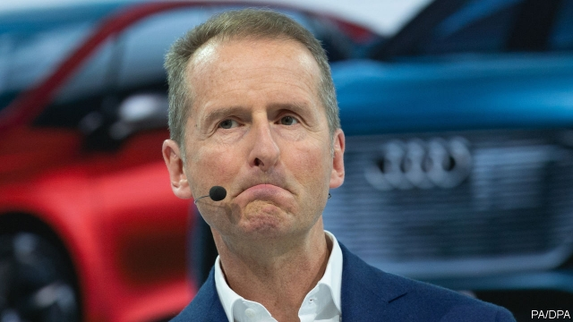

###### New Wave

# VW’s newish boss is going full-steam ahead with electric cars 

##### And picking a fight with the German carmaker’s powerful unions 

 

> Mar 14th 2019 

“THE SUPERTANKER is picking up speed,” declared Herbert Diess, boss of Volkswagen (VW), presenting future plans to investors and the press on March 12th at the company’s headquarters in Wolfsburg. A fast move by the giant carmaker into electric vehicles (EVs) will become quicker still, he vowed. His promise of 70 new electric models by 2028, rather than 50 as previously pledged, and 22m EVs delivered over the next ten years is the biggest commitment to battery power by any car company. Mr Diess is taking on the tough task of turning a supertanker around. 

VW’s investors have long grumbled that its vast bulk has not delivered high profits or helped its share price. Mr Diess wants to raise both. Before the “dieselgate” emissions scandal the firm’s bosses bet on scale. VW made nearly 11m vehicles last year. Putting growth before profits also suited its mighty unions, for which preserving jobs is paramount. As a result, VW disproportionately relies on its two premium brands, Audi and Porsche, for earnings. Productivity at its mass-market brands is woeful, and that in a segment where margins are anyway slender. 

Any attempt to change the balance has met with stiff resistance. Workers occupy half the seats on the firm’s supervisory board and can usually count on the state of Lower Saxony, which owns 12% of VW, to back them. The board can block job cuts and other unwelcome changes. Nearly half of VW’s 660,000 employees are in Germany but the company has been unable to shift manufacturing to lower-wage countries, as rival carmakers have done. In 2017 unions successfully opposed the mooted sale of Ducati, a small Italian motorcycle-maker that is hardly core to VW. “Labour dominates the firm,” says Arndt Ellinghorst of Evercore ISI, an equity-research firm, and corporate governance is “a catastrophe”. 

Mr Diess arrived from BMW three years ago with a reputation as a cost cutter and took over as boss last year with a mandate from the Porsche and Piëch families, which control just over half the firm’s voting rights, to take on the unions. On March 4th Wolfgang Porsche, spokesman for the families, criticised VW’s “fossilised structures” and bemoaned labour blocking progress. Mr Diess explained his “EV heavy” vision as a broad attempt to cut global emissions of carbon dioxide as well as meeting extremely tough European emissions targets. But it may also provide an excuse to slash the labour force. Mr Diess said lay-offs would be unavoidable as the simpler mechanics of EVs require 30% less “effort” to manufacture than a petrol-powered car. 

Another jerk of the supertanker’s tiller that will upset VW’s unions is Mr Diess’s new focus on shareholders. VW is introducing a scheme linking incentives for senior managers to the firm’s share price. Although on March 13th VW postponed plans to spin off its lorry-making division, the company has promised more details on other restrucuring efforts, such as cutting costs and unlocking the firm’s “huge conlgomerate discount”, in the summer. 

Tales abound of tensions between Mr Diess and Bernd Osterloh, VW’s pugnacious labour leader. Mr Osterloh has said that management should focus on its mishandling of new emissions tests in Europe, which delayed new models and cost VW €1bn ($1.1bn), rather than changes to the workforce. If Mr Diess is serious about leading the car industry’s charge on electrification, the latter will be unavoidable. 

-- 

 单词注释:

1.newish['nju:iʃ]:a. 尚新的 

2.supertanker['sju:pәtæŋkә]:n. 超级油轮, 巨大油轮 

3.herbert['hә:bәt]:n. 赫伯特（男人名） 

4.volkswagen['fɔ:lks,vɑ:^әn]:n. 大众汽车（财富500强公司之一） 

5.vw[]:abbr. 大众汽车（Volkswagen） 

6.investor[in'vestә]:n. 投资者 [经] 投资者 

7.headquarter[,hed'kwɔ:tә]:vt. 将...的总部设在 

8.Wolfsburg[]:n. 沃尔夫斯堡（德国北部城市） 

9.carmaker['kɑ:,meikә(r)]:n. 汽车制造商 

10.ev[]:[电] 电子伏特 

11.vow[vau]:n. 誓约, 誓言, 许愿 vi. 起誓, 发誓, 郑重宣言 vt. 立誓, 起誓要, 郑重地宣布 

12.pledge[pledʒ]:n. 诺言, 保证, 誓言, 抵押, 信物, 保人, 祝愿 vt. 许诺, 保证, 使发誓, 抵押, 典当, 举杯祝...健康 

13.supertanker['sju:pәtæŋkә]:n. 超级油轮, 巨大油轮 

14.grumble['grʌmbl]:n. 怨言, 满腹牢骚 vi. 抱怨, 发牢骚, 发隆隆声 vt. 抱怨 

15.emission[i'miʃәn]:n. 发射, 射出, 发行 [医] 发射, 遗精 

16.mighty['maiti]:n. 有势力的人 a. 有势力的, 强大的, 有力的 adv. 很, 极 

17.paramount['pærәmaunt]:n. 首长, 最高当局 a. 最重要的, 最高的, 至上的 

18.disproportionately[]:adv. 不匀称, 不相称 

19.premium['pri:miәm]:n. 额外补贴, 奖金, 奖赏, 保险费 [医] 保险费 

20.audi[]:n. 奥迪公司；奥迪汽车 

21.porsche[]:n. 保时捷（德国知名汽车厂商或其出产的轿车品牌名） 

22.earning['ә:niŋ]:n. 收入（earn的现在分词） 

23.productivity[.prәudʌk'tiviti]:n. 生产力 [经] 生产率, 生产能力 

24.woeful['wәuful]:a. 悲伤的, 悲哀的 

25.supervisory[.sju:pә'vaizәri]:a. 管理的, 监督的, 管理人的 [经] 监督的, 管理的 

26.Saxony['sæksәni]:n. 光毛呢 

27.unwelcome[ʌn'welkәm]:a. 不受欢迎的, 讨厌的 n. 冷淡 vt. 冷淡地对待, 冷淡地接受 

28.manufacturing[.mænju'fæktʃәriŋ]:n. 制造业 a. 制造业的 

29.moot[mu:t]:n. 大会, 模拟案件, 辩论会 a. 未决议的, 无实际意义的 vt. 讨论, 争论 

30.ducati[]:[网络] 杜卡迪；杜卡迪公司；杜卡迪超级摩托车 

31.Arndt[ɑ:nt]:阿尔恩特(姓氏) 

32.evercore[]:[网络] 艾维克；艾菲科 

33.isi[]:abbr. 工业标准项目（Industry Standard Item）；钢铁学会（Iron and Steel Institute）；印度标准学会（Indian Standards Institution） 

34.corporate['kɒ:pәrit]:a. 社团的, 合伙的, 公司的 [经] 团体的, 法人的, 社团的 

35.governance['gʌvәnәns]:n. 统治, 统辖, 管理 [法] 统治, 管理, 支配 

36.bmw[]:abbr. 德国宝马汽车公司（Bavarian Motor Works） 

37.cutter['kʌtә]:n. 裁剪者, 切割者, 切割器 [化] 刀具; 剪切机; 切刀; 切胶机 

38.mandate['mændeit]:n. 命令, 指令, 要求 vt. 委任统治 

39.wolfgang['wulf^æŋ]:n. 沃尔夫冈（男子名） 

40.spokesman['spәuksmәn]:n. 发言人, 代言者 

41.criticise['kritisaiz]:v. 批评, 吹毛求疵, 非难 

42.fossilise['fɔsilaiz]:vt.vi. 使成化石, 变成化石, 使(思想)陈旧, 使僵化 

43.bemoan[bi'mәun]:vt. 哀悼, 惋惜, 认为遗憾, 哀叹 

44.ev[]:[电] 电子伏特 

45.slash[slæʃ]:v. 猛砍, 乱砍 n. 猛砍, 乱砍, 删减 [计] 斜线 

46.unavoidable[.ʌnә'vɒidәbl]:a. 不可避免的, 不得已的, 不能作废的 [医] 难免的 

47.les[lei]:abbr. 发射脱离系统（Launch Escape System） 

48.jerk[dʒә:k]:n. 性情古怪的人, 急拉, 肌肉抽搐, 牛肉干 vi. 痉挛, 急拉, 急推 vt. 猛拉 

49.tiller['tilә]:n. 耕种者, 分蘖 vi. 分蘖 

50.shareholder['ʃєә.hәuldә]:n. 股东 [法] 股东, 股票持有人 

51.incentive[in'sentiv]:n. 动机 a. 激励的 

52.unlock[.ʌn'lɒk]:vt. 开...的锁, 开启, 表露, 放出 vi. 被开启, 揭开, 解放 [计] 解出锁定 

53.abound[ә'baund]:vi. 大量存在, 富于, 充满 

54.Bernd[]:n. 贝恩德（德国人名） 

55.osterloh[]:[网络] 奥斯特罗；奥斯特洛；张凯贞与美国欧斯特洛 

56.pugnacious[pʌg'neiʃәs]:a. 好斗的 

57.mishandle[mis'hændl]:vt. 虐待, 胡乱处理 

58.electrification[i.lektrifi'keiʃәn]:n. 起电, 带电, 电气化 [化] 起电 

