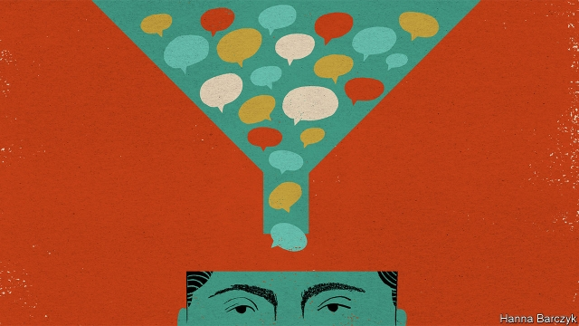

###### Chaguan

# China says it wants more “independent” think-tanks 

##### However, they must be independent “with Chinese characteristics” 

 

> Mar 14th 2019 

FRUSTRATED BY the quality of the advice he was receiving, the first Song emperor of China had an idea. The tenth-century ruler, it is said, promised that officials would not be executed for disagreeing with him. President Xi Jinping appears to be testing a less flamboyant remedy to a similar problem. To ensure a supply of diverse opinions, even as public debates face strict controls, Mr Xi is encouraging a boom in “think-tanks with Chinese characteristics”. 

State-funded think-tanks, many of them serving individual ministries or Communist Party bodies, have long existed in China. But recent years have seen a flourishing of think-tanks that eschew direct state sponsorship. Some are privately funded foundations, or attached to universities. Others register as private consulting firms, bringing both flexibility and vulnerability. 

The boom throws up puzzles. In the West, measuring clout is easy. When a Democrat wins the White House, a flotilla of progressive wonks bobs across Washington from places like the Brookings Institution to join the government. When a Republican is elected, conservative wonks who share the winner’s politics take their turn— hard-edged partisan think-tanks have hit the jackpot under President Donald Trump. In Europe, think-tanks send staff into government as special advisers and work to shape public debate. Assessing influence is harder in China, where the revolving door is one-way: officials may retire into think-tanks, but seldom return to government. And the party in power never changes. 

In China, real influence is rarely wielded in public. Among researchers, the term neibu (“internal”) is used a lot. Each day, favoured think-tanks and universities send policy papers via neibu channels to Mr Xi and other leaders. If he reads a paper, or—a high honour—scrawls a note in its margins, aides send word to its authors, casting a roseate glow over all involved. Well-connected think-tanks send staff to internal government and party meetings. Behind closed doors, their scholars weigh in on big, divisive questions. An example is the Belt and Road Initiative, a scheme to connect the world with railway lines, telecommunications networks and other infrastructure. Some think-tanks argue that China gains by funding and controlling the project. Others call it a financial and diplomatic burden that should be shared with other countries. During the trade war with America, scholars have been summoned to advise on the wording of Chinese government announcements. Smart think-tanks prepare public and neibu versions of papers. They are also asked by officials to advance arguments that bigwigs prefer not to make aloud. Distrust any policy wonk who claims to speak for a grandee, though, says a prominent researcher. “If he is really close to those VVVIPs, he cannot tell you.” 

Chaguan asked the heads of some very different think-tanks about another puzzle: that proximity to power is good for prestige but bad for credibility, especially in an autocracy. Diplomats and foreign analysts call the China Institutes of Contemporary International Relations (CICIR) the country’s shrewdest foreign-policy think-tank, despite (or perhaps because of) its links to the deep state. With over 200 scholars following both individual countries and broad questions of national security, CICIR’s leafy campus resembles a small university. Paramilitary guards and massive gates hint at CICIR’s (unacknowledged) affiliation with the Ministry of State Security, China’s main intelligence service. CICIR’s president, Yuan Peng, notes that Western think-tanks use punchy phrases and attack politicians for past blunders. CICIR uses “subtle” language to describe present realities accurately and to offer constructive suggestions about the future, he says. Mr Yuan accepts no lessons about objectivity from the West, calling American think-tanks beholden to rich ideologues: “Western think-tanks are independent from government, but not from interest groups.” 

Wang Huiyao leads the Centre for China and Globalisation, a think-tank that promotes free trade and greater opening to the world. Mr Wang is proud that his “independent” think-tank is funded by Chinese entrepreneurs and companies, not the state. But he is an outsider with neibu access, serving as an appointed adviser to the State Council, or cabinet, and as vice-chairman of a group that seeks to influence foreign-educated Chinese, the Western Returned Scholars Association. Today’s China may not allow political competition, but it has opened a door to “political-proposal competition”, he argues. 

The Chongyang Institute for Financial Studies, which is backed by private donors but attached to Renmin University, an elite academy in Beijing, is headed by Wang Wen, a rising star on what might be dubbed the Make China Great Again right. He downplays his rumoured access to powerful folk, insisting that Chinese leaders consult widely, gathering opinions “like bees collect nectar”. The institute’s walls are thick with framed photographs of foreign dignitaries, for favoured think-tanks also do quasi-diplomatic work. 

True independence brings costs. The Unirule Institute for Economics, founded in 1993 by distinguished liberal reformers, is under siege. It currently perches in a small apartment in north Beijing, down a hallway crowded with bicycles and buckets of yellowing vegetables. The government last year cancelled the business licence of one of its sponsoring entities, after Unirule criticised policies that favour state monopolies and hamper private firms. Authorities say its fault was hosting training courses without an educational permit. Its director, Sheng Hong, was until January a member of Chinese Economists 50 Forum, a body closely linked to Liu He, a deputy prime minister who is Mr Xi’s chief economic adviser. Mr Sheng says forum members feel they are offering advice to national leaders. But access comes with “invisible limitations”. Too often, sensitive subjects are not raised, he says. 

Wise emperors understood this. Diverse opinions may provoke autocratic rulers. What really hurts is the advice they never hear. 

-- 

 单词注释:

1.les[lei]:abbr. 发射脱离系统（Launch Escape System） 

2.flamboyant[flæm'bɒiәnt]:a. 火焰似的, 辉耀的, 华丽的 

3.eschew[is'tʃu:]:vt. 避开, 远避 

4.sponsorship['spɔnsәʃip]:n. 发起, 倡议, 主办, 保证人的地位, 教父的地位, 教母的地位 

5.privately[]:adv. 秘密地；私下地 

6.flexibility[.fleksi'biliti]:n. 弹性, 适应性 [计] 灵活性; 适应性 

7.vulnerability[.vʌlnәrә'biliti]:n. 易受伤, 易受责难, 易受伤部位 [医] 易损性 

8.clout[klaut]:n. 敲击, 破布 vt. 打补钉 

9.democrat['demәkræt]:n. 民主人士, 民主主义者, 民主党党员 [经] 民主党 

10.flotilla[flәu'tilә]:n. 小舰队, 小型船队 

11.wonk[wɔŋk]:[俚]书呆子, 死用功的学生 

12.bob[bɒb]:vt. 剪短, 敲击 vi. 振动, 上下跳动 n. 短发, 悬挂的饰品, 浮子, 摆动, 轻敲, 5便士 

13.Washington['wɒʃiŋtn]:n. 华盛顿 

14.Brooking[]:n. (Brooking)人名；(英、西)布鲁金 忍受（brook的现在分词形式） 容忍 

15.politic['pɒlitik]:a. 精明的, 明智的, 策略的 

16.partisan['pɑ:tizn]:n. 党羽, 虔诚信徒, 同党, 游击队员 a. 党派的, 偏袒的, 效忠的, 献身的, 盲目推崇的 

17.jackpot['dʒækpɔt]:n. 最大赌注, (彩票的)头奖, 最大成功, 意外的成功/奖赏, 困境 

18.adviser[әd'vaizә]:n. 顾问, 劝告者, 指导教师 [法] 顾问, 劝告者 

19.revolve[ri'vɒlv]:v. (使)旋转, 反复考虑, 循环出现 

20.wield[wi:ld]:vt. 挥舞, 运用 

21.aide[eid]:n. 助手, 副官 [计] 数据输入的可说明性 

22.roseate['rәuziәt]:a. 玫瑰色的 

23.divisive[di'vaisiv]:a. 区分的, 制造分裂的, 造成不和的 

24.telecommunication['telikәmju:ni'keiʃәn]:n. 电讯, 远距离通讯, 无线电通讯 [计] 远程通信, 电信 

25.infrastructure['infrәstrʌktʃә]:n. 基础结构, 基础设施 [经] 基础设施 

26.diplomatic[.diplә'mætik]:a. 外交的, 老练的 [法] 外交的, 外交上的, 文献上的 

27.summon['sʌmәn]:vt. 召唤, 召集, 号召, 振奋, 唤起, 鼓起 [经] 传唤, 传讯 

28.wording['wә:diŋ]:n. 用词, 措词 

29.bigwig['bigwig]:n. 要人, 大亨 

30.distrust[dis'trʌst]:n. 不信任 vt. 不信任 

31.grandee[græn'di:]:n. 大公, 显贵之人 

32.cannot['kænɒt]:aux. 无法, 不能 

33.proximity[prɒk'simiti]:n. 接近, 亲近 

34.prestige[pre'sti:ʒ]:n. 声望, 威望, 威信 [经] 商誉, 声誉 

35.credibility[.kredi'biliti]:n. 可信用, 确实性, 可靠 [法] 证据能力, 可信程度, 确实性 

36.autocracy[ɒ:'tɒkrәsi]:n. 独裁统治, 独裁统治的国家 [法] 独裁政治, 专制政治, 独裁政府 

37.diplomat['diplәmæt]:n. 外交官, 有外交手腕的人 [法] 外交家, 外交官, 有权谋的人 

38.analyst['ænәlist]:n. 分析者, 精神分析学家 [化] 分析员; 化验员 

39.shrewd[ʃru:d]:a. 精明的, 锐利的, 剧烈的, 机灵的, 厉害的 

40.leafy['li:fi]:a. 叶茂盛的, 多叶的, 叶状的 

41.paramilitary[.pærә'militәri]:a. 辅助军事的 

42.unacknowledged[.ʌnәk'nɒlidʒd]:a. 未被承认的, 未被公认的, 未答复的 

43.affiliation[ә.fili'eiʃәn]:n. 联系, 从属关系 [医] 父权(判定私生儿的父亲) 

44.peng[]:n. 执业工程师 

45.punchy[]:a. 有力的, 生气勃勃的 

46.blunder['blʌndә]:n. 大错, 大失策 vi. 失策, 跌跌撞撞地走, 犯错 vt. 做错 

47.subtle['sʌtl]:a. 敏锐的, 精细的, 狡猾的, 稀薄的, 灵巧的, 微妙的 [医] 锐敏的; 精细的 

48.accurately['ækjurәtli]:adv. 正确地, 精确地 

49.constructive[kәn'strʌktiv]:a. 建设性的, 构造上的 [医] 构成的 

50.objectivity[,ɔbdʒek'tivәti]:n. 客观, 客观现实, 客观性 [经] 客观性 

51.beholden[bi'hәudәn]:a. 负有义务的, 受惠的 

52.wang[]:n. 王（姓氏）；王安电脑公司 

53.globalisation[,gləubəlai'zeiʃən]:n. 全球化, =globalization 

54.entrepreneur[.ɒntrәprә'nә:]:n. 企业家, 主办人 [经] 承包商, 企业家 

55.outsider[' aut'saidә]:n. 外人, 局外人, 非会员, 外行, 门外汉, 比赛中获胜可能性不大的选手 [经] 外船公司 

56.Chongyang[]:冲阳 

57.donor['dәunә]:n. 捐赠人 [化] 给体; 供体 

58.elite[ei'li:t]:n. 精华, 精锐, 中坚分子 

59.wen[wen]:n. 粉瘤, 拥挤不堪的城市 [医] 皮脂囊肿, 粉瘤, 表皮囊肿 

60.dub[dʌb]:vt. 配音, 轻点, 授予称号, 击 n. 一下击鼓声, 笨蛋 

61.downplay['daunplei]:vt. 不予重视 

62.nectar['nektә]:n. 神酒, 甜美饮料, 甘露 

63.dignitary['dignitәri]:n. 高贵的人, 高官, 高僧, 要人 

64.reformer[ri'fɒ:mә]:n. 改革家, 改革运动者 [化] 转化炉; 转化器; 重整器; 重整炉 

65.siege[si:dʒ]:n. 包围, 围攻, 再三的努力 vt. 包围, 围攻 

66.currently['kʌrәntli]:adv. 现在, 当前, 一般, 普通 [计] 当前 

67.perch[pә:tʃ]:n. 栖木, 高位, 杆, 河鲈 v. (使)栖息, 就位, 位于, (使)暂歇 

68.hallway['hɔ:lwei]:n. 门厅；玄关；走廊 

69.entity['entiti]:n. 实体, 实存物, 存在 [计] 实体 

70.criticise['kritisaiz]:v. 批评, 吹毛求疵, 非难 

71.monopoly[mә'nɒpәli]:n. 垄断, 专卖权, 独占事业 [经] 垄断, 专利品, 垄断(权)独占 

72.hamper['hæpә]:n. 食篮, 阻碍物, 食盒 vt. 阻碍, 使困累, 妨碍, 牵制 

73.educational[.edju'keiʃәnl]:a. 教育的, 教育性的 

74.sheng[ʃeŋ]:n. 笙（中国的一种民族乐器） 

75.hong[hɔŋ]:n. （中国、日本的）行, 商行 

76.economist[i:'kɒnәmist]:n. 经济学者, 经济家 [经] 经济学家 

77.forum['fɒ:rәm]:n. 论坛, 公开讨论的广场, 法庭, 讨论会 [法] 讨论会, 专题讨论, 公共论坛 

78.forum['fɒ:rәm]:n. 论坛, 公开讨论的广场, 法庭, 讨论会 [法] 讨论会, 专题讨论, 公共论坛 

79.provoke[prә'vәuk]:vt. 激怒, 惹起, 诱导 [法] 刺激, 煽动, 激怒 

80.autocratic[.ɒ:tә'krætik]:a. 独裁的, 专制的 

