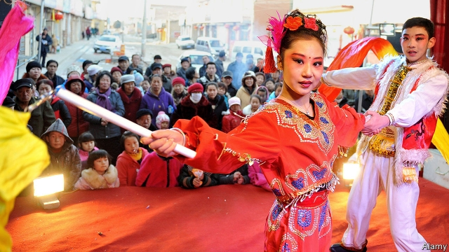

###### Keeping it dirty

# China’s north-east is the home of bawdy song-and-dance 

##### Despite the Communist Party’s war on smut, it thrives 

 

> Mar 14th 2019 

“CUT! THAT was dead awful. Deliver with more passion!” roars He Xiaoying at a group of adolescent girls who had been rehearsing a comedy routine. Ms He is the eponymous head of a boarding school in the north-eastern city of Changchun, in China’s rust belt. Her mission is to train young people in the art of errenzhuan, or “two-person turn”, a traditional form of comic song-and-dance that often involves raunchy gags. The children also study subjects that are more academic, but these take a back seat. 

There are at least a dozen such schools in the three provinces of the north-east where errenzhuan originated. Ms He’s 80-odd students, most from poor backgrounds, dream of appearing on national television, or, failing that, at a well-known theatre. In a region plagued by unemployment, some people see a promising future in comedy. 

Errenzhuan requires arduous training. It involves duets, typically between a man and a woman, that are often delivered in seven- or ten-character rhyming lines. The dance is usually in folk style, as is the performers’ dress (though modern touches are permissible). In the north-east, where errenzhuan has many fans, some proudly call it the world’s hardest form of comedy. 

It is certainly among the most notorious in China for its bawdiness. A common routine is called “The 18 Touches”. One variant of this involves a female performer cracking lewd jokes while stroking the genitals of her male counterpart (with his trousers on). In 2004 Zhao Benshan, the godfather of errenzhuan and China’s first billionaire comedian, said erren zhuan without smut was not erren zhuan at all. 

President Xi Jinping is no fan of lewd comedy. In 2014, in a speech on the role of the arts, Mr Xi said some artists were spewing out “cultural garbage”. He demanded that creative works serve the Communist Party and not “provoke the ecstasy of the senses”. It may be no coincidence that Mr Zhao has not appeared on national television’s Chinese New Year gala since Mr Xi assumed power in 2012. He had once been a regular (in cleaned-up form) on the hugely popular show. Last year Mr Zhao was booted out of the advisory body to China’s parliament. His flamboyant lifestyle may also have contributed to his fall from grace. 

Mr Zhao is now leading a campaign to bowdlerise errenzhuan. In his chain of theatres he puts on only family fare. Dirty jokes and swearing are all but banned. Other venues have followed suit. Television stations only invite the cleanest erren zhuan performers. Ms He, the head teacher, says she does not teach her students any dirty lines or gestures. A Changchun resident says this trend may explain why attendance at errenzhuan theatres is falling. 

But head to public parks in the north-east and you will find the art form refreshingly unchanged. Errenzhuan entertainers often make extra money with impromptu, open-air gigs. On a recent afternoon in Changchun’s Labour Park, an animated crowd surrounds an errenzhuan duo. Egged on by the audience, the pair engage in profanity-laced banter and sway their hips suggestively. After the show the crowd disperses, but quickly forms again around another act nearby. It involves a male performer reaching up his female partner’s dress. The woman smiles at him seductively, then slaps his face. The park’s security guards, whose job might be supposed to include putting a stop to such displays, appear happy to watch. 

-- 

 单词注释:

1.bawdy['bɒ:di]:a. 淫秽的, 言语猥亵的 

2.smut[smʌt]:n. 煤尘, 污迹, 黑穗病 vt. 弄脏 vi. 患黑穗病 

3.xiaoying[]:[网络] 王小英；蔡；姓名 

4.rehearse[ri'hә:s]:vt. 预演, 排演, 使熟练掌握, 练习, 复述 vi. 排练, 练习, 演习 

5.eponymous[i'pɒnimәs]:a. 齐名的 

6.Changchun['tʃɑ:ŋ'tʃjn]:长春[吉林省] 

7.comic['kɒmik]:n. 连环漫画, 喜剧演员, 滑稽的人 a. 滑稽的, 有趣的, 喜剧的 

8.raunchy['rɒ:ntʃi]:a. 不整洁的, 不修边幅的, 肮脏的, 淫秽的 

9.gag[gæg]:n. 箝口物, 箝制言论, 讨论终结 vt. 阻塞, 压制言论自由, 使窒息, 使呕吐, 插科打浑, 欺骗 vi. 窒息, 作呕, 欺骗, 插科打浑 

10.plague[pleig]:n. 瘟疫, 天罚, 麻烦, 灾祸 vt. 折磨, 使苦恼, 使得灾祸 

11.arduous['ɑ:djuәs]:a. 费力的, 努力的, 险峻的 

12.duet[dju:'et]:n. 二重奏 

13.typically['tipikәli]:adv. 代表性地；作为特色地 

14.rhym[]:[网络] 鐗涘竞；洞庭清韵；里姆 

15.permissible[pә'misәbl]:a. 可允许的, 可容许程度的 [机] 容许, 允许 

16.proudly['praudli]:adv. 傲慢地, 自大地, 得意洋洋地 

17.notorious[nәu'tɒ:riәs]:a. 声名狼藉的, 臭名昭著的, 众人皆知的 

18.bawdiness[]:n. bawdy的变形 

19.variant['vєәriәnt]:n. 变体, 异体 a. 不同的, 有差别的 [计] 变体型 

20.lewd[lu:d]:a. 淫荡的 [法] 淫荡的, 猥亵的 

21.genital['dʒenitl]:a. 生殖的 [医] 生殖的, 生殖器的 

22.counterpart['kauntәpɑ:t]:n. 副本, 复本, 配对物, 相应物 [经] 副本, 正副二份中之一 

23.trouser['trauzә]:a. 裤子的 

24.godfather['gɒdfɑ:ðә]:n. 教父 vt. 当教父 

25.billionaire[.biljә'nєә]:n. 亿万富翁 

26.comedian[kә'mi:djәn]:n. 喜剧演员 

27.zhuan[]:n. 转；专（汉语拼音） 

28.spew[spju:]:vi. 呕吐, 喷涌 vt. 呕出, 喷 n. 呕吐物, 喷涌物 

29.cultural['kʌltʃәrәl]:a. 文化的, 教养的, 修养的 [医] 培养的 

30.provoke[prә'vәuk]:vt. 激怒, 惹起, 诱导 [法] 刺激, 煽动, 激怒 

31.ecstasy['ekstәsi]:n. 狂喜, 心醉神迷, 忘形 [医] 入迷 

32.gala['geilә]:n. 节日, 祝贺 

33.hugely['hju:dʒli]:adv. 巨大地, 非常地 

34.advisory[әd'vaizәri]:a. 顾问的, 咨询的, 劝告的 [法] 劝告的, 忠告的, 咨询的 

35.flamboyant[flæm'bɒiәnt]:a. 火焰似的, 辉耀的, 华丽的 

36.lifestyle['laifstail]:n. 生活方式 

37.bowdlerise['bəʊdləˌraɪz]:vt. 删除（书刊、剧本等中）有伤风化的词语或场面 

38.venue['venju:]:n. 犯罪地点, 审判地, 发生地点 

39.attendance[ә'tendәns]:n. 出席, 出席的人数, 照料 [法] 管理, 照料, 资助 

40.refreshingly[rɪ'freʃɪŋlɪ]:adv. 清爽地, 有精神地 

41.unchanged[.ʌn'tʃeindʒd]:a. 无变化的 [经] 持稳的 

42.entertainer[.entә'teinә]:n. 表演娱乐节目的人, 演艺人员 

43.impromptu[im'prɒmptju:]:n. 即席演出, 即兴曲 a. 即席的 adv. 即席 

44.gig[gig]:n. 旋转物, 轻便双轮马车, 赛艇, 鱼叉, 记过, 爵士乐演奏会 vi. 乘轻便双轮马车, 乘快艇, (用鱼叉)叉鱼 vt. (用鱼叉)叉, 刺激, 记过 

45.animate['ænimeit]:vt. 使有生气, 赋予生命 a. 有生命的, 有生气的 

46.duo['dju:әu]:n. 二重唱 

47.bant[bænt]:vi. 做减肥治疗法 [医] 忌食减瘦 

48.hip[hip]:n. 臀部, 蔷薇果, 忧郁 a. 熟悉内情的 vt. 使忧郁, 给(屋顶)造屋脊 interj. 喝彩声 

49.suggestively[sə'dʒestivli]:adv. 提示地；引起联想地；暗示地 

50.disperse[dis'pә:s]:vt. 分散, 传播, 散开 vi. 分散 a. 分散的 [计] 分散 

51.quickly['kwikli]:adv. 很快地 

52.seductively[sɪ'dʌktɪvlɪ]:adv. 诱惑地; 富有魅力地; 勾引地 

53.slap[slæp]:n. 掴, 掌击, 侮辱, 拍击声 v. 拍击, 惩罚 adv. 正面地, 直接地, 突然地 

