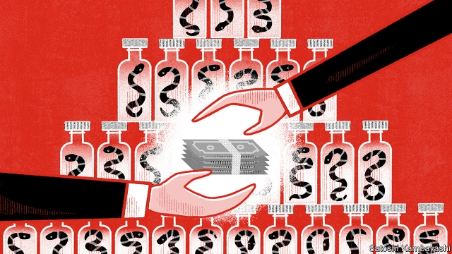

###### Spin doctors

# In China, scandal engulfs a big seller of traditional medicine 

##### How much is the government of a large port city to blame? 

 

> Mar 14th 2019 

THE FAKE advertisement was uncommonly cruel. Zhou Erli, a farmer from Inner Mongolia, first noticed it gaining popularity online when his four-year-old daughter, sick with cancer, was in intensive care. His girl was smiling in a photograph being circulated by Quanjian, a big health-products company. The ad claimed she had fully returned to health after taking the firm’s miraculous herbal remedies. 

In fact, says Mr Zhou, bosses at Quanjian had told him to take his daughter off her chemotherapy treatment at a state-run children’s hospital in Beijing. They had offered what they assured him was a potent new cure: a drink made of jujube powder and gromwell-root oil. He had spent 5,000 yuan ($800) on it. But his daughter’s cancer had spread. In 2015, after the ad appeared, Mr Zhou filed a lawsuit alleging that the company had duped him, but the court dismissed his case for lack of evidence. Little Zhou Yang died a few months later. 

Her story might have ended there, had it not been taken up by a popular online myth-busting forum, Dingxiang Doctor. In late December, in an article that went viral, the website took aim at Quanjian, which it said had been taking in billions of yuan from annual sales. It had investments in football and equestrian clubs, cosmetics, banking, insurance and hotels. The article said the firm had earned huge profits by swindling patients. It accused Quanjian’s founder and boss, Shu Yuhui, of running the company like an illegal pyramid scheme. Quanjian’s salespeople, Dingxiang Doctor said, made money mainly by corralling new ones to join, earning commission on their sales too. 

Amid an online outcry, the government reacted swiftly. Mr Shu’s name disappeared from a list of advisers to the legislature in Tianjin, a northern port city where his company is based. On January 7th state media reported that Mr Shu and 17 others had been arrested. Market regulators launched a 100-day inspection of the health-product business. By March 1st more than 4,800 cases had been lodged against firms involved in it, the regulators said. 

On a recent visit to the site of Quanjian’s headquarters in a semi-rural suburb of Tianjin, a lone employee said the firm was closed. Nearby noodle restaurants that once fed its staff were shuttered. Ownership of the firm’s crown jewel, Tianjin Quanjian FC (now Tianjin Tianhai), has been transferred to the local football association. The club is seeking a new investor. 

It has been a remarkable fall for one of Tianjin’s health giants. A guard says the headquarters was once busy “like Tiananmen Square”. Buses from out of town daily disgorged hundreds of Quanjian “teachers”, as the firm called its senior salespeople. Mr Shu once boasted that his 10,000-bed cancer hospital was the largest in Asia. It is now shut. 

In the company’s heyday, over 7,000 shops nationwide offered Quanjian’s signature “fire therapy” (patients are draped in alcohol-soaked towels and set alight). Among its popular products were “negative-ion” sanitary pads that claimed to prevent menstrual cramping and cervical cancer. The brand’s insoles, which purport to cure arthritis and heart disease, are still available online. A pair sells for 1,068 yuan. 

Tianjin has been known since imperial days for health-care research and manufacturing. Tong Ren Tang, a 350-year-old herbal-medicine business, is based in the nearby capital. It is the best-known maker of traditional Chinese medicine, a system of often unproven remedies that goes back 2,500 years. Zhu Yonghong, co-founder of Tasly, a big traditional-medicine firm in Tianjin, says Quanjian and firms like it set up in Tianjin to profit from Tong Ren Tang’s aura. According to Mr Zhu, they “blurred the line” between regulated traditional medicine and outright quackery. 

Quanjian’s founder, Mr Shu, first came to the port to work for Tianshi (known abroad as Tiens), a large seller of health products. The company’s name means “heavenly lion”. Two such beasts with gigantic wings flank the entrance to Tianshi’s headquarters. The firm says it has more than 10,000 staff in 110 countries. It also owns hotels, a college and a hot-spring resort. Its chairman, Li Jinyuan, a former oilfield worker, is Tianjin’s richest man. In 2015 he took 6,000 staff to France on a splashy holiday. Sustaining this are Tianshi’s machines offering diagnoses based on palm-readings. They claim to detect ailments ranging from HIV to hepatitis, for which the firm offers pricey treatments. 

According to his biography, Mr Shu later set up Quanjian with 600 secret traditional recipes (he is said to come from a family of herbal doctors). A board in the entrance to his shuttered hospital reads: “To say something is real that isn’t, is deception; to make something real that isn’t, is skill.” A user on Weibo, a Twitter-like site, sums up the appeal: “Quanjian tells patients they will live when hospitals tell them they will die.” 

To boost demand for its products, Quanjian devised an alluring scheme. Buying seven pairs of the magic insoles would earn a member the right to become a distributor. To innocent consumers, that seemed above-board: Quanjian has all the trappings of a legal direct-sales firm, including licences from the Ministry of Commerce (in February the ministry said it had suspended the issuing of permits for direct selling). But Quanjian’s pyramid-type recruitment method is banned. Companies that use it are commonly described in China as “business cults”. That is because gangs often ensnare jobseekers into joining. Ecstatic rallies keep alive participants’ illusory dreams of enrichment. 

Local governments, eager to foster the growth of job-creating firms, have an incentive to turn a blind eye. Last year Tianjin’s said Quanjian, as well as Tianshi (which is involved in direct selling but has not been publicly accused of wrongdoing), were “brilliant national corporations” that were socially responsible and innovative. Health-product firms are among Tianjin’s most valuable companies: Quanjian paid 147m yuan in local taxes in 2017. 

This causes some bosses in Tianjin’s health industry to wonder whether the authorities’ action against Mr Shu may be about more than his company’s products and sales techniques. Could he have offended a powerful politician? After all, many cases similar to that of Mr Zhou’s daughter have gone unheeded by the government. Since 2009, according to court papers, activities carried out in Tianshi’s name have been linked to 155 deaths and 2,781 cases of illegal activity (the company blames these on criminals usurping its name). On February 18th police in Tianjin rejected a case filed by Mr Zhou in which he accused Quanjian and its boss of using his daughter for false advertising. 

The outcome of another recent case is disheartening. In December 2017 Hongmao Yaojiu, a popular traditional tonic from Inner Mongolia that has long billed itself as a cure-all for the elderly, was denounced online by a doctor as ineffective and harmful. Police jailed him for three months, despite public indignation (soon censored online). On his release he apologised publicly for “not thinking clearly”. On China’s social media, it did not go unnoticed that an evening news segment on the Quanjian arrests was followed by an ad for the tonic. 

-- 

 单词注释:

1.engulf[in'gʌlf]:vt. 卷入, 吸进, 吞没, 使全神贯注 

2.fake[feik]:n. 假货, 欺骗, 诡计 a. 假的 vt. 假造, 仿造 vi. 伪装 

3.uncommonly[ʌn'kɔmәnli]:adv. 非常, 极其, 罕见地, 难得地, 非凡地 

4.zhou[dʒәj]:n. 周（中国姓氏）；周朝（中国古代王朝） 

5.Erli[]:[地名] 埃利 ( 意 ) 

6.Mongolia[mɒŋ'gәuljә]:n. 蒙古 

7.popularity[.pɒpju'læriti]:n. 名声, 受大众欢迎, 流行 

8.online[]:[计] 联机 

9.fully['fuli]:adv. 十分地, 完全地, 充分地 

10.miraculous[mi'rækjulәs]:a. 奇迹的, 不可思议的 

11.herbal['hә:bәl]:a. 草药的 [医] 本草书 

12.chemotherapy[.kemәu'θerәpi]:n. 化学疗法 [化] 化学疗法 

13.potent['pәutnt]:a. 有力的, 有说服力的, 有效的 [医] 有力的, 有性交能力的 

14.jujube['dʒu:dʒu:b]:n. 枣树, 枣子 

15.lawsuit['lɒ:sju:t]:n. 诉讼 [法] 诉讼, 诉讼案件 

16.allege[ә'ledʒ]:vt. 宣称, 主张, 提出, 断言 [法] 断言, 指称, 指证 

17.dupe[dju:p]:n. 傻瓜, 易受骗的人 vt. 欺骗, 愚弄 

18.yang[jɑ:ŋ,jæŋ]:n. 杨（姓氏） 

19.forum['fɒ:rәm]:n. 论坛, 公开讨论的广场, 法庭, 讨论会 [法] 讨论会, 专题讨论, 公共论坛 

20.viral['vairәl]:a. 病毒的, 病毒引起的 [医] 病毒的 

21.equestrian[i'kwestriәn]:a. 骑术的, 马的, 骑在马背上的 n. 骑手 

22.cosmetic[kɒz'metik]:n. 化妆品 a. 化妆用的 

23.swindle[swindl]:n. 骗取, 欺诈, 骗局 v. 骗取, 诈取 

24.founder['faundә]:n. 创立者, 建立者 vt. 使沉没, 使摔倒, 弄跛, 浸水, 破坏 vi. 沉没, 摔到, 变跛, 倒塌, 失败 

25.shu[]:abbr. 上海大学（Shanghai University）；辣味强弱程度（Scoville Heat Units） 

26.Yuhui[]:[网络] 隔岸听涛；晴汶；御匾会 

27.salesperson['seilzpә:sәn]:n. 售货员 

28.corral[kɒ:'rɑ:l]:n. 畜栏 vt. 把...关进畜栏 

29.amid[ә'mid]:prep. 在其间, 在其中 [经] 在...中 

30.outcry['autkrai]:n. 尖叫, 倒彩, 强烈抗议, 喊价 vi. 喊叫 vt. 叫得比...响 

31.swiftly['swiftli]:adv. 很快地, 即刻 

32.adviser[әd'vaizә]:n. 顾问, 劝告者, 指导教师 [法] 顾问, 劝告者 

33.legislature['ledʒisleitʃә]:n. 立法机关, 议会, 立法院 [法] 立法机构, 立法机关 

34.tianjin['tjɑ:n'dʒin]:n. 天津（中国一城市） 

35.regulator['regjuleitә]:n. 调整者, 校准者, 校准器, 调整器, 标准钟 [化] 调节剂; 调节器 

36.headquarter[,hed'kwɔ:tә]:vt. 将...的总部设在 

37.lone[lәun]:a. 孤单的, 孤立的, 单身的, 寂寞的 

38.shutter['ʃʌtә]:n. 百叶窗, 关闭物, 照相机快门, 关闭者 vt. 为...装百叶窗, 以百叶窗遮闭 

39.FC[]:消防, 火力控制, 足球俱乐部 [计] 信息流控制, 字形改变, 操作码, 功能码 DOS外部命令:比较两个文件的内容 

40.investor[in'vestә]:n. 投资者 [经] 投资者 

41.disgorge[dis'gɒ:dʒ]:vt. 吐出, 流注, 被迫交出 vi. 呕吐 

42.heyday['heidei]:n. 全盛期 interj. 嘿 

43.therapy['θerәpi]:n. 治疗 [医] 疗法, 治疗 

44.drape[dreip]:n. 布帘, 褶皱 vt. 用布帘覆盖, 披上 vi. 成褶皱状 

45.alight[ә'lait]:vi. 落下, 偶然发现 a. 点着的 

46.sanitary['sænitәri]:a. 卫生的 n. 公共厕所 

47.menstrual['menstruәl]:a. 月经的, 一月一次的, 每月的 [医] 月经的 

48.cramp[kræmp]:n. 痉挛, 腹部绞痛, 铁夹钳 a. 狭窄的, 难认的 vt. 使抽筋, 以铁箍扣紧, 束缚 

49.cervical['sә:vikәl]:a. 颈的, 子宫颈的 [医] 颈的 

50.insole['insәul]:n. 鞋内底, 鞋垫 

51.purport['pә:pɒ:t]:n. 意义, 要旨, 目的 vt. 意味着, 声称, 打算 

52.arthritis[ɑ:'θraitis]:n. 关节炎 [医] 关节炎 

53.imperial[im'piәriәl]:a. 帝王的, 宗主国的, 至尊的, 壮丽的 n. 特等品 

54.manufacturing[.mænju'fæktʃәriŋ]:n. 制造业 a. 制造业的 

55.tong[tɒŋ]:n. 钳子, 帮会 v. 用钳子钳起 

56.REN[]:[计] DOS内部命令:更改文件名 [医] 肾 

57.tang[tæŋ]:n. 强烈味道, 特殊的气味, 特性, 柄脚, 当的一声, 墨角藻 vt. 使发气味, 装刀柄于, 使发出当的一声 vi. 发出当的一声 

58.maker['meikә]:n. 制造者, 上帝 [经] 制造者, 出票人 

59.unproven[ʌnˈpru:vn]:a. 未被证实的 

60.zhu[]:n. 朱（姓氏） 

61.aura['ɒ:rә]:n. 气氛, 气味 [医] 先兆 

62.blur[blә:]:vt. 使模糊, 弄脏 vi. 弄脏, 模糊 

63.outright['autrait]:a. 率直的, 完全的, 总共的, 直率的 adv. 完全地, 率直地, 立刻地, 一直向前 

64.quackery['kwækәri]:n. 骗人的治疗, 招摇撞骗, 骗子的行为 [医] 江湖医术 

65.tien[]:n. 天津饭；天山 

66.heavenly['hevnli]:a. 天上的, 神圣的, 天国似的 

67.gigantic[dʒai'gæntik]:a. 巨人般的, 巨大的 

68.flank[flæŋk]:n. 侧面, 侧腹, 胁, 腰窝肉 vt. 攻击侧面, 守侧面 vi. 侧面与...相接 

69.splashy['splæʃi]:a. 容易溅开的, 泥泞的, 遍布斑点的 

70.diagnosis[.daiәg'nәusis]:n. 诊断 [计] 诊断 

71.ailment['eilmәnt]:n. 病痛, 疾病 [医] 疾病 

72.hiv[]:abbr. 艾滋病病毒（human immunodeficiency virus） 

73.hepatitis[.hepә'taitis]:n. 肝炎 [医] 肝炎 

74.pricey['praisi]:a. 昂贵的, 价格高的 

75.deception[di'sepʃәn]:n. 欺骗, 诡计 [法] 瞒骗, 诈欺, 欺骗 

76.Weibo[]:[网络] 新浪微博；我的微博；个人微博 

77.allure[ә'luә]:vt. 引诱, 吸引 n. 魅力, 诱惑力 

78.distributor[dis'tribjutә]:n. 分发者, 分布者, 散布者, 分配者, 销售者, 分配器, 配电盘, 自动拆版机 [计] 分配器 

79.trapping['træpiŋ]:[计] 设陷, 陷入, 俘获 [化] 截留; 捕俘 

80.recruitment[ri'kru:tmәnt]:n. 新兵征召 [医] 募集[反应], 募集[现象](生理), 复聪(耳科) 

81.cult[kʌlt]:n. 膜拜, 礼拜式, 祭仪, 一群信徒 [医] 迷信, 巫术 

82.ensnare[in'snєә]:vt. 以陷阱捕捉, 诱入圈套, 诱捕 

83.jobseeker['dʒɔb,si:kә(r)]:n. 求职者 

84.ecstatic[ik'stætik]:n. 狂喜的人 a. 狂喜的 

85.rally['ræli]:n. 重振旗鼓, 集合, 群众集会, 跌停回升 v. 重整旗鼓, 集合, 恢复精神, 团结, 挖苦, 嘲笑 

86.illusory[i'lju:sәri]:a. 产生幻觉的, 幻影的, 错觉的 [法] 因错觉产生的, 虚幻的 

87.enrichment[in'ritʃmәnt]:n. 丰富, 肥沃 [化] 富集 

88.foster['fɒstә]:a. 收养的, 养育的 vt. 养育, 抚育, 培养, 鼓励, 抱(希望) 

89.incentive[in'sentiv]:n. 动机 a. 激励的 

90.wrongdoing['rɒŋ'du:iŋ]:n. 干坏事, 坏事 

91.socially['sәuʃәli]:adv. 在社会上, 在社交上, 以社会生活方式 

92.innovative['inәjveitiv]:a. 革新的, 创新的, 富有革新精神的 

93.unheeded[.ʌn'hi:did]:a. 未被注意的, 被忽视的 

94.usurp[ju:'zә:p]:vt. 篡夺, 侵占, 夺取 vi. 篡夺, 侵占 

95.advertising['ædvәtaiziŋ]:n. 广告业, 广告 a. 广告的 [计] 发广告 

96.dishearten[dis'hɑ:tn]:vt. 使...气馁, 使...沮丧 

97.tonic['tɒnik]:n. 补药, (音乐)主调音或基音 a. 滋补的, 声调的, 使精神振作的 

98.denounce[di'nauns]:vt. 告发, 抨击, 谴责 [法] 谴责, 斥责, 告发 

99.ineffective[.ini'fektiv]:a. 无效的 [法] 失效的, 无效的, 效率低的 

100.indignation[.indig'neiʃәn]:n. 愤怒, 愤慨, 义愤 

101.censor['sensә]:n. 检查员 vt. 检查, 审查, 删改 

102.apologise[ә'pɔlәdʒaiz]:vi. 道歉（等于apologize） 

103.unnotice[]:[网络] 未被注意的 

