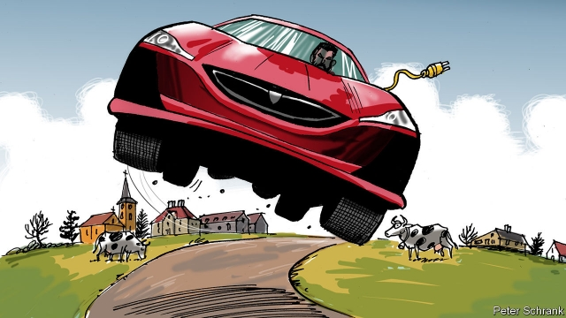

###### Speed king

# A Croatian inventor says he is building the world’s fastest car 

##### A superfast new car from an unlikely spot 

 

> Mar 14th 2019 

YOU GET what you pay for. And if you pay €1.7m ($1.9m), next year you can take delivery of an electric car that can reach 412kph (256mph). The C_Two, says Mate Rimac, who builds them, is the most powerful road car ever. “Not electric, not hybrid, not combustion engine, but ever.” (Definitional issues mean his claim is sure to be contested, for example by Bugatti or Hennessey.) If you allow time to charge the battery after every 650km, but ignore speed limits, traffic jams and a wait for the Channel Tunnel, you could leave Sveta Nedelja, the town outside the Croatian capital where they are being built, after lunch and be in London, 1,650km away, for dinner. 

Croatia’s economy grew by 2.8% last year but Mr Rimac’s company left it in the dust. A year ago he employed 200 people; now he says he employs 500. In a few years he expects to employ thousands. Thanks to a low national birth rate and high emigration, Croatian companies are experiencing labour shortages. But finding workers is not Mr Rimac’s problem. The trouble is that nobody in Croatia has the right experience. 

“Eight and a half years ago I was one man in my garage,” says the 31-year-old entrepreneur. Now he is planning a 50,000 square-metre campus for his company that other countries would “give their liver for”. He thinks many of his compatriots don’t like him because they believe he just builds cars for rich people, and because they don’t celebrate success. In fact, he says, the 150 new cars he is building are really “the showcase of our technology and a test bed for our technologies”. Jeremy Clarkson, the host of a popular motoring show, said of the earlier version—which cost €1.2m and had a top speed of 355kph—that he had never seen anything “with number plates” move as fast. 

But will Mr Rimac stay in Croatia? He pulls up a map that shows where Europe’s carmakers and suppliers are. Within striking distance of Croatia there is a forest of dots from northern Italy through to Bavaria and down to Romania and Serbia, but in Croatia itself, “zero”, he says bluntly. “I have stayed here because of patriotism, but realistically it would have been much easier and much better for the company to be somewhere else,” he says. Unlike Nikola Tesla, another electrically gifted citizen of what is now Croatia, he is staying put for now. 

-- 

 单词注释:

1.Croatian[krej'әiʃ(ә)n]:a. 克罗地亚的, 克罗地亚语的, 克罗地亚人的 n. 克罗地亚人, 克罗地亚语 

2.superfast['sju:pә,fɑ:st]:超高速的 

3.rimac[]:abbr. Research Institute for Medicine and Chemistry 医学和化学研究学会 

4.hybrid['haibrid]:n. 混血儿, 杂种, 混合物 a. 混合的, 杂种的, 混合语的 [计] NetWare的主机实用程序, 双重用户建立程序 

5.combustion[kәm'bʌstʃәn]:n. 燃烧, 骚动 [化] 燃烧 

6.definitional[]:[计] 定义的 

7.Bugatti[]:n. 布加迪（汽车品牌） 

8.hennessey[]:n. (Hennessey)人名；(英)亨尼西 

9.sveta[]:n. (Sveta)人名；(俄、塞、亚美)斯韦塔 

10.emigration[.emi'greiʃәn]:n. 移民, 移居外国(或外地) [医] 血细胞渗出 

11.Croatia[krәu'eiʃjә]:n. 克罗地亚 

12.entrepreneur[.ɒntrәprә'nә:]:n. 企业家, 主办人 [经] 承包商, 企业家 

13.compatriot[kәm'pætriәt]:n. 同国人 a. 同国的, 同胞的 

14.showcase['ʃәukeis]:n. 陈列橱 [经] 商品陈列所, 货物陈列架 

15.jeremy['dʒerimi]:n. 杰里米（男子名） 

16.Clarkson[]:n. 克拉克森（男子名） 

17.motoring['mәutәriŋ]:n. 驾车, 乘汽车 

18.carmaker['kɑ:,meikә(r)]:n. 汽车制造商 

19.supplier[sә'plaiә]:n. 供应者, 供给国, 供应商 [化] 承制厂; 供应厂商 

20.Bavaria[bә'vєәriә]:n. 巴伐利亚州(德国地名) 

21.Romania[rәu'meinjә]:n. 罗马尼亚 

22.serbia['sә:bjә]:n. 塞尔维亚（南斯拉夫成员共和国名） 

23.bluntly['blʌntli]:adv. 坦率地, 率直地 

24.patriotism['peitriәtizm]:n. 爱国心, 爱国精神, 爱国主义 

25.realistically[riә'listikli]:adv. 写实地, 逼真地, 现实地 

26.nikola[]:尼古拉（人名） 

27.Tesla['teslә]:[电] 特斯拉 

28.electrically[i'lektrikәli]:adv. 电力地；有关电地 

