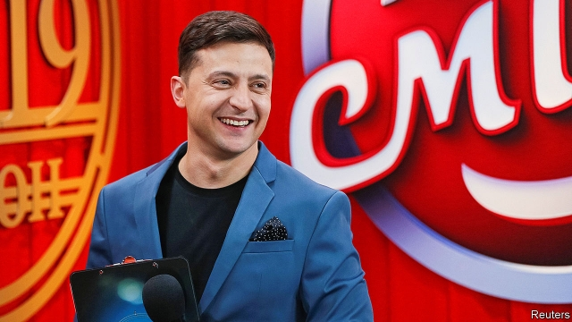
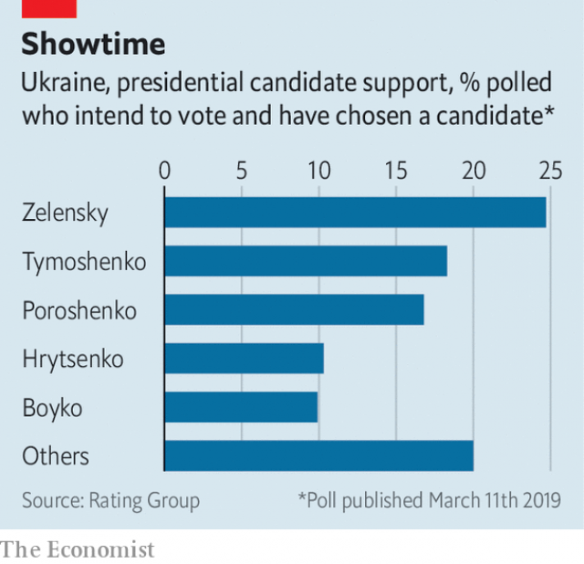

###### No laughing matter

# A comedian could be Ukraine’s next president 

##### Volodymyr Zelensky has no political experience but has played a president on television 

 

> Mar 14th 2019 

A  MEMORIAL COMPLEX featuring photographs of brave protesters fills Kiev’s Independence Square, or Maidan. Displays reproduce Ukrainians’ Facebook posts from key moments during the movement that overthrew the former president, Viktor Yanukovych, five years ago. “I stopped counting covered bodies,” reads one, recalling the day when police opened fire on demonstrators. “How many of them are there?” The revolution was dubbed the “Revolution of Dignity”. Yet ahead of a presidential election on March 31st, the campaign is anything but dignified. 

Among more than 40 candidates, the front-runner is Volodymyr Zelensky, a comedian and actor best known for playing a teacher who becomes president in a popular television show called “Servant of the Nation”. He is now attempting to turn make-believe into reality, presenting himself as a fresh face to a population frustrated with the old elite. “People want to show the authorities the middle finger, and he is playing the role of this middle finger,” says Volodymyr Fesenko, a political analyst. 

The two other main contenders are the incumbent president, Petro Poroshenko, and a former prime minister, Yulia Tymoshenko. Many reformers had pinned their hopes on Slava Vakarchuk, a rock star who declined to run. Anatoliy Hrytsenko, a former defence minister, has the backing of many opinion-formers but few voters. The choice in the second-round run-off, on April 21st, will be between the lesser of two evils, and the stakes are high. 

Ukrainians are frustrated with their post-revolutionary leadership. Three-quarters of them say the country is headed in the wrong direction, despite the fact that Ukraine has moved closer to Europe (it now has visa-free travel to the EU, for instance). That is because the central promise of the revolution—uprooting the country’s deeply corrupt, oligarch-controlled political system—remains unfulfilled. A recent Supreme Court decision to strike down a key anti-graft law passed in 2015 exemplifies the backsliding. Falling living standards, rising utility bills and a simmering war with Russia in the country’s east have meant steep sacrifices for ordinary people. Polls show that more Ukrainians now mistrust their own Rada (parliament) than they do the Russian media, which spew propaganda to fuel the conflict. 

 

Nowhere is the oligarchs’ enduring influence more evident than in the campaign. A successful presidential run requires exposure on television, but the main channels are still owned by oligarchs. “We made a revolution, but you can’t win elections when the oligarchs control the media,” says Vitaliy Shabunin, an anti-corruption activist. The main oligarchic contest is between President Poroshenko, a sweets magnate whose net worth has grown while in office and who owns his own TV channel, and Ihor Kolomoisky, a billionaire who saw his bank, PrivatBank, nationalised and accused of fraud. Mr Zelensky’s ties to Mr Kolomoisky have raised eyebrows. His show runs on Mr Kolomoisky’s network, 1+1, which has promoted Mr Zelensky’s presidential bid; his circle includes people close to the oligarch. (Both men deny any links.) Yet some reformers and many voters see him, however imperfect, as the only chance for change. “We’ve had lots of experienced folk, but haven’t got anything from them,” says a schoolteacher eyeing the Maidan memorial. 

One evening earlier this month, Mr Zelensky could be found on set in a chilly Kiev basement, in costume as his man-of-the-people-turned-president character, Vasyl Holoborodko. The show’s latest season, set to air in the heat of the campaign, serves as Mr Zelensky’s main political advertising. In one scene being filmed, Mr Zelensky’s character prepares to take the oath of office. A trio of historical figures—Plato, Prince Vladimir of Kiev and the Slavic philosopher Grigory Skovoroda—emerge from the shadows to advise the would-be president. “What is power?” Plato muses. 

What Mr Zelensky would do with power remains a mystery. “I want to do something to change the mistrust towards politicians,” Mr Zelensky says, unhelpfully. He has offered little indication of what exactly he plans to do, beyond vague assurances to maintain Ukraine’s Western course, improve the investment climate and end the war in the east. He has promised to crowdsource his cabinet and his policies. When pressed to name world leaders he admired, Mr Zelensky invoked Brazil’s Jair Bolsonaro, a right-wing populist, and France’s Emmanuel Macron, a liberal technocrat. Western diplomats find him frighteningly unprepared. Many fret that Vladimir Putin will gobble him up like one of Mr Poroshenko’s chocolate bars. 

The old guard hopes that voters will opt for experience once more. Mr Poroshenko is running on a platform of “army, faith and language”, pushing patriotism to distract from his failure to fight corruption. Ms Tymoshenko has reinvented herself as a populist, raging against the IMF and its demands that Ukraine raise its gas prices to market rates. Both hope to win the likely run-off with Mr Zelensky on April 21st, and then to compete for control over the Rada in a parliamentary election due in October. 

What worries observers more than who will win is whether the election will be seen as legitimate. Many fear Russian disinformation and hacking. A greater threat, however, may come from the candidates themselves. Both Mr Poroshenko and Ms Tymoshenko have faced allegations of vote-buying. The presence of private armies with murky loyalties, an angry populace and an abundance of weapons makes for a volatile mix, as seen last week when dozens of officers were wounded in clashes with ultranationalists opposed to Mr Poroshenko. If Ukrainians wake up on April 1st distrusting the results of the first round, it will be no laughing matter. 

-- 

 单词注释:

1.comedian[kә'mi:djәn]:n. 喜剧演员 

2.volodymyr[]:[网络] 昊宇 

3.zelensky[]:[网络] 泽伦斯基 

4.protester[]:n. 抗议者, 持异议者, 拒付者 [经] 反对者 

5.maidan[mai'dɑ:n]:n. <印> 练兵场, 操场 

6.facebook[]:n. 脸谱网 

7.overthrow[.әuvә'θrәu]:n. 推翻, 瓦解, 倾覆 vt. 打倒, 推翻, 倾覆 

8.Viktor[]:维克托（人名） 

9.yanukovych[]:[网络] 亚努柯维奇 

10.demonstrator['demәnstreitә]:n. 论证者, 证明者, 指示者, 示威者 [医] 示教者 

11.dub[dʌb]:vt. 配音, 轻点, 授予称号, 击 n. 一下击鼓声, 笨蛋 

12.presidential[.prezi'denʃәl]:a. 总统制的, 总统的, 首长的, 统辖的 [法] 总统的, 议长的, 总经理的 

13.dignify['dignifai]:vt. 增威严, 使高贵, 故作显贵 

14.elite[ei'li:t]:n. 精华, 精锐, 中坚分子 

15.fesenko[]:[网络] 费先科；爵士 

16.analyst['ænәlist]:n. 分析者, 精神分析学家 [化] 分析员; 化验员 

17.contender[kәn'tendә(r)]:n. 参赛者, 争论者, 斗争者, 竞争者 

18.incumbent[in'kʌmbәnt]:a. 现任的, 依靠的, 负有义务的 n. 领圣俸者, 在职者 

19.petro[]:n. 佩特罗（女子名）；[宗]（希）彼得（男子名, 涵义为石头） 

20.Poroshenko[]:[网络] 波罗申科 

21.yulia[]:[网络] 尤利娅；尤莉娅；尤利亚 

22.tymoshenko[]:[网络] 季莫申科；总理季莫申科；乌克兰前总理季莫申科 

23.reformer[ri'fɒ:mә]:n. 改革家, 改革运动者 [化] 转化炉; 转化器; 重整器; 重整炉 

24.slava[]:n. (Slava)人名；(俄、捷、塞)斯拉娃 (女名), 斯拉瓦 

25.anatoliy[]:n. (Anatoliy)人名；(乌克)阿纳托利 

26.Hrytsenko[]:格里岑科 

27.voter['vәutә]:n. 选民, 投票人 [法] 选民, 选举人, 投票人 

28.lesser['lesә]:a. 较少的, 较小的, 次要的 

29.ukrainian[ju(:)'kreinjәn]:a. 乌克兰的；乌克兰人的 

30.ukraine[ju(:)'krein]:n. 乌克兰（原苏联一加盟共和国, 现已独立） 

31.EU[]:[化] 富集铀; 浓缩铀 [医] 铕(63号元素) 

32.unfulfilled[]:[法] 未实现的, 未履行的, 未完成的 

33.exemplify[ig'zemplifai]:vt. 例证, 例示 [法] 制作经公章证明的誊本, 例证 

34.backslide[.bæk'slaid]:vi. 堕落, 退步 n. 堕落, 退步 

35.simmer['simә]:vt. 煨 vi. 炖, 内心充满 n. 即将沸腾的状态, 即将发作 

36.mistrust[.mis'trʌst]:n. 不信任, 疑惑 v. 不信任, 疑惑 

37.rada[]:abbr. （英国）皇家戏剧艺术学院（Royal Academy of Dramatic Art）；随机存取离散地址（Random Access Discrete Address） 

38.spew[spju:]:vi. 呕吐, 喷涌 vt. 呕出, 喷 n. 呕吐物, 喷涌物 

39.propaganda[.prɒpә'gændә]:n. 宣传, 宣传活动 [医] 宣传 

40.oligarch['ɒligɑ:k]:n. 寡头政治执政者 

41.vitaliy[]:[网络] 活力十足 

42.activist['æktivist]:n. 激进主义分子 

43.oligarchic[,ɔli'^ɑ:kik]:[计] 少数的, 寡头的 

44.magnate['mægneit]:n. 大官, 巨头 [法] 大官, 权贵, 大资本家 

45.ihor[]:[网络] 至尊铭 

46.billionaire[.biljә'nєә]:n. 亿万富翁 

47.PrivatBank[]:[网络] 短信服务是免费的 

48.nationalise['næʃәnәlaiz]:vt. 把...收归国有, 使具有某国国籍, 使国有化 

49.fraud[frɒ:d]:n. 欺骗, 欺诈, 诡计, 骗子 [经] 欺诈, 舞弊, 骗子 

50.eyebrow['aibrau]:n. 眉毛 [医] 眉 

51.imperfect[im'pә:fikt]:a. 不完美的, 不完整的, 减弱的, 未完成过去时的 n. 未完成体 

52.schoolteacher['sku:lti:tʃә]:n. 教师 

53.chilly['tʃili]:a. 寒冷的, 冷淡的, 不友好的 [建] 番椒, 冷 

54.kiev['ki:ev]:n. 基辅（乌克兰共和国首都） 

55.costume['kɒstju:m]:n. 装束, 服装 

56.vasyl[]:n. (Vasyl)人名；(乌克)瓦西里 

57.advertising['ædvәtaiziŋ]:n. 广告业, 广告 a. 广告的 [计] 发广告 

58.oath[әuθ]:n. 誓约, 誓言, 咒骂 [法] 誓言, 誓约, 宣誓 

59.trio['tri:әu]:n. 三重唱 

60.Vladimir[vlɑ'dimɪr]:n. 弗拉基米尔（古罗斯弗拉基米尔-苏兹达里公国的古都） 

61.Slavic['slævik, 'slɑ:v-]:a. 斯拉夫的, 斯拉夫人的 

62.grigory[]:n. (Grigory)人名；(俄)格里戈里 

63.Plato['pleitәu]:n. 柏拉图 

64.muse[mju:z]:n. 沉思, 冥想 v. 沉思, 冥想, 若有所思地凝望或说 

65.unhelpfully[]:adv. 不起帮助作用地, 无用地, 不予帮组地 

66.assurance[ә'ʃuәrәns]:n. 保证, 把握, 信心, 保险 [经] 保证, 担保, 保险 

67.crowdsource[]:[网络] 众包；群众外包；群众外包的方式 

68.invoke[in'vәuk]:vt. 祈求, 恳求, 实行, 援引, 引起 [计] 调用; 请求 

69.jair[]:[网络] 睚珥；贾伊尔；睢珥 

70.Populist['pɔpjulist]:n. 民粹派的成员 

71.emmanuel[i'mænjuәl]:n. 以马内利（耶稣基督的别称）；伊曼纽尔（男子名, 等于Immanuel） 

72.macron['mækrәn]:n. 长音符号 

73.technocrat['teknәukræt]:n. 技术专家治国论者, 技术专家统治论者 

74.diplomat['diplәmæt]:n. 外交官, 有外交手腕的人 [法] 外交家, 外交官, 有权谋的人 

75.frighteningly['fraɪtnɪŋlɪ]:adv. 吓人地; 令人恐惧地, 引起突然惊恐地 

76.unprepared[.ʌnpri'pєәd]:a. 无准备的, 即席的, 不期而遇的 

77.fret[fret]:n. 烦躁, 磨损, 焦急, 网状饰物 vi. 烦恼, 不满, 磨损 vt. 使烦恼, 腐蚀, 使磨损, 使起波纹 

78.putin['putin]:n. 普京（人名） 

79.gobble['gɒbl]:n. 火鸡叫声 vt. 狼吞虎咽 vi. 贪食, 咯咯叫 

80.opt[ɒpt]:vi. 选择 

81.patriotism['peitriәtizm]:n. 爱国心, 爱国精神, 爱国主义 

82.distract[dis'trækt]:vt. 转移, 分心, 使发狂 

83.corruption[kә'rʌpʃәn]:n. 腐败, 堕落, 贪污 [计] 论误 

84.reinvent[.ri:in'vent]:vt. 重新使用；彻底改造；重复发明（在不知他人已发明的情况下） 

85.IMF[]:国际货币基金组织 [经] 国际货币基金 

86.parliamentary[.pɑ:lә'mentәri]:a. 国会的, 议会的, 议会制度的 

87.legitimate[li'dʒitimәt]:a. 合法的, 正当的, 婚生的 vt. 认为正当, 立为嫡嗣, 使合法 

88.disinformation[.disinfә'meiʃәn]:n. 假情报 

89.hack[hæk]:n. 劈, 砍, 砍痕, 出租车, 干咳, 晒架, 鹤嘴锄 vt. 劈, 砍, 出租, 用旧 vi. 劈, 砍, 干咳, 驾驶出租车 a. 出租的 

90.allegation[.æli'geiʃәn]:n. 断言, 主张, 申辩 [法] 声明, 事实陈述, 断言 

91.murky['mә:ki]:a. 黝暗的, 阴沉的, 朦胧的 

92.populace['pɒpjulәs]:n. 平民, 大众, 人口 

93.abundance[ә'bʌndәns]:n. 丰富, 充足, 大量 [经] 丰富, 充裕 

94.volatile['vɒlәtail]:a. 挥发性的, 可变的, 不稳定的, 飞行的, 轻快的, 爆炸性的 n. 有翅动物, 挥发物 [计] 易失的 

95.clash[klæʃ]:n. 冲突, 撞击声, 抵触 vi. 冲突, 抵触 vt. 使发出撞击声 [计] 对撞 

96.ultranationalist[,ʌltrә'næʃәnәlist]:n. 极端民族主义者, 狭隘民族主义者 [法] 极端民族主义份子 

97.distrust[dis'trʌst]:n. 不信任 vt. 不信任 

