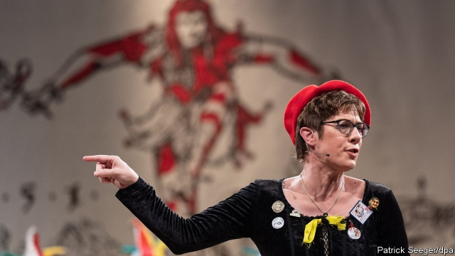

###### Annegret’s progress

# Germany’s chancellor-in-waiting makes a rightward tilt 

##### Ms Kramp-Karrenbauer is playing a shrewd game 

 

> Mar 14th 2019 

DUMPING ON VOTERS is rarely a winning strategy for politicians. But Annegret Kramp-Karrenbauer, who leads the Christian Democratic Union (CDU), Germany’s largest party, says her compatriots are becoming “the most uptight people in the world”. Ms Kramp-Karrenbauer had been criticised for a joke, made during west Germany’s riotous carnival season, about “third-gender bathrooms” for “men who can’t decide if they want to sit or stand when they pee”. But she was not in the mood to apologise. How absurd to police jokes at a carnival, she thundered last week, going on to defend the rights of carnivores, fireworks fans and children who like to dress up as cowboys and Indians. 

The semiotics of carnival in Germany are difficult for outsiders to parse. But what initially seemed a silly-season story now looks like a tactical gambit. Last December Ms Kramp-Karrenbauer narrowly beat a conservative rival in an election to replace Angela Merkel, Germany’s chancellor and her mentor, as CDU leader. That put her in the top position to take over as chancellor when Mrs Merkel steps down, as she has promised to do. Many on the party’s right who had grown tired of Mrs Merkel’s big-tent centrism feared they were in line for years more of the same. Ms Kramp-Karrenbauer wants to change their minds. 

She has started by sharpening the CDU’s conservative profile. Liberated by her lack of ministerial responsibility, she has accentuated differences with the Social Democrats (SPD), the CDU’s junior coalition partner, on everything from pensions to arms exports. Her jabs at politically correct pieties delight the party’s base, and the SPD, having been suffocated in coalition with Mrs Merkel, is happy to play along. Indeed, there is a growing sense that German party politics is emerging from a long Merkel-induced slumber. 

In policy, too, Ms Kramp-Karrenbauer is signalling a rightward shift. During a recent CDU workshop she backed a policy of closing Germany’s borders as a last resort in the event of another migration crisis. That unsettled moderates who had supported Mrs Merkel’s open-border approach in 2015, but for now most accept the need for internal bridge-building. The mood in the CDU is “very upbeat”, says one MP. 

Whether this approach will appeal to ordinary Germans is another matter. Manfred Güllner at Forsa, a pollster, notes that voters who have defected from the CDU have slightly stronger centrist tendencies than those who remain. That suggests a permanent rightward tilt would leave Ms Kramp-Karrenbauer fishing for votes in the wrong pool. Yet as premier of the Saarland, the tiny German state she ran for seven years, Ms Kramp-Karrenbauer pursued a moderate, pragmatic path. Those instincts probably provide the best guide to how she might operate as chancellor. 

That question is acquiring fresh urgency. Last weekend Ms Kramp-Karrenbauer issued a set of EU reform proposals in response to an article published a few days earlier by Emmanuel Macron, France’s president. Her list—which will have been sanctioned by Mrs Merkel—included provocative calls to close the European Parliament’s second seat in Strasbourg, a French city, and for France to hand its UN Security Council seat to the EU. France’s unamused ministers were left in the odd position of having to respond not to another government but the leader of a political party. 

With the CDU leader thus adopting the air of chancellor-in-waiting, Berlin has taken to guessing when Mrs Merkel will seek to hand over the reins of government to her protégée. Should that happen before the chancellor’s term expires in 2021 the SPD might quit the government, triggering an election. Both women insist that no change is imminent, and two-thirds of Germans want Mrs Merkel to serve out her term. But as Ms Kramp-Karrenbauer stakes out her territory, some wonder if the current arrangement can last that long. 

-- 

 单词注释:

1.rightward['raitwәd]:adv. 向右, 向右倾 a. 朝右的 

2.tilt[tilt]:n. 倾斜, 倾向, 船篷, 车篷 vt. 使倾斜, 使倾侧, 用帆布篷遮盖 vi. 倾斜, 翘起, 冲, 评击 [计] 倾斜 

3.shrewd[ʃru:d]:a. 精明的, 锐利的, 剧烈的, 机灵的, 厉害的 

4.voter['vәutә]:n. 选民, 投票人 [法] 选民, 选举人, 投票人 

5.CDU[]:abbr. 中央显示器（Central Display Unit）；海防搜索潜艇雷达（Coast Defense radar for detecting U-boats） 

6.compatriot[kәm'pætriәt]:n. 同国人 a. 同国的, 同胞的 

7.uptight['ʌp'tait]:a. 紧张的, 拮据的, 心情焦躁的 

8.criticise['kritisaiz]:v. 批评, 吹毛求疵, 非难 

9.riotous['raiәtәs]:a. 引起骚扰的, 暴乱的, 放荡的 

10.carnival['kɑ:nivәl]:n. 嘉年华会, 狂欢节, 饮宴狂欢 

11.pee[pi:]:n. (英)便士, 小便 vi. 小便 

12.apologise[ә'pɔlәdʒaiz]:vi. 道歉（等于apologize） 

13.carnivore['kɑ:nivɒ:]:n. 食肉动物 [医] 食肉动物, 食虫植物 

14.semiotic[.semi'ɒtik]:a. 符号学的, 症状的 [医] 症状的; 特殊的 

15.outsider[' aut'saidә]:n. 外人, 局外人, 非会员, 外行, 门外汉, 比赛中获胜可能性不大的选手 [经] 外船公司 

16.parse[pɑ:s]:vt. 从语法上分析 [计] 分列 

17.initially[i'niʃәli]:adv. 最初, 开头 

18.tactical['tæktikl]:a. 战术的, 用兵上的, 策略的 

19.gambit['gæmbit]:n. 以取得优势的开局棋法, 开场白, 话题 

20.narrowly['nærәuli]:adv. 狭窄地, 严密地, 仔细地, 几乎不, 勉强地, 仅仅 

21.angela['ændʒilә]:n. 安吉拉（女子名） 

22.merkel[]: [人名] 默克尔; [地名] [美国] 默克尔 

23.chancellor['tʃɑ:nsәlә]:n. 大臣, 总理, 首相, 大使馆/领事馆的一等秘书, 司法官, 大学校长 

24.mentor['mentɔ:]:n. 指导者, 良师益友 

25.Mr['mistә(r)]:先生 [计] 存储器回收程序, 多重请求 

26.centrism['sentrizәm]:n. 中间路线,中间派的政策,温和主义 

27.profile['prәufail]:n. 侧面, 轮廓, 传略 vt. 描绘...轮廓, 写...的传略 [计] 提问档; 剖面图法; 剖面法 

28.ministerial[.mini'stiәriәl]:a. 部长的, 内阁的, 执政的 [法] 部长的, 部的, 公使的 

29.accentuate[æk'sentjueit]:vt. 以重音念, 强调, 重读 

30.democrat['demәkræt]:n. 民主人士, 民主主义者, 民主党党员 [经] 民主党 

31.spd[]:abbr. 电涌保护器；补充石油税；统计过程诊断（Statistical Process Diagnosis） 

32.coalition[.kәuә'liʃәn]:n. 结合体, 结合, 联合 [经] 联合, 联盟 

33.jab[dʒæb]:v. 刺, 戳, 猛击 n. 刺, 戳, 猛击 

34.politically[]:adv. 政治上 

35.piety['paiәti]:n. 虔诚, 孝敬, 虔诚的行为 

36.suffocate['sʌfәkeit]:vt. 使窒息, 噎住, 闷熄 vi. 闷死, 窒息, 受阻 

37.politic['pɒlitik]:a. 精明的, 明智的, 策略的 

38.slumber['slʌmbә]:n. 睡眠, 麻木状态 vi. 微睡, 静止, 麻木 vt. 睡着度过(时间) 

39.migration[mai'greiʃәn]:n. 移民, 移往, 移动 [计] 迁移 

40.unsettle[.ʌn'setl]:vt. 使移动, 搅乱, 使动摇, 使不安宁 vi. 动荡不定, 离开固定位置 

41.upbeat['ʌpbi:t]:n. 弱拍, 上升, 兴旺 a. 上升的, 乐观的 

42.MP[]:国会议员, 下院议员 [计] 宏处理程序, 维护程序, 线性规划, 微程序, 多处理器 

43.Manfred['mænfred]:曼弗雷德(男子名) 

44.forsa[]:n. 富彩（公司名） 

45.pollster['pәulstә]:n. 民意调查人, 民意测验经办人 

46.centrist['sentrist]:n. 中间党派的成员, 温和主义者 [法] 中间派议员, 中立派议员 

47.Saarland['zɑ:rlɑ:nt; 'sɑ:lænd]:n. 萨尔州（德国的一个州） 

48.pragmatic[præ^'mætik]:a. 忙碌的, 爱管闲事的, 自负的, 固执己见的, 实际的, 务实的, 国事的, 国务的 [法] 闲断的, 固执己见的, 实用主义的 

49.urgency['ә:dʒәnsi]:n. 紧急, 催促 [法] 紧急, 迫切, 紧急之事 

50.EU[]:[化] 富集铀; 浓缩铀 [医] 铕(63号元素) 

51.emmanuel[i'mænjuәl]:n. 以马内利（耶稣基督的别称）；伊曼纽尔（男子名, 等于Immanuel） 

52.macron['mækrәn]:n. 长音符号 

53.sanction['sæŋkʃәn]:n. 核准, 制裁, 处罚, 约束力 vt. 制定制裁规则, 认可, 核准, 同意 

54.provocative[prә'vɒkәtiv]:a. 激发感情的, 挑拨的, 刺激的 n. 刺激物, 挑拨物, 兴奋剂 

55.strasbourg['stræsb\\:^, strɑ:z'bu:r]:n. 斯特拉斯堡（法国东北部城市） 

56.UN[ʌn]:pron. 家伙, 东西 [经] 联合国 

57.unamused[ʌnəm'ju:sd]:a. 非娱乐性的 

58.Berlin[bә:'lin]:n. 柏林, (软质)柏林毛线 

59.expire[ik'spaiә]:vi. 期满, 呼气, 断气 vt. 呼出 

60.trigger['trigә]:n. 触发器, 扳机 vt. 触发, 发射, 引起 vi. 松开扳柄 [计] 切换开关 

61.imminent['iminәnt]:a. 即将来临的, 逼近的 

