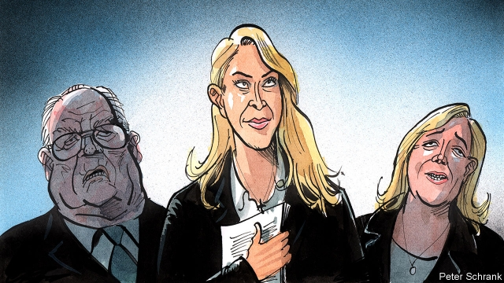

###### Charlemagne

# Meet Marion Maréchal, the next voice of French nationalism 

##### The next Le Pen and her crusade to protect Catholic France 

 

> Mar 14th 2019 

THE REVAMPED Confluence neighbourhood of Lyon is a laboratory for modern eco-living. A self-driving electric bus runs along the river Rhône, and green architecture overlooks converted docks. Waterfront cafés serve health food, and arts centres rise on former industrial land. The new influx of metropolitan types into the district helped Emmanuel Macron win fully 82% of the vote in the second round of the French presidential election in 2017 against the nationalist Marine Le Pen. 

Yet today this neighbourhood is also the improbable new home to a rather different sort of experiment, run by the youngest member of the Le Pen political dynasty. In a side street a private graduate school, the Institute of Social, Economic and Political Science, opened its doors last autumn. It is the brainchild of Marion Maréchal, niece of Marine, and granddaughter of Jean-Marie, founder of the National Front (now the National Rally). In theory the 29-year-old Ms Maréchal has given up politics, having been elected to the National Assembly for a term in 2012 while still a law student. In reality the third-generation Le Pen has ambitious plans to shape the agenda on the right—from outside electoral politics. 

France may cherish conceptual thinking, but its aspirant politicians usually tread a route to electoral office via jobs as party hacks or on ministerial staff. Time spent in think-tanks or academia, American-style, is uncommon. What makes Ms Maréchal’s choice arresting is not that it reflects her political retirement: sitting in an empty classroom at the Lyon site, she states unambiguously that “I will certainly go back into politics.” It is, rather, that she sees the spread of ideas, and honing of a right-wing ideology, as a means of “continuing to be in politics, but in a different way”. 

Dismissed by French educationalists as a gimmick, the school is a centre of training, not research. It offers two-year diplomas—not yet approved by the French state—to just 90 students in social sciences and business. Class topics, pinned to the wall in the entrance hall, range from media training and leadership to “France, Christianity and secularism” and “world Islamist organisations”. This push to break the “ideological conformity” of French thinking is part of what Ms Maréchal calls “cultural politics” or “meta-politics”. “Our fight cannot only take place in elections,” she told the Conservative Political Action Conference in Washington last year. 

Ms Maréchal calls her brand of politics “conservative”. Which is telling, not least because the word is rarely used in France to define politics, and carries American echoes. Indeed, Benjamin Haddad, of the Atlantic Council in Washington, sees a parallel between the youngest Le Pen’s plans and the way American conservatives built institutions to mount a takeover of the Republican Party ahead of Ronald Reagan’s election in 1980. She is in contact, if irregularly, with Steve Bannon; and the former editor of the London edition of Breitbart News is on her school’s advisory board. The conservative label also reflects Ms Maréchal’s obsession with preserving French Catholic identity, in an attempt to put an acceptable face on what is often a toxic nativist discourse. If Ms Maréchal rails against French secularists, who chase nativity scenes from town halls at Christmas, her main gripe is mass Muslim immigration. “I don’t want France to become a land of Islam,” she says. The “great replacement” theory popularised by Renaud Camus, an essayist who warns that Europe will be demographically swamped, is “not absurd”, she adds, quoting a study suggesting that the “indigenous French” will be a minority by 2040. “Just like you,” she told her Washington audience, “we want our country back.” 

Perhaps most striking, Ms Maréchal’s embrace of the word “conservative” reflects a political strategy that sets her apart from her aunt. Marine Le Pen is more exercised by unfettered capitalism and “savage globalisation” than by family values, in line with her courtship of the working-class former Communist vote in France’s rustbelt. Hers is a classic anti-elite populism—her slogan for elections to the European Parliament in May is “Let’s give power to the people”—and she wears the populist tag as a badge of pride. 

Ms Maréchal, like her grandfather, is more attuned to the economic worries of small businesses and artisans. And her core project is the defence of a France of church spires, rural roots and family values, which taps into a seam of Catholic nationalism. Unlike her aunt, she marched against gay marriage. Naturally, she does this with a modern French twist: Ms Maréchal is separated from the father of her young daughter, and photos of her with a member of Italy’s Northern League have made the celebrity press. But Ms Maréchal’s aim is not, Italian-style, to unite the populist right and left; “I don’t call myself a populist,” she says. It is, rather, to merge the right and the far right, by allying the working-class vote with that of the “bourgeoisie enracinée” (rooted bourgeoisie). 

Plenty of obstacles stand in the way, among them historical baggage and wide differences between the far right and the French Republicans over Europe, not to mention Ms Le Pen’s tight grip on her own party. Ms Maréchal will not challenge her aunt any time soon. Yet party politics in France, and in Europe, are unusually fluid. The Republicans have bled moderates to Mr Macron, shifting the party’s centre of gravity to the right. One ex-deputy, Thierry Mariani, recently defected to Ms Le Pen. Italy shows how unlikely political bedfellows can nonetheless end up together, and in power. 

Above all, Ms Maréchal is in no rush. She stands to benefit from the broader success of reactionary books (by authors such as Eric Zemmour) and journals. Valeurs Actuelles, a right-wing magazine, sells more copies each week than Libération, a leftish paper, does each day. The editor of L’Incorrect, a monthly, sits on Ms Maréchal’s advisory board. It was in 1992 that the youngest Le Pen made her debut, as the blonde infant on a campaign poster in her grandfather’s arms. Today, confessing “admiration” for “his struggles”, she is playing the long game. It would be rash to ignore her. 

-- 

 单词注释:

1.Charlemagne['ʃɑ:lә'mein]:查理曼大帝(742-814, 世称 Charles the Great或Charles I, 768-814为法兰克王, 800-814为西罗马帝国皇帝) 

2.marion['meәriәn, 'mæriәn]:n. 马里恩（男子名） 

3.nationalism['næʃәnәlizm]:n. 民族主义, 民族特性 

4.LE[]:[计] 小于或等于 

5.crusade[kru:'seid]:n. 改革运动, 十字军东侵 vi. 从事改革运动, 加入十字军 

6.revamp[ri:'væmp]:vt. 换新鞋面, 修理, 修补, 修改 [经] 整修, 补, 修改 

7.confluence['kɒnfluәns]:n. 合流, 合流点, 集合, 人群 [医] 融合, 汇合 

8.Lyon['laiәn]:n. 里昂 

9.Rhône[]:[地名] 罗讷河 ( 法、瑞士 ) 

10.waterfront['wɔ:tәfrʌnt]:n. 水边, 滨水区, 滩, 海滨, 江边 

11.influx['inflʌks]:n. 流入, 河口, 汇集 [医] 注入, 流入 

12.metropolitan[.metrә'pɒlitn]:n. 大都市居民, 都主教, 宗主国的公民 a. 大都市的, 都主教区的, 宗主国的 

13.emmanuel[i'mænjuәl]:n. 以马内利（耶稣基督的别称）；伊曼纽尔（男子名, 等于Immanuel） 

14.macron['mækrәn]:n. 长音符号 

15.fully['fuli]:adv. 十分地, 完全地, 充分地 

16.presidential[.prezi'denʃәl]:a. 总统制的, 总统的, 首长的, 统辖的 [法] 总统的, 议长的, 总经理的 

17.nationalist['næʃәnәlist]:n. 国家主义者, 民族主义者 

18.improbable[im'prɒbәbl]:a. 不大可能的, 不象发生的, 荒谬可笑的 [法] 未必会的, 不大可能发生的, 未必确实的 

19.brainchild['breintʃaild]:n. 脑力劳动的产物 

20.founder['faundә]:n. 创立者, 建立者 vt. 使沉没, 使摔倒, 弄跛, 浸水, 破坏 vi. 沉没, 摔到, 变跛, 倒塌, 失败 

21.rally['ræli]:n. 重振旗鼓, 集合, 群众集会, 跌停回升 v. 重整旗鼓, 集合, 恢复精神, 团结, 挖苦, 嘲笑 

22.politic['pɒlitik]:a. 精明的, 明智的, 策略的 

23.ambitious[æm'biʃәs]:a. 有野心的, 抱负不凡的, 雄心勃勃的 

24.electoral[i'lektәrәl]:a. 选举人的, 选举的, (有关)选举的 [法] 选举的, 选举人的, 由选举人组成的 

25.cherish['tʃeriʃ]:vt. 珍爱, 怀有, 爱护 

26.conceptual[kәn'septʃuәl]:a. 概念的 [医] 概念的 

27.aspirant[ә'spairәnt]:n. 怀抱大志者, 野心家 a. 上进的, 有野心的 

28.tread[tred]:n. 踏, 步态, 梯级, 交尾, 鞋底 vi. 踏, 行走, 交尾 vt. 踩, 踏, 践踏, 跳(舞) 

29.hack[hæk]:n. 劈, 砍, 砍痕, 出租车, 干咳, 晒架, 鹤嘴锄 vt. 劈, 砍, 出租, 用旧 vi. 劈, 砍, 干咳, 驾驶出租车 a. 出租的 

30.ministerial[.mini'stiәriәl]:a. 部长的, 内阁的, 执政的 [法] 部长的, 部的, 公使的 

31.academia[.ækә'di:miә]:n. 学术界, 学术生涯 

32.uncommon[.ʌn'kɒmәn]:a. 不寻常的, 非凡的, 罕有的 adv. 不平常地 

33.unambiguously[ˌʌnæm'bɪɡjʊəslɪ]:adv. 明白地, 不含糊地 

34.HON[hʌn]:[化] δ-羟基-γ-氧代正缬氨酸 [医] 羟氧基正缬氨酸 

35.ideology[.aidi'ɒlәdʒi]:n. 思想体系, 意识形态, 观念学, 空论 [医] 观念学, 观念形态 

36.educationalist[,edju(:)'keiʃәnәlist]:n. 教育家 

37.gimmick['gimik]:n. 暗机关 vt. 耍花招改变, 使暗机关 

38.Christianity[.kristʃi'æniti]:n. 基督教, 基督教精神 

39.secularism['sekjulәrizm]:n. 现世主义, 宗教与教育分离论 

40.Islamist[iz'lɑ:mist]:n. 伊斯兰教主义者；回教教徒 

41.organisation[,ɔ: ^әnaizeiʃən; - ni'z-]:n. 组织, 团体, 体制, 编制 

42.ideological[.aidiә'lɒdʒikәl]:a. 意识形态的, 空想的 [法] 思想的, 思想上的, 意识形态的 

43.conformity[kәn'fɒ:miti]:n. 遵照, 适合, 一致, 相似 [计] 符合度 

44.cultural['kʌltʃәrәl]:a. 文化的, 教养的, 修养的 [医] 培养的 

45.cannot['kænɒt]:aux. 无法, 不能 

46.Washington['wɒʃiŋtn]:n. 华盛顿 

47.benjamin['bendʒәmin]:[医] 安息香 

48.haddad[]:n. (Haddad)人名；(法、西)阿达；(塞、瑞典、阿拉伯、英)哈达德 

49.takeover[]:n. 接管, 接收 [经] 接收 

50.ronald['rɔnәld]:n. 罗纳德（男子名） 

51.irregularly[]:adv. 不规则, 不整齐, 不合法 

52.steve[]:n. 史蒂夫（男子名） 

53.bannon[]:n. (Bannon)人名；(英)班农 

54.breitbart[]:[网络] 布莱巴特；布莱特巴特；布利塔 

55.advisory[әd'vaizәri]:a. 顾问的, 咨询的, 劝告的 [法] 劝告的, 忠告的, 咨询的 

56.obsession[әb'seʃәn]:n. 困扰, 困扰人的情绪 [医] 强迫观念 

57.toxic['tɒksik]:a. 有毒的, 中毒的 [医] 中毒的, 毒物的 

58.nativist['neitivist]:n. 先天论者, 乡土主义者, 本土主义者 

59.discourse['diskɒ:s]:n. 谈话, 演讲 vi. 谈话, 讲述 

60.secularist['sekjulәrist]:n. 现世主义者, 宗教与教育分离论者 

61.nativity[nә'tiviti]:n. 出生, 出生的情况, 诞生, 出生地, 耶酥诞生 

62.gripe[graip]:n. 紧握, 柄, 把手, 控制 vt. 抓紧, 抱住, 使肠痛, 激怒 vi. 肠绞痛, 抱怨 

63.Muslim['mjzlim; (?@) 'mʌzlem]:n. 伊斯兰教, 伊斯兰教教徒 

64.Islam['izlɑ:m]:n. 伊斯兰教 

65.replacement[ri'pleismәnt]:n. 归还, 更换, 代替者 [医] 复位, 置换 

66.popularise['pɔpjjlәraiz]:vt.vi. 使通俗化, 使受欢迎, 使大众化, 使普及, 宣传, 推广 

67.renaud[]:雷诺（人名） 

68.Camus[kɑ:'mju, kә'mjɔ]:加缪(Albert, 1913-1960, 法国小说家、剧作家, 曾获1957年诺贝尔文学奖) 

69.essayist['eseiist]:n. 随笔作家, 评论家 

70.demographically[]:adv. 人口统计地(demographic, demographical 的变形) 

71.indigenous[in'didʒinәs]:a. 本土的, 国产的, 固有的 [医] 原产的, 本土的 

72.unfetter[.ʌn'fetә]:vt. 给...解开脚链, 释放, 使自由 [法] 除去...脚镣, 释放 

73.capitalism['kæpitәlizәm]:n. 资本主义 [经] 资本主义 

74.globalisation[,gləubəlai'zeiʃən]:n. 全球化, =globalization 

75.courtship['kɒ:tʃip]:n. 求爱, 求婚, 求爱时期 

76.rustbelt[]: 铁锈地带; 衰退地区 

77.Populist['pɔpjulist]:n. 民粹派的成员 

78.badge[bædʒ]:n. 徽章, 标记 [计] 标记 

79.attune[ә'tju:n]:vt. 为乐器调音, 使协调, 使合拍 

80.artisan[.ɑ:ti'zæn]:n. 工匠, 技工 [经] 熟练技术工, 匠人 

81.spire[spaiә]:n. 尖塔, 尖顶, 锥形体, 螺旋 vi. 突出, 耸立, 螺旋形上升 vt. 给...加塔尖 

82.seam[si:m]:n. 缝合线, 衔接口, 接缝, 线缝, 伤疤 vt. 缝合, 接合, 焊合, 使留下伤痕 vi. 裂开, 发生裂痕 

83.celebrity[si'lebrti]:n. 名声, 名人 

84.merge[mә:dʒ]:vt. 使合并, 使消失, 吞没 vi. 合并, 渐渐消失 [计] 合并 

85.ally['ælai. ә'lai]:n. 同盟者, 同盟国, 助手 vt. 使联盟, 使联合, 使有关系 vi. 结盟 

86.bourgeoisie[.buәʒwɑ:'zi:]:n. 中产阶级, 资产阶级 

87.Thierry[]:n. 蒂埃里（男子名） 

88.mariani[]:[网络] 马里亚尼；玛丽安妮；玛莉安妮 

89.bedfellow['bed.felәu]:n. 同床者, 伙伴 

90.nonetheless[,nʌnðә'les]:conj. 然而, 尽管, 不过 adv. 不过, 仍然, 尽管如此, 然而 

91.reactionary[ri'ækʃәnәri]:n. 反动分子 a. 反动的, 反动主义的, 反对改革的 

92.eric['erik]:abbr. 科教资源信息中心（Educational Resources Information Center）；电子遥控与独立控制（Electronic Remote and Independent Control） 

93.valeur[]: [人名] 瓦勒 

94.leftish['leftɪʃ]:a. 左派的, 左倾的 

95.debut['deibju:]:n. 初次登台, 开张 v. 初次登台 

96.blonde[blɔnd]:a. (头发)亚麻色的, 淡色的, 白肤金发碧眼的, 白里透红的, 白皙的, 淡黄色的 n. 肤色白皙的金发女人 

97.admiration[.ædmә'reiʃәn]:n. 赞赏, 钦佩, 引人赞赏的对象 

98.rash[ræʃ]:a. 轻率的, 匆忙的, 鲁莽的 n. 皮疹 

