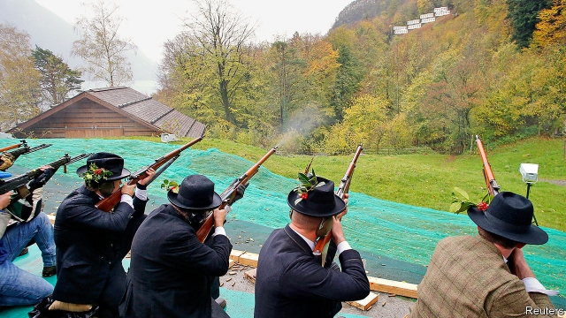

###### Pragmatic and prickly

# Norway and Switzerland: two approaches to life outside the EU 

##### Two models that might inform Brexit, were Brits paying attention 

 

> Mar 14th 2019 

THE SWISS are getting ready once again for a referendum that could muck up their relations with the European Union. On May 19th they will have a chance to block an EU law that is meant to protect the continent against terrorism by forcing the Swiss, along with everyone else in Europe’s Schengen free-movement zone, to tighten rules on gun use and ownership. Swiss men, most of whom do an annual stint as army reservists, may keep a weapon under their bed at home when they are not on duty. The EU’s instruction to curb this privilege, among other things by banning people from possessing semi-automatic weapons, has enraged Swiss on the prickly right, even though their federal parliament has diluted the EU’s edict, for instance by exempting members of shooting clubs from such strictures. 

In any case, the nationalist Swiss People’s Party, the country’s largest, still jibs at the Schengen zone’s freedom of movement and rails against the European Convention on Human Rights. It argues, for instance, that migrants who commit crimes should be expelled forthwith and that asylum-seekers should be denied legal aid in pursuit of residence; the right lost referendums on those issues three years ago. But if the Swiss repeatedly use referendums in an effort to block such European laws from affecting them and propose nationwide initiatives to amend their own constitution with the same aims, they could be forced out of the convention or even out of the Schengen zone, membership of which is vital for business. 

Brexiteers often cite Norway and Switzerland as shiny models for Britain to emulate once the shackles of the European Union have been shaken off. Yet the two countries, though superficially akin, differ sharply in legislation and popular attitudes to Europe. True, both are enviably prosperous and stable democracies, and both laud pragmatism in politics. Yet the Norwegians have much smoother relations with the EU, whereas the Swiss—influenced by a large minority—tend to be twitchy and awkward, even if recent referendums have generally gone against the anti-EU nationalists. Bigwigs in the Brussels bureaucracy dread the prospect that the post-Brexit British will cleave to a Swiss rather than a Norwegian model. 

On the face of things, the similarities should outweigh the differences. Both countries, along with remote Iceland and tiny Liechtenstein, belong to the European Free Trade Association (EFTA), which grants access to the single market. Both belong to the Schengen zone: in 2005, 55% of the Swiss voted in favour of joining it. Both keep out of the customs union and have steadfastly refused to join the actual EU, mainly to preserve their own cherished sense of independence and sovereignty. Norwegians said no (by 52.2% to 47.8%) in 1994 and have not been asked again. In 1992 the Swiss rejected a bid to join the European Economic Area, which the other three EFTA members have joined, by 50.3% to 49.7%; in 2001 the Swiss voted overwhelmingly against reopening negotiations to join it. In both countries, minorities of only around a fifth still want to join the EU wholesale; a similar proportion (though it is bigger in Switzerland) want to withdraw from the web of EU arrangements they now have; and easily the largest group—well over half—in each country is satisfied with the way things are. There is not the slightest chance of either country fully joining the EU soon. 

Yet the Norwegians seem much happier with their deal. True, there have been complaints about the EU forcing Norway, as part of the single market, to open up its postal services and electricity companies, among other things. And Norway’s Progress Party, like the Swiss People’s Party, balks at unlimited immigration within the EU’s Schengen area. 

But the Swiss are regarded in Brussels as a lot more awkward, for two main reasons. First, their relations with the EU are governed by a tangle of more than 100 bilateral agreements. So the EU longs to build a so-called “institutional architecture” to put the Swiss under the roof of Europe’s laws. 

This is where the second hiccup, in the view of Brussels, occurs. For whenever the EU wants to bring the Swiss into line with a new law, the threat of a blocking referendum pops up. The Swiss need only 50,000 signatures (within a timeframe) to put one to the people. This unpredictability constantly creates tension. Last November the Swiss People’s Party put forward a “Swiss Law First” initiative to assert the superiority of Swiss law over European. Though it was decisively defeated (on the same day as an initiative to ban the dehorning of cows and goats was more narrowly fended off), such events make relations between Switzerland and the EU endlessly twitchy. 

Because of its long history of neutrality, Switzerland is oddly isolated in the midst of Europe. It joined the UN only in 2002 and has never bid for a seat on its Security Council. Norway, by contrast, despite its refusal to join the EU, is outward-looking, with an energetic foreign policy that punches above its weight and has pushed it into diplomatic peace missions in such far-flung places as South Sudan, Colombia, Sri Lanka and Israel-Palestine. With its bitter involvement in the second world war, its border with Russia, vast territorial waters and an Atlantic naval and fishing fleet, it remains a vigorous member of NATO. Though many UN agencies are housed in Geneva, the Swiss are careful not to take sides when disputes arise—unless their own sovereignty is threatened. There is little talk of diplomatic or economic fraternity between Switzerland and Norway. And Brexiteers mention a “Swiss option” much more rarely these days. 

-- 

 单词注释:

1.pragmatic[præ^'mætik]:a. 忙碌的, 爱管闲事的, 自负的, 固执己见的, 实际的, 务实的, 国事的, 国务的 [法] 闲断的, 固执己见的, 实用主义的 

2.prickly['prikli]:a. 多刺的, 满是针刺的, 针刺般痛的 

3.Norway['nɒ:wei]:n. 挪威 

4.EU[]:[化] 富集铀; 浓缩铀 [医] 铕(63号元素) 

5.Brexit[]:[网络] 英国退出欧盟 

6.brit[brit]:n. 小海生动物, 小鲱鱼 

7.referendum[.refә'rendәm]:n. （就重大政治或社会问题进行的）全民公决，全民投票 

8.muck[mʌk]:n. 垃圾, 肥料 vt. 施肥, 弄脏, 弄糟 vi. 搬运矸石 

9.terrorism['terәrizm]:n. 恐怖主义, 恐怖统治, 恐怖状态 [法] 胁迫, 暴政, 恐怖政治 

10.schengen['ʃɛŋən]: [地名] [卢森堡] 申根 

11.tighten['taitn]:vt. 勒紧, 使变紧 vi. 变紧, 绷紧 

12.stint[stint]:vt. 节省, 限制, 停止 vi. 节约 n. 吝惜, 节约, 限额 

13.reservist[ri'zә:vist]:n. 后备军人 

14.curb[kә:b]:n. 抑制, 勒马绳, 边石 vt. 抑制, 束缚, 勒住 

15.enrage[in'reidʒ]:vt. 激怒, 使暴怒 

16.dilute[dai'lju:t]:vt. 冲淡, 稀释 a. 淡的, 稀释的 

17.edict['i:dikt]:n. 布告, 法令 [经] 布告, 法令 

18.exempt[ig'zempt]:n. 免税者, 被免除义务者 a. 免除的 vt. 使免除, 豁免 

19.stricture['striktʃә]:n. 狭窄, 指责, 束缚 [医] 狭窄 

20.nationalist['næʃәnәlist]:n. 国家主义者, 民族主义者 

21.jib[dʒib]:n. 船首三角帆, 铁臂 vi. 移转, 踌躇不前, 停止不动 

22.migrant['maigrәnt]:n. 候鸟, 移居者 [法] 移居者 

23.forthwith['fɒ:θ'wiθ]:adv. 立刻, 不犹豫地, 不延迟地 [法] 必须立即执行的命令 

24.amend[ә'mend]:vt. 修改, 改善, 改良 vi. 改过自新 

25.membership['membәʃip]:n. 会员的资格, 全体会员, 会员数目 [法] 会员资格, 成员资格, 会籍 

26.Brexiteers[]:支持英国退欧的人（Brexiteer的复数） 

27.cite[sait]:vt. 引用, 引证, 表彰 [建] 引证, 指引 

28.shiny['ʃaini]:a. 有光泽的, 发光的, 辉煌的, 磨光的, 磨损的 

29.emulate['emjuleit]:vt. 效法, 尽力赶上, 同...竞争 [计] 仿真 

30.shackle['ʃækl]:n. 桎梏, 束缚物 vt. 加枷锁, 束缚 

31.superficially[]:adv. 表面, 表面性, 浅层, 不深, 表皮, (贬)肤浅, 一知半解, 浅薄, 平方, 浮面 

32.akin[ә'kin]:a. 同类的, 同族的, 同源的 

33.enviably['envɪəblɪ]:adv. 令人羡慕地; 羡慕地, 渴望得到地 

34.laud[lɒ:d]:n. 赞美, 称赞 vt. 赞美, 称赞 

35.pragmatism['prægmәtizm]:n. 实用主义 [法] 实用主义, 干涉主义, 独断 

36.politic['pɒlitik]:a. 精明的, 明智的, 策略的 

37.Norwegian[nɒ:'wi:dʒәn]:n. 挪威人, 挪威语 a. 挪威的, 挪威人的, 挪威语的 

38.twitchy[ˈtwɪtʃi]:a. 抽搐的, 抽动的, 痉挛性的； 焦躁不安的 

39.bigwig['bigwig]:n. 要人, 大亨 

40.Brussel[]:n. 布鲁塞尔（比利时首都） 

41.bureaucracy[bjuә'rɒkrәsi]:n. 官僚, 官吏 [法] 官僚主义, 官僚政治, 官僚机构 

42.cleave[kli:v]:vt. 劈开, 分开 vi. 劈开, 分开, 粘着, 依恋 

43.Norwegian[nɒ:'wi:dʒәn]:n. 挪威人, 挪威语 a. 挪威的, 挪威人的, 挪威语的 

44.similarity[.simi'læriti]:n. 类似, 类似处 [法] 类似, 相似, 类似事例 

45.outweigh[.aut'wei]:vt. 比...重, 比...重要, 比...有价值 

46.Liechtenstein['liktәn,stain]:a. (中欧国家)列支敦士登的 

47.EFTA['eftә]:abbr.European Free Trade Area 欧洲自由贸易地域 abbr.European Free Trade Association  欧洲自由贸易协会 

48.steadfastly['stedfɑ:stlɪ]:adv. 踏实地, 不变地; 岿然; 坚定不渝 

49.cherish['tʃeriʃ]:vt. 珍爱, 怀有, 爱护 

50.sovereignty['sɒvrәnti]:n. 主权, 独立国 [法] 主权, 主权国家, 统治权 

51.overwhelmingly[.әuvә'hwelmiŋli]:adv. 压倒性地, 不可抵抗地 

52.reopen[.ri:'әupәn]:v. 重开, 再开始, 再开 

53.negotiation[ni.gәuʃi'eiʃәn]:n. 谈判, 磋商, 交涉 [经] 谈判, 协商 

54.wholesale['hәulseil]:n. 批发 a. 批发的, 大规模的 adv. 大规模, 照批发方式 vi. 经营批发业, 批发 vt. 批发 

55.fully['fuli]:adv. 十分地, 完全地, 充分地 

56.postal['pәustl]:a. 邮政的, 邮局的 [经] 邮政的 

57.balk[bɒ:k]:n. 障碍, 错误, 失败 vt. 阻止, 错过, 推诿 vi. 逡巡不前 

58.unlimited[.ʌn'limitid]:a. 无限的, 不受限制的, 无条件的 [经] 无限的, 不定的 

59.tangle['tæŋgl]:n. 缠结, 纠结的一团, 困惑, 纠纷, 混乱 vt. 使缠结, 缠住 vi. 缠结, 乱作一团 

60.bilateral[bai'lætәrәl]:a. 有两边的, 双边的, 双方的 [医] 两侧的 

61.institutional[.insti'tju:ʃәnәl]:a. 制度的, 公共机构的, 学会的 [法] 组织机构的, 制度的, 公共机构的 

62.hiccup['hikʌp]:n. 打嗝 v. 打嗝 

63.timeframe[taɪmfreɪm]:n. 时间表 

64.unpredictability[ˌʌnprɪˌdɪktə'bɪlətɪ]: 不可预测性, 不可预知性 

65.constantly['kɒnstәntli]:adv. 不变地, 不断地, 时常地 

66.assert[ә'sә:t]:vt. 主张, 坚称, 断言 [法] 宣称, 断言, 维护 

67.superiority[sju:.piәri'ɒriti]:n. 优越, 高傲 [化] 优越性 

68.decisively[]:adv. 果断地；决然地 

69.dehorn[di'hɔ:n]:v. 切去角 

70.narrowly['nærәuli]:adv. 狭窄地, 严密地, 仔细地, 几乎不, 勉强地, 仅仅 

71.fend[fend]:vt. 击退, 保护, 供养 

72.endlessly['endlisli]:adv. 不断地, 无穷尽地 

73.neutrality[nju:'træliti]:n. 中立, 不偏不倚, 中间状态 [医] 中性; 无作用[性] 

74.oddly['ɒdli]:adv. 奇怪地 

75.UN[ʌn]:pron. 家伙, 东西 [经] 联合国 

76.diplomatic[.diplә'mætik]:a. 外交的, 老练的 [法] 外交的, 外交上的, 文献上的 

77.Sudan[su:'dæn]:n. 苏丹 [化] 苯偶氮间苯二酚; 苏丹 

78.Colombia[kә'læmbiә]:n. 哥伦比亚 

79.sri[sri]:n. 斯里兰卡（Sri Lanka）；（拉）神圣罗马帝国（Sacrum Romanum Imperium） 

80.lanka[]:n. 兰卡；楞伽 

81.involvement[in'vɔlvmәnt]:n. 卷入, 牵连, 包含, 困窘 [经] 财政困难, 经济上的困窘 

82.territorial[.teri'tɒ:riәl]:a. 领土的, 土地的, 地方的, 区域性的 n. 本土自卫队队员 

83.NATO['neitәj]:北大西洋公约组织, 北约组织 [经] 北大西洋公约组织 

84.Geneva[dʒi'ni:vә]:n. 日内瓦, (荷兰)杜松子酒 

85.fraternity[frә'tә:niti]:n. 友爱, 互助会, 大学生联谊会 

