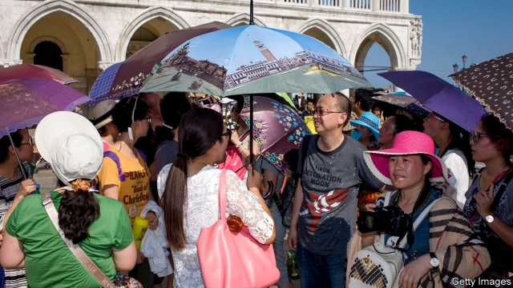
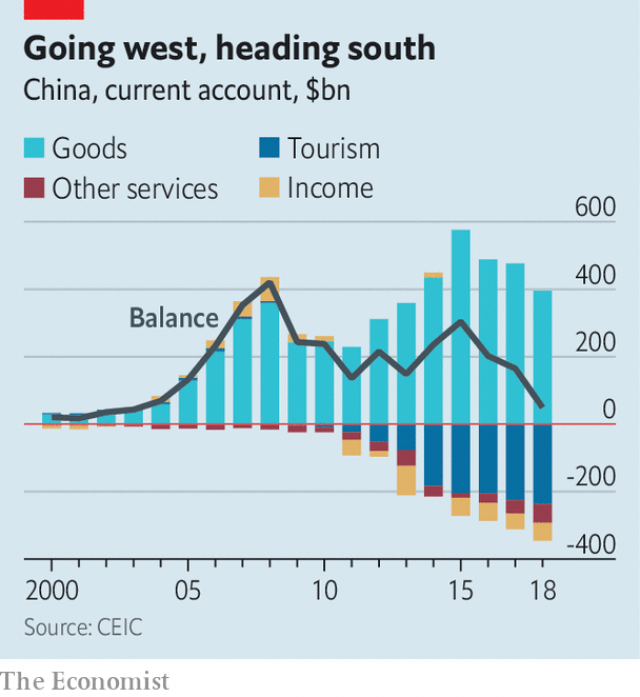

###### Package deal

# China’s current-account surplus has vanished 

##### A deficit could remake the financial system, if the government lets it 

 

> Mar 14th 2019 

IN A CONTROL room at the headquarters of Ctrip, China’s largest online travel agency, dozens of fluorescent lines flash every second across a big digital map of the world. Each line represents an international flight sold on Ctrip’s platform. The top destinations on the morning of March 11th, when your correspondent visited, were Seoul, Bangkok and Manila. A live ranking for hotel reservations put Liverpool in first place among European cities, Merseyside’s rough-hewn charms briefly trumping Venice and Barcelona (and apparently benefiting from a special offer). 

In this century’s first decade Chinese citizens averaged fewer than 30m trips abroad annually. Last year they made 150m, roughly one-quarter of which were booked via Ctrip. That is not just a boon for hotels and gift shops the world over. It is a factor behind a profound shift in the global financial system: the disappearance of China’s current-account surplus. 

As recently as 2007 that surplus equalled 10% of China’s GDP, far above what economists normally regard as healthy. It epitomised what Ben Bernanke, then chairman of the Federal Reserve, called a “global saving glut”, in which export powerhouses such as China earned cash from other countries and then did not spend it. China’s giant surplus was the mirror image of America’s deficit. It was the symbol of a world economy out of kilter. 

No longer. Last year China’s current-account surplus was just 0.4% of GDP. Analysts at Morgan Stanley predict that China could be in deficit in 2019—which would be the first annual gap since 1993—and for years to come. Others, such as the International Monetary Fund, forecast that China will maintain a surplus, though only by the slimmest of margins. Either way, it would be a sign that the global economy is better balanced than a decade ago. It could also be an impetus for China to modernise its financial system. 

The basic explanation for the change is that China is buying much more from abroad just as its exporters run into resistance (see chart). Its share of global exports peaked at 14% in 2015 and has since inched down. The trade war with America adds to the headwinds. At the same time, imports have soared. China’s surplus in goods trade in 2018 was the lowest for five years. 

 

The tale of trade in services, especially tourism, is even more striking. When Beijing hosted the Olympic games in 2008, foreign visitors splashed out a little more in China than Chinese did abroad. Since then the number of foreign arrivals in China has stagnated, while Chinese outbound trips have surged. Not only that: Chinese travellers have proved to be big spenders, as anyone who has queued for a VAT refund at London’s Heathrow airport knows only too well. In 2018 China ran a $240bn deficit in tourism, its biggest yet. 

Some of the current-account fluctuations are cyclical. Chen Long of Gavekal Dragonomics, a research firm, notes that the price of oil and semiconductors, two of China’s biggest imports, was high last year. If they come down, a current-account surplus could swell up again. 

Yet deeper forces are also at work. At bottom, a country’s current-account balance is simply the gap between its savings and its investment. China’s investment rate has stayed at a lofty 40% or so of GDP. But its savings rate has fallen to about the same, from 50% of GDP a decade ago, as its people have learned to love opening their wallets (or rather, tapping their mobile payment apps). An ageing population should lead to a further drawdown of savings, because fewer workers will be supporting more retirees. The disappearance of the surplus is, in this sense, a reflection of China growing richer and older. 

There is, nevertheless, some concern about the implications. In emerging markets big current-account deficits can be a warning sign of financial instability, indicating that countries are living beyond their means and relying on fickle foreign investors to fund their spending. But China is in no such danger. Any deficit is expected to be small, as a fraction of GDP, in the coming years. What is more, the government still has a fat buffer of $3trn in foreign-exchange reserves. That should buy it time. 

The crucial question is how China uses this time. By definition any country that runs a current-account deficit needs to finance it with cash from abroad. In an economy with a wide-open capital account and a freely floating currency, inflows and outflows balance without the central bank giving it much thought. But in China the government keeps a tight grip on both its capital account and its exchange rate. 

So now that it is facing the prospect of current-account deficits, it has little choice but to relax its grip, in order to bring in more foreign funding. It is moving in that direction. China has long controlled access to its capital markets by issuing strict quotas to foreign investors, with a preference for institutions such as pension funds. But in recent years it has opened more channels, notably through carefully managed links to the Hong Kong stock exchange. 

These moves, though incremental, have been enough in aggregate to persuade compilers of leading stock and bond indices, important benchmarks for global investors, to bring Chinese assets into their fold. Last month MSCI said it would more than quadruple the weight of mainland-listed shares in its emerging-markets stocks index to 3.3%. Next month China will enter the Bloomberg Barclays bond index, which could fuel roughly $100bn of inflows into Chinese bonds within two years. 

In a new book on China’s bond market, the IMF argues that this could foster a virtuous cycle. More active investing in bonds would support the government’s goal of using interest rates as a bigger weapon in its monetary-policy arsenal (instead of old-fashioned administrative guidance). With a more flexible exchange rate to boot, China would end up with a more modern, efficient financial system—proof that a current-account deficit can, handled well, be a welcome development. 

But there are clear limits to how far China is willing to go. Efforts to lure in foreign investors have not been matched by moves to make it easier for its citizens to invest abroad. Yi Gang, the newish governor of the central bank, has repeatedly vowed to maintain the “basic stability” of the yuan. Louis Kuijs of Oxford Economics thinks the constraint is ultimately philosophical. The Chinese government is wary about ceding too much control to the market. “It implies a relatively slow opening up,” he says. 

Another element of China’s approach to managing a deficit is therefore to stop it from getting too big in the first place. Guan Tao, a former central-bank official, says that China has to improve its competitiveness in services. With a better tourism industry, better universities and better hospitals, China would, he believes, attract more foreigners and keep more of its own spending at home. 

Think of it as the second act for the Great Wall. It never much worked as a fortification for China: over the course of its two-plus millennia in existence, barbarian invaders repeatedly breached it. But now its role is to lure in tourist hordes. In this battle it has a better chance of success. 

-- 

 单词注释:

1.deficit['defisit]:n. 赤字, 不足额 [医] 短缺 

2.remake[ri'meik]:vt. 再作, 再制, 重作 n. 再制, 改作, 重制物 

3.headquarter[,hed'kwɔ:tә]:vt. 将...的总部设在 

4.Ctrip[]:[网络] 携程；携程网；携程旅行网 

5.online[]:[计] 联机 

6.fluorescent[.fluә'resәnt]:n. 荧光 a. 荧光的 

7.Seoul[sәul]:n. 汉城 

8.Bangkok['bæŋkɒk]:n. 曼谷 

9.Manila[mә'nilә]:n. 马尼拉 

10.Liverpool['livәpu:l]:n. 利物浦 

11.charm[tʃɑ:m]:n. 吸引力, 魔力, 符咒 vt. 迷住, 使陶醉, 行魔法 vi. 用符咒, 有魅力 

12.briefly['brifli]:adv. 简短地, 扼要地, 简明地, 简单地 

13.trump[trʌmp]:n. 王牌, 法宝, 喇叭 vt. 打出王牌赢, 胜过 vi. 出王牌, 吹喇叭 

14.Venice['venis]:n. 威尼斯 

15.Barcelona[.bɑ:si'lәunә]:n. 巴塞罗那 

16.apparently[ә'pærәntli]:adv. 表面上, 清楚地, 显然地 

17.annually['ænjuәli]:adv. 一年一次, 每年 [经] 年度的, 每年的 

18.boon[bu:n]:n. 恩惠 

19.profound[prә'faund]:a. 极深的, 深厚的, 深刻的, 渊博的 

20.disappearance[.disә'piәrәns]:n. 看不见, 失踪, 消失 

21.economist[i:'kɒnәmist]:n. 经济学者, 经济家 [经] 经济学家 

22.epitomise[]:vt. 对...作摘要, 集中体现, 成为...的化身, 成为...的缩影, 概括 

23.ben[ben]:n. 内室 [医] 贝昂(俗名,一般指辣木Moringa oleifera,有时也指一些不同属的植物) 

24.bernanke[]:n. 伯南克（姓氏） 

25.glut[glʌt]:n. 大量, 供过于求 vt. 使充满, 使吃饱, 过多供应 vi. 吃得过多, 狼吞虎咽 

26.powerhouse['pauәhaus]:n. 发电所, 动力室, 精力旺盛的人, 办事效率高的机构 

27.kilter['kiltә]:n. 良好状态, 顺利, 平衡 

28.analyst['ænәlist]:n. 分析者, 精神分析学家 [化] 分析员; 化验员 

29.Morgan['mɒ:gәn]:n. 摩根马 

30.stanley['stænli]:n. 斯坦利（男子名） 

31.monetary['mʌnitәri]:a. 货币的, 金钱的 [经] 货币的, 金融的 

32.impetus['impitәs]:n. 动力, 推动力, 动量 [医] 冲动, 动能, 起始(病) 

33.modernise['mɔdәnaiz]:vt.vi. (使)现代化, (使)适应现代需要 vi. 用现代方法 

34.exporter[ik'spɒ:tә]:n. 出口商, 输出者, 出口公司 [经] 出口商, 输出者 

35.headwind[]:n. 逆风, 顶风 

36.soar[sɒ:]:n. 高扬, 翱翔 vi. 往上飞舞, 高耸, 翱翔 

37.stagnate['stægneit]:v. (使)淤塞, (使)停滞, (使)变萧条 

38.outbound['autbaund]:a. 开往国外的 [计] 出站 

39.surge[sә:dʒ]:n. 巨涌, 汹涌, 澎湃 vi. 汹涌, 澎湃, 颠簸, 猛冲, 突然放松 vt. 使汹涌奔腾, 急放 [计] 电压尖峰 

40.traveller['trævlә]:n. 旅行者 [经] 旅行商 

41.spender['spendә]:n. 挥霍者, 挥金如土的人 [法] 挥金如土者, 挥霍钱财者 

42.VAT[væt]:n. 大桶 vt. 装入大桶, 在大桶里处理 

43.refund['ri:fʌnd]:n. 偿还 vt. 付还, 偿还借款 vi. 归还, 偿还 

44.heathrow['hi:θrәj]:n. 希思罗机场（位于英国伦敦） 

45.fluctuation[.flʌktʃu'eiʃәn]:n. 变动, 波动, 动摇 [化] 涨落; 起伏; 波动; 脉动 

46.cyclical['siklik(e)l]:a. 周期的, 轮转的, 循环的, 轮列的, 轮卷的, 环状的, 环的, 组诗的, 始末的 [计] 循环的 

47.chen[]:n. 陈 

48.Gavekal[]:[网络] 研究机构加维卡尔 

49.Dragonomics[]:[网络] 龙洲经讯；龙州经讯；北京龙洲经讯 

50.lofty['lɒfti]:a. 高的, 傲慢的, 崇高的, 高级的, 玄虚的 

51.APP[]:[计] 应用, 应用程序; 相联并行处理器 

52.drawdown['draudaun]:n. 水位降低, 减少, 消耗 [经] 提款 

53.retiree[ri.taiә'ri:]:n. 退休人员, 退休者 [法] 退休者, 退职者 

54.instability[.instә'biliti]:n. 不安定, 不稳定 [医] 不稳定性 

55.fickle['fikl]:a. 变幻无常的, 浮燥的, 薄情的 

56.investor[in'vestә]:n. 投资者 [经] 投资者 

57.buffer['bʌfә]:n. 缓冲器, 缓冲区 vt. 缓冲 [计] 缓冲区, 缓冲器 

58.inflow['inflәu]:n. 流入, 流入物 

59.outflow['autflәu]:n. 流出, 流出物 [医] 流出, 传出, 流出物 

60.quota['kwәutә]:n. 配额, 限额 [化] 定额 

61.notably['nәjtbәli]:adv. 显著地, 著名地, 尤其, 特别 

62.carefully['kєәfuli]:adv. 小心地, 谨慎地 

63.hong[hɔŋ]:n. （中国、日本的）行, 商行 

64.kong[kɔŋ]:n. 含锡砾石下的无矿基岩；钢 

65.incremental[.inkri'mentl]:a. 增加的, 增值的 [经] 增长的, 增量的 

66.aggregate['ægrigәt]:n. 合计, 总计, 聚集体 a. 合计的, 聚集的 v. 聚集, 集合, 合计达 [计] 聚合体; 聚集 

67.compiler[kәm'pailә]:n. 编辑者 [计] 编译程序 

68.benchmark[]:[计] 基准程序; 基准 

69.asset['æset]:n. 资产, 有益的东西 

70.msci[]:abbr. medium scale compound integration 中规模混合集成; multi-protocol serial communications interface 多协议串行通信接口 

71.quadruple['kwɒdrupl]:a. 四倍的, 四重的, 四部分组成的 n. 四倍 vt. 使成四倍 vi. 成为四倍 

72.bloomberg[]: [人名] 布隆伯格 

73.barclay['bɑ:kli]:n. 巴克利（姓氏, 男子名） 

74.IMF[]:国际货币基金组织 [经] 国际货币基金 

75.foster['fɒstә]:a. 收养的, 养育的 vt. 养育, 抚育, 培养, 鼓励, 抱(希望) 

76.virtuous['vә:tʃuәs]:a. 品德高尚的, 公正的, 贞洁的, 有效力的 

77.arsenal['ɑ:snәl]:n. 兵工厂, 军械库 [机] 兵工厂 

78.administrative[әd'ministrәtiv]:a. 管理的, 行政的 [法] 行政的, 管理的, 遗产管理的 

79.lure[luә]:n. 饵, 诱惑 vt. 引诱, 诱惑 

80.yi[ji:]:n. 彝人；彝语 

81.newish['nju:iʃ]:a. 尚新的 

82.vow[vau]:n. 誓约, 誓言, 许愿 vi. 起誓, 发誓, 郑重宣言 vt. 立誓, 起誓要, 郑重地宣布 

83.louis['lu(:)i, 'lu(:)is]:n. 路易斯（男子名） 

84.Oxford['ɒksfәd]:n. 牛津, 牛津大学 

85.constraint[kәn'streint]:n. 强制, 约束 [计] 约束 

86.philosophical[.filә'sɒfikl]:a. 哲学的, 冷静的, 达观的, 哲学上的, 哲学家似的 

87.wary['wєәri]:a. 谨慎的, 小心的, 机警的, 周到的, 唯恐的 

88.cede[si:d]:vt. 割让 [法] 割让, 让与, 放弃 

89.guan[ɡwɑ:n]:n. 中南美所产的冠雉（外形似火鸡） 

90.Tao[tau]:n. (道家学说中的)道 

91.competitiveness[]:[经] 竞争 

92.fortification[.fɒ:tifi'keiʃәn]:n. 筑城, 防御工事, 要塞 

93.millennia[mi'leniә]:一千年, 千年周年纪念日, 千年庆典, 千年期, (喻)太平盛世, 想象中的黄金时代 

94.barbarian[bɑ:'bєәriәn]:n. 野蛮人 a. 野蛮的 

95.invader[in'veidә]:n. 侵略者 [化] 侵入物 

96.breach[bri:tʃ]:n. 裂口, 违背, 破坏, 违反, 突破, 破裂 vt. 攻破, 突破 vi. 跳出水面 

97.horde[hɒ:d]:n. (一)群, 游牧部落, 移动群 vi. 成群结队 

