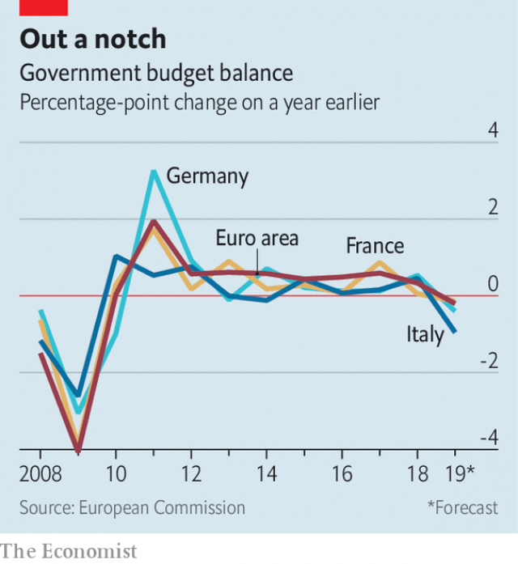

###### Self-defence

# Euro-zone fiscal policy is easing for the first time in a decade 

##### But too little will be spent, and on the wrong things 

> Mar 14th 2019 

IT IS HARD to defend yourself with one hand tied behind your back. Yet the euro area’s economy has been repeatedly asked to do just that. Whenever it is taking a beating, it has had to fight back with monetary policy alone. The European Central Bank (ECB) has cut rates to zero and below, bought bonds by the bucketload and lent super-cheaply to banks. Fiscal policy has been barely used—and has sometimes done more harm than good. Debt crises forced governments in the south of the bloc to tighten their belts; those in the north chose to do the same. 

The economy is struggling again, and the ECB’s firepower is waning. The central bank said on March 7th that it would keep interest rates on hold at least until the end of this year and extend its programme of cheap loans to banks. Even then, it does not expect inflation, now 1.5%, to reach its target of close to but below 2%. Its interest rates are already at rock bottom. Its bond-buying programme cannot easily be expanded because its holdings of German government bonds are close to legal limits. 

Just as well, then, that for the first time in a decade fiscal policy in the euro area is expected to loosen this year (see chart). But the extent of easing is small and its composition is not best suited to kick-starting growth. The zone has no common budget—although its members’ finance ministers discussed the topic on March 11th—so overall policy is simply the sum of individual countries’ fiscal plans. 

 

Those plans point to a wider aggregate deficit in 2019, of 0.8% of GDP. Italy’s deficit is growing. So is France’s, which could be expanded further by concessions to the gilets jaunes protesters late last year. Germany plans a smaller surplus. Fabio Balboni of HSBC, a bank, expects fiscal policy to add 0.2-0.3 percentage points to the zone’s GDP growth this year. Every little helps. But it’s still only a little. 

Some countries have more room for manoeuvre than others—and those that have it might not make the most of it. Both Germany and Italy have been hit hard, partly by slowing demand for their exports. But whereas Germany has plenty of fiscal room, Italy, with public debt of more than 130% of GDP, would risk scaring financial markets (again) if it splurged. A German boost would help Italy too. But some economists note that Germany has tended to run larger surpluses than first projected. 

Mr Balboni adds that much of the expected stimulus takes the form of tax cuts and benefit increases. Because people could choose to save rather than spend the extra cash, that lifts the economy less than public investment, which also brings the benefit of increased economic potential. 

Public investment has yet to recover from deep cuts during the crisis years. Its share in euro-zone GDP is still lower than it was in 2007; in Germany it is below the zone’s average. The OECD, which on March 6th published gloomy economic forecasts for the euro zone, estimates that if only the countries with scope to loosen policy—eg, Austria and the Netherlands, as well as Germany—spent an extra 0.5% of GDP for three years, and all countries undertook structural reform, the zone’s economy would be 1% larger in the long run. 

The OECD would welcome such co-ordination, but there is little sign of it yet. The common budget discussed by finance ministers this week would at least aim to encourage public investment and structural reform. But at the insistence of northerners, who loathe the idea of fiscal transfers to the supposedly profligate south, the budget cannot be used to stabilise the economy in rough times. Crucial details, such as its size, are yet to be decided. Meanwhile, threats abound, from American protectionism to a Chinese slowdown and a chaotic Brexit. With only one and a half hands free, the euro area’s economy could be in for a clobbering. 

-- 

 单词注释:

1.fiscal['fiskәl]:a. 财政的, 国库的 [经] 财政上的, 会计的, 国库的 

2.euro['juәrәu]:n. 欧元（欧盟的统一货币单位） 

3.monetary['mʌnitәri]:a. 货币的, 金钱的 [经] 货币的, 金融的 

4.ECB[]:[计] 事件控制块 

5.bucketload[]:[网络] 铲斗负载 

6.fiscal['fiskәl]:a. 财政的, 国库的 [经] 财政上的, 会计的, 国库的 

7.bloc[blɒk]:n. 集团 

8.tighten['taitn]:vt. 勒紧, 使变紧 vi. 变紧, 绷紧 

9.firepower['faiәpauә]:n. 火力 

10.wane[wein]:n. 减少, 衰微, 败落, 亏缺, 月亏 vi. 变小, 亏缺, 衰落, 消逝, 退潮 

11.inflation[in'fleiʃәn]:n. 胀大, 夸张, 通货膨胀 [化] 充气吹胀; 膨胀 

12.cannot['kænɒt]:aux. 无法, 不能 

13.holding['hәuldiŋ]:n. 把持, 支持, 保持 [法] 租借地, 占有物, 拥有的财产 

14.aggregate['ægrigәt]:n. 合计, 总计, 聚集体 a. 合计的, 聚集的 v. 聚集, 集合, 合计达 [计] 聚合体; 聚集 

15.deficit['defisit]:n. 赤字, 不足额 [医] 短缺 

16.concession[kәn'seʃәn]:n. 特许, 让步, 认可 [经] 核准, 许可, 特殊(权) 

17.gilet[dʒi'lei]:n. 背心, 马甲 

18.jaune[]:[网络] 汝拉 

19.protester[]:n. 抗议者, 持异议者, 拒付者 [经] 反对者 

20.fabio[]:n. 法比奥（意大利常用名） 

21.balboni[]:n. (Balboni)人名；(意)巴尔博尼 

22.hsbc[]:abbr. 汇丰银行（Hong Kong and Shang Hai Banking Corporation） 

23.manoeuvre[mә'nu:vә]:n. 调遣, 演习, 策略 vi. 调动, 演习, 用策略 vt. 调动, 操纵 

24.splurge[splә:dʒ]:n. 炫耀, 夸示 vi. 炫耀, 卖弄, 挥霍 vt. 挥霍 

25.economist[i:'kɒnәmist]:n. 经济学者, 经济家 [经] 经济学家 

26.surpluse[]:[网络] 尚余 

27.stimulus['stimjulәs]:n. 刺激, 激励, 刺激品 [医] 刺激特, 刺激 

28.les[lei]:abbr. 发射脱离系统（Launch Escape System） 

29.Oecd[]:[经] 已开发国家组织 

30.Austria['ɒstriә]:n. 奥地利 

31.Netherlands['neðәlәndz]:n. 荷兰 

32.insistence[in'sistәns]:n. 坚持, 坚决主张 

33.northerner['nɔ:ðәnә]:n. 北方人 

34.loathe[lәuð]:vt. 厌恶, 憎恶 

35.supposedly[sә'pәuzidli]:adv. 想象上, 看上去像, 被认为是, 恐怕, 按照推测 

36.profligate['prɒfligit]:a. 放荡的, 不检点的, 浪费的 n. 放荡者, 享乐者 

37.stabilise['steibilaiz]:vt.vi. (使)稳定, (使)安定, (使)坚固 vt. 装稳定器 

38.abound[ә'baund]:vi. 大量存在, 富于, 充满 

39.protectionism[prә'tekʃәnizm]:n. 贸易保护主义, 贸易保护制 [经] 保护(贸易)主义, 保护(贸易)制 

40.slowdown['slәudaun]:n. 降低速度, 减速 

41.chaotic[kei'ɒtik]:a. 混乱的, 无秩序的 [法] 混乱的, 混沌的 

42.Brexit[]:[网络] 英国退出欧盟 

43.clobber['klɒbә]:n. 衣服, (鞋匠用来掩饰皮革缝的)软膏 vt. 痛打, 击倒, 拉垮 

