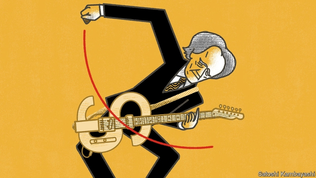

###### Buttonwood

# How to be a rock-star bond investor 

##### Bill Gross, Rolling Stone 

 

> Mar 14th 2019 

ONE NIGHT in 1965, Keith Richards woke up with a riff going around inside his head. He reached for his guitar, played the bare bones of a song into a cassette recorder and promptly fell asleep. Mick Jagger was soon scribbling lyrics by the swimming pool. Four days later, the Rolling Stones recorded “(I Can’t Get No) Satisfaction”. 

Hit records are not made like that any more, according to John Seabrook’s book, “The Song Machine”. Instead they are assembled from sounds honed on computers. It can take months. A specialist in electronic percussion does the beats. Another comes up with hooks, the short catchy bits. A third writes the melody. Everything is calibrated against what worked well on previous hits. 

This brings us to Bill Gross, who founded PIMCO, the world’s biggest bond firm, and ran its market-beating Total Returns fund from 1987 until 2014. Mr Gross, who retired last month, is often called a rock-star fund manager. A new paper by Aaron Brown of New York University and Richard Dewey of Royal Bridge Capital, a hedge fund, gives him the “Song Machine” treatment, breaking his performance into constituent parts. It finds that even if you could simulate his strategy, a human factor would remain that algorithms cannot match. A Stones fan might call it inspiration. In finance, it is known as alpha. 

What were Mr Gross’s trademark beats and hooks? He spoke of three. He took on more credit risk, buying bonds from issuers who might default, than would a bond manager tracking a benchmark index. He similarly loaded his portfolio with mortgage-backed bonds. His third signature trade relied on the shape of the yield curve. A five-year bond will usually have a higher yield (and lower price) than a four-year bond. Bonds therefore become more valuable as time passes. As a five-year bond yielding, say, 6% becomes a four-year bond yielding 5%, its price goes up. Mr Gross’s trick was to isolate the sweet spot where this “roll-down” is strongest—around the five-year mark—and hold more of those bonds. He offset this by holding fewer 30-year bonds, where roll-down is weak. 

Messrs Brown and Dewey compiled simple trading rules to mimic these elements. They then undertook a statistical exercise to gauge how far they explain Mr Gross’s excess return. Even when you allow for these factors, they find he still beats the index. He had the magic alpha. 

The template for this kind of analysis is “Buffett’s Alpha”, a paper in 2013 by Andrea Frazzini, David Kabiller and Lasse Pederson. It found that the market-beating performance of Warren Buffett, the Beatles to Mr Gross’s Stones, could have been matched by an investor following a well-defined strategy, a core part of which was buying “value” stocks (ie, those with low prices relative to the worth of a firm’s assets). Their conclusion is a tad reductive for some tastes—like saying anyone with an Apple Mac could come up with “Satisfaction”. Mr Buffett was able to identify a winning strategy and to stick with it, which is not easy. But the main goal of these exercises is to show that systematic investing can work well. 

It appears, though, that Mr Gross did something that could not easily be replicated. Whatever his edge, it was just as well he had it, argue Messrs Brown and Dewey. When you think you have a market-beating strategy, it is wise to ask, “If I am to win, who loses?” A value investor of the Buffett stamp wins because of other investors’ tendency to extrapolate the initial success of “growth” stocks and overpay for them. Similarly, Mr Gross’s roll-down trade may work because excess demand for long-dated bonds from certain kinds of investors with long-term liabilities leaves that end of the yield curve rather flat. 

Profiting from the errors of others is what skilful investors do. But two of Mr Gross’s strategies involved taking on extra risks that a lot of bond investors would prefer not to bear. Credit securities and mortgage bonds give a little extra return compared to safe government bonds. But from time to time they inflict big losses. An investor who makes better returns by taking on such risks is not demonstrating skill, say the authors. 

Even the most talented rock stars take risks. Keith Richards took enough illicit drugs to fell a herd of bison. He lived to tell the tale. Mr Gross’s riskier bets also paid off. But as Messrs Brown and Dewey argue, the risk of catastrophic loss that comes with these strategies is hard to gauge upfront. Things might have gone differently. As Mr Richards has noted, a lot of rock stars don’t survive. 

-- 

 单词注释:

1.buttonwood['bʌtnwʊd]: 美洲悬铃木 

2.investor[in'vestә]:n. 投资者 [经] 投资者 

3.keith[ki:θ]:n. 基思（男子名） 

4.richards['ritʃәdz]:n. 理查兹（姓氏） 

5.riff[rif]:n. 连复段 

6.promptly['prɒmptli]:adv. 敏捷地, 迅速地 

7.Mick[mik]:n. 爱尔兰人 

8.jagger['jɑ:^ә]:[机] L形吊骨 

9.scribble['skribl]:n. 潦草的写法, 潦草写成的东西, 拙劣的作品 v. 潦草地书写, 乱写, 滥写 

10.lyric['lirik]:n. 抒情诗, 歌词 a. 抒情的 

11.john[dʒɔn]:n. 盥洗室, 厕所, 嫖客 

12.hone[hәun]:n. 磨刀石, 抱怨, 想念 vt. 用磨刀石磨, 磨练 

13.percussion[pә:'kʌʃәn]:n. 敲打, 碰撞, 叩击, 叩诊, 击发, 打击, 打击乐器组 [医] 叩诊 

14.catchy['kætʃi]:a. 易记住的, 欺骗性的, 不规则发生的 

15.melody['melәdi]:n. 曲子, 美妙音乐, 曲调 

16.calibrate['kælibreit]:vt. 测定口径, 校准, 使标准化, 调整 [化] 校准 

17.pimco[]:[网络] 太平洋投资管理公司；太平洋资产管理公司；太平洋投资公司 

18.aaron['eәrәn]:n. 亚伦（男子名）；[圣经]亚伦（摩西之兄, 犹太教的第一祭司长） 

19.york[jɔ:k]:n. 约克郡；约克王朝 

20.richard['ritʃәd]:n. 理查德（男子名） 

21.Dewey['dju(:)i]:[计] 杜威 

22.constituent[kәn'stitjuәnt]:n. 成分, 选民, 构成物 a. 构成的, 组织的, 选举的 

23.simulate['simjuleit]:vt. 模拟, 假装, 模仿 [法] 伪装的, 模拟的; 假装的, 伪装的, 冒充 

24.algorithm['ælgәriðm]:n. 算法 [计] 算法 

25.cannot['kænɒt]:aux. 无法, 不能 

26.inspiration[.inspә'reiʃәn]:n. 灵感, 鼓舞人心的人或物, 妙计, 吸气 [医] 吸[气] 

27.alpha['ælfә]:n. 希腊字母表的第一个字母, 最初, 开端 [医] α(希腊文的第一个字母), 甲种 

28.trademark['treidmɑ:k]:n. 商标 [法] 商标 

29.issuer['iʃjuә]:n. 发行者 [法] 发行人, 发布人 

30.default[di'fɒ:lt]:n. 违约, 不履行责任, 缺席, 默认值 v. 疏怠职责, 缺席, 拖欠, 默认 [计] 默认; 默认值; 缺省值 

31.benchmark[]:[计] 基准程序; 基准 

32.portfolio[pɒ:t'fәuliәu]:n. 皮包, 公文包, 部长职务, 有价证券财产目录, 艺术代表作选辑 [法] 公文包, 文件夹, 阁员职务 

33.offset['ɒ:fset]:n. 抵消, 把...并列, 旁系, 支管, 用胶印法印 vt. 弥补, 抵消, 胶印 vi. 装支管 n. 偏移量 [计] 偏移量 

34.Messrs['mesәz]:[法][pl. ](=Messieurs)各位(先生) 

35.mimic['mimik]:a. 模仿的, 摹拟的 n. 效颦者, 模仿者, 小丑, 仿制品 vt. 模仿, 摹拟 

36.template['templit]:n. 样板, 模板, 垫木 [计] 模板 

37.alpha['ælfә]:n. 希腊字母表的第一个字母, 最初, 开端 [医] α(希腊文的第一个字母), 甲种 

38.andrea['ændriә,ɑ:n'dreiә]:n. 安德里亚（男子名） 

39.Frazzini[]:[网络] 弗拉齐尼 

40.david['deivid]:n. 大卫；戴维（男子名） 

41.lasse[]:n. (Lasse)人名；(德、芬、挪)拉塞；(法)拉斯 

42.pederson[]: [人名] 佩德森 

43.warren['wɒrәn]:n. 养兔场, 拥挤的地区 

44.buffett['bʌfit]: [人名] 巴菲特 

45.beatles['bi:tlz]:n. 披头士合唱（摇滚乐队） 

46.asset['æset]:n. 资产, 有益的东西 

47.tad[tæd]:n. (美)(非正式)男孩, 小孩子, 少量 

48.reductive[ri'dʌktiv]:a. 减少的, 还原论的 n. 还原剂 

49.mac[mæk]:n. 防水胶布, (英)雨衣, 老兄, 老弟 [计] 宏, 多路存取计算机, 苹果公司的微机 

50.replicate['replikeit]:vt. 折叠, 折转, 复制 n. 复现试验, 复制品, 高八度音 a. 复现的, 复制的, 折转的, 弯回的 

51.extrapolate[ek'stræpәleit]:v. 推断, 外推 

52.overpay[.әuvә'pei]:vt. 多付, 多给报酬 vi. 付得过多 

53.liability[laiә'biliti]:n. 责任, 债务, 倾向 [经] 责任, 义务, 负债 

54.skilful['skilful]:a. 灵巧的, 熟练的, 制作精巧的 

55.mortgage['mɒ:gidʒ]:n. 抵押, 约束性义务, 抵押借款 vt. 抵押, 以...作担保, 把...许给 

56.inflict[in'flikt]:vt. 施以, 加害, 使承受 [法] 处, 加, 予以 

57.talented['tælәntid]:a. 天资高的, 有才能的 

58.illicit[i'lisit]:a. 不法的, 不正当的, 禁止的 [法] 违法的, 违禁的, 被禁止的 

59.bison['baisәn]:n. 野牛 

60.risky['riski]:a. 危险的 

61.catastrophic[.kætә'strɒfik]:a. 悲惨的, 灾难的 

62.upfront[ˌʌpˈfrʌnt]:a. 正直的, 坦率的; 最前面的, 首要的; 在前面的; 预先的 adv. 在最前面; 提前支付（工资） 

63.differently['difrentli]:adv. 差异, 不同, 各别, 各种 

