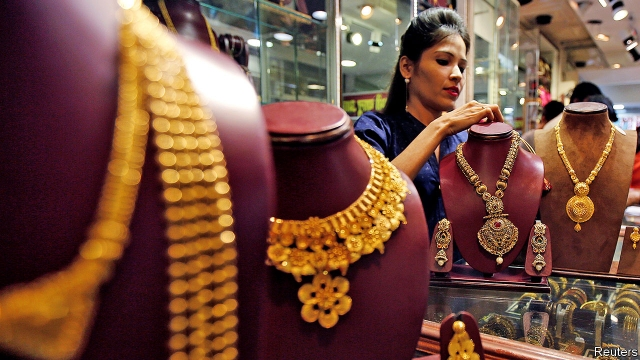

###### Lacklustre

# Indians may be falling out of love with gold 

##### A weak rupee, a high gold price and changing fashions all play a part 

 

> Mar 14th 2019 

P.N. GADGIL & SONS, a jewellery shop in Thane, a suburb of Mumbai, is gearing up for the wedding season—a busy time for gold sales, even if demand is brisker still during Hindu festivals, when jewellers stay open almost round the clock. Free samosas and Pepsi are offered to those queuing outside; inside, the noise and bustle are non-stop. 

Indians have long regarded gold as the surest store of wealth. Brides bring it as dowry. Newborns are given bangles and anklets. Astrologers prescribe gold rings for stress. Indian households own 23,000 tonnes, three times more than the bullion held by America’s Federal Reserve. In the year to March 2018 gold imports, at $74.7bn, ranked after only oil. 

The government has tried repeatedly to break Indians’ addiction, increasing import duty fivefold since 2013. In 2015 it began a scheme allowing investors to exchange gold for interest-bearing bonds and get it back when the bonds mature. Television commercials nudge viewers to invest in mutual funds instead. 

Such efforts long seemed unavailing, but something seems to have shifted. Demand has fallen by a fifth since 2010. 

Consumer preferences are one reason: many prefer lighter jewellery for daily wear. Millennials, a third of the population, spend more than older generations on mobile phones and other electronic goods. The international price of gold has gone up; last month it was near a five-year high, measured in dollars. The weak rupee, close to a record low at 70 to the dollar, makes the domestic price dearer still. A goods-and-services tax introduced in 2017, one-third higher than the levy it replaced, has also hit sales. And with inflation down to just 2.6%, gold’s utility as a hedge has lessened, says Ajit Ranade, an economist. 

Jewellers’ margins are already slim, gripes Rajendra Jain, who owns another shop in Thane. Online firms selling small amounts for as little as one (American) cent are adding to the pain. Since 2016 over 30m customers have traded three tonnes via Paytm, an e-commerce giant. The average transaction is 50-100 rupees. It’s like “buying shampoo in small sachets instead of the whole bottle,” says Gaurav Mathur of SafeGold, a rival. 

Jewellers, who account for 70% of sales, are also still recovering from the government’s messy recall, in 2016, of high-value banknotes, which squeezed cash purchases. The end of India’s love affair with gold may be overdue. But it is bad luck for the shopkeepers of Thane. 

-- 

 单词注释:

1.lacklustre['læklʌstә]:a. 无光泽的, 无生气的 n. 无光泽, 无生气 

2.rupee[ru:'pi:]:n. 卢比(印、巴等国货币单位) 

3.PN[]:清注意, 本票, 期票 [计] 页编号, 可编程网络 

4.gadgil[]: [人名] 加吉尔 

5.jewellery['dʒu:әlri]:n. 宝石, 贵重饰物, 珠宝, 宝石饰物, 受珍视的人/物, 宝贝, 有价值的人/物 

6.thane[θein]:n. 大乡绅, 领主 

7.mumbai[]:n. 孟买（印度城市） 

8.Hindu['hindu:]:a. 印度教教徒的 n. 印度教教徒 

9.jeweller['dʒu:әlә(r)]:n. 宝石商, 宝石匠, 珠宝商 

10.pepsi['pepsi]:n. 百事可乐（一种饮料的商标名称） 

11.bustle['bʌsl]:n. 喧闹, 裙撑 vi. 奔忙, 喧闹 vt. 使忙碌, 催促 

12.dowry['dauәri]:n. 嫁妆 [法] 陪嫁物, 嫁妆 

13.newborn['nju:bɒ:n]:n. 婴儿 a. 新生的 

14.bangle['bæŋgl]:n. 手镯, 脚镯 

15.anklet['æŋklit]:n. 短袜, 脚镯, 脚镣 

16.astrologer[ә'strɒlәdʒә]:n. 占星家 

17.tonne[tʌn]:n. 吨, 公吨 [经] 吨 

18.bullion['buljәn]:n. 金银, 金银块, 纯金 [经] 金银锭 

19.addiction[ә'dikʃәn]:n. 入迷, 瘾 [医] 瘾, 癖嗜 

20.fivefold['faivfәuld]:a. 五重的, 五倍的 adv. 五重地, 五倍地 

21.investor[in'vestә]:n. 投资者 [经] 投资者 

22.nudge[nʌdʒ]:n. 用肘轻推, 推动, 讨厌家伙 

23.unavailing[.ʌnә'veiliŋ]:a. 无益的, 无用的, 无效的, 徒劳的 [法] 无效的, 无用的, 无益的 

24.millennials[mɪ'leniəl]:adj. 一千年的；一千年至福的 [网络] 千禧世代；千禧之子；千禧一代 

25.levy['levi]:n. 税款, 所征的人数, 征收 vi. 征税, 课税 vt. 征收, 强求, 召集 

26.inflation[in'fleiʃәn]:n. 胀大, 夸张, 通货膨胀 [化] 充气吹胀; 膨胀 

27.ajit[]:n. (Ajit)人名；(马来、印)阿吉特 

28.ranade[]:[网络] 拉那德教授；拉德 

29.economist[i:'kɒnәmist]:n. 经济学者, 经济家 [经] 经济学家 

30.gripe[graip]:n. 紧握, 柄, 把手, 控制 vt. 抓紧, 抱住, 使肠痛, 激怒 vi. 肠绞痛, 抱怨 

31.rajendra[]:[网络] 拉金德拉；拉贾德拉；茹阿坚德茹阿 

32.Jain[dʒain]:n. 耆那教徒 a. 耆那教的, 耆那教徒的 

33.online[]:[计] 联机 

34.transaction[træn'sækʃәn]:n. 交易, 办理, 学报, 和解协议 [计] 事务处理 

35.sachet[sæ'ʃei]:n. 小袋, 香料袋 [医] 香囊, 小药囊 

36.gaurav[]:[网络] 高拉夫；印度；高瑞 

37.mathur[]:n. (Mathur)人名；(德、西、印)马图尔；(英)马瑟 

38.banknote['bæŋknәut]:n. 钞票 

