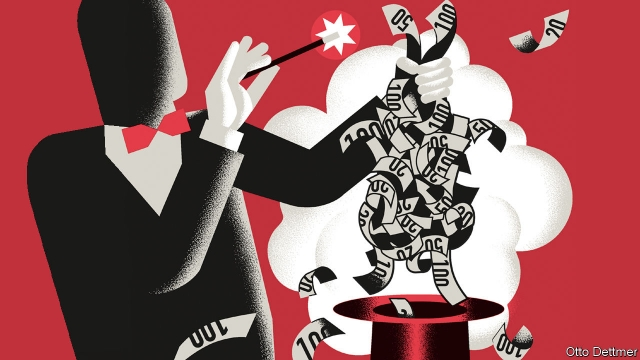

###### Free exchange

# Is modern monetary theory nutty or essential? 

##### Some eminent economists think the former 

 

> Mar 14th 2019 

“MODERN MONETARY THEORY” sounds like the subject of a lecture destined to put undergraduates to sleep. But among macroeconomists MMT is far from soporific. Stephanie Kelton, a leading MMT scholar at Stony Brook University, has advised Bernie Sanders, a senator and presidential candidate. Congresswoman Alexandria Ocasio-Cortez, a young flag-bearer of the American left, cites MMT when asked how she plans to pay for a Green New Deal. As MMT’s political stock has risen, so has the temperature of debate about it. Paul Krugman, a Nobel prizewinner and newspaper columnist, recently complained that its devotees engage in “Calvinball” (a game in the comic strip “Calvin and Hobbes” in which players may change the rules on a whim). Larry Summers, a former treasury secretary now at Harvard University, recently called MMT the new “voodoo economics”, an insult formerly reserved for the notion that tax cuts pay for themselves. These arguments are loud, sprawling and difficult to weigh up. They also speak volumes about macroeconomics. 

MMT has its roots in deep doctrinal fissures. In the decades after the Depression economists argued, sometimes bitterly, over how to build on the ideas of John Maynard Keynes, macroeconomics’ founding intellect. In the end, a mathematised, American strain of Keynesianism became dominant, while other variants were lumped into the category of “post-Keynesianism”: an eclectic mix of ideas consigned to the heterodox fringe. In the 1990s a number of like-minded thinkers drew on post-Keynesian ideas in fleshing out the perspective embodied in MMT. 

That perspective is not always clear; there is no canonical MMT model. But there are some central ideas. A government that prints and borrows in its own currency cannot be forced to default, since it can always create money to pay creditors. New money can also pay for government spending; tax revenues are unnecessary. Governments, furthermore, should use their budgets to manage demand and maintain full employment (tasks now assigned to monetary policy, set by central banks). The main constraint on government spending is not the mood of the bond market, but the availability of underused resources, like jobless workers. Raising spending when the economy is already at capacity can lead to rapid inflation. The purpose of taxes, then, is to keep inflation in check. Spending is the accelerator, taxation the brakes. Fiscal deficits are irrelevant as long as unemployment is low and prices are stable. 

To those versed in orthodoxy—in which governments must eventually pay for their spending through taxes—these ideas sound bizarre. This strangeness is partly a result of MMT scholars’ unconventional idiom. Speaking with MMT’s adherents is sometimes like watching a football match with friends who insist the ball remains stationary while every other element in the game, including the pitch and goalposts, moves around it. Communication is made harder still by MMTers’ sparse use of mathematical models. To economists who consider heavy-duty maths a mark of seriousness, such reluctance to use equations is either evidence of intellectual inferiority or a way of avoiding scrutiny. 

It may instead reflect the fact that MMT is less a rival theory than a qualitative critique. Yes, central banks can use interest rates to achieve full employment, if rates are not too close to zero. But MMTers think governments are better equipped. Monetary policy works via banks and financial markets, but when markets panic, this mechanism is weakened. Rate cuts stimulate the economy by encouraging firms and households to borrow, but that can engender risky levels of private-sector debt. Government spending sidesteps these problems. Similarly, rate rises can slow inflation. But they often work by inducing indiscriminate involuntary unemployment. The state could instead tame an unruly boom, MMTers argue, by breaking up monopolies—thus loosening supply constraints—or by aiming tax increases at fossil-fuel firms. 

Economists recognise that their models have shortcomings, and that monetary policy is not all-powerful. But most economists have long held that macroeconomic policy should stabilise the economy with the lightest possible touch, the better to let markets allocate resources. Other means can then be used to tackle reckless lending, market failures or inequality. MMT’s supporters question this—and believe that recent economic history bolsters their case. 

You might suppose that the feud could be settled by testing rival claims. Alas, macroeconomics rarely works this way. Macroeconomists cannot run experiments as laboratory scientists can. Statistical analysis of the world is muddied by the vast number of variables, many of which are correlated with the thing whose effect the economist is trying to isolate. Macroeconomic arguments tend not to produce winners and losers: only those with more influence and those with less. Post-Keynesian ideas were never proven false, unlike the Ptolemaic model of the solar system. Rather, they declined in status as mainstream Keynesianism rose. 

Mainstream Keynesianism was tarnished in turn amid the inflation of the 1970s. The monetarism which then gained favour floundered a decade later, when central banks targeting money-supply growth discovered that the link between their targets and inflation had vanished. Keynesians regrouped and built “new Keynesian” models which became the workhorses of much recent analysis. They too have disappointed. In 2016 Olivier Blanchard, a former chief economist of the IMF, described the workhorses as “seriously flawed”, “based on unappealing assumptions”, and yielding implications that are “not convincing”. Paul Romer, a Nobel laureate last year, wrote in 2016 that “for more than three decades, macroeconomics has gone backwards”. 

MMT is not obviously a step forward. But if it wins political support and influences policy only to flop, that is hardly voodoo. It is macroeconomics as usual. 

-- 

 单词注释:

1.monetary['mʌnitәri]:a. 货币的, 金钱的 [经] 货币的, 金融的 

2.nutty['nʌti]:a. 产坚果的 

3.eminent['eminәnt]:a. 显赫的, 杰出的, 有名的 

4.economist[i:'kɒnәmist]:n. 经济学者, 经济家 [经] 经济学家 

5.monetary['mʌnitәri]:a. 货币的, 金钱的 [经] 货币的, 金融的 

6.destine['destin]:vt. 注定, 预定 

7.macroeconomist[,mækrəʊɪ'kɒnəmɪst]:n. 宏观经济学家 

8.mmt[]:abbr. manual muscle test 手肌力试验; missile mate test 导弹配合试验; memory test 记忆力试验; missile mate testing 导弹配合试验 

9.soporific[.sәupә'rifik]:a. 催眠的, 想睡的, 令人麻木不仁的 n. 催眠剂, 安眠药 

10.stephanie[]:n. 斯蒂芬妮（女子名） 

11.kelton[]:n. (Kelton)人名；(英)凯尔顿 

12.bernie['bә:ni]:n. 伯尼（男子名）；[俚]可卡因（等于cocaine） 

13.sander['sændә]:[电] 散沙 

14.senator['senәtә]:n. 参议员, (某些大学的)理事 [法] 参议员, 上议员 

15.presidential[.prezi'denʃәl]:a. 总统制的, 总统的, 首长的, 统辖的 [法] 总统的, 议长的, 总经理的 

16.congresswoman['kɒŋgreswumәn]:n. 国会女议员, 众议院女议员 

17.alexandria[,æli^'zɑ:ndriә]:n. 亚历山大港（位于埃及）；亚历山大市（美国弗吉尼亚一城市）；亚历山大大帝 

18.cite[sait]:vt. 引用, 引证, 表彰 [建] 引证, 指引 

19.paul[pɔ:l]:n. 保罗（男子名） 

20.krugman[]:n. [人名]克鲁格曼 

21.Nobel['nәubel]:n. 诺贝尔 

22.prizewinner['praizwinә]:n. 得奖人 

23.columnist['kɒlәmist]:n. 专栏作家 

24.devotee[.devә'ti:]:n. 爱好者, 献身者, 虔诚的宗教信徒 

25.Calvinball[]:[网络] 卡尔文堡 

26.comic['kɒmik]:n. 连环漫画, 喜剧演员, 滑稽的人 a. 滑稽的, 有趣的, 喜剧的 

27.calvin['kælvin]:n. 卡尔文（男子名）；加尔文（法国神学家） 

28.hobbes[hɔbz]:n. 霍布斯（姓氏, 特指英国哲学家托马斯·霍布斯） 

29.whim[hwim]:n. 一时的兴致, 冲动, 怪念头, 绞盘 

30.Larry['læri]:n. 拉里（男子名） 

31.treasury['treʒәri]:n. 国库, 宝库, 财政部, 国库券 [经] 库存, 国库, 金库 

32.Harvard['hɑ:vәd]:n. 哈佛大学 

33.voodoo['vu:du:]:n. 伏都教, 巫术, 巫术信仰 

34.formerly['fɒ:mәli]:adv. 从前, 以前 

35.sprawl[sprɒ:l]:vi. 伸开手足躺, 爬行, 蔓生, 蔓延 vt. 懒散地伸开, 使蔓生, 使不规则地伸展 n. 伸开手足躺卧姿势 

36.macroeconomic[-mik]:n. 整体经济 

37.doctrinal['dɒktrinәl]:a. 教义的, 教诲的, 学说的 

38.fissure['fiʃә]:n. 裂缝, 裂沟 v. (使)裂开, (使)分裂 

39.john[dʒɔn]:n. 盥洗室, 厕所, 嫖客 

40.maynard['meinәd]:n. 梅纳德（男子名） 

41.intellect['intәlekt]:n. 智力, 出众的才华, 知识分子 [医] 智力, 才智 

42.mathematised[]:[网络] 数学化 

43.Keynesianism['keinziәnizəm]:n. 凯因斯主义 

44.dominant['dɒminәnt]:a. 占优势的, 支配的 [医] 优性的, 显性的 

45.variant['vєәriәnt]:n. 变体, 异体 a. 不同的, 有差别的 [计] 变体型 

46.eclectic[ek'lektik]:n. 折衷主义者 a. 选择的, 折衷的 

47.consign[kәn'sain]:vt. 交付, 储蓄, 委托, 寄存 [经] 托卖, 寄存, 寄销 

48.heterodox['hetәrәdɒks]:a. 非正统的, 异端的 

49.fringe[frindʒ]:n. 边缘, 端, 流苏, 穗, 初步 vt. 加穗于, 加饰边于 a. 边缘的, 附加的 

50.thinker['θiŋkә]:n. 思想者, 思想家 

51.embody[im'bɒdi]:vt. 具体表达, 使具体化 [经] 合并, 具体化, 具体表现 

52.alway['ɔ:lwei]:adv. 永远；总是（等于always） 

53.canonical[kә'nɔnikәl]:a. 依教规的, 被认为圣典的, 权威的, 典型的 [建] 正则的 

54.cannot['kænɒt]:aux. 无法, 不能 

55.default[di'fɒ:lt]:n. 违约, 不履行责任, 缺席, 默认值 v. 疏怠职责, 缺席, 拖欠, 默认 [计] 默认; 默认值; 缺省值 

56.creditor['kreditә]:n. 债权人 [法] 债权人, 债主, 贷方 

57.constraint[kәn'streint]:n. 强制, 约束 [计] 约束 

58.availability[ә.veilә'biliti]:n. 有效性, 可利用性, 可利用的人 [计] 有效性; 可用性 

59.underused[ˌʌndəˈju:zd]:a. 未充分利用的 

60.jobless['dʒɔblis]:a. 失职的, 无职业的 [经] 失业的 

61.inflation[in'fleiʃәn]:n. 胀大, 夸张, 通货膨胀 [化] 充气吹胀; 膨胀 

62.accelerator[әk'selәreitә]:n. 加速剂, 加速器, 油门 [化] 加速器; 早强剂; 促进剂; 硫化促进剂 

63.taxation[tæk'seiʃәn]:n. 课税, 征税, 抽税, 税款, 估定的税额 [经] 征税, 纳税, 税制 

64.fiscal['fiskәl]:a. 财政的, 国库的 [经] 财政上的, 会计的, 国库的 

65.deficit['defisit]:n. 赤字, 不足额 [医] 短缺 

66.irrelevant[i'relәvәnt]:a. 不恰当的, 无关系的, 不相干的 [法] 无关的, 不相干的, 离题的 

67.verse[vә:s]:n. 诗, 韵文, 诗句 vt. 用诗表达 vi. 作诗 

68.bizarre[bi'zɑ:]:a. 奇异的 

69.strangeness['streindʒnis]:n. 奇妙, 不可思议, 陌生 [化] 奇异性 

70.unconventional[.ʌnkәn'venʃәnl]:a. 不依惯例的, 非传统的, 非常规的 

71.adherent[әd'hiәrәnt]:n. 信徒, 追随者 a. 附着的, 发生联系的 

72.stationary['steiʃ(ә)nәri]:a. 不动的, 静止的, 不变的, 固定的, 停留的 [计] 定常, 定态, 固定的 

73.goalpost['gәulpәust]:n. 球门柱 

74.sparse['spɑ:s]:a. 稀疏的, 稀稀落落的, 稀薄的 

75.seriousness['siәriәsnis]:n. 严肃, 认真, 严重性 

76.reluctance[ri'lʌktәns]:n. 不情愿, 勉强 [电] 磁阻 

77.inferiority[in.fiәri'ɒriti]:n. 自卑, 次等 [医] 下位, 下级, 次级, 劣等 

78.scrutiny['skru:tini]:n. 细看, 仔细检查, 监视, 选票检查 [经] 复查, 评核, 仔细检查 

79.les[lei]:abbr. 发射脱离系统（Launch Escape System） 

80.qualitative['kwɒlitәtiv]:a. 性质的, 质的, 定性的 

81.critique[kri'ti:k]:n. 评论文章, 评论 

82.monetary['mʌnitәri]:a. 货币的, 金钱的 [经] 货币的, 金融的 

83.mechanism['mekәnizm]:n. 机械, 机构, 结构, 机理, 技巧 [化] 机理; 历程; 机构 

84.engender[in'dʒendә]:vt. 产生, 引起 vi. 发生, 形成 

85.risky['riski]:a. 危险的 

86.sidestep['saidstep]:n. 横跨的一步, 台阶 vt. 横跨一步躲避, 回避 vi. 回避问题, 躲避打击 

87.induce[in'dju:s]:vt. 引诱, 招致, 归纳出, 感应 [医] 诱导, 感应 

88.indiscriminate[.indis'kriminit]:a. 无差别的, 任意的, 杂乱的 [医] 无差别的, 普遍的 

89.involuntary[in'vɒlәntәri]:a. 自然而然的, 无意识的, 不知不觉的, 偶然的, 不随意的 [医] 不随意的 

90.unruly[.ʌn'ru:li]:a. 难控制的, 无法无天的, 任性的 

91.stabilise['steibilaiz]:vt.vi. (使)稳定, (使)安定, (使)坚固 vt. 装稳定器 

92.tackle['tækl]:n. 工具, 复滑车, 滑车, 装备, 扭倒 vt. 固定, 处理, 抓住 vi. 扭倒 

93.reckless['reklis]:a. 不介意的, 大意的, 鲁莽的, 不顾后果的 [法] 不注意的, 粗心大意的, 鲁莽的 

94.inequality[.ini'kwɒliti]:n. 不平等, 不同, 不平坦, 不平均 n. 不平等, 不等式 [计] 不等式 

95.supporter[sә'pɒ:tә]:n. 支持者, 后盾, 迫随者, 护身织物 [法] 支持者, 赡养者, 抚养者 

96.bolster['bәulstә]:n. 支持, 长枕 vt. 支持, 支撑 

97.feud[fju:d]:n. 不和, 封地, 争执 vi. 长期不和, 擦亮 

98.ala['eilә]:n. 翼, 翅 [化] 丙氨酸 

99.correlate['kɒrәleit]:n. 有相互关系的东西, 相关物 vt. 使有相互关系 vi. 相关 

100.macroeconomic[-mik]:n. 整体经济 

101.Ptolemaic[tɔlә'meiik]:a. 埃及的托勒密五朝的, (古希腊天文学家,地理学家,数学家)托勒密的 

102.statu[]:[网络] 状态查看；雕像；特级雪花白 

103.mainstream['meinstri:m]:n. 主流 

104.mainstream['meinstri:m]:n. 主流 

105.tarnish['tɑ:niʃ]:n. 失泽, 失泽膜, 污点 vt. 使失去光泽, 玷污 vi. 失去光泽, 被玷污 

106.amid[ә'mid]:prep. 在其间, 在其中 [经] 在...中 

107.monetarism['mʌnitәrizәm]:[经] 货币主义 

108.flounder['flaundә]:vi. 挣扎, 折腾；错乱地做事或说话 

109.Keynesian['keinziәn]:a. 凯因斯主义的 n. 凯因斯主义的追随者, 凯因斯主义的鼓吹者 

110.regroup['ri:'^ru:p]:vt. 重新聚集 vt.vi. 重新组合 vi. 变更部署 

111.Keynesian['keinziәn]:a. 凯因斯主义的 n. 凯因斯主义的追随者, 凯因斯主义的鼓吹者 

112.workhorse['w\\:khɔ:s]:n. 载重马, 做重活的人 

113.Olivier[əu'liviə]:n. 奥利维尔（男子名） 

114.Blanchard['blæntʃəd]:n. 布兰卡德（男子名） 

115.IMF[]:国际货币基金组织 [经] 国际货币基金 

116.flaw[flɒ:]:n. 缺点, 裂纹, 瑕疵, 一阵狂风 [化] 划痕; 裂缝; 裂纹 

117.Romer[]:n. 纲格测定器；坐标格网尺 n. (Romer)人名；(英、德、俄、西、罗)罗默 

118.laureate['lɒ:riәt]:a. 戴桂冠的, 用月桂树枝编织成的, 荣誉的 n. 桂冠诗人 vt. 使戴桂冠 

119.backwards['bækwәdz]:adv. 向后 

120.flop[flɒp]:n. 砰然落下, 拍击声, 失败 vi. 笨重地摔, 猛落 vt. 笨拙地抛下 adv. 噗通 

