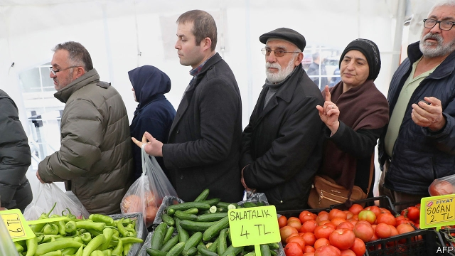
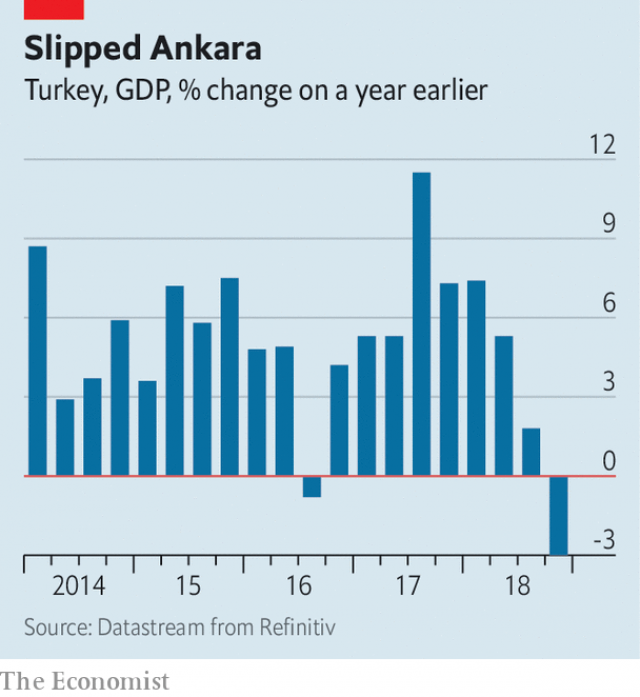

###### Turkey in recession

# The struggle to restore Turkey’s stricken economy 

##### The effects of mismanagement will linger 

 

> Mar 14th 2019 

DURING TURKEY’S constitutional upheavals in 2016-17, when President Recep Tayyip Erdogan faced down an attempted coup and gathered up new political powers (and prisoners), the country’s economic reformers remembered better days. They talked wistfully of an imminent return to “factory settings”. Turkey, they believed, had a default set of successful policies, from which it had recently deviated and to which it could quickly revert, undoing any mistakes in between. 

Instead the economy suffered something closer to a system crash. Excessive lending, some of it guaranteed by the government, contributed to rising inflation and a widening current-account deficit. The central bank’s ability to restore order was stymied by Mr Erdogan’s hostility to orthodox monetary policy (he compared interest rates to tools of terrorism). When the government fell out with President Donald Trump over the arrest of an American pastor working in Anatolia, foreign investors (and many Turkish depositors) lost their nerve. Turkey’s currency, the lira, fell by 40% against the dollar in the first eight months of 2018. 

That drop was excruciating for the many companies that had borrowed in euros or dollars: foreign-currency corporate debt amounted to over 35% of GDP in 2018. Hundreds of firms have since defaulted or applied for konkordato, a court-approved rescheduling of debt that allows them to avoid declaring bankruptcy. Their number includes the Turkish franchises of Gloria Jean’s Coffees owned by Haci Sayid, a cafeteria chain founded by two brothers who have been making baklava since 1968. 

The full extent of the damage became clearer on March 11th, when Turkey reported its latest GDP figures. They showed that the economy shrank by 3% in the fourth quarter of 2018 compared with a year earlier (see chart). That was an even sharper fall than expected. But if anything, it understates the suffering. An unusually large share of this diminished output was exported to foreigners, rather than enjoyed at home. Household consumption, a better measure of pleasure and pain, shrank by almost 9%. 

 

The crisis has, however, forced the government to reset its reckless macroeconomic policies. The appointment in July of Berat Albayrak, the president’s son-in-law, as finance minister did not bode well. But for the moment the family dynamic seems to be working in the economy’s favour, helping to reconcile Mr Erdogan to the need for monetary and fiscal restraint. The central bank was belatedly permitted to unholster its terrorist tools and raise interest rates. The government has also set itself ambitious fiscal targets that will require cutting pensions and postponing investment to narrow the budget deficit. 

The flow of credit has been sharply curtailed, imports have collapsed and exports have boomed. The current account even swung into surplus for four months in a row from August to November, as Turkey welcomed more foreign tourists and fewer foreign goods. This rebalancing has helped to revive the lira, which rose by 28% from the end of August to the end of January. 

But how long will it take for stability to translate into growth? An economy, unfortunately, cannot be reset as easily as a smartphone. Past mismanagement tends to become embedded in the circuits. The Turkish public, for example, will not quickly forget last year’s erosion in the value of the lira. They now hold nearly half of their deposits in foreign currency. And the central bank will have to keep interest rates high for some time to convince people that it can conquer inflation, which remains at almost 20%. In its impatience, the government has resorted to opening subsidised food stalls in big cities to dampen the rise in the price of groceries, which Mr Albayrak has branded “food terrorism”. 

Inflation should fall further later in the year, as the effects of the lira’s decline wear off. Credit is already beginning to revive, led by state banks. And some early indicators for 2019 suggest that the pace of economic contraction is starting to ease. BBVA, a bank, believes growth will return in the second half of the year, leaving the economy 1% bigger this year than last. 

A cyclical recovery will not, however, resolve questions about Turkey’s longer-term future. It is hard now to argue that the market-friendly policies embraced by Mr Erdogan’s party from 2002 to 2011 represent the economy’s default mode. After all, the populism and cronyism of more recent years is hardly new in Turkey. A similar kind of mismanagement reared its head many times before the financial crisis of 2001 and the promise of European Union membership motivated a decade of reform. Perhaps populism, not liberalism, represents Turkey’s factory settings, to which it has returned after all. 

-- 

 单词注释:

1.recession[ri'seʃәn]:n. 后退, 凹处, 衰退, 归还 [医] 退缩 

2.mismanagement[]:n. 管理不善；处置失当 

3.linger['liŋgә]:vi. 逗留, 消磨, 徘徊 vt. 消磨 

4.constitutional[.kɒnsti'tju:ʃәnl]:a. 宪法的, 立宪的, 体质的 [医] 全身的; 体质的 

5.upheaval[ʌp'hi:vl]:n. 举起, 隆起, 大变动, 剧变 

6.recep[]:n. (Recep)人名；(土)雷杰普 

7.tayyip[]:[网络] 塔伊普 

8.erdogan[]:[网络] 埃尔多安；土耳其总理埃尔多安；艾尔多安 

9.coup['ku:]:n. 砰然的一击, 妙计, 出乎意料的行动, 政变 [医] 发作, 中, 击 

10.reformer[ri'fɒ:mә]:n. 改革家, 改革运动者 [化] 转化炉; 转化器; 重整器; 重整炉 

11.wistfully['wɪstfəlɪ]:adv. 惆怅地, 渴望地 

12.imminent['iminәnt]:a. 即将来临的, 逼近的 

13.default[di'fɒ:lt]:n. 违约, 不履行责任, 缺席, 默认值 v. 疏怠职责, 缺席, 拖欠, 默认 [计] 默认; 默认值; 缺省值 

14.deviate['di:vieit]:vi. 脱离, 偏离 vt. 使偏离 a. 脱离常规的 n. 脱离常规的人 

15.quickly['kwikli]:adv. 很快地 

16.revert[ri'vә:t]:vi. 恢复, 复归, 回复, 还原 vt. 使回复原状, 使回转 n. 恢复原信仰的人 [计] 还原 

17.inflation[in'fleiʃәn]:n. 胀大, 夸张, 通货膨胀 [化] 充气吹胀; 膨胀 

18.deficit['defisit]:n. 赤字, 不足额 [医] 短缺 

19.stymy[]:n. (喻)困难的境地 vt. 使(球)处于困难的位置, 使为难, 使处困境, 妨碍, 阻挠, 阻碍 

20.hostility[hɒs'tiliti]:n. 敌意, 敌对, 反对 

21.orthodox['ɒ:θәdɒks]:a. 正统的, 传统的, 惯常的 

22.monetary['mʌnitәri]:a. 货币的, 金钱的 [经] 货币的, 金融的 

23.terrorism['terәrizm]:n. 恐怖主义, 恐怖统治, 恐怖状态 [法] 胁迫, 暴政, 恐怖政治 

24.pastor['pæstә]:n. 牧师 

25.Anatolia[.ænә'tәuljә]:n. 安纳托利亚(小亚细亚旧称) 

26.investor[in'vestә]:n. 投资者 [经] 投资者 

27.Turkish['tә:kiʃ]:n. 土耳其语 a. 土耳其的, 土耳其人的, 土耳其语的 

28.depositor[di'pɒzitә]:n. 存放者, 存款人 [经] 存款人, 储户, 委托人 

29.lira['liәrә]:n. 里拉 

30.excruciate[iks'kru:ʃieit]:vt. 施酷刑, 拷问, 使苦恼, 折磨 

31.euro['juәrәu]:n. 欧元（欧盟的统一货币单位） 

32.corporate['kɒ:pәrit]:a. 社团的, 合伙的, 公司的 [经] 团体的, 法人的, 社团的 

33.reschedule[ri:ʃedju:l]:[计] 重安排, 重调度 [化] 修订计划 

34.bankruptcy['bæŋkrәptsi]:n. 破产者 [经] 破产, 倒闭 

35.franchise['fræntʃaiz]:n. 公民权, 特权, 特许经营权, 免赔额 vt. 给以特权, 给以...公民权 

36.gloria['^lɔ:riә]:n. 地质用远程斜向[指示]声纳（Geological LongLORIA Range Inclined [Indicating] Asdic） 

37.haci[]:[网络] 本田飞机公司(HONDA Aircraft Company， Inc.)；羟基磷灰石涂层钛种植体；灌溉处理 

38.sayid['saɪjɪd]:n. 赛伊德（男子名） 

39.baklava['bæklәvә]:n. (土尔其,希腊的)果仁蜜饼 

40.Sharpe['ʃa:p]:n. 夏普指数；夏普指标；夏普（人名） 

41.understate[.ʌndә'steit]:v. 不完全地陈述, 保守地说, 有意轻描淡写 

42.diminish[di'miniʃ]:v. (使)减少, (使)变小 

43.reset[.ri:'set]:n. 重新设定, 重新组合, 重排版 vt. 重新设定, 重置, 重新组合 vi. 重置, 清零 [计] 重置, 清零 

44.reckless['reklis]:a. 不介意的, 大意的, 鲁莽的, 不顾后果的 [法] 不注意的, 粗心大意的, 鲁莽的 

45.macroeconomic[-mik]:n. 整体经济 

46.Berat[be'rɑ:t]:培拉特(阿尔巴尼亚城市) 

47.Albayrak[]:[网络] 阿贝莱克；阿尔贝拉克；阿尔巴伊拉克 

48.bode[bәud]:v. 预示 bide的过去式 

49.reconcile['rekәnsail]:vt. 使和解, 调停, 使和谐, 使一致, 使听从 [经] 对帐, 使一致 

50.fiscal['fiskәl]:a. 财政的, 国库的 [经] 财政上的, 会计的, 国库的 

51.belatedly[bi'leitidli]:adv. 延迟地；延续地 

52.unholster[]:[网络] 独行者 

53.terrorist['terәrist]:n. 恐怖分子 [法] 恐怖份子, 恐怖主义 

54.ambitious[æm'biʃәs]:a. 有野心的, 抱负不凡的, 雄心勃勃的 

55.postpon[pəs'pɒn]: [医]推迟, 延迟, 搁置 

56.curtail[kә:'teil]:vt. 缩减, 剥夺, 简略 [法] 剥夺特权 

57.rebalance[re'bæləns]: 再平衡 

58.revive[ri'vaiv]:vt. 使苏醒, 使复兴, 使振奋, 回想起, 重播 vi. 苏醒, 复活, 复兴, 恢复精神 

59.cannot['kænɒt]:aux. 无法, 不能 

60.smartphone[]:n. 智能手机 

61.embed[im'bed]:vt. 使插入, 使嵌入, 使深留脑中 [计] 嵌入 

62.erosion[i'rәuʒәn]:n. 腐蚀, 冲蚀, 侵蚀 [化] 磨耗; 侵蚀 

63.impatience[im'peiʃәns]:n. 性急, 难耐, 焦急, 急躁 

64.subsidise[]:vt. 给...补助金, 津贴, 资助 

65.stall[stɒ:l]:n. 厩, 停车处, 牧师职位, 货摊, 托辞, 拖延 vt. 关入厩, 停顿, 推托, 支吾, 使陷于泥中 vi. 被关在厩内, 陷于泥中, 停止, 支吾 

66.dampen['dæmpәn]:vt. 弄湿, 使沮丧 vi. 变湿, 丧气 

67.inflation[in'fleiʃәn]:n. 胀大, 夸张, 通货膨胀 [化] 充气吹胀; 膨胀 

68.indicator['indikeitә]:n. 指示器, 指示剂, 指标 [计] 指示器 

69.contraction[kәn'trækʃәn]:n. 收缩, 缩写式, 害病 [医] 收缩; 挛缩; 牙弓内缩 

70.bbva[]:[网络] 西班牙对外银行(Banco Bilbao Vizcaya Argentaria)；毕尔巴鄂比斯开银行；西班牙毕尔巴鄂比斯开银行 

71.cyclical['siklik(e)l]:a. 周期的, 轮转的, 循环的, 轮列的, 轮卷的, 环状的, 环的, 组诗的, 始末的 [计] 循环的 

72.Populism['pɒpjulizm]:n. 平民主义, 民粹主义 

73.cronyism['krәjniizəm]:n. 任人唯亲 

74.membership['membәʃip]:n. 会员的资格, 全体会员, 会员数目 [法] 会员资格, 成员资格, 会籍 

75.liberalism['libәrәlizm]:n. 自由主义 

