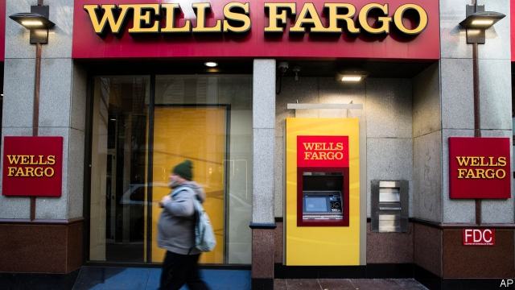

###### In the pillory

# Wells Fargo takes a pasting, from Congress and a regulator 

##### Another bad day for Tim Sloan 

 

> Mar 14th 2019 

“YOU HAVE not been able to keep Wells Fargo out of trouble,” Maxine Waters told Tim Sloan, the chief executive of America’s fourth-biggest bank, on March 12th. Ms Waters, the Democrat who since January has chaired the House of Representatives’ Financial Services Committee, is not alone in her ire. Patrick McHenry, the committee’s senior Republican, piled in too. Soon after Mr Sloan faced the panel, the Office of the Comptroller of the Currency (OCC), a regulator, said it was “disappointed” with Wells’s “performance under our consent orders”, corporate governance and risk management. “We expect national banks to treat their customers fairly, operate in a safe and sound manner, and follow the rules of law.” A public dressing-down from politicians is one thing; such a rebuke from a regulator is a true ear-burner. 

Over the past three years a series of misdeeds has been uncovered at the San Francisco-based bank. Under pressure to meet demanding sales targets, staff opened 3.5m fake accounts and signed customers up for credit and debit cards without their consent. The bank charged people for car insurance they did not need and overcharged members of the armed forces for refinancing mortgages. Wells has had to set aside money to reimburse foreign-exchange and wealth-management clients. It has even had to refund mis-sold pet insurance. 

These transgressions have cost the bank dear. Since 2016 Wells has paid more than $1.5bn in fines to federal and state regulators (including $500m to the OCC), plus $620m to resolve lawsuits brought by customers and shareholders. The Federal Reserve capped its balance-sheet at $2trn in February 2018—a limit that will stay until the Fed is satisfied that Wells has cleaned up its act. At the House hearing Mr Sloan admitted that Wells is operating under 14 consent orders (settlements agreed with regulators without admitting guilt). 

Investors are grumbling too. Wells’s share price fell by 24% in 2018 (though it has begun 2019 more steadily). The asset cap, which Mr Sloan expects to stay in place all this year, is starting to bite, while rival megabanks can take advantage of America’s robust economy to lend more. In recent times Wells has enjoyed a higher return on equity than its competitors. Last year it was overtaken by JPMorgan Chase. 

Mr Sloan—who assumed the top job in 2016 after his predecessor, John Stumpf, was forced out amid the fake-accounts scandal—insists that Wells has reformed. He told the committee that the offending sales targets have been changed. The 5,300 workers who opened phoney accounts have been sacked. A quarter of Wells’s board members stepped down in 2018. 

The result, he claims, is a more customer-friendly bank. For instance, Wells has revised its overdraft rules, to make them more lenient on those who make mistakes. If a withdrawal is made the day before a customer’s monthly pay-cheque clears, the customer will no longer be charged. 

But lawmakers and regulators are still furious. “Each time a new scandal breaks, Wells Fargo promises to get to the bottom of it,” said Mr McHenry at this week’s hearing. “But then a few months later, we hear about another case of dishonest sales practices or gross mismanagement.” 

Other banks are not guiltless, but in this category of sin Wells has been in a league of its own. In June the same committee quizzed the OCC after it ended an investigation into malpractice at other banks without publishing its findings. It emerged that employees at unnamed banks had opened around 10,000 fake accounts. But that is minuscule next to the tally at Wells. 

Even so, there is some small consolation for Mr Sloan: he will not be the only one in the pillory. In April the heads of all America’s large banks are due to testify before Ms Waters’s committee. She is probably just getting started. 

-- 

 单词注释:

1.pillory['pilәri]:n. 颈手枷, 笑柄, 示众 vt. 上颈手枷, 使惹人嘲笑, 使受众辱, 将...示众 

2.fargo['fɑ:ɡəu]:n. 法戈（美国北达科他州东南部城市） 

3.pasting['peistiŋ]:n. 裱糊, 涂；粘合 

4.regulator['regjuleitә]:n. 调整者, 校准者, 校准器, 调整器, 标准钟 [化] 调节剂; 调节器 

5.tim[tim]:n. 蒂姆（男子名） 

6.sloan[slәun]:n. 斯隆（姓氏）；麻省理工学院斯隆商学院 

7.maxine[mæk'si:n,'mæksi:n]:n. 玛克辛（女子名） 

8.democrat['demәkræt]:n. 民主人士, 民主主义者, 民主党党员 [经] 民主党 

9.ire[aiә]:n. 忿怒 [电] 美国无线电工程师学会 

10.patrick['pætrik]:n. 帕特里克（男子名） 

11.mchenry[]: [人名] [苏格兰人、爱尔兰人姓氏] 麦克亨利盖尔语姓氏的英语形式，来源于教名Henry的盖尔语形式; [地名] [美国] 麦克亨利 

12.comptroller[kәn'trәulә]:n. 审计官 [经] 主计, 会计师, 审计 

13.occ[]:abbr. 开路特性（Open Circuit Characteristic）；偶然的（等于occasional） 

14.corporate['kɒ:pәrit]:a. 社团的, 合伙的, 公司的 [经] 团体的, 法人的, 社团的 

15.governance['gʌvәnәns]:n. 统治, 统辖, 管理 [法] 统治, 管理, 支配 

16.rebuke[ri'bju:k]:n. 指责, 谴责, 非难 vt. 斥责, 指责, 制止 

17.sery[]:n. (Sery)人名；(俄)谢雷；(科特)塞里 

18.misdeed['mis'di:d]:n. 罪行, 犯罪 [法] 不端行为, 犯罪, 恶性 

19.san[sɑ:n]:abbr. 存储区域网（Storage Area Networking） 

20.fake[feik]:n. 假货, 欺骗, 诡计 a. 假的 vt. 假造, 仿造 vi. 伪装 

21.debit['debit]:n. 借方, 借 vt. 记入借方 

22.overcharge[.әuvә'tʃɑ:dʒ]:v. 讨价过高, 装载过多, 过度充电, 渲染 n. 超载, 装药过多, 过度充电 

23.refinancing[rifi'nænsiŋ]:[经] 重新集资金 

24.mortgage['mɒ:gidʒ]:n. 抵押, 约束性义务, 抵押借款 vt. 抵押, 以...作担保, 把...许给 

25.reimburse[.ri:im'bә:s]:vt. 付还, 偿还, 赔偿 [经] 偿付, 赔还, 付还; 偿还 

26.client['klaiәnt]:n. 客户, 顾客, 委托人 [计] 客户, 客户机, 客户机程序 

27.refund['ri:fʌnd]:n. 偿还 vt. 付还, 偿还借款 vi. 归还, 偿还 

28.transgression[træns'greʃәn]:n. 违反, 犯罪 [医] 亲和转移 

29.lawsuit['lɒ:sju:t]:n. 诉讼 [法] 诉讼, 诉讼案件 

30.shareholder['ʃєә.hәuldә]:n. 股东 [法] 股东, 股票持有人 

31.guilt[gilt]:n. 罪行, 内疚 [法] 罪, 犯罪, 罪行 

32.investor[in'vestә]:n. 投资者 [经] 投资者 

33.grumble['grʌmbl]:n. 怨言, 满腹牢骚 vi. 抱怨, 发牢骚, 发隆隆声 vt. 抱怨 

34.asset['æset]:n. 资产, 有益的东西 

35.megabanks[]:[网络] 性的大型银行；超级银行集团 

36.robust[rәu'bʌst]:a. 健康的, 强健的, 要用力气的, 坚定的, 粗野的 [计] 健壮性 

37.equity['ekwiti]:n. 公平, 公正 [经] 权益, 产权 

38.jpmorgan[]:[网络] 摩根大通；摩根大通银行；摩根大通公司 

39.predecessor[.predi'sesә]:n. 前任, 先辈, 前身 [医] 初牙, 前辈, 祖先 

40.john[dʒɔn]:n. 盥洗室, 厕所, 嫖客 

41.stumpf[]: [人名] 斯顿夫 

42.amid[ә'mid]:prep. 在其间, 在其中 [经] 在...中 

43.phoney['fәuni]:a. 假的, 假冒的, 伪造的 n. 骗子, 假货, 假冒者 

44.overdraft['әjvәdrɑ:ft; (?@) -dræft]:n. 透支, 透支额, 气流, 过度通风 [经] 透支 

45.lenient['li:njәnt]:a. 宽大的, 温和的, 慈悲为怀的 [法] 宽大的, 仁慈的 

46.withdrawal[wið'drɒ:l]:n. 提款, 撤退, 退回, 撤消, 退隐, 戒毒过程 [医] 戒除, 脱瘾 

47.lawmaker[lɒ:'meikә]:n. 立法者 

48.dishonest[dis'ɒnist]:a. 不诚实的 [法] 不忠实的, 不诚实的, 欺诈的 

49.mismanagement[]:n. 管理不善；处置失当 

50.guiltless['^iltlis]:a. 无罪的, 无辜的, 没有...经验的, 不熟悉...的, 没有...的 [法] 无辜的, 无罪的, 无知的 

51.malpractice[mæl'præktis]:n. 不当治疗, 不端行为, 渎职 [医] 疗法失当, 医疗差错 

52.unnamed['ʌn'neimd]:a. 未命名的, 没有名字的, 未提及的 [计] 无名的 

53.minuscule['minәskju:l]:n. 小书写体, 小写字 a. 用小书写体的, 小写字的 

54.tally['tæli]:n. 符木, 记账, 得分, 比分, 计数器, 标签, 符合, 对应物 vt. 记录, 点数, 计算, 加标签于, 使符合 vi. 记帐, 符合, 吻合, 记分 [计] 计数 

55.consolation[.kɒnsә'leiʃәn]:n. 安慰, 令人安慰的事物 [法] 安慰, 慰问 

56.testify['testifai]:v. 证明, 作证, 声明, 表明 

