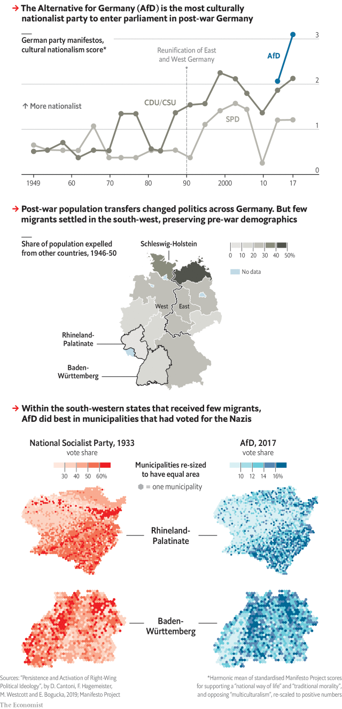

###### Nationalism’s deep roots

# New research finds parallels between German votes in 1933 and now 

##### In some regions, support for the far right in 2017 echoes votes for the pre-war Nazis 

 

> Mar 16th 2019 

FEW COUNTRIES have done more than Germany to repent of the sins of the past. Its post-war constitution banned Nazi symbols and anti-democratic parties. For decades the conservative Christian Democratic Union has guarded the right-wing frontier of German politics and kept extremists out of parliament. 

Against this background, many Germans were alarmed when the far-right Alternative for Germany (AfD) won 13% of the vote in 2017, making it the third-biggest force in parliament. The party was founded to oppose EU bail-outs of debt-stricken countries like Greece, which many Germans saw as a transfer from industrious German taxpayers to feckless Greeks. In 2013 it fell short of the 5% of votes needed to enter parliament. The AfD was then transformed as nationalists took it over and began to rail against immigrants and Islam. 

The AfD rejects the “extremist” label. People seen giving Nazi salutes have “nothing to do with our party”, said Beatrix von Storch, its deputy leader. And it goes without saying that the AfD’s agenda, though distasteful to liberals, is not remotely similar to that of the Third Reich. 

But a new paper finds an uncomfortable overlap between the parts of Germany that support the AfD and those that voted for the Nazis in 1933. At first glance, the link is invisible. The Nazis fared well in northern states like Schleswig-Holstein; the AfD did best in the former East Germany. 

However, northern Germany has changed a lot. After the war, 12m ethnic Germans living in territory ceded to other countries fled to Germany. They flocked to northern states—by 1950 “expellees” made up 36% of Schleswig-Holstein—but mostly avoided the south-west. These transfers reshuffled Germany’s political map. 

It is only in areas where pre-war demographics still persist that electoral maps show strong echoes of the past. Parts of the south-west that backed the Nazis in 1933 also embraced the AfD, and those that shunned Hitler rejected it. Overall, the paper’s authors found that among municipalities with average far-right support but few expellees, a 1% increase in the Nazis’ vote share in 1933 was associated with an extra 0.3-0.5% gain for the AfD from 2013-17. 

These findings should be understood in a modern context. The Nazis are not coming back. But it seems that modern German nationalism has deep historic roots. 

-- 

 单词注释:

1.Nazi['nɑ:tsi]:n. 纳粹党人 a. 纳粹党的 

2.Nazi['nɑ:tsi]:n. 纳粹党人 a. 纳粹党的 

3.politic['pɒlitik]:a. 精明的, 明智的, 策略的 

4.extremist[iks'tri:mist]:[经] 偏激份子 

5.afd[]:abbr. 自动装填装置（Automatic Feeding Device） 

6.EU[]:[化] 富集铀; 浓缩铀 [医] 铕(63号元素) 

7.industrious[in'dʌstriәs]:a. 勤勉的, 刻苦的 

8.taxpayer['tækspeiә]:n. 纳税人 [法] 纳税人, 纳税义务人 

9.feckless['feklis]:a. 无效的, 无能的, 不负责任的 

10.nationalist['næʃәnәlist]:n. 国家主义者, 民族主义者 

11.Islam['izlɑ:m]:n. 伊斯兰教 

12.Beatrix['biәtriks]:n. 比阿特丽克斯(Beatrice的异体)(f.) 

13.Von[vɔn;fɔn;fәn]:[计] 冯·诺伊曼 

14.storch[]: [人名] 斯托奇 

15.distasteful[dis'teistful]:a. 味道差的, 使人不愉快的, 讨厌的 

16.remotely[]:adv. 极小地, 极细微地 

17.reich[raik]:n. 德国；德意志帝国 

18.overlap[.әuvә'læp]:n. 重叠, 重复, 部分的同时发生 vt. 重叠, 重复, 与...同时发生 vi. 迭盖, 部分的同时发生 [计] 重叠 

19.ethnic['eθnik]:a. 人种的, 种族的 [医] 人种的 

20.cede[si:d]:vt. 割让 [法] 割让, 让与, 放弃 

21.expellee[ekspә'li:]:n. 被驱逐(出国)者 [法] 被驱逐出境者, 被开除者 

22.reshuffle[ri:'ʃʌfl]:vt. 重新洗牌, 改组, 撤换 n. 重新洗牌, 改组, 撤换 

23.demographic[.demә'græfik]:a. 人口统计的 [法] 人口统计的, 人口学的 

24.electoral[i'lektәrәl]:a. 选举人的, 选举的, (有关)选举的 [法] 选举的, 选举人的, 由选举人组成的 

25.shun[ʃʌn]:vt. 避开, 规避, 避免 

26.hitler['hitlә]:n. 希特勒（纳粹德国元首） 

27.municipality[.mju:nisi'pæliti]:n. 自治区, 市当局, 市民 [法] 市, 自治市, 自治地区 

28.context['kɒntekst]:n. 上下文, 背景, 来龙去脉 n. 上下文 [计] 上下文 

29.nationalism['næʃәnәlizm]:n. 民族主义, 民族特性 

30.historic[hi'stɒrik]:a. 历史上著名的, 有历史性的 

