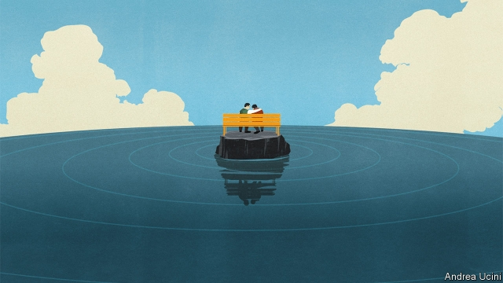
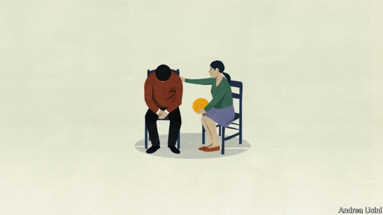

###### Talk is cheap

# What disasters reveal about mental-health care 

##### Counselling by amateurs costs little and can work wonders 

 

> Mar 16th 2019 

AT JABAL AMMAN mental-health clinic, perched atop a hill in the old town of Jordan’s capital, Walaa Etawi, the manager, and her colleagues list the countries from where they see refugees—and what ails them. There are Iraqis (many with post-traumatic stress, says a nurse), Syrians (a lot of depression), Sudanese (anxiety), and at least ten other nationalities. By official estimates, 1.4m people have poured into Jordan from Syria’s civil war alone. Disaster-relief groups like the International Medical Corps (IMC), which runs the Jabal Amman clinic, came to help. 

In the past two decades care for mental distress in such emergencies, whether wrought by conflict or natural calamity, has become an immediate priority—on a par with shelter and food. And what has been learnt from disasters has inspired new, pared-down mental-health care models that can be deployed quickly to help lots of people. In parts of Indonesia, Sri Lanka, the Philippines and elsewhere these models became part of rebuilt health-care systems. They are now being picked up in America and Europe, as people wake up to the scale of mental-health problems and the shortage of specialists to treat them. 

In Jordan IMC has the luxury of hiring psychiatrists and mental-health nurses. But in most countries suffering civil wars, earthquakes or typhoons a single mental hospital and a handful of psychiatrists for a population of millions is typically all there is. For foreign medics who fly in after a disaster, mending crushed limbs and stanching bleeding wounds is straightforward. Alleviating mental distress is trickier, not least because the medics seldom speak the local language. “We have to learn about the culture in their country to understand what affects their symptoms,” says Khawla Aljaloudy, a nurse at the Jabal Amman clinic. “If an Italian says ‘I’m possessed’, I would suspect a serious problem,” says Luana Giardinelli, a clinical psychologist at IMC. In other cultures, she says, that is what people might say about symptoms of mild distress. 

As disaster-relief experts wondered how quickly to train local people to provide mental-health care, they realised that, for the most part, non-specialists might be able to do the job. “We used to assume that people need professional counselling,” says Julian Eaton of the London School of Hygiene and Tropical Medicine, a veteran in post-disaster care. But it turned out this was not so. Rates of mental-health problems usually doubled after a calamity. But few people needed a psychiatrist. Most got better with simple, appropriate help that anyone could provide. Known as “psychological first aid”, it is something that can be taught in a matter of hours. 

This training is now standard fare in the first days after a disaster. Teachers, pastors, barbers and taxi-drivers are taught to notice people in distress, to provide the right kind of emotional support, and to avoid common mistakes such as pressing sufferers to recount stressful events. 

This approach has also been formalised as a way of preventing post-traumatic stress disorder. In Western countries it has been adopted by emergency responders helping people who have been through traumatic events. Of necessity, the version used for refugees and survivors of natural disasters also includes help with pressing practical issues, such as finding safe housing and making contact with others from their village or town. For survivors of disasters, the root cause of psychological distress is often practical hardship. 

That problems of daily life take a toll on mental health is also becoming evident in rich countries. A study in 2015 found that primary-care doctors in Britain spend one-fifth of their consultation time on issues that are not medical, such as distress stemming from financial difficulties or loneliness. In response, Britain’s National Health Service has been expanding the use of “social prescribing” whereby family doctors refer patients to organisations that provide housing, welfare and debt advice, or social connections through activities such as dance classes or gardening groups. 

Disaster relief has taught that non-specialists can be trained to treat mild-to-moderate depression and anxiety, which affect 15-20% of people in any given year. The idea, known in the jargon as “task-shifting”, was “born out of necessity”, says Peter Ventevogel of UNHCR, the UN’s refugee agency. When psychiatrists are too few, he says, it is best that they work with those most in need, such as the suicidal. 

Dispensing pills may seem an obvious task to train non-specialists for. But in disaster relief, says Ms Giardinelli, medication is the option of last resort. Displaced people move often and unpredictably, she says, so the priority is to give them something of lasting value—such as information about their condition and ways to manage their symptoms (a calming slow-breathing technique, for example). 

In Western countries a psychotherapist’s qualification usually takes several years of training, on top of a university degree. Dixon Chibanda, a psychiatrist in Zimbabwe, showed that lay people can be trained in a couple of weeks to do some parts of the job. In 2005 in Zimbabwe’s capital, Harare, the bulldozing of slums that voted for the opposition left 700,000 people homeless. Many were also viciously beaten by the police. At the time, the whole country had five psychiatrists for its 13m people. So Dr Chibanda decided to train elderly women already known for some kind of community work in aspects of cognitive-behavioural therapy, a Western staple that involves teaching people to spot the real-world situations that set off their anxieties, and suggesting concrete steps to deal with those situations. He dispatched these amateur counsellors to “friendship benches” installed in health centres’ courtyards. There, they talked to people troubled by kufungisisa (“thinking too much”), the local expression for depression and anxiety. 

A study in 2014-15 found that after six months only 13-14% of people seen by the grandmothers still had symptoms of depression or anxiety, compared with about half of those who received the standard treatment, in which a nurse talked to them and prescribed medication. The friendship-bench model has been replicated in Malawi (which added elderly men as counsellors) and Tanzania. In 2016 it was picked up by New York City’s health department. 

Unlike the plain garden benches in Africa, those in New York are made of attention-grabbing bright orange plastic. They are staffed by trained social workers who offer advice to people with mental-health and addiction problems. Whereas kindly grandmothers are Africa’s trusted confidantes, many of those in New York are former sufferers such as addicts. 

Gary Belkin, the city’s mental-health commissioner, who has advised on health projects in Africa and disaster relief in Haiti, says that places like New York can learn from poor countries that mental-health care is not the preserve of qualified specialists. “These are smarter ways,” says Dr Belkin, who calls ideas such as the friendship bench “innovation of a higher order”. As part of an $850m mental-health initiative launched in 2015, New York City has plans to train 250,000 of its firefighters, police officers, teachers, shopkeepers and citizens to spot common risk factors and warning signs of mental illness and respond appropriately. The city has also trained over 1,200 workers at organisations that help groups at high risk of mental illness (such as young people, the homeless, abused women and immigrants) to screen for risks and provide counselling. 

The idea of using non-specialists is spreading in Europe, too. Italy is testing guidelines for mild perinatal depression that, so far, have been used only in poor countries such as Pakistan to train village paramedics with at best a secondary education. Italy is trying the approach with midwives, who would provide some of the perinatal-depression care now reserved for psychiatrists. “We had to adapt the manual,” says Antonio Lora from the Lombardy region’s health department, which is running the trial. That included deleting the parts where the midwife tells the woman not to worry if the baby is a girl and how to ask her husband for permission to go out. 

 

Such models are not without drawbacks. Trainees are taught a set of structured sessions, to use for everyone. Some may simply parrot the phrases in the manual, says Mr Ventevogel. Where psychiatrists are too few, patchy supervision of new trainees can fail to weed out problems that lead to poor quality. 

England is a test case for standardised talk-therapy. It has rapidly expanded access to it by training thousands of new therapists to provide a uniform bundle of sessions. James Binnie of London South Bank University worries that the programme is a “therapy factory” which ignores the variety of personal and social issues that shape each person’s psychological problems. Psychotherapy, he says, is a relationship, so cannot be reduced to separate “active ingredients”. David Goldbloom of the University of Toronto sees things differently. He says that standardising talk-therapy ensures that patients get the care they are supposed to get—just as they would with any form of medical treatment. “The alternative is a bit of a Wild West,” he says. 

Concerns about amateur shrinks resemble those raised in the past over other types of health care, such as training community health workers (or “barefoot doctors”) to provide basic prenatal care, treat malaria or diagnose pneumonia. They may not be as good as doctors, but training armies of them has been crucial to the steep reductions in maternal and child mortality in Ethiopia, Rwanda and many other poor countries in the past decade. In England’s programme, half the people seen for depression and anxiety recover (though of course some would have done so anyway). 

In some developing countries the mental-health care models spawned by disaster relief were adopted by primary health-care systems. In Aceh, an Indonesian province devastated by a tsunami in 2004, there were no community mental-health nurses at all until relief organisations trained the first cohort. They are now established at health centres, whizzing around on motorcycles to check on patients at home. Disasters also set off an expansion of mental-health care in Sri Lanka, Nepal and the Philippines. In 2017 Zimbabwe’s friendshipbench grandmothers, of whom over 400 were trained, treated over 30,000 people. 

In rich countries, the need is less dire. But mental-health care is often underfunded and less than a third of those needing it get it. These countries may not be facing humanitarian disasters, but the needs have been acute enough to spur a search for ideas beyond their own borders. 

-- 

 单词注释:

1.counsel['kaunsәl]:n. 商议, 忠告, 法律顾问 v. 商议, 劝告 

2.jabal[]: [地名] 山（阿拉伯语） 

3.Amman[æ'mɑ:n]:n. 安曼(约旦首都) 

4.perch[pә:tʃ]:n. 栖木, 高位, 杆, 河鲈 v. (使)栖息, 就位, 位于, (使)暂歇 

5.atop[ә'tɒp]:adv. 在顶上 prep. 在...的顶上 

6.ail[eil]:vt. 使苦恼 vi. 生病, 处境困难 [计] 数组互联逻辑 

7.Iraqi[i'rɑ:ki]:n. 伊拉克人, 伊拉克阿拉伯语 a. 伊拉克的, 伊拉克人的 

8.Syrian['siriәn]:n. 叙利亚人, 叙利亚语 a. 叙利亚语的, 叙利亚人的 

9.Sudanese[su:dә'ni:z]:a. 苏丹的, 苏丹人的 n. 苏丹人 

10.jordan['dʒɒ:dәn]:n. 约旦, 约旦河, 尿壶 

11.corp[]:[经] 公司 

12.IMC[]:[计] 交互模块控制器 

13.jabal[]: [地名] 山（阿拉伯语） 

14.Amman[æ'mɑ:n]:n. 安曼(约旦首都) 

15.calamity[kә'læmiti]:n. 灾难, 不幸事件 

16.par[pɑ:]:n. 标准, 票面价值, 平均数量, 同等水平 a. 票面的, 平常的, 标准的, 平价的 [计] 重新传输的肯定回答 

17.deploy[di'plɒi]:v. 展开, 配置 

18.quickly['kwikli]:adv. 很快地 

19.Indonesia[.indәu'ni:ʒә]:n. 印尼 

20.sri[sri]:n. 斯里兰卡（Sri Lanka）；（拉）神圣罗马帝国（Sacrum Romanum Imperium） 

21.lanka[]:n. 兰卡；楞伽 

22.Philippine['filipi:n]:a. 菲律宾(群岛)的, 菲律宾人的 

23.psychiatrist[sai'kaiәtrist]:n. 精神病医生, 精神病学家 [医] 精神病学家 

24.typically['tipikәli]:adv. 代表性地；作为特色地 

25.medic['medik]:n. 苜蓿属植物, 医师, 医科学生 

26.stanching[stɔ:ntʃɪŋ]:v. 使（伤口）止血( stanch的现在分词 ); 止（血）; 使不漏; 使不流失 

27.bleeding['bli:diŋ]:n. 出血, 流血 [化] 渗色 

28.alleviate[ә'li:vieit]:vt. 减轻, 使缓和 

29.tricky['triki]:a. 狡猾的, 机敏的 

30.luana[]: [人名] 卢瓦纳 

31.giardinelli[]:贾尔迪内利 

32.clinical['klinikәl]:a. 临床的, 门诊部的 [医] 临床的, 临证的 

33.psychologist[sai'kɒlәdʒist]:n. 心理学家 [医] 心理学家 

34.Julian['dʒu:ljәn]:a. 尤利乌斯恺撒的 

35.eaton['i:tn]:n. 伊顿（姓氏）） 

36.hygiene['haidʒi:n]:n. 卫生保健, 卫生学, 保健法 [医] 卫生, 卫生学 

37.pastor['pæstә]:n. 牧师 

38.sufferer['sʌfәrә]:n. 受难者, 被害者, 患者 [法] 受害者, 受难者 

39.recount[ri'kaunt]:vt. 详述, 叙述, 重新计算 n. 重新计算 

40.stressful[]:a. 着重, 强调, 重读, 使受应力 

41.formalise['fɔ:məlaɪz]:vt. 使（协议、计划等）成书面文字形式; 使成为正式, 使具有一定形式 

42.responder[ri'spɔndә(r)]:n. 回答者, 响应者, 响应器, 应答机 [计] 响应站, 应答机 

43.traumatic[trɒ:'mætik]:a. 外伤的, 创伤的 [医] 创伤的, 外伤的 

44.refugee[.refju'dʒi:]:n. 难民, 流亡者 [法] 避难者, 流亡者, 难民 

45.survivor[sә'vaivә]:n. 生还者, 幸存者 [法] 生还者, 生存者, 辛存者 

46.toll[tәul]:n. 通行费, 代价, 钟声 vt. 征收, 敲钟, 鸣钟, 勾引, 引诱 vi. 征税, 鸣钟 

47.consultation[.kɒnsәl'teiʃәn]:n. 请教, 咨询, 磋商会 [医] 会诊 

48.loneliness['lәunlinis]:n. 寂寞, 孤独, 清静 

49.whereby[(h)weә'bai]:adv. 靠什么, 如何, 为何, 靠那个, 因此, 由此 [法] 因此, 由是 

50.organisation[,ɔ: ^әnaizeiʃən; - ni'z-]:n. 组织, 团体, 体制, 编制 

51.jargon['dʒɑ:gәn]:n. 专门术语, 行话, 梦话, 土语 [计] 行话 

52.peter['pi:tә]:vi. 逐渐消失, 逐渐减少 

53.UNHCR[]:abbr. 联合国难民事务高级专员（United Nations High Commissioner for Refugees） 

54.suicidal[sjui'saidәl]:a. 自杀的, 自杀性的, 自我毁灭的 [法] 自杀的 

55.dispense[dis'pens]:vt. 分发, 分配 vi. 特许, 豁免 

56.medication[.medi'keiʃәn]:n. 药物治疗, 药物处理, 医药 [医] 药疗法, 投药法 

57.displace[dis'pleis]:vt. 移置, 替换, 转移 

58.unpredictably[ˌʌnprɪˈdɪktəblɪ]:adv. 无法预言地）；不可预见地（不能预料地 

59.dixon['diksn]:n. 狄克逊（姓氏） 

60.Zimbabwe[zim'bɑ:bwei]:n. 津巴布韦 

61.HARARE[hә'rɑ:rei]:哈拉雷[津巴布韦首都](旧称索尔兹伯里) 

62.bulldoze['buldәuz]:vt. 强迫, 用推土机推平/削平, 用推土机清除, 压倒, 威胁 

63.opposition[.ɒpә'ziʃәn]:n. 反对, 敌对, 相反, 在野党 [医] 对生, 对向, 反抗, 反对症 

64.homeless['hәumlis]:a. 无家的, 无养主的 

65.viciously[]:adv. 邪恶地；敌意地 

66.therapy['θerәpi]:n. 治疗 [医] 疗法, 治疗 

67.staple['steipl]:n. 主要产物, 常用品, 主要要素, 原料, 订书钉, 钩环 a. 主要的, 重要的 vt. 分级, 钉住 

68.dispatch[dis'pætʃ]:vt. 派遣 n. 派遣, 急件 [计] 调度 

69.counsellor['kaunsәlә]:n. 顾问, 辅导员, 律师 

70.replicate['replikeit]:vt. 折叠, 折转, 复制 n. 复现试验, 复制品, 高八度音 a. 复现的, 复制的, 折转的, 弯回的 

71.Malawi[mә'lɑ:wi]:n. 马拉维 

72.Tanzania[.tænzә'ni:ә]:n. 坦桑尼亚 

73.york[jɔ:k]:n. 约克郡；约克王朝 

74.addiction[ә'dikʃәn]:n. 入迷, 瘾 [医] 瘾, 癖嗜 

75.kindly['kaindli]:a. 和蔼的, 温和的, 爽快的 adv. 温和地, 亲切地 

76.confidante[.kɒnfi'dænt]:n. 知己的女友 

77.addict[ә'dikt]:vt. 使沉溺, 使上瘾 n. 入迷的人, 上瘾者 

78.gary['^eәri]:n. 盖理 

79.belkin[]:贝尔金 贝尔金 

80.commissioner[kә'miʃәnә]:n. 委员, 理事, 行政长官 [法] 委员, 政府的特派员, 地方地官 

81.Haiti['heiti]:n. 海地 

82.innovation[.inәu'veiʃәn]:n. 改革, 创新 [法] 创新, 改革, 刷新 

83.appropriately[]:adv. 适当的, 恰如其分的, 恰当的, 合适的 

84.guideline['gaidlain]:n. 指导路线, 方针, 指标 [经] 指导路线, 方针, 准则 

85.perinatal[,peri'neitl]:[医] 产期的 

86.Pakistan[.pɑ:ki'stɑ:n]:n. 巴基斯坦 

87.paramedic['pærәmedik]:n. 伞兵军医, 伞降急救人员 

88.midwive[]:[网络] 助产士 

89.antonio[æn'tәuniәu]:n. 安东尼奥（男名） 

90.lora['lәurә]:n. 罗拉（女子名, 等于Laura） 

91.Lombardy['lɒmbәdi]:n. 伦巴第(意大利州名) 

92.midwife['midwaif]:n. 助产士, 接生婆 [医] 助产士 

93.trainee[trei'ni:]:n. 实习生, 新兵, 受培训者 [经] 学徒工, 培训人员 

94.patchy['pætʃi]:a. 补缀的, 凑合的, 不调和的, 散落的, 斑驳的, 不完全的 

95.supervision[.sju:pә'viʒәn]:n. 监督, 管理 [经] 监督, 管理 

96.wee[wi:]:a. 很小的, 微小的 n. 一点点 

97.standardise[]:vt. 使与标准比较, 用标准校验, 使符合标准, 使统一, 使标准化 

98.therapist['θerәpist]:n. 治疗学家 [医] 治疗学家 

99.jame[]: 灰岩井 

100.binnie[]:n. (Binnie)人名；(英)宾尼 

101.psychotherapy[.saikәu'θerәpi]:n. 精神疗法, 心理疗法 [医] 精神疗法, 心理疗法 

102.cannot['kænɒt]:aux. 无法, 不能 

103.david['deivid]:n. 大卫；戴维（男子名） 

104.Goldbloom[]:n. (Goldbloom)人名；(英)戈德布卢姆 

105.toronto[tә'rɔntәu]:n. 多伦多（加拿大城市） 

106.differently['difrentli]:adv. 差异, 不同, 各别, 各种 

107.barefoot['bєәfut]:a. 赤脚的 

108.prenatal[.pri:'neitl]:a. 出生以前的, 孕期的 [医] 产前的, 出生前的 

109.malaria[mә'lєәriә]:n. 疟疾, 瘴气 [医] 疟[疾] 

110.diagnose['daiәgnәuz]:v. 诊断 

111.pneumonia[nju:'mәunjә]:n. 肺炎 [医] 肺炎 

112.maternal[mә'tә:nl]:a. 母亲的, 母系的, 母方的 [医] 属母的, 母的, 母性的 

113.mortality[mɒ:'tælәti]:n. 必死的命运, 死亡数目, 死亡率 [医] 必死性, 死亡率 

114.Ethiopia[.i:θi'әupiә]:n. 埃塞俄比亚 

115.rwanda[rj'ændә]:n. 卢旺达（东非国家）；卢旺达语 

116.spawn[spɒ:n]:n. (鱼)卵, 产物 vt. 产卵, 酿成, 大量生产 vi. 产卵, 大量生产 

117.aceh[]:n. 亚齐省（印度尼西亚最西部的一个省） 

118.Indonesian[.indәu'ni:ʒәn]:a. 印尼的 n. 印尼人, 印尼语群 

119.devastate['devәsteit]:vt. 毁坏 [法] 使荒废, 毁灭, 掠夺 

120.tsunami[tsu'nɑ:mi]:n. 海啸 

121.cohort['kәuhɒ:t]:n. 一群；步兵大队；支持者；共同特点的一群人 

122.whizz[hwiz]:n. 飕飕声, 精明的人, 专家 v. (使)飕飕作声 

123.Nepal[ni'pɒ:l]:n. 尼泊尔 

124.les[lei]:abbr. 发射脱离系统（Launch Escape System） 

125.dire[daiә]:a. 可怕的, 悲惨的, 阴沉的, 极端的 

126.underfunded[ˌʌndəˈfʌndɪd]:a. 资金不足的 

127.humanitarian[hju:.mæni'tєәriәn]:n. 人道主义者, 博爱者, 基督凡人论者 a. 人道主义的, 博爱的, 凡人论的 

