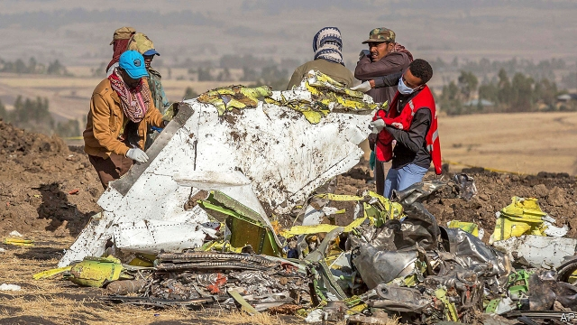
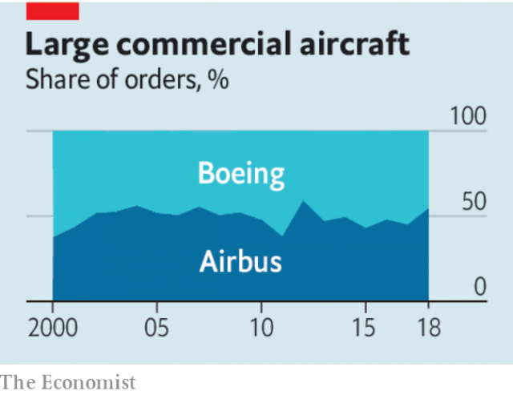

###### The Boeing accident

# A shadow over flight’s golden age 

##### The crash of Ethiopian Airlines flight ET302 is an ominous sign for the world’s aircraft duopoly 

 

> Mar 14th 2019 

WHEN A BOEING 737 MAX 8 crashed near Addis Ababa after take-off on March 10th, 157 people lost their lives. It did not take long for the human tragedy to raise questions about what went wrong. That has fed a crisis of trust in Boeing and in the FAA, the American regulator which, even as its counterparts grounded the MAX 8, left it flying for three days before President Donald Trump stepped in, suspending all MAX planes. 

Mr Trump noted that Boeing was “an incredible company”. In fact the crash is a warning. After a 20-year boom, one of the West’s most sophisticated industries faces a difficult future. 

The MAX 8 is one of Boeing’s most advanced models. Until this week it has been a commercial triumph, with 370 in operation and 4,700 more on order. The 737 series makes up a third of Boeing’s profits and most of its order book. That performance caps an extraordinary two decades for the Boeing and Airbus duopoly, as a growing global middle class has taken to the air. Over 21,000 aircraft are in use; a new plane is delivered every five hours. Boeing has slimmed down its supply chain and Airbus has asserted its independence from European governments. That has led to a shareholder bonanza. Their combined market value of $310bn is six times bigger than in 2000. And their overall safety record has been good, with one fatal accident per 2.5m flights last year. 

This week’s crash foreshadows the end of that golden age. Another MAX 8 crashed in October in Indonesia in similar circumstances. Although investigators have yet to determine the cause of the Ethiopian Airlines accident, regulators suspect that the MAX 8 has a design flaw. 

 

This plays into the worry that a new technological phase is under way. Aircraft are becoming autonomous, as computers take charge. This promises safer, more efficient flying, but the interaction between human pilots and machines is still unpredictable and experimental (see article). In the Indonesian crash the pilots fought a losing battle against anti-stalling software that forced the plane’s nose down at least 20 times. 

The industry’s technical complexity is amplified by its organisational complexity. In the 1990s a few Western airlines dominated and a handful of regulators had global clout. Now there are hundreds of airlines and 290,000 pilots worldwide. In 2018, for the first time, less than half of the global fleet was based in the West. Maintaining common standards on training and procedures is harder. China and other countries want a bigger say. The credibility of American regulators has slipped because they have let domestic competition decline. This suggests they are cosy with industry. 

Then comes geopolitics. With their hubs in Seattle and Toulouse, Boeing and Airbus are among the West’s largest exporters and a rare example of an industry in which China cannot compete. It would be depressing, but not impossible, if safety decisions were influenced by trade tensions. Over time, China and India may insist that the duopoly make more aircraft within their borders, to capture more jobs and intellectual property. That could require a restructuring of how both firms manufacture. Rows over aircraft emissions will further complicate the debate. 

Neither Boeing nor Airbus is about to go bust. Any flaw in the MAX 8 will probably be resolved, as battery problems in the 787 Dreamliner were in 2013. Boeing has $12.7bn of cash and bank lines to cushion it from the reputational crisis. Both firms are ultimately backed by governments. In any case, demand for planes will grow. But ahead lie environmental and technological uncertainty, organisational complexity and geopolitical tension. The years of bumper margins may be over. 

-- 

 单词注释:

1.boe[bəu]:abbr. back outlet eccentric 后偏心（轮）出口 

2.Ethiopian[.i:θi'әupiәn]:a. 埃塞俄比亚的 n. 埃塞俄比亚人 

3.ominous['ɒminәs]:a. 恶兆的, 不吉利的, 预兆的 

4.duopoly[dju'ɔpәli]:[经] 双头垄断的生产者 

5.MAX[mæks]:[计] 最大 

6.addis['ædis]:n. 艾缔思（姓氏） 

7.Ababa[]:n. (Ababa)人名；(塞)阿巴巴 

8.FAA[]:一切海损均不赔偿 

9.regulator['regjuleitә]:n. 调整者, 校准者, 校准器, 调整器, 标准钟 [化] 调节剂; 调节器 

10.counterpart['kauntәpɑ:t]:n. 副本, 复本, 配对物, 相应物 [经] 副本, 正副二份中之一 

11.incredible[in'kredәbl]:a. 难以置信的 

12.sophisticate[sә'fistikeit]:n. 久经世故的人, 精于...之道的人 vt. 篡改, 曲解, 使变得世故, 掺合, 弄复杂 vi. 诡辩 

13.sery[]:n. (Sery)人名；(俄)谢雷；(科特)塞里 

14.airbus['eәbʌs]:空中客车 

15.assert[ә'sә:t]:vt. 主张, 坚称, 断言 [法] 宣称, 断言, 维护 

16.shareholder['ʃєә.hәuldә]:n. 股东 [法] 股东, 股票持有人 

17.bonanza[bәu'nænzә]:n. 富矿带, 带来好运的事物, 幸运 

18.foreshadow[fɒ:'ʃædәu]:vt. 成为前兆, 预示 

19.Indonesia[.indәu'ni:ʒә]:n. 印尼 

20.investigator[in'vestigeitә]:n. 调查者, 审查者 [法] 审查员, 侦查员, 调查员 

21.flaw[flɒ:]:n. 缺点, 裂纹, 瑕疵, 一阵狂风 [化] 划痕; 裂缝; 裂纹 

22.technological[.teknә'lɒdʒikl]:a. 技术的 [经] 工艺的, 技术的 

23.unpredictable[.ʌnpri'diktәbl]:a. 不可预知的 

24.Indonesian[.indәu'ni:ʒәn]:a. 印尼的 n. 印尼人, 印尼语群 

25.complexity[kәm'pleksiti]:n. 复杂, 复杂性, 复杂的事物 

26.organisational[]:a. organise的变形 

27.clout[klaut]:n. 敲击, 破布 vt. 打补钉 

28.les[lei]:abbr. 发射脱离系统（Launch Escape System） 

29.credibility[.kredi'biliti]:n. 可信用, 确实性, 可靠 [法] 证据能力, 可信程度, 确实性 

30.geopolitic[,dʒi:әjpә'litik]:a. 地理政治学的 

31.hub[hʌb]:n. 毂, 木片, 中心 [计] 插座; 插孔; 集线器, 集中器, 连接器, 中继站 

32.Seattle[si'ætl]:n. 西雅图 

33.toulouse[tu:'lu:z]:n. 图卢兹（法国南部城市） 

34.exporter[ik'spɒ:tә]:n. 出口商, 输出者, 出口公司 [经] 出口商, 输出者 

35.cannot['kænɒt]:aux. 无法, 不能 

36.depressing[di'presiŋ]:a. 抑压的, 沉闷的, 阴沉的 

37.restructuring[]:[计] 重构的 

38.emission[i'miʃәn]:n. 发射, 射出, 发行 [医] 发射, 遗精 

39.bust[bʌst]:n. 半身像, 胸部, 失败, 殴打 vt. 使爆裂, 使破产 vi. 爆裂, 破产 [计] 操作错 

40.dreamliner[]:[网络] 梦幻客机；梦想飞机；梦想客机 

41.reputational[,repju'teiʃən]:a. reputation（名声, 声誉）的变形 

42.environmental[in.vaiәrәn'mentәl]:a. 周围的, 环境的 [经] 环境的, 环保的 

43.uncertainty[.ʌn'sә:tnti]:n. 不确定, 不可靠, 不确定的事物 [化] 不确定度 

44.geopolitical[,dʒi(:)әupә'litikәl]:[计] 地理的 

45.bumper['bʌmpә]:n. 缓冲器, 满杯 a. 大胜利的 

