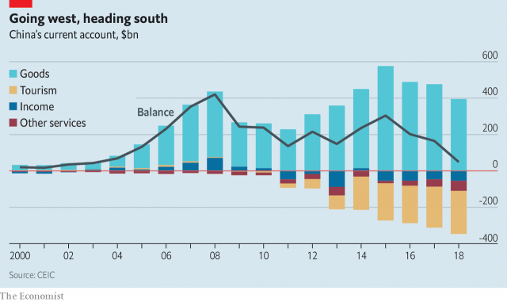

###### The big flip

# China may soon run its first annual current-account deficit in decades 

##### The implications will be profound 

> Mar 16th 2019 

 

THAT CHINA sells more to the world than it buys from it can seem like an immutable feature of the economic landscape. Every year for a quarter of a century China has run a current-account surplus (roughly speaking, the sum of its trade balance and net income from foreign investments). This surplus has been blamed for various evils including the decline of Western manufacturing and the flooding of America’s bond market with the excess savings that fuelled the subprime housing bubble. 

Yet the surplus may soon disappear. In 2019 China could well run its first annual current-account deficit since 1993. The shift from lender to borrower will create a knock-on effect, gradually forcing it to attract more foreign capital and liberalise its financial system. China’s government is only slowly waking up to this fact. America’s trade negotiators, meanwhile, seem not to have noticed it at all. Instead of focusing on urging China to free its financial system, they are more concerned that China keep the yuan from falling. The result of this myopia is a missed opportunity for both sides. 

China’s decades of surpluses reflected the fact that for years it saved more than it invested. Thrifty households hoarded cash. The rise of great coastal manufacturing clusters meant exporters earned more revenues than even China could reinvest. But now that has begun to change. Consumers are splashing out on cars, smartphones and designer clothes. Chinese tourists are spending immense sums overseas (see article). As the population grows older the national savings rate will fall further, because more people in retirement will draw down their savings. 

Whether or not China actually slips into deficit this year will be determined mostly by commodities prices. But the trend in saving and investment is clear: the country will soon need to adjust to a new reality in which deficits are the norm. That in turn means that China will need to attract net capital inflows—the mirror image of a current-account deficit. To some extent this is happening. China has eased quotas for foreigners buying bonds and shares directly, and made it simpler for them to invest in mainland securities via schemes run by the Hong Kong Stock Exchange. Pension funds and mutual funds all over the world are considering increasing their exposure to China. 

But the reforms remain limited. Ordinary Chinese citizens face restrictions on how much money they can take out. If many foreign investors tried to pull their money out of China at once it is not clear that they would be able to do so, an uncertainty that in turn may make them nervous about putting large sums in. China is terrified of financial instability. A botched currency reform in 2015 caused widespread volatility. But the system the country is moving to, which treats locals and foreigners differently, promises to be leaky, corrupt and unstable. 

Eventually, then, capital will need to flow freely in both directions across China’s borders. That is to be welcomed. People outside and inside China will benefit from being able to invest in more places. The need for freer capital flows will have the welcome side-effect of forcing China to reform its state-dominated financial system, not least so that it commands confidence among international investors. This in turn will mean that market forces play a bigger role in allocating capital in China. 

You might expect America’s trade negotiators to welcome all of this, and urge China to free its financial system. Unfortunately they seem stuck in the past. Obsessed with the idea that China might depress its currency to boost exports, they are reportedly insisting it commit itself to a stable yuan. That is wrong-headed and self-defeating. Rather than fighting yesterday’s currency wars, America should urge China to prepare for the future. 

-- 

 单词注释:

1.flip[flip]:vt. 掷, 弹, 轻击, 空翻 vi. 用指轻弹, 抽打, 蹦跳 n. 抛, 弹, 筋斗 a. 无礼的 [计] 翻转 

2.deficit['defisit]:n. 赤字, 不足额 [医] 短缺 

3.profound[prә'faund]:a. 极深的, 深厚的, 深刻的, 渊博的 

4.immutable[i'mju:tәbl]:a. 不可变的, 不变的, 不能变的 

5.landscape['lændskeip]:n. 风景, 山水, 风景画 vi. 从事景观美化 vt. 美化...景观 [计] 横向 

6.manufacturing[.mænju'fæktʃәriŋ]:n. 制造业 a. 制造业的 

7.subprime[ˌsʌb'praɪm]:a. 准一流的, 近乎头等的; 准最低贷款利率的 

8.lender['lendә]:n. 出借人, 贷方 [经] 出借者, 贷方, 贷款人 

9.borrower['bɒrәuә]:n. 借用人, 剽窃者 [经] 借款人, 借用人 

10.liberalise['lɪbərəlaɪz]:vt. 使自由化 

11.negotiator[ni'gәuʃieitә]:n. 磋商者, 交涉者, 议定者 [经] 谈判者, 交易者, 协商者 

12.myopia[mai'әupiә]:n. 近视 [医] 近视 

13.surpluse[]:[网络] 尚余 

14.thrifty['θrifti]:a. 节俭的, 兴旺的, 繁茂的 

15.hoard[hɒ:d]:n. 贮藏物, 密藏的金钱 v. 囤积, 贮藏 

16.coastal['kәustәl]:a. 海岸的, 沿海的, 沿岸的 [法] 海岸的, 沿海的 

17.cluster['klʌstә]:n. 串, 丛, 群, 簇 vi. 成串, 丛生 vt. 使聚集 [计] 簇 

18.exporter[ik'spɒ:tә]:n. 出口商, 输出者, 出口公司 [经] 出口商, 输出者 

19.reinv[]:[网络] 开发投资；房地产开发投资 

20.smartphones[]: 智能手机（smartphone的复数） 

21.designer[di'zainә]:n. 设计者, 谋划者, 制图者 [计] 设计员 

22.oversea['әuvә'si:]:adv. 海外, 向国外, 向海外, 国外 a. 外国的, 在国外的, 在海外的, 舶来的 

23.retirement[ri'taiәmәnt]:n. 退休, 隐居, 撤退 [经] 退休, 退股, (固定资产)报废 

24.commodity[kә'mɒditi]:n. 农产品, 商品, 有用的物品 [经] 商品, 货物, 日用品 

25.norm[nɒ:m]:n. 基准, 模范, 标准, 准则, 平均数 [化] 定额 

26.quota['kwәutә]:n. 配额, 限额 [化] 定额 

27.hong[hɔŋ]:n. （中国、日本的）行, 商行 

28.kong[kɔŋ]:n. 含锡砾石下的无矿基岩；钢 

29.investor[in'vestә]:n. 投资者 [经] 投资者 

30.uncertainty[.ʌn'sә:tnti]:n. 不确定, 不可靠, 不确定的事物 [化] 不确定度 

31.instability[.instә'biliti]:n. 不安定, 不稳定 [医] 不稳定性 

32.botch[bɒtʃ]:v. 拙笨地修补, 糟蹋 n. 拙笨的修补, 难看的补缀 

33.volatility[.vɒlә'tiliti]:n. 挥发性, 挥发度, 轻快, 易变, 短暂 [计] 变更率 

34.differently['difrentli]:adv. 差异, 不同, 各别, 各种 

35.leaky['li:ki]:a. 有漏洞的, 易泄漏秘密的, 爱哭的 [电] 漏的 

36.obsess[әb'ses]:vt. 迷住, 使困扰 

37.reportedly[ri'pɒ:tidli]:adv. 根据传说, 根据传闻, 据报道 

