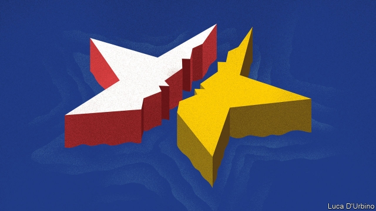

###### Transatlantic relations

# Europe and America must work to stop their relationship unravelling 

##### Worth fighting for 

 

> Mar 14th 2019 

THE ATLANTIC OCEAN is starting to look awfully wide. To Europeans the United States appears ever more remote, under a puzzling president who delights in bullying them, questions the future of the transatlantic alliance and sometimes shows more warmth towards dictators than democrats. Americans see an ageing continent that, though fine for tourists, is coming apart at the seams politically and falling behind economically—as feeble in growth as it is excessive in regulation. To Atlanticists, including this newspaper, such fatalism about the divisions between Europe and America is worrying. It is also misplaced. 

True, some gaps are glaring. America has abandoned the Paris climate accord and the nuclear deal with Iran, whereas Europe remains committed to both. Other disagreements threaten. President Donald Trump has called the European Union a “foe” on trade and is weighing up punitive tariffs on European cars. Trust has plummeted. Only one in ten Germans has confidence that Mr Trump will do the right thing in world affairs, down from nearly nine out of ten who trusted Barack Obama in 2016. Twenty years ago NATO celebrated its 50th anniversary with a three-day leaders’ summit. Fear of another bust-up with Mr Trump has relegated plans for the alliance’s 70th birthday party on April 4th to a one-day meeting of foreign ministers. 

Past intimacies are not enough to keep warm feelings going today. Europe inevitably counts for less in American eyes than it once did. The generation that formed bonds fighting side-by-side in the second world war is passing away and even the cold war is becoming a distant memory. Meanwhile, America is becoming less European. A century ago more than 80% of its foreign-born population came from Europe; now the figure is only 10%. Surging economies in Asia are tugging America’s attention away. 

Yet, through its many ups and downs, the relationship has proved resilient. Trade flows between the EU and the United States remain the world’s biggest, worth more than $3bn a day. Shared democratic values, though wobbly in places, are a force for freedom. And, underpinning everything, the alliance provides stability in the face of a variety of threats, from terrorism to an aggressive Russia, that have given the alliance a new salience. 

At the heart of this security partnership is NATO. By reaching its 70th birthday the alliance stands out as a survivor—in the past five centuries the average lifespan for collective-defence alliances is just 15 years. Even as European leaders wonder how long they can rely on America, the relationship on the ground is thriving. As our special report this week explains, this is thanks to NATO’s ability to change. No one imagined that the alliance’s Article 5 mutual-defence pledge would be invoked for the first, and so far only, time in response to a terrorist attack on America, in September 2001, or that Estonians, Latvians and Poles would be among NATO members to suffer casualties in Afghanistan. Since 2014 the allies have responded vigorously to Russia’s annexation of Ukraine. They have increased defence spending, moved multinational battlegroups into the Baltic states and Poland, set ambitious targets for military readiness and conducted their biggest exercises since the cold war. 

In America polls suggest that public opinion towards NATO has actually grown more positive since Mr Trump became president. In Congress, too, backing for the alliance is rock-solid, reflected in supportive votes and the presence at the Munich Security Conference last month of a record number of American lawmakers. Nancy Pelosi, the Democratic leader of the House of Representatives, has extended a bipartisan invitation to NATO’s secretary-general, Jens Stoltenberg, to address a joint session of Congress on the eve of the 70th anniversary. 

NATO’s success holds lessons for the transatlantic relationship as a whole. To flourish in the future, it must not just survive Mr Trump, but change every bit as boldly as it has in the past. 

First, this means building on its strengths, not undermining them: removing trade barriers rather than lapsing into tariff wars, for example. Mr Trump is right to badger his allies to live up to their defence-spending promises. But he is quite wrong to think of charging them cost-plus-50% for hosting American bases, as he is said to be contemplating. Such matters should not be treated like a “New York real-estate deal”, a former vice-president, Dick Cheney, told the current one, Mike Pence, last week. Those European bases help America project power across the world (see article). 

Second, realism should replace nostalgia. Europeans should not fool themselves that America’s next president will simply turn the clock back. Instead, to make themselves useful to America, Europeans need to become less dependent on it. For instance, in defence, they have taken only baby steps towards plugging big gaps in their capabilities and avoiding wasteful duplication. Their efforts should extend beyond the EU, whose members after Brexit will account for only 20% of NATO countries’ defence spending. 

A more capable Europe would help with the third and biggest change: adjusting to China’s rise. America’s focus will increasingly be on the rival superpower. Already China’s influence is making itself felt on the alliance, from the nuclear balance to the security implications of, say, Germany buying 5G kit from Huawei or Italy getting involved in the infrastructure projects of the Belt and Road Initiative. Yet the allies have barely begun to think seriously about all this. A new paper from the European Commission that sees China as a “systemic rival” is at least a start. 

If the allies worked hard on how best to pursue their shared interests in dealing with China, they could start to forge a new transatlantic partnership, with a division of labour designed to accommodate the pull of the Pacific. This would involve Europeans taking on more of the security burden in their own backyard in exchange for continued American protection, and co-ordination on the economic and technological challenge from China. Today the leadership to do this is lacking. But Europeans and Americans once before summoned the vision that brought decades of peace and prosperity. They need to do so again. 

-- 

 单词注释:

1.transatlantic[.trænsәt'læntik]:a. 横渡大西洋的, 大西洋彼岸的, 美国的 

2.unravel[.ʌn'rævl]:vt. 阐明, 解决, 解开 vi. 散开 

3.bully['buli]:n. 欺凌弱小者, 土霸 vt. 威胁, 恐吓, 欺负 vi. 欺负 a. 特好的, 第一流的 adv. 十分 

4.transatlantic[.trænsәt'læntik]:a. 横渡大西洋的, 大西洋彼岸的, 美国的 

5.alliance[ә'laiәns]:n. 联盟, 联合 [法] 同盟, 联盟, 联姻 

6.dictator['dikteitә]:n. 命令者, 独裁者 

7.democrat['demәkræt]:n. 民主人士, 民主主义者, 民主党党员 [经] 民主党 

8.seam[si:m]:n. 缝合线, 衔接口, 接缝, 线缝, 伤疤 vt. 缝合, 接合, 焊合, 使留下伤痕 vi. 裂开, 发生裂痕 

9.politically[]:adv. 政治上 

10.Atlanticist[-sist]:大西洋主义者 

11.fatalism['feitәlizm]:n. 宿命论 

12.misplace[mis'pleis]:vt. 放错地方 

13.Iran[i'rɑ:n]:n. 伊朗 

14.foe[fou]:n. 仇敌, 反对者, 敌人, 对手 

15.punitive['pju:nitiv]:a. 刑罚的, 惩罚性的 [法] 刑罚的, 惩罚性的, 结予惩处的 

16.tariff['tærif]:n. 关税, 关税表, 价格表, 收费表 vt. 课以关税 [计] 价目表 

17.plummete[]:[网络] 直线下降 

18.barack[bɑ:'ræk]:n. 巴拉克（男子名） 

19.obama[]:n. 奥巴马(姓) 

20.NATO['neitәj]:北大西洋公约组织, 北约组织 [经] 北大西洋公约组织 

21.relegate['religeit]:vt. 驱逐, 使降低地位, 把...归类, 把...委托给 [法] 流放, 判流放刑, 驱逐 

22.intimacy['intimәsi]:n. 亲密, 熟悉, 亲昵行为(言语) [法] 亲近的行为, 亲密, 隐私 

23.inevitably[in'evitәbli]:adv. 不可避免地 

24.les[lei]:abbr. 发射脱离系统（Launch Escape System） 

25.surge[sә:dʒ]:n. 巨涌, 汹涌, 澎湃 vi. 汹涌, 澎湃, 颠簸, 猛冲, 突然放松 vt. 使汹涌奔腾, 急放 [计] 电压尖峰 

26.tug[tʌg]:n. 用力拉, 拖曳, 苦干, 挣扎, 绳索 v. 用力拉 

27.resilient[ri'ziliәnt]:a. 弹回的, 有弹力的 [医] 回弹的, 回能的 

28.EU[]:[化] 富集铀; 浓缩铀 [医] 铕(63号元素) 

29.wobbly['wɒbli]:a. 摆动的, 不稳定的 

30.underpin[.ʌndә'pin]:vt. 从下面支承, 支撑, 支持 [经] 支撑 

31.terrorism['terәrizm]:n. 恐怖主义, 恐怖统治, 恐怖状态 [法] 胁迫, 暴政, 恐怖政治 

32.salience['seiliәns]:n. 显著, 卓越, 突出, 突起, 特征 

33.partnership['pɑ:tnәʃip]:n. 合伙, 合股, 合作关系 [经] 合伙(合作)关系, 全体合伙人 

34.lifespan['laifspæn]:n. 预期生命期限；寿命；预期使用期限 

35.pledge[pledʒ]:n. 诺言, 保证, 誓言, 抵押, 信物, 保人, 祝愿 vt. 许诺, 保证, 使发誓, 抵押, 典当, 举杯祝...健康 

36.invoke[in'vәuk]:vt. 祈求, 恳求, 实行, 援引, 引起 [计] 调用; 请求 

37.terrorist['terәrist]:n. 恐怖分子 [法] 恐怖份子, 恐怖主义 

38.Estonian[es'tәuniәn]:a. 爱沙尼亚的 n. 爱沙尼亚人, 爱沙尼亚语 

39.Latvian['lætviәn]:a. 拉脱维亚的 n. 拉脱维亚人, 拉脱维亚语 

40.casualty['kæʒjuәlti]:n. 意外事故, 伤亡, 受害者 [化] 事故 

41.Afghanistan[æf'gænistæn]:n. 阿富汗 

42.ally['ælai. ә'lai]:n. 同盟者, 同盟国, 助手 vt. 使联盟, 使联合, 使有关系 vi. 结盟 

43.vigorously[]:adv. 朝气蓬勃, 精力充沛, 壮健, 茁壮, 健壮, 强有力 

44.annexation[ænek'seiʃәn]:n. 合并, 附加, 附加物 [法] 兼并, 侵吞, 附加物 

45.ukraine[ju(:)'krein]:n. 乌克兰（原苏联一加盟共和国, 现已独立） 

46.multinational[.mʌlti'næʃәnl]:a. 多国的, 跨国公司的 n. 跨国公司 

47.battlegroup[]:na. 战斗群 [网络] 战场；战斗大队；战斗部队 

48.Baltic['bɒ:ltik]:a. 波罗的海的 

49.Poland['pәulәnd]:n. 波兰 

50.ambitious[æm'biʃәs]:a. 有野心的, 抱负不凡的, 雄心勃勃的 

51.readiness['redinis]:n. 预备, 准备, 敏捷 

52.supportive[sә'pɔ:tiv]:a. 支撑, 支承, 资助, 赞助, 支援, 经受, 忍受, 扶养, 证实, 鼓励, 维持, 伴奏 

53.Munich['mju:nik]:n. 慕尼黑 

54.lawmaker[lɒ:'meikә]:n. 立法者 

55.nancy['nænsi]:n. 女性化的男人 a. 女性化的, 同性恋的 

56.pelosi[]:佩洛西 

57.bipartisan[bai,pɑ:ti'zæn]:a. 两党连立的 

58.jen[]:n. 珍（女子名） 

59.Stoltenberg[]:n. (Stoltenberg)人名；(瑞典)斯托尔滕贝里；(挪)斯托尔滕贝格；(德)施托尔滕贝格 

60.boldly['bәuldli]:adv. 大胆地, 显眼地 

61.undermine[.ʌndә'main]:vt. 在...下面挖, 渐渐破坏, 暗地里破坏 [法] 暗中破坏, 以阴谋中伤伤害 

62.lapse[læps]:n. 过失, 流逝, 失效 vi. 犯错, 堕落, 减退, 消失, 流逝 vt. 使失效 

63.badger['bædʒә]:n. 獾, 獾皮毛 vt. 纠缠 

64.contemplate['kɒntempleit]:vt. 注视, 沉思, 盘算 vi. 冥思苦想 

65.york[jɔ:k]:n. 约克郡；约克王朝 

66.dick[dik]:n. 家伙, 词典, 誓言(书) [医] 二氯乙胂(毒气) 

67.Cheney['tʃini]:n. 切尼（姓氏） 

68.mike[maik]:vi. 偷懒, 游手好闲 n. 休息, 游手好闲, 扩音器, 话筒 

69.realism['riәlizm]:n. 写实主义, 现实, 实在论 [法] 现实主义 

70.nostalgia[nɒs'tældʒiә]:n. 乡愁, 向往过去, 怀旧之情 [医] 怀乡病 

71.capability[.keipә'biliti]:n. 能力, 性能, 约束力 [化] 能力 

72.wasteful['weistful]:a. 浪费的, 不经济的 

73.duplication[.dju:pli'keiʃәn]:n. 副本, 复制 [医] 重迭, 双折, 复制 

74.Brexit[]:[网络] 英国退出欧盟 

75.superpower[.sju:pә'pauә]:n. 超级强权, 超级大国 [经] 超级大国 

76.kit[kit]:n. 装备, 工具箱, 成套工具 [计] 成套部件; 成套零件 

77.huawei[]: 华为 

78.infrastructure['infrәstrʌktʃә]:n. 基础结构, 基础设施 [经] 基础设施 

79.systemic[si'stemik]:a. 系统的, 体系的, 全身的 [医] 系统的, 全身的 

80.forge[fɒ:dʒ]:n. 熔炉, 铁工厂 vt. 打制, 锻造, 伪造 vi. 锻造, 伪造 

81.backyard['bæk'jɑ:d]:n. 后院, 后庭 

82.technological[.teknә'lɒdʒikl]:a. 技术的 [经] 工艺的, 技术的 

83.summon['sʌmәn]:vt. 召唤, 召集, 号召, 振奋, 唤起, 鼓起 [经] 传唤, 传讯 

