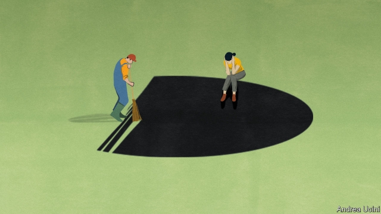

###### Unprofessional help

# Most mental-health problems are untreated. Trained laypeople can help 

##### Talk therapy is cheap and surprisingly effective 

 

> Mar 14th 2019 

IN ANY GIVEN year one person in six is afflicted by a mental illness. Most cases involve mild-to-moderate depression or anxiety. Some sufferers recover on their own. For many, however, the condition is left untreated and may become chronic or severe. In the past social stigma meant that people kept their pain to themselves. The stigma is now melting away. Yet in rich Western countries two-thirds of people with a mental-health problem do not receive any treatment for it. In poor countries hardly any do. And almost everywhere, psychiatrists and clinical psychologists are scarce. Often they are the only people whom states or insurers will pay to treat mental illness, so those who seek help must wait months for it. The cost in human misery is huge. Mental-health care needs to change. 

In particular, the psychiatric profession’s over-tight grip should be challenged. Talk therapy, which the World Health Organisation recommends as a first line of treatment for mild-to-moderate depression and anxiety, can be delegated to non-specialists—a concept known as “task-shifting” (see article). 

The experiences of two very different places—England and Zimbabwe—demonstrate that this approach can work on a national scale anywhere. England blazed a trail by training a new cadre of talk-therapy practitioners using a one-year boot camp. Graduates of the scheme typically provide cognitive-behavioural therapy (CBT). 

This involves teaching people to spot the real-world situations that set off their negative thoughts, fears and anxieties, such as awkward social gatherings or meeting the boss. It then offers concrete steps for dealing with them, such as going on a walk with a friend or reminding yourself that you got a bonus so the boss probably doesn’t think you are useless. Half of those who complete two or more therapy sessions for depression or anxiety recover (though some would have anyway). Zimbabwe has been training elderly women to provide something like CBT on “friendship benches” set up in courtyards. 

Both programmes are inspiring imitators. Scotland, whose health service is run independently from England’s, has a similar scheme. Canada, Norway and New Zealand are also using ideas from England. Zimbabwe’s approach has been imitated not only in other African countries but even in New York. 

The benefits can be enormous. Even mild forms of distress affect work, child-rearing and physical health. Social anxiety may keep someone at home. A depressed mother may struggle to care for and play with her child in the early months so crucial for brain development. In Britain about 11% of workers’ sick days are because of mental-health problems. Those who struggle into work despite such problems are, on average, less productive. Add in disability payments to those who drop out completely, and the annual cost in Europe is nearly 3% of GDP, by one estimate. 

Yet too little use is made of cheap talk-therapy. Critics complain that standardised sessions can never fit the unique circumstances of each person’s distress. But the alternative is usually no care at all, or advice from charity helplines. Psychiatrists, as eager as any other guild to protect their turf, often warn that therapists who have not studied psychiatry may provide poor-quality care. In fact, plenty of evidence shows that, with proper supervision, trained amateurs do a good job. The old notion that doctors must do everything is not only impractical; it is also disproved by experience. In many places, nurses do tasks once reserved for doctors, including anaesthesia, endoscopy and emergency care. Community health workers in poor countries (sometimes known as “barefoot doctors”) treat malaria and diagnose pneumonia. 

The same kind of approach can work for mental health. Indeed, with so many more sufferers than can plausibly see a specialist, cheap talk with trained laypeople is the only practical way to bring relief—and turn millions of lives around. 

-- 

 单词注释:

1.unprofessional['ʌnprә'feʃәnl]:a. 违反行业习惯的, 违反行业道德的, 不合行规的, 非职业性的, 外行的 

2.untreated['ʌn'tri:tid]:[化] 未经处理的 

3.laypeople['leɪpi:pl]:n. 外行, 非专业人员, 未担任神职的一般信徒 

4.therapy['θerәpi]:n. 治疗 [医] 疗法, 治疗 

5.afflict[ә'flikt]:vt. 使苦恼, 折磨 

6.sufferer['sʌfәrә]:n. 受难者, 被害者, 患者 [法] 受害者, 受难者 

7.chronic['krɒnik]:a. 慢性的, 习惯性的 n. 慢性病患者 

8.stigma['stigmә]:n. 耻辱, 污名, 烙印 [医] 柱头; 小孔, 眼点; 气孔; 小斑; 特征 

9.psychiatrist[sai'kaiәtrist]:n. 精神病医生, 精神病学家 [医] 精神病学家 

10.clinical['klinikәl]:a. 临床的, 门诊部的 [医] 临床的, 临证的 

11.psychologist[sai'kɒlәdʒist]:n. 心理学家 [医] 心理学家 

12.insurer[in'ʃuәrә]:n. 保险公司 [法] 保险人, 承保人, 保险公司 

13.misery['mizәri]:n. 痛苦, 悲惨, 不幸, 穷困 

14.psychiatric[saiki'ætrik; (?@) si-]:a. 精神病学的, 医精神病的 [医] 精神病学的 

15.organisation[,ɔ: ^әnaizeiʃən; - ni'z-]:n. 组织, 团体, 体制, 编制 

16.cadre['kædri.'kɑ:dә]:n. 框架, 干部 [经] 干部 

17.practitioner[præk'tiʃәnә]:n. 从业者, 开业者 [医] 行医者, 医师 

18.typically['tipikәli]:adv. 代表性地；作为特色地 

19.Cbt[]:[经] 芝加哥交易所 

20.gathering['gæðәriŋ]:n. 聚集, 集中, 采集 [化] 富集 

21.Zimbabwe[zim'bɑ:bwei]:n. 津巴布韦 

22.imitator['imi,teitә]:n. 模仿者, 临摹者, 仿造者, 伪造者 [计] 模拟, 模拟程序, 模拟器 

23.independently[.indi'pendәntli]:adv. 独立地, 自立地 

24.Norway['nɒ:wei]:n. 挪威 

25.zealand['zi:lәnd]:n. 西兰岛（丹麦最大的岛） 

26.york[jɔ:k]:n. 约克郡；约克王朝 

27.les[lei]:abbr. 发射脱离系统（Launch Escape System） 

28.standardise[]:vt. 使与标准比较, 用标准校验, 使符合标准, 使统一, 使标准化 

29.helpline[ˈhelplaɪn]:n. 热线服务电话 

30.guild[gild]:n. 团体, 协会, 行业协会 [经] 同业公会 

31.turf[tә:f]:n. 草皮, 泥炭, 跑马场 vt. 覆草皮于 

32.therapist['θerәpist]:n. 治疗学家 [医] 治疗学家 

33.psychiatry[sai'kaiәtri]:n. 精神病学, 精神病治疗 [医] 精神病学 

34.supervision[.sju:pә'viʒәn]:n. 监督, 管理 [经] 监督, 管理 

35.impractical[im'præktikәl]:a. 不切实际的, 不能实行的, 不现实的, 不合情理的 

36.disprove[.dis'pru:v]:vt. 证明...是不对的, 提出...的反证, 反驳 [法] 证明...不成立, 反驳, 驳斥 

37.anaesthesia[.ænis'θi:zjә]:n. 麻木, 麻醉 [医] 感觉缺失, 麻木, 麻醉[法] 

38.endoscopy[en'dɔskәpi]:[医] 内窥镜检查 

39.barefoot['bєәfut]:a. 赤脚的 

40.malaria[mә'lєәriә]:n. 疟疾, 瘴气 [医] 疟[疾] 

41.diagnose['daiәgnәuz]:v. 诊断 

42.pneumonia[nju:'mәunjә]:n. 肺炎 [医] 肺炎 

43.plausibly[ˌplɔ:zəblɪ]:adv. 似真地 

