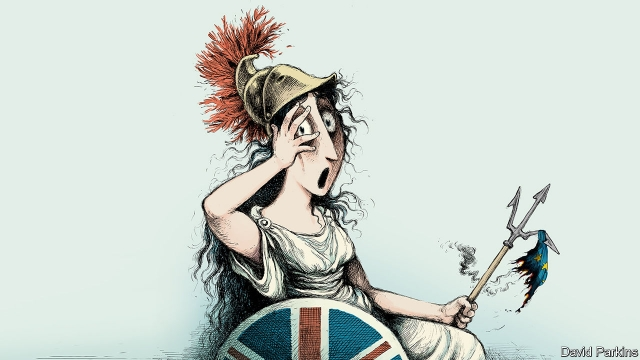

###### A country in chaos

# Oh **UK! What next for Brexit? 

##### Britain’s political crisis has reached new depths. Parliament must seize the initiative 

 

> Mar 14th 2019 

WHEN HISTORIANS come to write the tale of Britain’s attempts to leave the European Union, this week may be seen as the moment the country finally grasped the mess it was in. In the campaign, Leavers had promised voters that Brexit would be easy because Britain “holds all the cards”. This week Parliament was so scornful of the exit deal that Theresa May had spent two years negotiating and renegotiating in Brussels that MPs threw it out for a second time, by 149 votes—the fourth-biggest government defeat in modern parliamentary history. The next day MPs rejected what had once been her back-up plan of simply walking out without a deal. The prime minister has lost control. On Wednesday four cabinet ministers failed to back her in a crucial vote. Both main parties, long divided over Brexit, are seeing their factions splintering into ever-angrier sub-factions. And all this just two weeks before exit day. 

Even by the chaotic standards of the three years since the referendum, the country is lost (see article). Mrs May boasted this week of “send[ing] a message to the whole world about the sort of country the United Kingdom will be”. She is not wrong: it is a laughing-stock. An unflappable place supposedly built on compromise and a stiff upper lip is consumed by accusations of treachery and betrayal. Yet the demolition of her plan offers Britain a chance to rethink its misguided approach to leaving the EU. Mrs May has made the worst of a bad job. This week’s chaos gives the country a shot at coming up with something better. 

The immediate consequence of the rebellion in Westminster is that Brexit must be delayed. As we went to press, Parliament was to vote for an extension of the March 29th deadline. For its own sake the EU should agree. A no-deal Brexit would hurt Britain grievously, but it would also hurt the EU—and Ireland as grievously as Britain. 

Mrs May’s plan is to hold yet another vote on her deal and to cudgel Brexiteers into supporting it by threatening them with a long extension that she says risks the cancellation of Brexit altogether. At the same time she will twist the arms of moderates by pointing out that a no-deal Brexit could still happen, because avoiding it depends on the agreement of the EU, which is losing patience. It is a desperate tactic from a prime minister who has lost her authority. It forces MPs to choose between options they find wretched when they are convinced that better alternatives are available. Even if it succeeds, it would deprive Britain of the stable, truly consenting majority that would serve as the foundation for the daunting series of votes needed to enact Brexit and for the even harder talks on the future relationship with the EU. 

To overcome the impasse created by today’s divisions, Britain needs a long extension. The question is how to use it to forge that stable, consenting majority in Parliament and the country. 

An increasingly popular answer is: get rid of Mrs May. The prime minister’s deal has flopped and her authority is shot. A growing number of Tories believe that a new leader with a new mandate could break the logjam (see article). Yet there is a high risk that Conservative Party members would install a replacement who takes the country towards an ultra-hard Brexit. What’s more, replacing Mrs May would do little to solve the riddle of how to put together a deal. The parties are fundamentally split. To believe that a new tenant in Downing Street could put them back together again and engineer a majority is to believe the Brexiteers’ fantasy that theirs is a brilliant project that is merely being badly executed. 

Calls for a general election are equally misguided. The country is as divided as the parties. Britain could go through its fourth poll in as many years only to end up where it started. Tory MPs might fall into line if they had been elected on a manifesto promising to enact the deal. But would the Conservatives really go into an election based on Mrs May’s scheme, which has twice been given a drubbing by MPs and was described this week even by one supportive Tory MP as “the best turd that we have”? It does not have the ring of a successful campaign. 

To break the logjam, Mrs May needs to do two things. The first is to consult Parliament, in a series of indicative votes that will reveal what form of Brexit can command a majority. The second is to call a referendum to make that choice legitimate. Today every faction sticks to its red lines, claiming to be speaking for the people. Only this combination can put those arguments to rest. 

Take these steps in turn. Despite the gridlock, the outlines of a parliamentary compromise are visible. Labour wants permanent membership of the EU’s customs union, which is a bit closer to the EU than Mrs May’s deal. Alternatively, MPs may favour a Norway-style set-up—which this newspaper has argued for and would keep Britain in the single market. The EU is open to both. Only if Mrs May cannot establish a consensus should she return to her own much-criticised plan. 

Getting votes for these or any other approach would require thinking beyond party lines. That does not come naturally in Britain’s adversarial, majoritarian policies. But the whipping system is breaking down. Party structures are fraying. Breakaway groups and parties-within-parties are forming on both sides of the Commons, and across it. Offering MPs free votes could foster cross-party support for a new approach. 

The second step is a confirmatory referendum. Brexit requires Britain to trade off going its own way with maintaining profitable ties with the EU. Any new Brexit plan that Parliament concocts will inevitably demand compromises that disappoint many, perhaps most, voters. Mrs May and other critics argue that holding another referendum would be undemocratic (never mind that Mrs May is prepared to ask MPs to vote on her deal a third or even fourth time). But the original referendum campaign utterly failed to capture the complexities of Brexit. The truly undemocratic course would be to deny voters the chance to vouch that, yes, they are content with how it has turned out. 

And so any deal that Parliament approves must be put to the public for a final say. It will be decried by hardline Brexiteers as treasonous and by hardline Remainers as an act of self-harm. Forget them. It is for the public to decide whether they are in favour of the new relationship with the EU—or whether, on reflection, they would rather stick with the one they already have. 

-- 

 单词注释:

1.chao[]:n. 钞（货币） 

2.historian[hi'stɒ:riәn]:n. 历史学家, 记事者 

3.leaver['li:vә]:n. 离开者（常指学校毕业生） 

4.voter['vәutә]:n. 选民, 投票人 [法] 选民, 选举人, 投票人 

5.Brexit[]:[网络] 英国退出欧盟 

6.scornful['skɒ:nful]:a. 轻蔑的 

7.theresa[ti'ri:zә]:n. 特丽萨（女子名） 

8.renegotiate[.ri:ni'gәuʃieit]:vt. 重新谈判 

9.Brussel[]:n. 布鲁塞尔（比利时首都） 

10.MP[]:国会议员, 下院议员 [计] 宏处理程序, 维护程序, 线性规划, 微程序, 多处理器 

11.parliamentary[.pɑ:lә'mentәri]:a. 国会的, 议会的, 议会制度的 

12.faction['fækʃәn]:n. 小派系, 内讧 [法] 宗派, 派别, 小集团 

13.splinter['splintә]:n. 碎片, 尖片, 分裂出来的小派别, 微小的东西 v. 使分裂, (使)破裂 

14.chaotic[kei'ɒtik]:a. 混乱的, 无秩序的 [法] 混乱的, 混沌的 

15.referendum[.refә'rendәm]:n. （就重大政治或社会问题进行的）全民公决，全民投票 

16.Mr['mistә(r)]:先生 [计] 存储器回收程序, 多重请求 

17.unflappable[.ʌn'flæpәbl]:a. 不慌张的, 镇定的 

18.supposedly[sә'pәuzidli]:adv. 想象上, 看上去像, 被认为是, 恐怕, 按照推测 

19.accusation[ækju:'zeiʃәn]:n. 控告, 指控, 指责 [法] 控告, 起诉, 告发 

20.treachery['tretʃәri]:n. 背叛, 变节 [法] 背叛, 变节, 背信弃义 

21.betrayal[bi'treiәl]:n. 背叛, 辜负 [法] 背叛, 通敌, 背信 

22.demolition[.demә'liʃәn]:n. 破坏, 毁坏, 撤销 [经] 拆毁(除,破坏) 

23.rethink[ri:'θiŋk]:v. 再想, 重想 

24.misguide[mis'gaid]:vt. 误导 

25.EU[]:[化] 富集铀; 浓缩铀 [医] 铕(63号元素) 

26.Westminster['westminstә]:n. 威斯敏斯特 

27.grievously[ˈgri:vəslɪ]:adv. 严重地 

28.cudgel['kʌdʒәl]:n. 棍棒 vt. 用棍棒打 

29.Brexiteers[]:支持英国退欧的人（Brexiteer的复数） 

30.cancellation[kænsә'leiʃәn]:n. 取消, 作废, 注销戳 [经] 注销, 取消, 保险单的注销 

31.tactic['tæktik]:n. 一项战术, 一条策略 a. 战术的, 顺序的, 排列的 

32.wretched['retʃid]:a. 可怜的, 不幸的, 卑鄙的 

33.deprive[di'praiv]:vt. 剥夺, 使丧失 [法] 剥夺, 剥夺, 夺去 

34.daunt[dɒ:nt]:vt. 威吓, 难倒, 使气馁 

35.sery[]:n. (Sery)人名；(俄)谢雷；(科特)塞里 

36.enact[i'nækt]:vt. 制定法律, 扮演, 颁布 [法] 法令, 法规, 条例 

37.impasse['impɑ:s]:n. 难局, 僵局, 死路, 死胡同 

38.forge[fɒ:dʒ]:n. 熔炉, 铁工厂 vt. 打制, 锻造, 伪造 vi. 锻造, 伪造 

39.flop[flɒp]:n. 砰然落下, 拍击声, 失败 vi. 笨重地摔, 猛落 vt. 笨拙地抛下 adv. 噗通 

40.Tory['tɒ:ri]:n. 托利党党员, 保守党员, 亲英分子 a. 保守分子的 

41.mandate['mændeit]:n. 命令, 指令, 要求 vt. 委任统治 

42.logjam['lɒgdʒæm]:n. 拥挤, 行不通, 为许多圆木材所阻 

43.replacement[ri'pleismәnt]:n. 归还, 更换, 代替者 [医] 复位, 置换 

44.fundamentally[fʌndә'mentәli]:adv. 基础, 首要, 主要, 十分重要, 基本, 根本, 原始, 基频, 基音, 基谐波 

45.equally['i:kwәli]:adv. 相等地, 同样地, 平等地 

46.Tory['tɒ:ri]:n. 托利党党员, 保守党员, 亲英分子 a. 保守分子的 

47.manifesto[.mæni'festәu]:n. 宣言, 声明 

48.drubbing['drʌbiŋ]:n. 殴打, 痛击 

49.supportive[sә'pɔ:tiv]:a. 支撑, 支承, 资助, 赞助, 支援, 经受, 忍受, 扶养, 证实, 鼓励, 维持, 伴奏 

50.MP[]:国会议员, 下院议员 [计] 宏处理程序, 维护程序, 线性规划, 微程序, 多处理器 

51.turd[tә:d]:n. 粪 

52.indicative[in'dikәtiv]:a. 指示的, 象征的, 表示...的 [经] 指标的 

53.legitimate[li'dʒitimәt]:a. 合法的, 正当的, 婚生的 vt. 认为正当, 立为嫡嗣, 使合法 

54.gridlock[ˈgrɪdlɒk]:n. 交通全面大堵塞; 僵局 v. （交通等）堵塞 

55.membership['membәʃip]:n. 会员的资格, 全体会员, 会员数目 [法] 会员资格, 成员资格, 会籍 

56.alternatively[ɒ:l'tә:nәtivli]:adv. 非此即彼 

57.cannot['kænɒt]:aux. 无法, 不能 

58.adversarial[,ædvә'seәriәl]:a. 敌手的,对手的,对抗(性)的 

59.majoritarian[mә.dʒɒri'tєәriәn]:n. 多数主义者 

60.fray[frei]:n. 磨损, 打架, 争论 vt. 使磨损 vi. 被磨损 

61.breakaway[]:n. 脱离, (美)(非正式)一碰就散开/脱落的, 分裂 

62.foster['fɒstә]:a. 收养的, 养育的 vt. 养育, 抚育, 培养, 鼓励, 抱(希望) 

63.confirmatory[kәn'f\\:mәtәri]:起确定作用的, 坚信礼的, 证实的 [计] 证实 

64.concoct[kәn'kɒkt]:vt. 调合, 捏造, 编造 [建] 调制, 混合 

65.inevitably[in'evitәbli]:adv. 不可避免地 

66.undemocratic['ʌndemә'krætik]:a. 非民主的, 不民主的 

67.utterly['ʌtәli]:adv. 完全地, 全然, 绝对 

68.complexity[kәm'pleksiti]:n. 复杂, 复杂性, 复杂的事物 

69.vouch[vautʃ]:vi. 担保, 保证, 证明, 确定地说 vt. 担保, 证明, 断定, 传唤...出庭作证 

70.decry[di'krai]:vt. 反对, 责难, 诽谤, 诋毁 

71.hardline[]:n. 强硬路线 [电] 硬线 

72.treasonous[]:a. 叛逆的, 谋反的, 犯叛国罪的, 涉及叛国罪的 

73.remainers[]:[网络] 剩余物 

