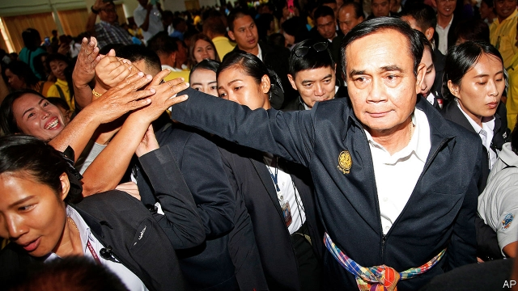

###### General decline

# Thailand’s bogus election 

##### The vote does not mark a return to democracy, but a new phase in military misrule 

 

> Mar 14th 2019 

IT SHOULD BE a triumphant return. On March 24th Thai voters will elect a new parliament, putting an end to five years of direct military rule (see article). But the MPs they pick will have nowhere to meet. King Vajiralongkorn has appropriated the old parliament building, which stands on royal property, for some unspecified purpose that, under the country’s harsh lèse-majesté laws, no one dares question. The military junta has yet to finish building a new parliament house. 

That the newly chosen representatives of the Thai people will be homeless stands as a symbol for how hollow the election will be, and how contemptuous the generals are of democracy, even as they claim to be restoring it. They have spent the past five years methodically rigging the system to ensure that the will of voters is thwarted, or at least fiercely circumscribed. In particular, they want to foil Thaksin Shinawatra, a former prime minister, now in exile, whose supporters have won every election since 2001. The result will be a travesty of democracy in a country that was once an inspiration for South-East Asia. It is bad news not only for the 69m Thais but also for the entire region. 

Since ousting a government loyal to Mr Thaksin in a coup in 2014, the generals have imposed an interim constitution that grants them broad powers to quash “any act which undermines public peace and order or national security, the monarchy, national economics or administration of state affairs”. They have carted off critical journalists and awkward politicians to re-education camps. Simply sharing or “liking” commentary that the regime deems subversive has landed hapless netizens in prison. Even the most veiled criticism of the monarchy—posting a BBC profile of the king, say, or making a snide remark about a mythical medieval princess—is considered a crime. And until December, all political gatherings involving more than five people were banned. 

The junta’s main weapon, however, is the new constitution, which it pushed through in a referendum in 2016 after banning critics from campaigning against it. Even so, the generals could persuade only a third of eligible voters to endorse the document (barely half of them turned out to cast their ballot). The constitution gives the junta the power to appoint all 250 members of the upper house. And it strengthens the proportional element of the voting system for the lower house, at the expense of Mr Thaksin’s main political vehicle, the Pheu Thai party. It also says the prime minister does not have to be an MP, paving the way for Prayuth Chan-ocha, the junta leader who does not belong to any party, to remain in power. And it allows the general to impose a “20-year plan” to which all future governments will have to stick. 

The manipulation has continued throughout the campaign. Politicians and parties at odds with the junta have found themselves in trouble with the courts or the Election Commission. Another party loyal to Mr Thaksin, Thai Raksa Chart, was banned outright. The army chief has issued a writ for libel against the head of another party who, after being followed by soldiers wherever he went, complained of the shameful waste of taxpayers’ money. Campaigning on social media is restricted to anodyne posts about the parties’ policies and candidates’ biographies. Politicians fear that minor infringements of such rules will be used as an excuse for further disqualifications. 

But all these strictures do not seem to bind Mr Prayuth and his allies. Before political gatherings were allowed again, he paraded around the country addressing huge crowds in sports stadiums. (These were not political gatherings—perish the thought—but “mobile cabinet meetings”.) The Election Commission has ruled that he can campaign for a pro-military party, which has named him as its candidate for prime minister, even though government officials like him are supposed to be neutral in the election. 

All this is intended to ensure that Mr Prayuth remains prime minister, despite his inertia and ineptitude. Under him, economic growth has slowed. Household debt has risen. According to Credit Suisse, a bank, Thailand has become the world’s most unequal country. The richest 1% of its people own more than two-thirds of the country’s wealth. Corruption thrives. The deputy prime minister explained away a big collection of luxury watches last year, saying they were on loan from a conveniently deceased friend. 

Worse is to come. The working-age population is shrinking as Thailand ages. Manufacturers are caught between low-wage countries, such as Vietnam, and China, with its vast industrial base. China also poses a problem diplomatically, in its attempts to enforce its territorial claims in the South China Sea, and more broadly to impose its will on its smaller, weaker neighbours. 

Thailand’s civilian politicians have lots of ideas about how to tackle these problems. Future Forward, a new party which appeals to younger Thais, wants to end business monopolies, decentralise government and extend the welfare state. Mr Thaksin’s allies have made endless pledges to help the rural poor. It is Mr Prayuth who, despite wielding almost unfettered power, seems lost for inspiration. The junta has promised to revive the economy by improving infrastructure, but few of its plans have come to fruition. The only thing the generals have to show for five years in office is a heavy-handed scheme to retain power. 

That is a shame not just for Thailand, but also for the region, which has lost a role model. Thailand was the only country in South-East Asia to avoid being colonised, and the first to become a democracy, in 1932. It has been a staunch ally of America since the second world war. It industrialised faster than the other big countries in the region, too. Many of its development schemes, such as a health-care programme for the poor introduced by Mr Thaksin almost 20 years ago, have been widely imitated. 

Much of South-East Asia is plagued by the same problems as Thailand: slowing growth, ageing populations, wobbly democracies, inadequate social safety-nets, endemic corruption and the ever-present shadow of China. Thailand now offers a cautionary tale of how not to grapple with such challenges. Thais deserve much better—starting with a genuine election. 

-- 

 单词注释:

1.bogus['bәugәs]:a. 假的, 伪造的 [经] 伪的, 伪造的 

2.misrule[mis'ru:l]:vt. 施暴政 n. 暴政 

3.triumphant[trai'ʌmfәnt]:a. 得胜的, 得意洋洋的 

4.Thai[tai]:n. 泰国人, 泰语 

5.voter['vәutә]:n. 选民, 投票人 [法] 选民, 选举人, 投票人 

6.MP[]:国会议员, 下院议员 [计] 宏处理程序, 维护程序, 线性规划, 微程序, 多处理器 

7.Vajiralongkorn[]:[网络] 王储哇集拉隆功；哇集拉隆功王储；玛哈·哇集拉隆功王储 

8.unspecified['ʌn'spesifaid]:a. 未特别指出的, 未特别提到的 

9.junta['dʒʌntә]:n. 以武力政变上台的(军)政府, 私党, 阴谋小集团, 政务会 

10.homeless['hәumlis]:a. 无家的, 无养主的 

11.contemptuous[kәn'temptʃuәs]:a. 轻蔑的, 鄙视的, 瞧不起人的 

12.methodically[mi'θɒdikәli]:adv. 有系统地, 有方法地 

13.rig[rig]:n. 装备, 帆装 vt. 装配, 装扮, 给船装帆, 垄断, 操纵 

14.thwart[θwɒ:t]:a. 横放的 vt. 反对, 阻挠, 横过 prep. 横过 adv. 横过 

15.fiercely['fiәsli]:adv. 猛烈地, 厉害地 

16.circumscribe['sә:kәmskraib]:vt. 在...周围画线, 限制 

17.foil[fɒil]:n. 箔, 烘托, 衬托 vt. 贴箔于, 衬托, 阻止, 挡开, 挫败 

18.thaksin[]: 塔克辛; 塔辛（人名） 

19.shinawatra[]:[网络] 西那瓦；那越；钦那瓦 

20.exile['eksail]:n. 放逐, 流放, 被放逐者 vt. 放逐, 流放, 使背井离乡 

21.supporter[sә'pɒ:tә]:n. 支持者, 后盾, 迫随者, 护身织物 [法] 支持者, 赡养者, 抚养者 

22.travesty['trævisti]:n. 拙劣的模仿作品, 嘲弄, 滑稽模仿 vt. 滑稽地模仿, 歪曲 

23.inspiration[.inspә'reiʃәn]:n. 灵感, 鼓舞人心的人或物, 妙计, 吸气 [医] 吸[气] 

24.Thai[tai]:n. 泰国人, 泰语 

25.oust[aust]:vt. 逐出, 罢黜, 剥夺, 驱逐 [法] 驱逐, 剥夺, 免职 

26.coup['ku:]:n. 砰然的一击, 妙计, 出乎意料的行动, 政变 [医] 发作, 中, 击 

27.interim['intәrim]:a. 暂时的, 临时的, 间歇的 n. 过渡时期 

28.quash[kwɒʃ]:vt. 撤销, 平息, 镇压 [法] 撤销, 废止, 宣布无效 

29.undermine[.ʌndә'main]:vt. 在...下面挖, 渐渐破坏, 暗地里破坏 [法] 暗中破坏, 以阴谋中伤伤害 

30.monarchy['mɒnәki]:n. 君主政体, 君主国, 君主政治 [法] 君主政体, 君主制度, 君主国 

31.commentary['kɒmәntәri]:n. 注释, 评论, 说明 [法] 注释, 评注, 评论 

32.regime[rei'ʒi:m]:n. 政权, 当权期间, 政体, 社会制度, 体制, 情态 [医] 制度, 生活制度 

33.deem[di:m]:v. 认为, 相信 

34.subversive[sәb'vә:siv]:a. 从事颠覆的, 破坏性的 n. 破坏分子, 颠覆分子 

35.hapless['hæplis]:a. 倒霉的, 不幸的 

36.netizens[nə'taɪzənz]:abbr. Internet citizens 网络公民 

37.BBC[]:英国广播公司 

38.profile['prәufail]:n. 侧面, 轮廓, 传略 vt. 描绘...轮廓, 写...的传略 [计] 提问档; 剖面图法; 剖面法 

39.snide[snaid]:n. 赝品, 假珠宝 a. 伪造的, 不诚实的, 卑鄙的, 险恶的 

40.mythical['miθikә l]:a. 神话的, 存在于神话中的, 神话式的, 不真实的, 虚构的, 幻想出来的 

41.medieval[.medi'i:vl]:a. 中古的, 中世纪的 

42.gathering['gæðәriŋ]:n. 聚集, 集中, 采集 [化] 富集 

43.referendum[.refә'rendәm]:n. （就重大政治或社会问题进行的）全民公决，全民投票 

44.eligible['elidʒәbl]:a. 有资格当选的, 合格的 n. 有资格者, 合格者, 适任者 

45.endorse[in'dɒ:s]:vt. 支持, 赞同, 背书于, 签署 [经] 赞成, 背书 

46.ballot['bælәt]:n. 投票, 投票用纸, 抽签 vi. 投票, 抽签 vt. 投票选出, 拉选票 

47.MP[]:国会议员, 下院议员 [计] 宏处理程序, 维护程序, 线性规划, 微程序, 多处理器 

48.Prayuth[]:[网络] 巴狱 

49.manipulation[mә.nipju'leiʃәn]:n. 操作, 处理 [化] (用手)操作; 使用 

50.odds[ɒdz]:n. 可能性, 几率, 机会, 胜算, 不平等 

51.outright['autrait]:a. 率直的, 完全的, 总共的, 直率的 adv. 完全地, 率直地, 立刻地, 一直向前 

52.writ[rit]:n. 令状, 文书, 文件, 书面命令 [经] 法院命令 

53.libel['laibәl]:n. 以文字损害名誉, 诽谤罪, 侮辱 v. 诽谤, 中伤, 损害名誉 

54.shameful['ʃeimful]:a. 可耻的, 丢脸的, 不道德的, 淫猥的, 猥亵的, 不体面的 

55.anodyne['ænәudain]:n. 止痛药, 镇痛剂 a. 止痛的 

56.infringement[in'frindʒmәnt]:n. 违犯, 侵害, 违反, 侵犯 [计] 违反, 侵犯, 侵权, 侵犯 

57.disqualification[dis,kwɔlifi'keiʃәn]:n. 不适合, 剥夺资格, 不合格, 无资格 [法] 无资格, 不合格, 取消资格 

58.stricture['striktʃә]:n. 狭窄, 指责, 束缚 [医] 狭窄 

59.ally['ælai. ә'lai]:n. 同盟者, 同盟国, 助手 vt. 使联盟, 使联合, 使有关系 vi. 结盟 

60.inertia[i'nә:ʃә]:n. 惯性, 惰性, 迟钝 [化] 惯性 

61.ineptitude[in'eptitju:d]:n. 不适当, 愚笨, 愚昧言行 [法] 不称职, 无能, 不适当 

62.Suisse[swi:s]:<法> = Switzerland 

63.Thailand['tailәnd]:n. 泰国 

64.unequal[.ʌn'i:kwәl]:a. 不相等的, 不规则的, 不能胜任的 [经] 不平均的, 不等的 

65.corruption[kә'rʌpʃәn]:n. 腐败, 堕落, 贪污 [计] 论误 

66.conveniently[]:a. 方便, 合宜 

67.decease[di'si:s]:n. 死亡 vi. 死亡 

68.Vietnam[.vjet'næm]:n. 越南 

69.diplomatically[,diplә'mætikәli]:adv. 在外交上, 靠外交途径, 凭外交手腕 

70.territorial[.teri'tɒ:riәl]:a. 领土的, 土地的, 地方的, 区域性的 n. 本土自卫队队员 

71.broadly['brɒ:dli]:adv. 宽广地, 明白地, 无礼貌地 

72.tackle['tækl]:n. 工具, 复滑车, 滑车, 装备, 扭倒 vt. 固定, 处理, 抓住 vi. 扭倒 

73.monopoly[mә'nɒpәli]:n. 垄断, 专卖权, 独占事业 [经] 垄断, 专利品, 垄断(权)独占 

74.decentralise[,di:'sentrәlaiz]:vi.vt. 分散, 以分权的方法进行的变革, 分权 

75.pledge[pledʒ]:n. 诺言, 保证, 誓言, 抵押, 信物, 保人, 祝愿 vt. 许诺, 保证, 使发誓, 抵押, 典当, 举杯祝...健康 

76.wield[wi:ld]:vt. 挥舞, 运用 

77.unfetter[.ʌn'fetә]:vt. 给...解开脚链, 释放, 使自由 [法] 除去...脚镣, 释放 

78.revive[ri'vaiv]:vt. 使苏醒, 使复兴, 使振奋, 回想起, 重播 vi. 苏醒, 复活, 复兴, 恢复精神 

79.infrastructure['infrәstrʌktʃә]:n. 基础结构, 基础设施 [经] 基础设施 

80.fruition[fru:'iʃәn]:n. 成就, 实现, 结果实 

81.colonise['kɔlәnaiz]:vi. 开拓殖民地；移民于殖民地 

82.staunch[stɒ:ntʃ]:vt. 止住, 止血 a. 坚固的, 坚强的, 忠实的, 忠诚的, 不透水的 

83.industrialise[in'dʌstriәlaiz]:vi.vt. (使)工业化 

84.plague[pleig]:n. 瘟疫, 天罚, 麻烦, 灾祸 vt. 折磨, 使苦恼, 使得灾祸 

85.wobbly['wɒbli]:a. 摆动的, 不稳定的 

86.inadequate[in'ædikwәt]:a. 不充分的, 不适当的 [法] 不充分的, 不适当的 

87.endemic[en'demik]:n. 地方病 a. 某地(或某些人中)流行的, 地方的 

88.corruption[kә'rʌpʃәn]:n. 腐败, 堕落, 贪污 [计] 论误 

89.cautionary['kɒ:ʃәnәri]:a. 警告的 

90.grapple[græpl]:v. 抓住, 掌握 n. 抓住, 系紧, 掌握, 与...扭打 

