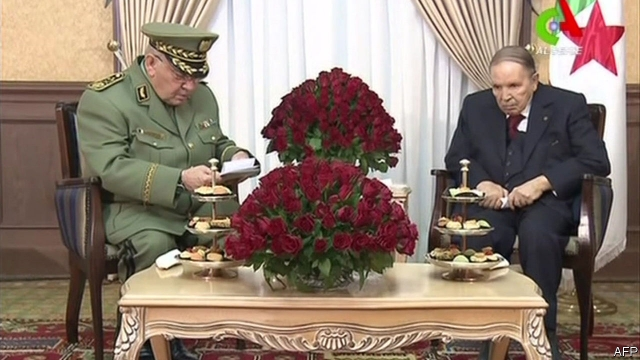

###### Une demi-victoire

# Algeria’s 82-year-old president, Abdelaziz Bouteflika, bows out 

##### But he’s not resigning, and protesters are not going home 

 

> Mar 14th 2019 

THE MAN who does not speak finally listened. On March 11th Algeria’s president, Abdelaziz Bouteflika, announced that he would not run for a fifth term. That has been the demand of tens of thousands of protesters over the past three weeks. Mr Bouteflika, 82, has ruled for 20 years. A stroke in 2013 left him confined to a wheelchair and barely able to speak. Yet he was to be the only real candidate in an election on April 18th. With him out of the race, the vote has been postponed. In a letter released by state media, he—or his coterie—acknowledged his health problems and promised to leave “a new republic…in the hands of the new generations of Algerians”. 

Not right away, though. The letter proposed a transitional period, with a national convention to draft a new constitution that would be put to a public vote. Elections will follow. The timing of all this is vague, and Mr Bouteflika will preside over a technocratic government until the election. There is talk of Lakhdar Brahimi, a veteran diplomat, heading the constitutional effort. 

Joy at the announcement soon turned to doubt. Mr Brahimi is close to the president and, at 85, is even older than him. The unpopular prime minister has resigned, but his replacement and his new deputy are both former ministers and loyalists. “We demand a radical change of the system, not a change of puppets,” read one banner hoisted in the street. Protests have continued. Algerians had hoped to be rid of both the invalid president and the clique of generals and businessmen that runs the country. Instead, le pouvoir (the power), as the latter is known, seems to be stalling for time to anoint a successor. 

Decades ago the army called the shots. It stepped into politics in 1992 by cancelling Algeria’s first (and only) free election after Islamists were poised to win. That touched off a decade-long civil war that killed 200,000 people. But the army’s influence has waned during Mr Bouteflika’s rule. He and his brother, Said, strengthened the presidency at its expense, sacking generals seen as insufficiently loyal. The army chief, Ahmed Gaid Salah, made a point of appearing on television with Mr Bouteflika after his announcement. 

A new economic elite has gained strength. The best-known businessman is Ali Haddad, a construction magnate who grew rich off state contracts and now heads the Business Leaders Forum (FCE), a powerful federation. Algeria is one of the largest energy producers in Africa and a key supplier of natural gas to Europe. Mr Bouteflika doled out billions of dollars in oil-and-gas revenue to allies, ostensibly for infrastructure projects. A good bit of it disappeared. An oft-cited example is the A1, a 750-mile highway. It took more than a decade to finish and cost as much as $15bn, making it one of the most expensive roads in the world. Several officials who worked on the project were jailed for corruption. 

Yet big business is divided. Executives compete for rents in a state-dominated economy. Many dislike Mr Haddad. Earlier this year Mohamed Benamor, the boss of a food conglomerate, was rumoured to have met an ex-general and presidential hopeful called Ali Ghediri. After the protests began, Mr Benamor and other businessmen quit the FCE and criticised Mr Bouteflika’s re-election bid. 

With so many competing interests, le pouvoir could not agree on a successor. It had hoped to find one during Mr Bouteflika’s languid fifth term—until the protests caught it unprepared. They grew to include not only frustrated young people but also vital functionaries, such as judges, who refused to supervise the election, and employees of state energy firms, who went on strike. The regime hopes to reassert some control by managing the transition and national convention. 

The protesters may not oblige. “Leave means leave” has become a popular slogan on social media. The police have so far been restrained, for fear of exacerbating the unrest. But things could get out of hand. Private disagreements between Mr Bouteflika’s allies may spill into public; Gulf states may start competing for influence in Algeria, as they already do in Tunisia and Libya. The days ahead will be uncertain. After decades of stagnant leadership, though, many Algerians will find that refreshing. 

-- 

 单词注释:

1.une[]:abbr. 联合国欧洲总部（United Nations European Headquarters）；通用非线性元件（Universal Nonlinear）；西班牙标准（Una Norma Espanola） 

2.abdelaziz[]:n. (Abdelaziz)人名；(阿拉伯)阿卜杜勒-阿齐兹 

3.bouteflika[]:[网络] 布特弗利卡；阿尔及利亚总统布特弗利卡；布特佛里卡 

4.protester[]:n. 抗议者, 持异议者, 拒付者 [经] 反对者 

5.tens[]:十位 

6.wheelchair['hwi:l.tʃєә]:n. 轮椅 

7.Algerian[æl'dʒiәriәn]:a. 阿尔及利亚的 n. 阿尔及利亚人 

8.transitional[træn'siʒәnl]:a. 变迁的, 过渡期的 [医] 转变的, 过渡的; 过渡型单核白细胞 

9.timing['taimiŋ]:n. 时间选择, 时间测定, 定时, 调速 [计] 定时器时钟 

10.preside[pri'zaid]:vi. 统辖, 当主人, 主持 [法] 主持, 负责, 指挥 

11.technocratic[ˌteknə'krætɪk]:a. 由技术专家官员组成的；受技术官僚影响的 

12.lakhdar[]: [地名] [阿尔及利亚] 拉赫达尔 

13.brahimi[]:[网络] 卜拉希米 

14.diplomat['diplәmæt]:n. 外交官, 有外交手腕的人 [法] 外交家, 外交官, 有权谋的人 

15.constitutional[.kɒnsti'tju:ʃәnl]:a. 宪法的, 立宪的, 体质的 [医] 全身的; 体质的 

16.unpopular['ʌn'pɔpjulә]:a. 不得人心的, 不受欢迎的, 不流行的 

17.replacement[ri'pleismәnt]:n. 归还, 更换, 代替者 [医] 复位, 置换 

18.loyalist['lɒiәlist]:n. 忠诚的人, 反对独立者, 反佛朗哥派的人 

19.hoist[hɒist]:n. 升高, 起重机, 推动 v. 升起, 升高, 举起 

20.invalid[in'vælid]:n. 病人, 残废者 a. 有病的, 无效的 

21.clique[kli:k]:n. 派系, 集团 vi. 结党 [计] 集团型 

22.LE[]:[计] 小于或等于 

23.Pouvoir[]:[网络] 权力；能；政权 

24.stall[stɒ:l]:n. 厩, 停车处, 牧师职位, 货摊, 托辞, 拖延 vt. 关入厩, 停顿, 推托, 支吾, 使陷于泥中 vi. 被关在厩内, 陷于泥中, 停止, 支吾 

25.anoint[ә'nɒint]:vt. 涂油, 施以涂油礼 [医] 涂油膏 

26.successor[sәk'sesә]:n. 继承者, 接任者 [计] 后继 

27.politic['pɒlitik]:a. 精明的, 明智的, 策略的 

28.Islamist[iz'lɑ:mist]:n. 伊斯兰教主义者；回教教徒 

29.poise[pɒiz]:n. 平衡, 均衡, 姿势, 镇静, 安静, 砝码 vt. 使平衡, 使悬着, 保持...姿势 vi. 平衡, 悬着, 准备好 

30.wane[wein]:n. 减少, 衰微, 败落, 亏缺, 月亏 vi. 变小, 亏缺, 衰落, 消逝, 退潮 

31.presidency['prezidәnsi]:n. 总统职权, 总裁职位 

32.insufficiently[ˌɪnsə'fɪʃntlɪ]:adv. 不够地, 不能胜任地 

33.ahmed[]:n. 艾哈迈德（男子名） 

34.gaid[]:[网络] 通信技术促进发展全球联盟；通信技术与发展联盟；发展联盟 

35.Salah[sә'lɑ:]:n. = salat [变体] 

36.elite[ei'li:t]:n. 精华, 精锐, 中坚分子 

37.ALI[]:[计] 异步线路接口 

38.haddad[]:n. (Haddad)人名；(法、西)阿达；(塞、瑞典、阿拉伯、英)哈达德 

39.magnate['mægneit]:n. 大官, 巨头 [法] 大官, 权贵, 大资本家 

40.forum['fɒ:rәm]:n. 论坛, 公开讨论的广场, 法庭, 讨论会 [法] 讨论会, 专题讨论, 公共论坛 

41.FCE[]:abbr. 飞行控制电子设备（Flight Control Electronics）；火控设备（Fire Equipment Control） 

42.federation[fedә'reiʃәn]:n. 联邦, 联合, 联盟 [法] 联邦, 联盟, 联邦政府 

43.Algeria[æl'dʒiәriә]:n. 阿尔及利亚 

44.producer[prә'dju:sә]:n. 生产者, 制作者, 制作人 [化] 发生器; (炉煤气)发生炉; 制气炉; 生产者 

45.supplier[sә'plaiә]:n. 供应者, 供给国, 供应商 [化] 承制厂; 供应厂商 

46.dole[dәul]:n. 救济品, 失业救济金 vt. 发放救济 

47.ally['ælai. ә'lai]:n. 同盟者, 同盟国, 助手 vt. 使联盟, 使联合, 使有关系 vi. 结盟 

48.ostensibly[]:adv. 可公开, 显然, 表面, 外表, 诡称, 假装 

49.infrastructure['infrәstrʌktʃә]:n. 基础结构, 基础设施 [经] 基础设施 

50.corruption[kә'rʌpʃәn]:n. 腐败, 堕落, 贪污 [计] 论误 

51.Mohamed[]:n. (Mohamed)人名；(阿拉伯)穆罕默德； 

52.conglomerate[kәn'glɒmәrit]:a. 聚成球形的, 砾岩性的 n. 集成物, 混合体, 砾岩 v. (使)凝聚成团 

53.presidential[.prezi'denʃәl]:a. 总统制的, 总统的, 首长的, 统辖的 [法] 总统的, 议长的, 总经理的 

54.criticise['kritisaiz]:v. 批评, 吹毛求疵, 非难 

55.languid['læŋgwid]:a. 疲倦的, 无力的, 阴沉的 

56.unprepared[.ʌnpri'pєәd]:a. 无准备的, 即席的, 不期而遇的 

57.functionary['fʌŋkʃәnәri]:n. 职员, 负责人员, 官员 a. 机能的, 作用的, 职务的 

58.supervise['sju:pәvaiz]:v. 监督, 管理, 指导 

59.regime[rei'ʒi:m]:n. 政权, 当权期间, 政体, 社会制度, 体制, 情态 [医] 制度, 生活制度 

60.reassert[.ri:ә'sә:t]:vt. 再断言, 重复主张 

61.transition[træn'ziʃәn]:n. 转变, 转换, 变迁, 过渡时期, 临时转调 [化] 跃迁 

62.exacerbate[ek'sæsәbeit]:vt. 使恶化, 使增剧, 激怒, 使加剧 

63.Tunisia[tju:'nisiә]:n. 突尼斯 

64.Libya['libiә]:n. 利比亚 

65.stagnant['stægnәnt]:a. 不流动的, 停滞的, 不景气的, 萧条的, 污浊的, 迟钝的 [经] 萧条的 

