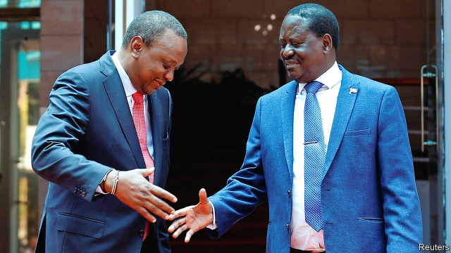

###### From frog to toady

# Kenya’s big-tent government has averted violence, but may stunt growth 

##### A land with no opposition 

 

> Mar 14th 2019 

LITTLE OVER a year ago, Kenya seemed to be teetering. Swathes of the country refused to recognise Uhuru Kenyatta (pictured, left) as their president. Nearly 100 people had died in political violence after he was declared winner of a brace of elections in late 2017. The opposition’s leader, Raila Odinga (pictured, right), having rejected his rival’s victory in the original poll and boycotted a court-ordered re-run, had declared himself “the people’s president”. His coalition announced a plan of economic disruption and threatened the secession of opposition heartlands. With tribal animosity rising, another eruption of violence seemed possible. 

Then suddenly it was all over. The two men made up in March last year. So startling has the reconciliation been after a bitter 16-year rivalry that it has taken on a fairy-tale flavour. Instead of questioning the president’s legitimacy, Mr Odinga now attends rallies, funerals and church services with him, cheerleading all the way. Politicians from Mr Kenyatta’s dominant Kikuyu tribe are cock-a-hoop. Their nemesis had not been turned from a frog into a prince, thank heavens, but he had become something rather better: a toady. 

Fairy tales are usually heart-warming. They are also, by definition, unreal. Cold political and ethnic calculation lies behind this rapprochement. Mr Odinga, who is 74, has concluded he will never be allowed to defeat a Kikuyu, an ally says, after losing to one in four of the five elections in which his name appeared on the ballot. Sharing power is the best he can hope for. He has won Mr Kenyatta’s backing for a referendum to increase the number of executive posts, probably by creating a prime minister and two deputies. These could be earmarked for tribes that supported the opposition, including Mr Odinga’s Luo people. 

Mr Kenyatta wins, too. He has tamed his opponents, restored stability and given businesses confidence to invest. Growth has ticked up. Most crucially, the president has found an ally who could prevent his deputy, William Ruto, from succeeding him in 2022, when Mr Kenyatta is obliged to stand down. For many Kikuyu, Mr Ruto (a Kalenjin) represents a greater threat than Mr Odinga. Since independence in 1963, the Kikuyu, Kenya’s biggest tribe, have lost power only once, during the presidency of Daniel arap Moi from 1978 to 2002. Mr Moi, a Kalenjin, curbed the clout of the Kikuyus. They do not want a repeat. 

The reconciliation, known in Kenya as “the handshake”, is not without risk. It may not last if Mr Odinga does not get what he wants. And Kalenjin politicians are furious at what they see as a blatant attempt to shut them out of power. When the Kalenjin and Kikuyu last stood on opposing sides of the political divide, in the election of 2007, some 1,400 people were killed. Many Kikuyus live in the Kalenjin heartlands of the Rift Valley. Because they, rather than their political leaders, could face Kalenjin wrath, some are understandably nervous. 

The handshake also means Kenya no longer has a functioning opposition. Some fret that the country could in effect become a one-party state again. Few politicians seem bothered. They argue that confrontational democracy is a Western import that has endangered stability and hampered economic development. Kenya, says a close ally of Mr Kenyatta, would be much better off with a benevolent dictatorship. 

Besides, the argument goes, the status quo would be little changed. Commentators sometimes point to the number of political parties Kenya has as a sign of its democratic vibrancy. Some 117 contested the election in 2007 and 47 have won seats in parliament since the end of one-party rule in 1991. Yet Farah Maalim, a veteran MP, says he can think of only one occasion on which a serious opposition party differed in substance from the government of the day, when FORD-Kenya called for widespread land redistribution in the 1990s. The rest have nearly all been temporary vehicles designed to propel their leaders to power or build ethnic coalitions. Mr Odinga has belonged to six political parties, Mr Kenyatta to four. Between them they have formed five separate alliances. 

Still, the lack of even a flawed opposition is troubling. In Mr Kenyatta’s first term, MPs on the other side of the house sometimes opposed bills that threatened, for instance, to impose controls on the media and non-governmental organisations. There is much less genuine scrutiny now, MPs say. Worse, the vacuum left by the opposition has been filled by government factionalism. Messrs Kenyatta and Odinga have launched an ambitious anti-corruption drive. Powerful officials, including several cabinet ministers, have been called in to explain the suspected disappearance of funds. Yet, because many of those questioned are seen as Mr Ruto’s allies, some think that the war on corruption is a ploy to neuter the deputy president. 

Mr Ruto is suspected of getting his revenge by using his large parliamentary caucus to hold up government business. An attempt to rescue Kenya Airways, the unprofitable national carrier, may have stalled as a result. Plans to build houses, improve access to free health care and boost manufacturing and agriculture have all been delayed, victims of the infighting. 

Such paralysis is hardly beneficial. Perhaps more worryingly, Kenya’s faltering democratic progress is also in danger. Although the referendum, which could take place later this year, should broaden the ethnic inclusivity of the government, politicians could use it to weaken oversight bodies created under the constitution of 2010. If everyone is in government, few have an interest in transparency or accountability. 

Moreover, there is plenty of evidence that a lack of political competition retards economic development. Many Kenyans remember the stagnation of their own one-party era. As alluring as a big-tent government may seem, a jobs-for-all-the-boys political settlement is likely to foster worse governance. Every ruling party needs an opposition to keep it honest. 

-- 

 单词注释:

1.toady['tәudi]:n. 谄媚者, 马屁精 v. 谄媚, 拍马屁 

2.avert[ә'vә:t]:vt. 转开, 避免, 防止 

3.stunt[stʌnt]:n. 特技, 绝技, 花招, 噱头, 手腕, 发育不良 vt. 阻碍成长 vi. 表演特技 

4.opposition[.ɒpә'ziʃәn]:n. 反对, 敌对, 相反, 在野党 [医] 对生, 对向, 反抗, 反对症 

5.Kenya['kenjә]:n. 肯尼亚 

6.teeter['ti:tә]:vi. 步履不稳地走动, 踉跄, 摇晃, 摇摆不定, 摇摇欲坠, 玩跷跷板 n. 踉跄, 摇摆, 跷跷板 

7.swathe[sweiθ]:vt. 绑, 裹, 包围 n. 带子, 绷带 

8.uhuru[u:'huru:]:[斯瓦希里]乌呼噜, 自由 

9.Kenyatta[]:n. (Kenyatta)人名；(肯)肯雅塔 

10.brace[breis]:n. 支柱, 曲柄, 支撑, 一对 vt. 紧缚, 支撑, 激励 vi. 打起精神 [计] 花括号 

11.raila[]:[网络] 铁路 

12.odinga[]:[网络] 奥廷加；奥丁加 

13.coalition[.kәuә'liʃәn]:n. 结合体, 结合, 联合 [经] 联合, 联盟 

14.disruption[dis'rʌpʃәn]:n. 分裂, 崩溃, 瓦解 

15.secession[si'seʃәn]:n. 脱离, 分离 

16.heartland['hɑ:tlænd]:n. 心脏地区, 中心地带 

17.tribal[traibl]:a. 部落的, 宗族的 

18.animosity[.æni'mɒsiti]:n. 仇恨, 憎恶, 敌意 

19.eruption[i'rʌpʃәn]:n. 爆发, 喷出物, 出疹 [化] 喷发 

20.reconciliation[,rekәnsili'eiʃәn]:n. 和解, 和好, 复交, 调解, 调停, 和谐, 一致, 甘愿, 顺从 [经] (银行往来)调节, 调和, 一致 

21.rivalry['raivlri]:n. 竞争, 对抗 [医] 拮抗 

22.legitimacy[li'dʒitimәsi]:n. 合法, 正统, 正当 [法] 合法性, 正统性, 婚生 

23.rally['ræli]:n. 重振旗鼓, 集合, 群众集会, 跌停回升 v. 重整旗鼓, 集合, 恢复精神, 团结, 挖苦, 嘲笑 

24.cheerleading['tʃɪəli:dɪŋ]:n. 带领啦啦队 

25.dominant['dɒminәnt]:a. 占优势的, 支配的 [医] 优性的, 显性的 

26.kikuyu[ki'ku:ju:]:n. 基库尤语（肯尼亚）；基库尤人（肯尼亚） 

27.nemesis['nemisis]:n. 复仇女神, 给与惩罚的人, 天罚, 报应 

28.fairy['fєәri]:n. 仙女, 精灵 a. 仙女的 

29.unreal['ʌn'ri(:)әl]:a. 假的, 虚构的, 不真实的, 幻想的 

30.ethnic['eθnik]:a. 人种的, 种族的 [医] 人种的 

31.rapprochement[ræ'prɔʃmә:ŋ]:n. 和解, 恢复邦交, 恢复友好关系, 重归于好 

32.ally['ælai. ә'lai]:n. 同盟者, 同盟国, 助手 vt. 使联盟, 使联合, 使有关系 vi. 结盟 

33.ballot['bælәt]:n. 投票, 投票用纸, 抽签 vi. 投票, 抽签 vt. 投票选出, 拉选票 

34.referendum[.refә'rendәm]:n. （就重大政治或社会问题进行的）全民公决，全民投票 

35.earmark['iәmɑ:k]:n. 耳上记号, 特征, 记号, 标记 vt. 在耳朵上做记号, 标记, 指定...作特定用途 

36.luo[]:n. 卢奥族, 卢奥人；卢奥语 

37.crucially[ˈkru:ʃɪəlɪ]:adv. 至关重要地, 关键地 

38.william['wiljәm]:n. 威廉（男子名）；[常作W-][美俚]钞票, 纸币 

39.Ruto[]:[网络] 鲁托；托公主；舞场 

40.kalenjin[]: 卡伦津人 

41.presidency['prezidәnsi]:n. 总统职权, 总裁职位 

42.daniel['dænjәl]:n. 丹尼尔（男子名） 

43.arap[]:n. (Arap)人名；(葡、塞、肯)阿拉普 

44.moi[]:abbr. 惯性矩（Moment of Inertia）；感染复数（Multiplicity of Infection）；英国新闻部（Ministry of Information）；英国内政部（Ministry of the Interior） 

45.curb[kә:b]:n. 抑制, 勒马绳, 边石 vt. 抑制, 束缚, 勒住 

46.clout[klaut]:n. 敲击, 破布 vt. 打补钉 

47.kikuyu[ki'ku:ju:]:n. 基库尤语（肯尼亚）；基库尤人（肯尼亚） 

48.handshake['hændʃeik]:n. 握手 

49.blatant['bleitәnt]:a. 喧嚣的, 吵闹的, 俗丽的, 炫耀的 

50.rift[rift]:n. 裂口, 空隙 vi. 裂开 vt. 使分开, 使割开 

51.wrath[rɒ:θ]:n. 愤怒, 激怒, 愤怒的举动, (自然现象等)严酷 

52.understandably[]:adv. 可懂, 可了解, 可理解 

53.fret[fret]:n. 烦躁, 磨损, 焦急, 网状饰物 vi. 烦恼, 不满, 磨损 vt. 使烦恼, 腐蚀, 使磨损, 使起波纹 

54.bother['bɒðә]:vt. 烦扰, 迷惑 vi. 烦恼, 操心 n. 麻烦, 纠纷, 讨厌的人 

55.confrontational[ˌkɒnfrʌnˈteɪʃnl]:a. 挑衅的; 对抗的 

56.endanger[in'deindʒә]:vt. 危及 [法] 使危险, 危及 

57.hamper['hæpә]:n. 食篮, 阻碍物, 食盒 vt. 阻碍, 使困累, 妨碍, 牵制 

58.benevolent[bi'nevәlәnt]:a. 善意的, 慈善的 

59.dictatorship[dik'teitәʃip]:n. 独裁者之职位, 独裁, 独裁政权 [法] 专攻, 独裁权 

60.statu[]:[网络] 状态查看；雕像；特级雪花白 

61.quo[]:vt. [古]说 

62.commentator['kɔmenteitә]:n. 评论员, 实况广播员, 注释者, 时事评论员 

63.vibrancy['vaibrәnsi]:n. 振动, 振响, 活力 

64.Farah[]:n. 法拉赫, 阿富汗西部河流 pers. 法拉, 法拉赫 

65.MP[]:国会议员, 下院议员 [计] 宏处理程序, 维护程序, 线性规划, 微程序, 多处理器 

66.redistribution['ri:distri'bju:ʃәn]:n. 重新分配, 再分发 [计] 重新分配 

67.propel[prәu'pel]:vt. 推进, 驱使 [机] 推进 

68.alliance[ә'laiәns]:n. 联盟, 联合 [法] 同盟, 联盟, 联姻 

69.flaw[flɒ:]:n. 缺点, 裂纹, 瑕疵, 一阵狂风 [化] 划痕; 裂缝; 裂纹 

70.MP[]:国会议员, 下院议员 [计] 宏处理程序, 维护程序, 线性规划, 微程序, 多处理器 

71.organisation[,ɔ: ^әnaizeiʃən; - ni'z-]:n. 组织, 团体, 体制, 编制 

72.les[lei]:abbr. 发射脱离系统（Launch Escape System） 

73.scrutiny['skru:tini]:n. 细看, 仔细检查, 监视, 选票检查 [经] 复查, 评核, 仔细检查 

74.factionalism['fækʃәnәlizm]:n. 党派性, 党派活动, 派系分裂倾向 

75.Messrs['mesәz]:[法][pl. ](=Messieurs)各位(先生) 

76.ambitious[æm'biʃәs]:a. 有野心的, 抱负不凡的, 雄心勃勃的 

77.disappearance[.disә'piәrәns]:n. 看不见, 失踪, 消失 

78.corruption[kә'rʌpʃәn]:n. 腐败, 堕落, 贪污 [计] 论误 

79.ploy[plɒi]:n. 手段, 活动, 玩乐 

80.neuter['nju:tә]:a. 中性的, 不及物的, 生殖器不完全的 n. 中性词, 无性动物, 阉割动物 

81.parliamentary[.pɑ:lә'mentәri]:a. 国会的, 议会的, 议会制度的 

82.caucus['kɒ:kәs]:n. 领导人会议, 核心会议 vi. 开核心会议 

83.airway['єәwei]:n. 空中航线, 风道 [医] 导气管 

84.unprofitable[.ʌn'prɒfitәbl]:a. 无利益的, 不赚钱的, 不上算的 [法] 无利可图的, 无益的 

85.stall[stɒ:l]:n. 厩, 停车处, 牧师职位, 货摊, 托辞, 拖延 vt. 关入厩, 停顿, 推托, 支吾, 使陷于泥中 vi. 被关在厩内, 陷于泥中, 停止, 支吾 

86.manufacturing[.mænju'fæktʃәriŋ]:n. 制造业 a. 制造业的 

87.infighting['infaitiŋ]:n. 近战, 混战, 暗斗 

88.paralysis[pә'rælisis]:n. 麻痹, 停顿, 瘫痪 [医] 麻痹, 瘫痪 

89.worryingly['wʌrɪɪŋlɪ]:adv. 焦虑地, 烦恼地 

90.falter['fɒ:ltә]:vt. 支吾地说 vi. 支吾, 蹒跚地走 n. 颤抖, 支吾, 踌躇 

91.broaden['brɒ:dn]:vi. 变宽, 扩大 vt. 放宽, 使扩大 

92.inclusivity[]:n. 包容性 

93.oversight['әuvәsait]:n. 勘漏, 失察, 失败, 照料 [经] 监督权 

94.transparency[træns'pærәnsi]:n. 透明, 透明度, 透过性, 透明物, 清晰 [计] 透明性; 透明 

95.accountability[ә.kauntә'biliti]:n. 负有责任, 可说明性 [化] 衡算计量 

96.retard[ri'tɑ:d]:n. 阻止, 延迟 vt. 妨碍, 延迟, 使减速 vi. 减速, 延迟 

97.kenyan['kenjәn]:n. 肯尼亚人 

98.stagnation[stæg'neiʃәn]:n. 淤塞, 停滞 [医] 停滞, 滞留, 郁积 

99.allure[ә'luә]:vt. 引诱, 吸引 n. 魅力, 诱惑力 

100.foster['fɒstә]:a. 收养的, 养育的 vt. 养育, 抚育, 培养, 鼓励, 抱(希望) 

101.governance['gʌvәnәns]:n. 统治, 统辖, 管理 [法] 统治, 管理, 支配 

