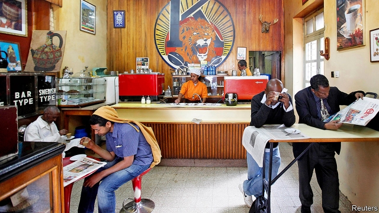

###### Ink by the barrel in Addis Ababa

# Press freedom in Ethiopia has blossomed. Will it last? 

##### A less autocratic leader lets newspapers thrive 

 

> Mar 14th 2019 

ESKINDER NEGA founded his first newspaper, Ethiopis, in 1993. After seven issues it was forced to close, the first paper charged under a muzzling law introduced by the Ethiopian People’s Revolutionary Democratic Front (EPRDF), which had shot its way to power two years before. Three more of Eskinder’s newspapers were shut down by the courts. In 2012 he was sentenced to 18 years in prison on charges of terrorism. He was released last year as part of an amnesty for political prisoners. 

Ethiopis is back in business, its return symbolising the start of a more hopeful era for press freedom. Hundreds of websites, blogs and satellite-TV channels have been unblocked since Abiy Ahmed took office as prime minister in April last year. For the first time in 13 years there are no journalists in prison; no fewer than 23 publications and six privately owned satellite channels have been given licences by the Ethiopian Broadcasting Authority since July. 

New provincial titles are emerging, too, including the first ever independent newspaper in Ethiopia’s troubled Somali region. Even state broadcasters are loosening up and giving airtime to opposition politicians. A new media bill is expected soon. It will probably soften criminal penalties for libel and lift some restrictions on private ownership that have crimped investment. 

This is not the first blossoming of free media. The EPRDF liberalised the press after it snatched power from a Marxist junta known as the Derg in 1991. More than 200 newspapers and 87 magazines were launched between 1992 and 1997. That did not last. Since 2001, 120 newspapers and 297 magazines received licences—but 261 of them were cancelled. At least 60 journalists fled the country between 2010 and 2015. 

Repression is one challenge for Ethiopia’s would-be press barons; a tough business environment is another. The average lifespan of an Ethiopian newspaper is nine months, reckons Endalk Chala, an academic who has studied the trade. Addis Zeybe, which was launched in October, stopped after only four issues. Advertisers “don’t want to be associated with media that is critical of the government”, says its founder, Abel Wabella. 

New titles face especially long odds. The state owns the main printing press, which can pulp issues the government does not like and which increased prices by almost 50% in December. “It’s a death blow,” says Eskinder. Abiy has spoken of the importance to democracy of a vibrant press, but state media still dominate, says Tsedale Lemma, the editor of Addis Standard, a feisty rag that recently returned from exile. 

Two tests of the new opening loom. The first is the willingness of state media to give equal time to the prime minister and his opponents in elections next year. Another will be the openness of Abiy himself to scrutiny: he has given only one press conference and few interviews. 

Eskinder recalls the aftermath of the election in 2005, when the EPRDF blamed newspapers for its failure to win a majority in Addis Ababa. “When this honeymoon ends I think we will have problems,” he says. Ominously, two local journalists reporting on controversial home demolitions near the capital were arrested last month. Upon release they were attacked by a mob outside the police station. 

-- 

 单词注释:

1.addis['ædis]:n. 艾缔思（姓氏） 

2.Ababa[]:n. (Ababa)人名；(塞)阿巴巴 

3.Ethiopia[.i:θi'әupiә]:n. 埃塞俄比亚 

4.les[lei]:abbr. 发射脱离系统（Launch Escape System） 

5.autocratic[.ɒ:tә'krætik]:a. 独裁的, 专制的 

6.nega[]:[网络] 负片按键；负片状态；否定(negation) 

7.muzzle['mʌzl]:n. 动物之鼻口, 口套, 枪口 vt. 戴口套于, 使缄默 

8.Ethiopian[.i:θi'әupiәn]:a. 埃塞俄比亚的 n. 埃塞俄比亚人 

9.eprdf[]:[网络] 衣索比亚人民革命民主阵线(Ethiopian People's Revolutionary Democratic Front)；人阵为主的埃革阵；人民革命阵线 

10.terrorism['terәrizm]:n. 恐怖主义, 恐怖统治, 恐怖状态 [法] 胁迫, 暴政, 恐怖政治 

11.amnesty['æmnisti]:n. 大赦, 赦免 

12.symbolise['simbәlaiz]:vt. 象征, 代表, 作为...的象征 vt.vi. 用符号表示, 使用符号 

13.blog[]:n. 博客；部落格；网络日志 

14.unblocked[]:a. 非块式；畅通无阻的 

15.ahmed[]:n. 艾哈迈德（男子名） 

16.privately[]:adv. 秘密地；私下地 

17.provincial[prә'vinʃәl]:n. 外地人, 粗野的人 a. 省的, 外地的, 偏狭的 

18.Somali[sәu'mɑ:li]:n. 索马里人 

19.broadcaster['brɒ:dkæstә]:n. 播送者, 广播装置, 播种机 

20.airtime['eәtaim]:电影或电视节目开始的时间 

21.opposition[.ɒpә'ziʃәn]:n. 反对, 敌对, 相反, 在野党 [医] 对生, 对向, 反抗, 反对症 

22.soften['sɒftn]:v. (使)变柔软, (使)变柔和 

23.penalty['penәlti]:n. 处罚, 刑罚, 罚款, 罚球, 报应, 不利结果, 妨碍 [经] 罚金(款), 违约金 

24.libel['laibәl]:n. 以文字损害名誉, 诽谤罪, 侮辱 v. 诽谤, 中伤, 损害名誉 

25.crimp[krimp]:n. 诱人当兵的人, 拳曲, 鬈发 vt. 诱...去当兵, 使拳曲, 使有褶 

26.blossoming['blɑsəmɪŋ]:v. （植物）开花( blossom的现在分词 ); 发展; 长成; 变得更加健康（或自信、成功） 

27.liberalise['lɪbərəlaɪz]:vt. 使自由化 

28.junta['dʒʌntә]:n. 以武力政变上台的(军)政府, 私党, 阴谋小集团, 政务会 

29.derg[]:abbr. decreasing 减少，削减，递减 

30.repression[ri'preʃәn]:n. 抑制, 压抑, 制止 [医] 压抑, 抑制 

31.baron['bærәn]:n. 男爵 [法] 男爵, 贵族, 大王 

32.lifespan['laifspæn]:n. 预期生命期限；寿命；预期使用期限 

33.reckon['rekәn]:vt. 计算, 总计, 估计, 认为, 猜想 vi. 数, 计算, 估计, 依赖, 料想 

34.Chala[]:[地名] 查拉 ( 秘、坦桑 ) 

35.advertiser['ædvәtaizә]:n. 做广告者, 广告客户 [经] 广告商, 广告者 

36.founder['faundә]:n. 创立者, 建立者 vt. 使沉没, 使摔倒, 弄跛, 浸水, 破坏 vi. 沉没, 摔到, 变跛, 倒塌, 失败 

37.abel['eibәl]:n. 亚伯（亚当和夏娃的次子）；艾贝尔（男子名） 

38.odds[ɒdz]:n. 可能性, 几率, 机会, 胜算, 不平等 

39.pulp[pʌlp]:n. 果肉, 纸浆 vt. 使化成纸浆, 除去...果肉 vi. 变成纸浆 

40.vibrant['vaibrәnt]:a. 振动的, 战栗的, 响亮的, 活跃的 

41.lemma['lemә]:n. 辅助定理, 论点, 引理 [医] 膜, 衣 

42.feisty['faisti]:a. 激动的, 活跃的, 好争吵的, 坐立不安的 

43.exile['eksail]:n. 放逐, 流放, 被放逐者 vt. 放逐, 流放, 使背井离乡 

44.loom[lu:m]:n. 织布机, 若隐若现的景象 vi. 朦胧地出现, 隐约可见, 可怕地出现 

45.openness['әupәnnis]:n. 公开；宽阔；率真 

46.aftermath['ɑ:ftәmæθ]:n. 结果, 后果 [法] 后果, 结果 

47.ominously['ɒmɪnəslɪ]:adv. 恶兆地, 不吉利地; 预示地 

48.demolition[.demә'liʃәn]:n. 破坏, 毁坏, 撤销 [经] 拆毁(除,破坏) 

49.mob[mɒb]:n. 暴民, 民众, 暴徒 vt. 大举包围, 蜂拥进入, 围攻 vi. 聚众生事 

