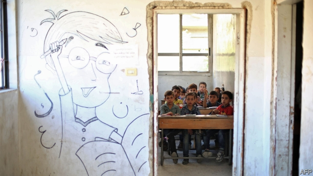

###### Failing grade

# Syria’s broken schools will make it difficult to fix the country 

##### The uneducated are easy prey for the Assad regime and extremist groups 

 

> Mar 14th 2019 

AFTER EIGHT years of civil war, Syria’s education system is a wreck. Nearly 3m school-age children, a third of the total, do not attend classes. That is, in part, because 40% of schools are unusable. Some have been damaged in the fighting; others are being used by armed groups or the displaced. The schools that still function are crammed and there are fewer teachers to run them—around 150,000 have fled or been killed. Unsurprisingly, students are way behind. Ten-year-olds in Syria read like five-year-olds in developed countries, says Save the Children, an aid agency. The literacy rate has plummeted. 

The consequences are stark. Syrians lack the skills needed to rebuild their country or to escape the grinding poverty in which 80% of them live. The uneducated are easier prey for jihadists and militiamen offering money and a bit of power, or for Bashar al-Assad’s regime, which will gladly give them a spot in the army. Shattered schools are yet another reason for more affluent Syrians to leave the country—and for those who have fled to stay abroad. “We’ll see the catastrophic results over the next decade as children become adults,” says Riyad al-Najem of Hurras, a charity that supports over 350 schools in Syria. 

At least seven different curricula compete in Syria. Opponents of Mr Assad purged the state’s syllabus of its paeans to the ruling Baath party. But they sparred over a common curriculum to replace it. The Kurds, who rule the north-east, imposed their own curriculum, replacing adulation of the Assads with adulation of Abdullah Ocalan, a jailed leader of Turkey’s Kurds. The Turks, meanwhile, have opened 11 religious secondary schools in the strip of Syria that they control. The Syriac Orthodox church and the jihadists of Hayat Tahrir al-Sham (HTS) and Islamic State have opened their own schools, too. 

As the frontlines of the war shifted, children lurched between curricula. Certificates earned in one place are often not recognised by the authorities in other parts. That makes it hard for students to get into universities, almost all of which are in regime-held areas. Many simply drop out. In some parts of the country 50% of kids leave school by the age of 13 and 80% by the age of 16. Sometimes parents pull their children out in order to marry them off or have them work on the streets. “They’ll make the same wages for their rest of their lives and bring up their children to do the same,” says Harun Onder of the World Bank. 

Western donors have withheld aid from rebel-held areas in order to avoid helping terrorist groups, such as HTS, which controls Idlib province. In 2017 the European Union, which has invested €2bn in Syrian education since 2012, stopped all but emergency relief in areas controlled by the regime. A scheme to train teachers from Syria at the American University in Beirut was postponed after the EU backed away. “We don’t want to do anything which would legitimise the regime or the terrorists,” says an EU official. 

But withholding aid may help them. Syrians are being pushed into the arms of militants, says Mr Najem, who fears a rash of school closures. Massa Mufti, an education expert from Damascus who advises the UN, worries that there will be more bloodshed: “We are generating another cycle of radicalisation and violence.” 

-- 

 单词注释:

1.uneducated[.ʌn'edjukeitid]:a. 未受教育的, 无知的 

2.prey[prei]:n. 被掠食者, 牺牲者 vi. 捕食 

3.Assad[]:阿萨德（人名） 

4.regime[rei'ʒi:m]:n. 政权, 当权期间, 政体, 社会制度, 体制, 情态 [医] 制度, 生活制度 

5.extremist[iks'tri:mist]:[经] 偏激份子 

6.unusable[]:[计] 不可用的 

7.displace[dis'pleis]:vt. 移置, 替换, 转移 

8.cram[kræm]:vt. 塞满, 填满, 猛吃 vi. 贪吃 n. 极度拥挤, 死记硬背 

9.unsurprisingly[]:adv. 不出所料的；不出奇的；意料中的 

10.Syria['siriә]:n. 叙利亚 [经] 叙利亚 

11.literacy['litәrәsi]:n. 读写能力, 识字, 精通文学 

12.plummete[]:[网络] 直线下降 

13.stark[stɑ:k]:a. 僵硬的, 完全的, 刻板的, 明显的, 荒凉的, 结实的 adv. 突出地, 简直, 全然 

14.Syrian['siriәn]:n. 叙利亚人, 叙利亚语 a. 叙利亚语的, 叙利亚人的 

15.jihadist[]:n. 伊斯兰圣战士 

16.militiaman[mi'liʃәmәn]:n. 国民兵, 民兵 

17.bashar[]:巴沙尔 巴沙尔 

18.gladly['glædli]:adv. 高兴地, 乐意地, 欢喜地 

19.shatter['ʃætә]:n. 碎片, 粉碎, 落叶, 喷洒 vt. 打碎, 使散开, 粉碎, 破坏 vi. 粉碎, 损坏, 脱落 

20.catastrophic[.kætә'strɒfik]:a. 悲惨的, 灾难的 

21.riyad[]:[网络] 利雅得；利亚德；里亚德 

22.hurras[]:[网络] 赫拉斯 

23.purge[pә:dʒ]:n. 净化, 清除, 泻药 v. (使)净化, 清除, (使)通便 [计] 服务器文件删除实用程序 

24.syllabus['silәbәs]:n. 摘要, 提纲, 课程表, 教学大纲 [医] 摘要, 要目 

25.paean['pi:әn]:n. 凯歌, 欢乐歌, 赞美歌 

26.baath[]:n. (Baath)人名；(德)巴特 

27.spar[spɑ:]:n. 晶石, 圆材, 拳斗, 争论 vt. 装圆材于 vi. 拳斗, 争论 

28.Kurd[kuәd]:n. 库尔德人 

29.adulation[.ædju'leiʃәn]:n. 谄媚, 过分的称赞 

30.assads[]:阿萨德（人名） 

31.Abdullah[,æb'dʌlə]:n. 阿布杜拉（人名） 

32.ocalan[]:[网络] 厄贾兰；奥丘兰；厄恰兰 

33.Turk[tә:k]:n. 土耳其人, 土耳其马 

34.Syriac['siriæk]:a. 叙利亚的 

35.orthodox['ɒ:θәdɒks]:a. 正统的, 传统的, 惯常的 

36.hayat[]:n. (Hayat)人名；(法)阿亚；(西)阿亚特；(德、土、阿拉伯、巴基)哈亚特 

37.tahrir[]:[网络] 广场；解放；开罗的解放 

38.HT[]:[计] 手控终端, 处理时间 

39.Islamic[iz'læmik]:a. 伊斯兰教的, 穆斯林的 

40.frontline['frʌntlɑɪn]:n. 前线; [体]锋线（包括大前锋, 小前锋, 中锋） 

41.lurch[lә:tʃ]:n. 惨败, 倾斜, 挫折, 举步蹒跚, 徘徊 vi. 惨败, 倾斜, 徘徊 vt. 击败 

42.harun[]:n. (Harun)人名；(英、德、土)哈伦 

43.onder[]: [地名] [印度] 翁代尔 

44.donor['dәunә]:n. 捐赠人 [化] 给体; 供体 

45.withhold[wið'hәuld]:vt. 使停止, 扣留, 保留, 拒给 vi. 克制, 忍住 

46.terrorist['terәrist]:n. 恐怖分子 [法] 恐怖份子, 恐怖主义 

47.Idlib[]:[地名] 伊德利卜 ( 叙 ) 

48.Syrian['siriәn]:n. 叙利亚人, 叙利亚语 a. 叙利亚语的, 叙利亚人的 

49.Beirut[.bei'ru:t]:n. 贝鲁特 

50.EU[]:[化] 富集铀; 浓缩铀 [医] 铕(63号元素) 

51.legitimise[li'dʒitimaiz]:vt.<主英> = legitimize 

52.militant['militәnt]:a. 好战的 

53.najem[]:[网络] 奈杰姆 

54.rash[ræʃ]:a. 轻率的, 匆忙的, 鲁莽的 n. 皮疹 

55.closure['klәuʒә]:n. 关闭 vt. 使终止 

56.massa['mɑ:ssɑ:]:[医] 质, 物质, 块, 丸块, 团 

57.mufti['mʌfti]:n. 常服, 便服, 穆夫提(伊斯兰法典说明官) 

58.Damascus[dә'mæskәs]:n. 大马士革 

59.UN[ʌn]:pron. 家伙, 东西 [经] 联合国 

60.radicalisation[]:[网络] 激进化 

