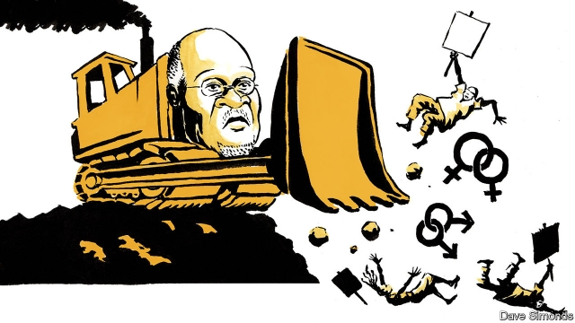

###### A dose of bull

# Tanzania’s leader, the “Bulldozer”, runs off course 

##### President John Magufuli hates critics, gay people and accurate statistics 

 

> Mar 14th 2019 

SEDITION AND statistics are two words that crop up with increasing regularity in the utterances of officials loyal to Tanzania’s president, John Magufuli. Last month a usually compliant daily newspaper, the Citizen, had the cheek to mention that the Tanzanian shilling’s value at the unofficial exchange rate had been sliding. Though this was plainly the case, it flouted the country’s bizarre Statistics Act, whereby no figure may be disseminated without verification or publication by the official organs of state. The Citizen was duly closed down for a week. These days Mr Magufuli, known in Swahili as Tingatinga (the Bulldozer), tries to squash anything that gets in his way: “I would like to tell media owners: be careful, watch it.” 

The charge of sedition is more frequently invoked. Last week the leader of the biggest opposition party, Freeman Mbowe, was released from prison on bail after four months behind bars. But he and eight other politicians are still due to be tried for sedition for attending a banned meeting the government says incited a riot. 

According to Zitto Kabwe, another prominent opposition figure who has been arrested several times, no fewer than 17 of his colleagues face—or have recently faced—prosecution, also mainly for sedition. Four, including Mr Mbowe, have served time in prison. But the politician who most rattles Mr Magufuli may be Tundu Lissu, a member of parliament who had been arrested at least six times (including for the sin of insulting the president) before he was shot 16 times in broad daylight shortly after leaving parliament in the sleepy capital, Dodoma, over a year ago. No one has been arrested for the crime. 

After a week in a coma followed by a string of operations in neighbouring Kenya and in Belgium, Mr Lissu is back in full cry, with well-aired performances at Western think-tank forums and on television abroad. He has yet to return home, but insists he will do so. Mr Magufuli, he says, is “determined that by 2020 there will be no political opposition in Tanzania. Essentially he wants to return it to one-party rule as it was before 1992,” when the ruling Chama Cha Mapinduzi (CCM), or Party of the Revolution, allowed multiparty democracy. The CCM, which evolved out of the party that took over at independence from Britain in 1961, has ruled longer without a break than any other party in Africa. 

A leading (but necessarily anonymous) journalist in Zanzibar, a semi-autonomous part of Tanzania, says: “There’s no more investigative journalism. People are afraid to give you information, especially people in government. The media these days is more controlled.” The Citizen, which is owned by Kenya’s Nation Media Group, part of the Aga Khan’s stable, may, he thinks, be sold to a Middle Eastern bigwig friendly to Mr Magufuli. The office of a leading human-rights lawyer, Fatma Karume, a granddaughter of Zanzibar’s first post-independence ruler, has been bombed. Aidan Eyakuze, who runs the country’s top independent research group, Twaweza, was harassed last year when he published the results of an opinion poll that showed Mr Magufuli’s once sky-high popularity to be falling fast. Under Mr Magufuli a raft of legislation, including on the media, cybercrime and political parties, makes it harder, often illegal, to criticise him. Live television coverage of parliamentary debates, where Mr Magufuli is still castigated, has been barred. The government urges citizens to redirect their anger at gay people, whom Mr Magufuli says “even cows” should condemn. 

  

Western donors, who have indulged Tanzania for many decades, at one point paying for more than a quarter of its annual budget, are losing patience. The head of the European Union mission, Roeland van de Geer, had to quit his post late last year. The Danes and the EU have withheld tranches of aid. Mr Magufuli is looking to the Middle East and China for less conditional help. 

The president has been foolish in economic matters too. The effect of his closure of the Citizen was the opposite of what he intended: the shilling’s true rate dipped further. After Mr Magufuli’s row with the paper, capital is reckoned to have fled to Kenya, which Mr Magufuli views as an adversary. Foreign-exchange controls are widely said to be imminent. 

Two years ago Mr Magufuli appalled investors by demanding that the country’s biggest mining company, Acacia Mining, a subsidiary of Barrick Gold, based in Canada, should pay the absurd sum of $193bn in back taxes—about four times Tanzania’s GDP—for allegedly undervaluing its gold exports. Acacia’s gold exports have since dipped sharply. Several past and present Acacia officials were arrested last year. The World Bank says foreign investment since 2014 has more than halved. “A lot of us are jittery,” says a businessman in Dar es Salaam, the commercial capital. “But it’s the unpredictability that really scares us.” 

-- 

 单词注释:

1.bulldozer['buldәuzә]:n. 推土机 [化] 推土机 

2.john[dʒɔn]:n. 盥洗室, 厕所, 嫖客 

3.statistic[stә'tistik]:n. 统计量 a. 统计的, 统计学的 

4.sedition[si'diʃәn]:n. 煽动骚乱, 暴动, 妨害治安, 骚动 [法] 煽动, 煽动叛逆罪, 暴动 

5.regularity[.regju'læriti]:n. 规则性, 匀整, 正规, 经常 [医] 规律性 

6.utterance['ʌtәrәns]:n. 发声, 言辞, 表达, 说话的方式, 死 [医] 发言, 言语, 语调 

7.compliant[kәm'plaiәnt]:a. 顺从的, 屈从的 [电] 适用于, 配合...使用 

8.Tanzanian[,tænzə'niən]:a. 坦桑尼亚的 坦桑尼亚人 

9.unofficial[.ʌnә'fiʃәl]:a. 非正式的, 非官方的 [化] 非法定的; 未入药典的 

10.plainly['pleinli]:adv. 清楚地, 明白地, 简单地, 朴素地, 直率地, 坦白地 

11.flout[flaut]:vt. 嘲笑, 愚弄 vi. 表示轻蔑 n. 嘲笑, 愚弄, 轻视 

12.bizarre[bi'zɑ:]:a. 奇异的 

13.whereby[(h)weә'bai]:adv. 靠什么, 如何, 为何, 靠那个, 因此, 由此 [法] 因此, 由是 

14.disseminate[di'semineit]:vt. 散播, 传播, 宣传 vi. 广为传播 

15.verification[.verifi'keiʃәn]:n. 证实, 查证, 证明属实 [计] 验证 

16.duly['dju:li]:adv. 恰当地, 充分地, 适当地, 及时地 

17.swahili[swɑ:'hi:li]:n. 斯瓦希里人；斯瓦希里语 

18.squash[skwɒʃ]:n. 挤压, 压碎的东西, 南瓜属植物, 拥挤的人群 vt. 压扁, 镇压, 压制 vi. 被压扁, 发溅泼声, 挤入 

19.sedition[si'diʃәn]:n. 煽动骚乱, 暴动, 妨害治安, 骚动 [法] 煽动, 煽动叛逆罪, 暴动 

20.invoke[in'vәuk]:vt. 祈求, 恳求, 实行, 援引, 引起 [计] 调用; 请求 

21.opposition[.ɒpә'ziʃәn]:n. 反对, 敌对, 相反, 在野党 [医] 对生, 对向, 反抗, 反对症 

22.freeman['fri:mәn]:n. 自由民, 公民, 正会员 [法] 自由民, 公民, 有公民权的人 

23.bail[beil]:n. 保释, 拎环, 杓, 栅栏 vt. 保释, 舀水 

24.riot['raiәt]:n. 暴动, 喧闹, 放纵 vi. 发动, 暴动, 纵情, 放荡 vt. 浪费, 挥霍 

25.Kabwe[]:n. (Kabwe)人名；(赞、刚(金))卡布韦 

26.rattle['rætl]:vt. 使嘎嘎响, 喋喋不休地说 vi. 格格响, 喋喋不休 n. 格格声, 拨浪鼓, 喋喋不休的话 

27.Lissu['li:su:]:n. (s) =Lisu 

28.Dodoma['dəudəmɑ:]:n. 多多马（坦桑尼亚中部城市, 新首都） 

29.coma['kәumә]:n. 昏迷, 麻木, 彗发 [化] 彗差; 彗形像差 

30.Kenya['kenjә]:n. 肯尼亚 

31.forum['fɒ:rәm]:n. 论坛, 公开讨论的广场, 法庭, 讨论会 [法] 讨论会, 专题讨论, 公共论坛 

32.Tanzania[.tænzә'ni:ә]:n. 坦桑尼亚 

33.essentially[i'senʃәli]:adv. 本质上, 本来 

34.chama[]:查马（地名） 

35.cha[tʃɑ:]:n. （英俚）茶 

36.ccm[]:abbr. counter-countermeasures 反对抗; 反干扰措施; cubic centimetre 立方厘米; Kubikzentimeter (German=cubic centimeter) （德语）立方厘米 

37.multiparty[,mʌlti'pɑ:ti]:a. 多党的,包括多党的,包含多党党员的, 导致多党并存的选举(或政治)制度的 

38.anonymous[ә'nɒnimәs]:a. 姓氏不详的, 无名的, 无特色的 [计] 无记录 

39.Zanzibar[,zænzi'bɑ:]:n. 桑给巴尔 

40.investigative[in'vestigeitiv]:a. 审查的, 调查的, 好研究的 [法] 调查的, 审查的, 受调查研究的 

41.journalism['dʒә:nәlizm]:n. 新闻业, 报章杂志 [法] 报刊, 新闻业, 新闻出版 

42.aga['ɑ:gә]:n. 将军, 大官, 宗教领袖 [医] 速长区(胚) 

43.bigwig['bigwig]:n. 要人, 大亨 

44.fatma[]:n. (Fatma)人名；(阿拉伯、土)法蒂玛 

45.karume[]:[网络] 轻马 

46.Aidan[]:艾丹 

47.harass['hærәs]:vt. 使困扰, 使烦恼, 折磨 

48.popularity[.pɒpju'læriti]:n. 名声, 受大众欢迎, 流行 

49.raft[ræft]:n. 筏, 救生筏, 大量 vi. 乘筏 vt. 筏运, 制成筏 

50.cybercrime[]:n. 网络犯罪 

51.criticise['kritisaiz]:v. 批评, 吹毛求疵, 非难 

52.coverage['kʌvәridʒ]:n. 覆盖的范围, 保险总额, 新闻报导 [化] 可达范围; 覆盖度 

53.parliamentary[.pɑ:lә'mentәri]:a. 国会的, 议会的, 议会制度的 

54.castigate['kæstigeit]:vt. 惩罚, 苛评, 修订 

55.donor['dәunә]:n. 捐赠人 [化] 给体; 供体 

56.indulge[in'dʌldʒ]:vt. 纵情于, 使高兴, 放任, 迁就 vi. 沉溺 

57.roeland[]:[网络] 罗兰 

58.de[di:]:[化] 非对映体过量 [医] 铥(69号元素铥的别名,1916年Eder离得的假想元素) 

59.gee['dʒi:]:n. 马, 家伙 interj. 向右, 前进, 哎呀(惊讶时所发声音) v. (使)向右转 

60.Dane[dein]:n. 丹麦人 

61.EU[]:[化] 富集铀; 浓缩铀 [医] 铕(63号元素) 

62.withhold[wið'hәuld]:vt. 使停止, 扣留, 保留, 拒给 vi. 克制, 忍住 

63.tranch[]:[网络] 串接；信用投资等级 

64.les[lei]:abbr. 发射脱离系统（Launch Escape System） 

65.conditional[kәn'diʃәnl]:a. 有条件的, 有前提的 [电] 有条件的 

66.closure['klәuʒә]:n. 关闭 vt. 使终止 

67.reckon['rekәn]:vt. 计算, 总计, 估计, 认为, 猜想 vi. 数, 计算, 估计, 依赖, 料想 

68.adversary['ædvәsәri]:n. 敌手, 对手 a. 敌手的, 敌对的 

69.imminent['iminәnt]:a. 即将来临的, 逼近的 

70.appall[ә'pɒ:l]:vt. 使丧胆, 使惊骇 

71.investor[in'vestә]:n. 投资者 [经] 投资者 

72.acacia[ә'keiʃә]:n. 洋槐, 刺槐, 阿拉伯树胶 [化] 阿拉伯胶; 金合欢胶 

73.subsidiary[sәb'sidiәri]:n. 子公司, 附件, 辅助者 a. 辅助的, 次要的, 津贴的 

74.barrick[]:n. (Barrick)人名；(英)巴里克 

75.allegedly[ә'ledʒidli]:adv. 依其申述 

76.undervalue[.ʌndә'vælju:]:vt. 低估...之价值, 低估, 看轻 [经] 低估, 降低...价值 

77.halve[hɑ:v]:vt. 二等分, 对半分享, 把...减半 

78.jittery['dʒitәri]:a. 极度紧张不安的 

79.dar[]:abbr. 美国革命女儿会（Daughters of the American Revolution） 

80.E[i:]:[计] 元件, 部件, 元素, 误差, 执行, 表达式, 指数 

81.salaam[sә'lɑ:m]:n. 额手礼, 问安 v. 行额手礼 

82.unpredictability[ˌʌnprɪˌdɪktə'bɪlətɪ]: 不可预测性, 不可预知性 

