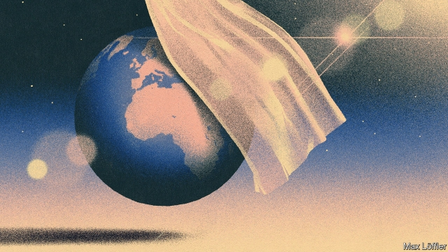

###### Sunny with overcast features

# Countries look at ways to tinker with Earth’s thermostat 

##### Cooling the climate 

 

> Mar 14th 2019 

THE IDEA of cooling the climate with stratospheric sunshades that would shield the planet from the sun’s warming rays moved up the international agenda this week, with mixed results. On the one hand, new research suggested that it is theoretically possible to fine-tune such a shield without some of its potentially damaging consequences. Publication of this work coincided with a proposal at the biennial UN Environment Assembly (UNEA), held in Nairobi, Kenya, for an expert review of such geoengineering methods. This was the highest-level discussion of the topic so far. On the other hand, the more than 170 nations involved could not arrive at a consensus. In a fitting illustration of the heat surrounding geoengineering, the proposal was withdrawn at the eleventh hour. 

Under the Paris Agreement, governments have pledged to keep average global warming to “well below” 2°C above pre-industrial levels and to try to limit maximum warming to 1.5°C. Many see these targets as wishful thinking: the planet is already roughly 1°C warmer than it was in pre-industrial times, global greenhouse gas emissions are still on the rise and national pledges to cut them fall short of what is needed to hit the 2°C target, let alone 1.5°C. 

Faced with this, some think there is a need to turn down the global thermostat using geoengineering. This encompasses a range of possibilities, including technologies that suck carbon dioxide out of the atmosphere and others that block incoming solar energy. One concern, however, is that these methods do not deal with the cause of the problem: greenhouse-gas emissions. Despite calls to map out the risks and benefits of geoengineering, progress on the international stage has been limited, in part, because it might detract from efforts to reduce emissions. That shifted this week when the delegates in Nairobi debated a proposal for an international assessment. It is the first time that geoengineering has been discussed at such a level and in a forum that includes America. 

The UNEA resolution was tabled by Switzerland, and by the start of the week it had received support from most governments. It called for an expert review of the science of geoengineering, including studies on the suite of available technologies, how each might be deployed and how well they would or would not work, as well as any possible negative consequences. The proposal also called for an analysis of the challenges in regulating each approach. 

Among the most controversial but also effective and affordable geoengineering options are planetary sunshades. By using high-flying aircraft, for instance, to spray a fine mist of mineral or man-made particles into the upper stratosphere, a portion of the sun’s incoming energy could be bounced back out into space before it gets a chance to warm the planet. The decades-old idea is inspired by large volcanic eruptions, like that of Mount Pinatubo in the Philippines in 1991, which cooled global temperatures by up to 0.5°C for four years. 

That event demonstrated that relatively simple sunshades could have a significant effect on global temperatures. Indeed, while climate models project that doubling the concentration of carbon dioxide in the atmosphere could cause between 1.5°C and 4°C of global warming, the models also suggest that it is theoretically possible to reduce temperatures by an equal amount using a sunshade. 

But there are challenges. Stratospheric particles eventually fall back to Earth in rain, so the effect is short-lived. A sunshade would need to be continually resupplied, which is one reason for an international governance framework. If a sunshade were allowed to dissipate while atmospheric CO{-2} concentrations remained high, global temperatures would rapidly shoot up, with devastating consequences in some regions of the world. 

Another problem is the effect of solar geoengineering on the water cycle. Over the past decade, several studies have suggested that sunshades could disproportionately affect rainfall, bringing drought to some regions. But that argument may be oversimplified, according to the new study published in Nature Climate Change .  

So far, most studies have modelled a “fully” geoengineered world in which CO{-2} concentrations are doubled compared with current or pre-industrial levels, and all the resulting warming is counterbalanced by a stratospheric sunshade. Instead, Peter Irvine of Harvard University and his colleagues simulated a partial sunshade. They were able to eliminate half the warming effect of doubled CO{-2} concentrations while stabilising the water cycle. 

In a warmer world, due to greenhouse gas emissions, the water cycle is intensified, making drier regions drier and wetter regions wetter, leading to floods and droughts. In their modelled “half-warmed” world, Dr Irvine and his colleagues found that both temperature and precipitation extremes were moderated, which should lead to fewer droughts and floods. 

The team also looked at how solar geoengineering would affect tropical cyclones. Doubling CO{-2} concentrations compared with present-day levels increased the cumulative intensity of all tropical cyclones by 17.6%. The partial sunshade brought that increase down to 2.4%. Limitations in the model made it impossible to see if this benefit was equally distributed across different regions, such as the Pacific and the Atlantic. 

The researchers say their study is more relevant to real policy decisions because it shines some light on what could be done by, for instance, combining solar geoengineering with efforts to cut greenhouse gas emissions. But all this would require international consensus, and obtaining that may be a fantasy. 

The barriers to unity were on display in Nairobi. In 2010 the Convention on Biological Diversity advised against geoengineering activities “until there is an adequate scientific basis” to justify them, but America is not a party to that convention. It was represented at UNEA. However, Several delegates told this newspaper that America and Saudi Arabia opposed the Swiss proposal to review geoengineering, preferring the issue to be assessed by the Intergovernmental Panel on Climate Change (IPCC), which is due to include something about the technologies in its next big report, expected in 2021. 

The distinction may seem procedural, but the Swiss proposal was for a more comprehensive appraisal and one that would be delivered more quickly, by August 2020. What is more, the IPCC’s mandate is primarily to consider the science of geoengineering, not whether and how to regulate its various technologies. And the impact of those technologies on a regional and global scale means governance questions will be at least as tricky as the scientific ones. Indeed, there are concerns that some geoengineering methods could be unilaterally deployed by one or more nations, to the possible detriment of others. “UNEP is the right space because it is the anchor institution of the UN for the environment that collects information but also has a policy function,” said Franz Perrez, Switzerland’s ambassador for the environment. 

The Americans, some said, did not appear to want to make room for conversations, let alone make decisions, about a framework for geoengineering that could restrict their future options. A spokesman for their delegation declined to comment. 

Supporters of the proposal insisted they sought an honest analysis. There is a bitter irony in the meeting’s outcome. The only reason the world may need geoengineering is that talks about cutting emissions have gone on so long but achieved so little. Yet in Nairobi delegates could not even commission a report. Geoengineering, the toolbox that a decade ago nobody wanted, could end up stuck in the same international procedures as efforts to tackle the root cause of global warming. 

-- 

 单词注释:

1.overcast['әuvәkɑ:st]:a. 阴天的, 阴暗的, 愁闷的 

2.tinker['tiŋkә]:n. 补锅匠, 会做各种修补活计的人 vi. 做焊锅匠, 笨拙的修补 vt. 修补 

3.thermostat['θә:mәustæt]:n. 自动调温器, 温度自动启闭装置 [化] 恒温器; 恒温箱 

4.stratospheric[.strætәu'sferik]:a. 同温层的 

5.sunshade['sʌnʃeid]:n. 遮阳伞, 天棚, 帽遮 

6.theoretically[.θi:ә'retikli]:adv. 理论上, 理论地 

7.potentially[pә'tenʃәli]:adv. 可能地, 潜在地 

8.coincide[.kәuin'said]:vi. 一致, 符合 [化] 重合 

9.biennial[bai'eniәl]:n. 两年生植物, 两年一次的事 a. 两年生的, 两年一次的 

10.UN[ʌn]:pron. 家伙, 东西 [经] 联合国 

11.Nairobi[nai'rәubi]:n. 内罗比 

12.Kenya['kenjә]:n. 肯尼亚 

13.geoengineering[]:地质工程 岩土工程 

14.eleventh[i'levnθ]:num. 第十一, 十一分之一 

15.pledge[pledʒ]:n. 诺言, 保证, 誓言, 抵押, 信物, 保人, 祝愿 vt. 许诺, 保证, 使发誓, 抵押, 典当, 举杯祝...健康 

16.wishful['wiʃful]:a. 愿望的, 渴望的, 一厢情愿的 

17.emission[i'miʃәn]:n. 发射, 射出, 发行 [医] 发射, 遗精 

18.encompass[in'kʌmpәs]:vt. 围绕, 完成, 包括, 包含, 环绕, 包围 

19.incoming['inkʌmiŋ]:a. 进来的, 刚开始的, 新来的 n. 进来 

20.detract[di'trækt]:vi. 减去, 贬低 vt. 转移, 分散 

21.forum['fɒ:rәm]:n. 论坛, 公开讨论的广场, 法庭, 讨论会 [法] 讨论会, 专题讨论, 公共论坛 

22.deploy[di'plɒi]:v. 展开, 配置 

23.affordable[]:[计] 普及型 

24.planetary['plænitri]:a. 行星的, 流浪的, 迁移不定的, 地球上的, 现世的 

25.stratosphere['strætәsfiә]:n. 同温层, 最上层, 尖端的学科领域 [医] 同温层, 平流层 

26.volcanic[vɒl'kænik]:a. 火山的, 猛烈的 n. 火山岩 

27.eruption[i'rʌpʃәn]:n. 爆发, 喷出物, 出疹 [化] 喷发 

28.Pinatubo[]:[网络] 皮纳图博火山；部火山；皮纳杜波 

29.Philippine['filipi:n]:a. 菲律宾(群岛)的, 菲律宾人的 

30.stratospheric[.strætәu'sferik]:a. 同温层的 

31.continually[kәn'tinjuәli]:adv. 不断地, 频繁地 

32.resupply[,ri:sә'plai]:v. 再供给, 再补给 

33.governance['gʌvәnәns]:n. 统治, 统辖, 管理 [法] 统治, 管理, 支配 

34.dissipate['disipeit]:vt. 散失, 驱散, 浪费 vi. 消散, 放荡 

35.devastate['devәsteit]:vt. 毁坏 [法] 使荒废, 毁灭, 掠夺 

36.disproportionately[]:adv. 不匀称, 不相称 

37.oversimplify[.әuvә'simplifai]:v. (使)过分地单纯化 

38.fully['fuli]:adv. 十分地, 完全地, 充分地 

39.geoengineered[]:[网络] 地球工程 

40.counterbalance['kauntә.bælәns]:vt. 使平均, 使平衡, 使弥补 n. 平衡量, 平衡力, 势均力敌 

41.peter['pi:tә]:vi. 逐渐消失, 逐渐减少 

42.irvine['\\:vin]:n. [美俚]警官 

43.Harvard['hɑ:vәd]:n. 哈佛大学 

44.simulate['simjuleit]:vt. 模拟, 假装, 模仿 [法] 伪装的, 模拟的; 假装的, 伪装的, 冒充 

45.stabilise['steibilaiz]:vt.vi. (使)稳定, (使)安定, (使)坚固 vt. 装稳定器 

46.intensify[in'tensifai]:vt. 加强 vi. 强化 

47.precipitation[pri.sipi'teiʃәn]:n. 坠落, 沉淀, 降水, 轻率, 急速, 猛冲, 突如其来 [化] 析出 

48.cyclone['saiklәun]:n. 龙卷风, 暴风 [化] 旋流(分离,除尘)器 

49.cumulative['kju:mjulәtiv]:a. 累积的 [医] 蓄积的, 累积的 

50.equally['i:kwәli]:adv. 相等地, 同样地, 平等地 

51.biological[.baiәu'lɒdʒikәl]:a. 生物学的 [医] 生物学的 

52.diversity[dai'vә:siti]:n. 差异, 多样性 [化] 多样性 

53.saudi['sajdi]:a. 沙乌地阿拉伯（人或语）的 

54.Arabia[ә'reibiә]:n. 阿拉伯半岛 

55.intergovernmental[,intә^ʌvәn'mentәl]:a. 政府间的 

56.IPCC[]:abbr. 政府间气候变化专门委员会（Intergovernmental Panel on Climate Change）；命令与控制的信息处理（Information Processingin Command and Control）；独立警察投诉委员会（The Independent Police Complaints Commission） 

57.procedural[prә'si:dʒәrәl]:a. 程序上的 [经] 程序上的 

58.appraisal[ә'preizәl]:n. 评价, 估价 [经] 评价, 评估 

59.quickly['kwikli]:adv. 很快地 

60.mandate['mændeit]:n. 命令, 指令, 要求 vt. 委任统治 

61.regional['ri:dʒәnәl]:a. 地方的, 地域性的 [医] 区的, 部位的 

62.tricky['triki]:a. 狡猾的, 机敏的 

63.unilaterally[]:[计] 单侧地 

64.detriment['detrimәnt]:n. 损害, 损害物 [法] 损害, 伤害, 危害 

65.UNEP[]:abbr. 联合国环境规划署（United Nations Environment Programme） 

66.franz[frɑ:nts]:n. 弗朗茨（Francis Ferdinand的德文名） 

67.spokesman['spәuksmәn]:n. 发言人, 代言者 

68.supporter[sә'pɒ:tә]:n. 支持者, 后盾, 迫随者, 护身织物 [法] 支持者, 赡养者, 抚养者 

69.irony['aiәrәni]:n. 反语, 讽刺, 具有讽刺意味的事 

70.geoengineering[]:地质工程 岩土工程 

71.toolbox['tu:lbɒks]:n. 工具箱 [计] 工具箱 

72.tackle['tækl]:n. 工具, 复滑车, 滑车, 装备, 扭倒 vt. 固定, 处理, 抓住 vi. 扭倒 

