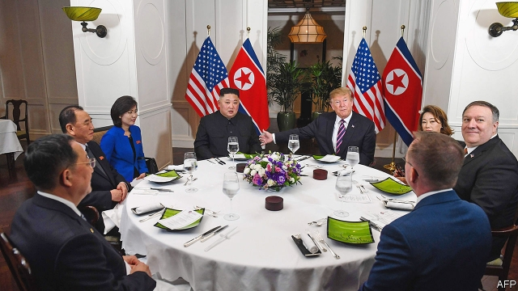

###### Dinner diplomacy

# Sharing a plate of food leads to more successful negotiations 

##### The psychology of eating together 

 

> Mar 14th 2019 

SHRIMP COCKTAIL, grilled sirloin with pear kimchi and chocolate lava cake. Donald Trump and Kim Jong Un had the same food brought to them on individual plates during their summit on February 27th. Psychologists think a meal like this is a good first step towards improving relations. But new work suggests there might have been a more positive outcome with a different serving arrangement. 

As Kaitlin Woolley of Cornell University and Ayelet Fishbach of the University of Chicago report in Psychological Science, a meal taken “family-style” from a central platter can greatly improve the outcome of subsequent negotiations. 

Having conducted previous research in 2017 revealing that eating similar foods led to people feeling emotionally closer to one another, Dr Woolley and Dr Fishbach wondered whether the way in which food was served also had a psychological effect. They theorised that, on the one hand, sharing food with other people might indicate food scarcity and increase a notion of competition. However, they also reasoned that it could instead lead people to become more aware of others’ needs and drive co-operative behaviour as a result. Curious to find out, they set up a series of experiments. 

For the first test they recruited 100 pairs of participants from a local café, none of whom knew each other. In return for a $3 gift card and a chance to win $50 based upon their performance during a negotiation game, the participants were sat at a table and fed tortilla chips with salsa. Half the pairs were given their own basket of 20 grams of chips and a bowl of 25 grams of salsa, and half were given 40 grams of chips and 50 grams of salsa to share. As a cover for the experiment, all participants were told this snack was to be consumed before the game began. 

The game required the participants to negotiate an hourly wage rate during a fictional strike. Each person was randomly assigned to represent the union or management and follow a set of rules. 

The researchers measured co-operation by noting the number of rounds it took to reach an agreement, and found that those who shared food resolved the strike significantly faster (in 8.7 rounds) than those who did not (13.2 rounds). A similar experiment was conducted with 104 participants and Goldfish crackers, this time negotiating an airline’s route prices. The results were much the same, with the food-sharers negotiating successfully 63.3% of the time and those who did not share doing so 42.9% of the time. 

To see if food-sharing among friends worked in the same way as it did among strangers, Dr Woolley and Dr Fishbach ran their strike experiment again with 240 people, partnering together two friends or two strangers. Regardless of whether the pairs were friends or strangers, those who shared food went into fewer rounds during the game, averaging 6.4 rounds, than those who did not share food, averaging 9.8. Friendship did have an effect, though. Whether they shared food or not, friends were generally more co-operative. 

Mr Trump and Mr Kim might balk at having to take turns serving themselves from platters in the centre of a table. But these results suggest that such an arrangement really could help world diplomacy. 

-- 

 单词注释:

1.diplomacy[di'plәumәsi]:n. 外交, 外交手腕, 交际手段 [法] 外交, 外交手腕, 权谋 

2.negotiation[ni.gәuʃi'eiʃәn]:n. 谈判, 磋商, 交涉 [经] 谈判, 协商 

3.shrimp[ʃrimp]:n. 虾, 小虾, 矮子 vi. 捕小虾 

4.cocktail['kɒkteil]:n. 鸡尾酒, 开味品 a. 鸡尾酒会的 

5.sirloin['sә:lɒin]:n. 牛的上部腰肉, 牛里脊肉 

6.kimchi['kimtʃi:]:n. (=kimchee)<朝鲜语>朝鲜泡菜 

7.lava['lɑ:vә]:n. 熔岩, 火山岩 [医] 火山石(一种顺势疗法药) 

8.kim[]:n. 金姆（人名） 

9.jong[jɔŋ]:n. 小伙子；（旧时的）青年男奴 

10.UN[ʌn]:pron. 家伙, 东西 [经] 联合国 

11.psychologist[sai'kɒlәdʒist]:n. 心理学家 [医] 心理学家 

12.kaitlin[]:凯特林(女子名) 

13.Woolley[]:伍利(英国地名) 

14.cornell[kɔ:'nel]:n. 康奈尔（姓氏） 

15.ayelet[]:[网络] 阿伊蕾特；以色列；艾亚蕾特 

16.fishbach[]:[网络] 皮肤试验 

17.Chicago[ʃi'kɑ:gәu]:n. 芝加哥 

18.platter['plætә]:n. 大浅盘, 主菜盘 [计] 底板 

19.emotionally[i'mәuʃәnәli]:adv. 在情绪上 

20.theorise['θiәraiz, 'θi:ә-]:vi. 建立理论, 讲理论, 推理 

21.scarcity['skɑ:siti]:n. 缺乏, 不足, 缺少 [经] 缺乏, 不足 

22.sery[]:n. (Sery)人名；(俄)谢雷；(科特)塞里 

23.participant[pɑ:'tisipәnt]:n. 参加者, 参与者 a. 有份的, 参加的, 参与的 

24.tortilla[tɔ:'tilә]:n. 玉米饼 

25.chip[tʃip]:n. 屑片, 薄片, 碎片 vt. 削, 切, 削成碎片, 使摔倒, 凿 vi. 削下屑片 [计] 孔屑; 组件; 晶片; 芯片 

26.salsa['sɑ:lsә]:n. 洋葱做的辣调味汁；萨尔萨舞曲 

27.hourly['auәli]:a. 每小时的, 以小时计的, 频繁的 adv. 每小时地, 频繁地, 不绝地 

28.fictional['fikʃәnl]:a. 虚构的, 编造的, 小说式的 [法] 拟制的, 假定的, 虚构的 

29.randomly[]:adv. 偶然, 胡乱, 无目的, 任意, 随便, 任取, 无规则, 机遇, 胡乱地, 任意地, 随便地 [计] 随机地 

30.significantly[]:adv. 值得注目地；意味深长地 

31.cracker['krækә]:n. 饼干, 爆竹 [计] 破袭者 

32.balk[bɒ:k]:n. 障碍, 错误, 失败 vt. 阻止, 错过, 推诿 vi. 逡巡不前 

