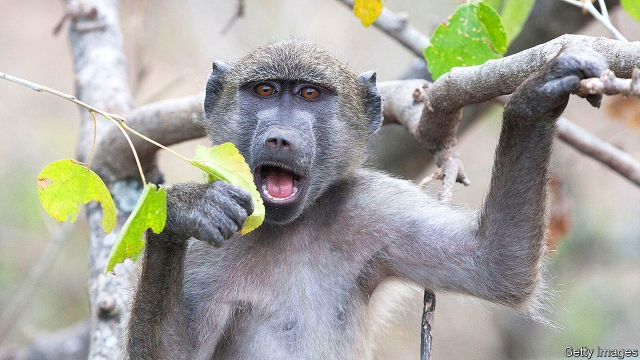

###### Monkey puzzle

# The evolution of monkeys remains a mystery 

##### One theory seems to be wrong 

 

> Mar 14th 2019 

WHY MONKEYS and apes took separate evolutionary paths has long been a mystery. One widely held theory is that environmental changes that led to more open habitats drove a wedge between these animals, leading the ancestors of monkeys to make do with a less nutritious diet of leaves and those of modern apes to thrive upon fruits and seeds. A study led by John Kappelman of the University of Texas and the late David Rasmussen of Washington University, published this week in PNAS, suggests that this idea is wrong. 

There are few vertebrate groups that have a worse fossil record than monkeys. Fossils form best when animals die in places where sediment is constantly being deposited to cover up their bones, like streams, river deltas, coastlines and sand dunes. Because monkeys typically live in lush forests where sediment is rarely deposited, they rarely fossilise. Indeed, while genetic analysis of modern species makes it clear that they diverged from apes 30m years ago, evidence of their first 12m years of existence has until now been composed of just two molars that are too worn to show much detail. 

A new fossil discovered in Nakwai, Kenya by a team of Kenyan and American scientists has now been dated as being 22m years old. Composed of several jaw fragments with well-preserved teeth still stuck in their sockets, the fossil clearly belonged to a monkey. Yet the specimen has raised more questions than it has answered because it lacks an important dental trait known as bilophodonty. 

Best described as teeth that have crests running between their cusps, bilophodont molars are found in all members of the old world monkey family and play a pivotal part in helping these animals to chew leaves efficiently. Because the Kenyan fossil does not have these crests, Dr Kappelman and his colleagues believe it was much more likely to have fed on fruits and seeds. That goes against the prevailing theory that leaves became a major part of the monkey diet after their split from apes 30m years ago. 

Although Alophia, as the researchers have named the fossil, may just be an odd early monkey lineage that broke from its kin and later started eating fruit, it is also possible that this animal had teeth that were typical for monkeys of the time. If so, the monkey puzzle deepens: something other than a taste for leaves must have led them away from apes. 

-- 

 单词注释:

1.ape[eip]:n. 无尾猿 [计] 应用程序评价 

2.evolutionary[,i:vә'lu:ʃәnәri]:a. 展开的, 进化论的, 进化的, 发展的 [计] 进化的, 改良的, 发展的 

3.environmental[in.vaiәrәn'mentәl]:a. 周围的, 环境的 [经] 环境的, 环保的 

4.habitat['hæbitæt]:n. 栖息地, 居留地, 自生地, 聚集处 [医] 习生地, 产地, 生境, 栖所 

5.wedge[wedʒ]:n. 楔子, 楔形物, 起因, 导致分裂的东西 vt. 楔住, 挤进, 楔入 vi. 楔入, 挤进 

6.les[lei]:abbr. 发射脱离系统（Launch Escape System） 

7.nutritious[nju:'triʃәs]:a. 滋养的, 营养的 [医] 有营养的 

8.john[dʒɔn]:n. 盥洗室, 厕所, 嫖客 

9.kappelman[]:[网络] 卡普尔曼 

10.Texas['teksәs]:n. 德克萨斯 

11.david['deivid]:n. 大卫；戴维（男子名） 

12.Rasmussen[]:拉斯马森（人名） 

13.Washington['wɒʃiŋtn]:n. 华盛顿 

14.PNA[]:[医] 巴黎解剖学名词 

15.vertebrate['vә:tibreit]:n. 脊椎动物 a. 有椎骨的, 有脊椎的 

16.fossil['fɒsәl]:n. 化石, 古物 a. 化石的, 陈腐的, 守旧的 

17.sediment['sedimәnt]:n. 沉淀物, 沉积 [化] 沉降物; 沉积物 

18.constantly['kɒnstәntli]:adv. 不变地, 不断地, 时常地 

19.delta['deltә]:n. 三角洲, 希腊字母的第四个字 [医] δ(希腊文的第四个字母), 丁种, 三角, 三角形区 

20.coastline['kәustlain]:n. 海岸线 

21.dune[dju:n]:n. 沙丘 

22.typically['tipikәli]:adv. 代表性地；作为特色地 

23.lush[lʌʃ]:a. 苍翠繁茂的, 多青草的, 丰富的 n. 酒, 酒鬼 v. 饮 

24.fossilise['fɔsilaiz]:vt.vi. 使成化石, 变成化石, 使(思想)陈旧, 使僵化 

25.specie['spi:ʃi]:n. 硬币 [经] 硬币 

26.diverge[dai'vә:dʒ]:vi. 分歧, 岔开 vt. 使岔开 

27.molar['mәulә]:a. 磨碎的, 臼齿的, 摩尔的, 克分子的 n. 臼齿, 磨牙 

28.Kenya['kenjә]:n. 肯尼亚 

29.kenyan['kenjәn]:n. 肯尼亚人 

30.dental['dentl]:a. 牙齿的 [医] 牙的, 齿的, 齿音, 齿音字母 

31.trait[treit]:n. 特征, 特性, 一笔, 少许 

32.crest[krest]:n. 冠, 饰毛, 头盔的顶部 vi. 到达绝顶 vt. 加以顶饰 

33.cusp[kʌsp]:n. 尖头, 尖端 [医] 尖 

34.bilophodont[,bai'lɔfәdәnt]:[动]双脊齿型, 双脊牙型(动物) 

35.pivotal['pivәtәl]:a. 枢轴的, 关键的, 起中心作用的 

36.efficiently[i'fiʃәntli]:adv. 生效, 能胜任, 有能力, 效率高, 有效 

37.lineage['liniidʒ]:n. 血统, 直系 [法] 血统, 世系 

38.kin[kin]:n. 亲戚, 同族, 血缘关系, 家族 a. 有亲属关系的, 性质类似的, 同类的 

