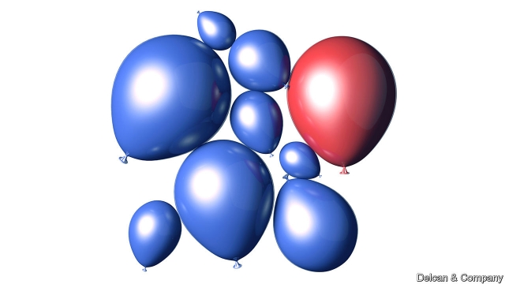
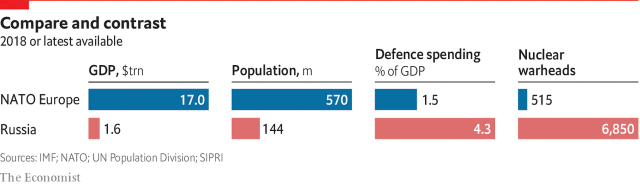

###### Keeping Russia in check

# Decades after the end of the cold war, Russia is showing new aggression 

##### The increased threat from Russia has prompted a vigorous, if uneven, response from the allies 

 

> Mar 14th 2019 

“FOR ME, I’M living the dream,” says Major Pierre Gosselin, a Canadian company commander in NATO’s multinational battlegroup in Latvia. A bleak, freezing-cold firing range in January at Camp Adazi, a military base 45 minutes’ drive from Riga, is not everyone’s idea of heaven. But Major Gosselin and his men, recently arrived for their six-month stint here, are loving the camaraderie, testing their weapons and trying out the different models of the small contingent from Montenegro, NATO’s newest member, which has sent troops to the battlegroup for the first time. 

Last July, asked in a television interview why Americans should defend Montenegro from attack, President Trump seemed to question whether NATO’s mutual-defence guarantee made sense. Montenegrins “may get aggressive”, he said, “and congratulations, you’re in world war three.” The Montenegrins at Adazi, however, are blending in easily. Their leader is particularly impressed by the interoperability of the magazines. 

The Canadian-led battlegroup is one of four that NATO has deployed since 2017 as part of its “enhanced forward presence”; the others are in Estonia (under British leadership), Lithuania (led by Germany) and Poland (where America takes the lead). The battlegroup in Latvia is the most international of the four: nine countries contribute to its 1,400-strong force. Colonel Josh Major, the commander of Task Force Latvia, calls it a “pretty good representation of all of Europe”. His forces have been involved in outreach activities all over the country, helping to counter Russian efforts to discredit NATO’s presence there. It’s been a “great experience for all our troops”, he says. 

But they are not there to have fun. Their job is to change the calculus in Russia, making any incursion much costlier to an aggressor. “The closer you get to Latvia, the more the sense of threat becomes real,” he notes. Part of this is a reflection of history. At the Latvian War Museum in Riga a new exhibition marks the centenary of the country’s war for independence, hard-won with help from allies including Britain and France. But in 1940 the Latvians allowed the Russians in without a fight, and then lived under Soviet occupation for half a century. Next time, if there is one, they are determined to shoot. 

In 2014 Russia provided a fresh reason for Latvians to feel threatened: it invaded Ukraine, with devastating speed, surprise and the use of “hybrid” tactics involving disinformation and disguised troops. It is all too easy to imagine how the same tactics could be applied in the Baltics. “War with Russia”, a novel by General Sir Richard Shirreff, describes exactly such a scenario, drawing on his experience at NATO, where he served as deputy supreme allied commander for Europe. 

The Latvians and their Baltic neighbours are also on their guard because Russia has been building up its forces near their borders in recent years. Russian military modernisation has reached a stage, says Rose Gottemoeller, NATO’s deputy secretary-general, “where we have to be hyper-alert”. 

That is why NATO has enhanced its presence not only on the ground but also in the air. At Amari in Estonia it has added an extra arm of its Baltic air-policing operation (the leading part of it remains in Lithuania). NATO countries take turns to do four-month stints at Amari; currently the Germans are there. Twice a day two of their Eurofighters are in the air within 15 minutes of the siren sounding. Once or twice a week these are live interceptions, typically of Russian planes flying between St Petersburg and the enclave of Kaliningrad. The interceptors get close enough to identify the Russian planes, but without provoking them. 

NATO’s presence in Adazi and Amari is just a start. Some would like to see both missions beefed up to convert the Baltic air policing into air defence and to enlarge the battlegroups and make them permanent. Radek Sikorski, a former Polish foreign minister, calls the Baltic battlegroups “symbolic”. 

So keen is the current Polish government to host a bulkier American force that it has offered to pay the United States about $2bn to set up a permanent base. Poland’s European allies frown on such bilateral deals, which are at odds with NATO’s collective spirit. Critics fear the move could divide the alliance and provoke Russia. Polish officials are confident of getting a beefier American presence in return for “enhanced host-nation support”, stressing that they see this as a regional hub benefiting NATO. 

NATO has plenty on its plate implementing the decisions it has already taken. The credibility of its forward presence depends on having reinforcements ready and being able to deploy them rapidly to prevent Russia from creating a fait accompli in the Baltic states. Simply clearing away obstacles to moving troops across Europe is a big task. 

This is not just about NATO’s eastern front. The alliance needs to be able to respond to threats wherever they may arise. “The alliance has got to get the initiative back, rather than always reacting to Russia,” says Lieutenant-General Ben Hodges, a former commander of the US army in Europe, now at the Centre for European Policy Analysis (CEPA), a think-tank. 

Recently Russia has been flexing its muscles in the Black Sea region. In November it seized three Ukrainian navy ships trying to cross, as they are entitled to do, from the Black Sea to the Sea of Azov via the Kerch Strait. Mr Hodges worries that NATO has not paid enough attention to the area. Russia’s actions have now brought a fresh focus on it. 

 

NATO’s individual members have different perceptions of potential threats. Whereas the Baltic countries are alert to any change in the wind from Russia (“We feel it on our skin,” says Latvia’s defence minister, Artis Pabriks), what Greeks feel on their skin is menace from Turkey, a fellow NATO member. Italians are less worried about Moscow than about migrants crossing the Mediterranean. The French concentrate especially on efforts to stabilise former colonies in Africa. And the Germans seem to feel threatened mainly by the thought that if NATO and the EU were to collapse they would lose the cornerstones of their stability and prosperity. 

To accommodate these diverse interests, the allies have developed what they call a 360-degree approach to security. That involves tackling threats not just from Russia but also from north Africa and the Middle East, sources of migration and terrorism. This has bolstered solidarity among NATO members. It is why Canada is happy to lead a training mission in Iraq and why Latvians have fought and died alongside Americans in Afghanistan. 

But this inclusive approach has its problems. One is that NATO may try to do too much and lose focus on its core mission of defence against Russia. Another is that, though speed is of the essence, decisions get gummed up in a search for consensus among 29 countries. Efforts to cut through this by granting more autonomy to NATO’s military chief, the supreme allied commander for Europe, meet resistance from members wary of ceding sovereignty. 

Contrasting perceptions of threat also make it harder to resolve what has become one of the most contentious issues for NATO: the level of its members’ defence spending, the agreed aim for which is at least 2% of GDP. Because they are so wary of Russia, Latvia and Poland are among the countries that meet this target, but the same is not true for many other members, especially Germany—which is why Mr Trump has criticised it loudly. 

-- 

 单词注释:

1.uneven[.ʌn'i:vәn]:a. 不平坦的, 不均等的, 奇数的 

2.ally['ælai. ә'lai]:n. 同盟者, 同盟国, 助手 vt. 使联盟, 使联合, 使有关系 vi. 结盟 

3.pierre[pi(:)'eә, peә]:n. 皮埃尔（男子名） 

4.gosselin[]: [人名] 戈斯林 

5.multinational[.mʌlti'næʃәnl]:a. 多国的, 跨国公司的 n. 跨国公司 

6.battlegroup[]:na. 战斗群 [网络] 战场；战斗大队；战斗部队 

7.Latvia['lætviә]:n. 拉脱维亚 

8.bleak[bli:k]:a. 萧瑟的, 荒凉的, 阴冷的 

9.Adazi[]:阿达吉 

10.riga['ri:^ә]:n. 里加（拉脱维亚共和国首都） 

11.stint[stint]:vt. 节省, 限制, 停止 vi. 节约 n. 吝惜, 节约, 限额 

12.camaraderie[.kæmә'rɑ:dәri:]:n. 友情；同志之爱 

13.contingent[kәn'tindʒәnt]:a. 或许发生的, 附随的, 偶然发生的 n. 偶然事件, 分遣队 

14.Montenegro[.mɒnti'ni:grәu]:n. 黑山 

15.Montenegrin[.mɒnti'ni:grin]:a. 黑山的 n. 黑山人 

16.interoperability['intәr,ɔpərә'bilәti]:[计] 互用性, 互操作性 

17.NATO['neitәj]:北大西洋公约组织, 北约组织 [经] 北大西洋公约组织 

18.deploy[di'plɒi]:v. 展开, 配置 

19.Estonia[es'tәuniә]:n. 爱沙尼亚 

20.lithuania[,liθju(:)'einjә, -niә]:n. 立陶宛 

21.Poland['pәulәnd]:n. 波兰 

22.josh[dʒɒʃ]:v. 戏弄, 说笑 n. 无恶意的戏谑, 玩笑 

23.representation[.reprizen'teiʃәn]:n. 表示法, 表现, 陈述, 代表 [计] 表示法指定 

24.outreach[aut'ri:tʃ]:vt. 超出...的范围, 作超出能力所及的事而害及自己, 占...的上风, 胜过 vi. 走得太远, 伸出, 展开 

25.discredit[dis'kredit]:n. 无信用, 丢脸, 不名誉 vt. 不信, 怀疑, 使丢脸 

26.calculus['kælkjulәs]:n. 结石；微积分学 

27.incursion[in'kә:ʃәn]:n. 侵入, 侵略, 奇袭 

28.aggressor[ә'gresә]:n. 侵略者, 挑畔者 [法] 侵略者, 攻击者 

29.Latvian['lætviәn]:a. 拉脱维亚的 n. 拉脱维亚人, 拉脱维亚语 

30.centenary[sen'ti:nәri]:n. 一百年 a. 一百年的 

31.Latvian['lætviәn]:a. 拉脱维亚的 n. 拉脱维亚人, 拉脱维亚语 

32.ukraine[ju(:)'krein]:n. 乌克兰（原苏联一加盟共和国, 现已独立） 

33.devastate['devәsteit]:vt. 毁坏 [法] 使荒废, 毁灭, 掠夺 

34.hybrid['haibrid]:n. 混血儿, 杂种, 混合物 a. 混合的, 杂种的, 混合语的 [计] NetWare的主机实用程序, 双重用户建立程序 

35.tactic['tæktik]:n. 一项战术, 一条策略 a. 战术的, 顺序的, 排列的 

36.disinformation[.disinfә'meiʃәn]:n. 假情报 

37.Baltic['bɒ:ltik]:a. 波罗的海的 

38.richard['ritʃәd]:n. 理查德（男子名） 

39.shirreff[]: [人名] 希里夫 

40.scenario[si'nɑ:riәu]:n. 剧本提纲, 情节, 剧本, 方案, 事态 [计] 方案 

41.Baltic['bɒ:ltik]:a. 波罗的海的 

42.modernisation[,mɔdәnai'zeiʃәn;-ni'z-]:n. <主英>=modernization 

43.gottemoeller[]: [人名] 戈特莫勒 

44.amari[]:n. (Amari)人名；(法、意、阿拉伯)阿马里；(英)阿马里，阿玛丽(女名) 

45.currently['kʌrәntli]:adv. 现在, 当前, 一般, 普通 [计] 当前 

46.Eurofighter[]:[网络] 欧洲战斗机；欧洲战机；欧洲战机集团 

47.siren['saiәrin]:n. 女海妖, 妖女, 警报器, 汽笛, 迷人的美女 a. 诱惑的 vi. 响着警报器前进 

48.interception[,intә(:)'sepʃәn]:n. 拦截, 截断, 截住, 截取, 截击, 窃听, 侦听, 雷达侦察 [计] 截取, 窃听 

49.typically['tipikәli]:adv. 代表性地；作为特色地 

50.ST[]:[计] 段表, 状态, 系统测试, 直端连接器 [化] 磺胺噻唑 

51.petersburg['pi:tәzbә:^]:n. 彼得斯堡（美国城市）；彼得堡（苏联城市列宁格勒旧称） 

52.enclave[en'cleiv]:n. 被包围的领土 [医] 被包围物 

53.KALININGRAD[kә'linin^ræd]:加里宁格勒 

54.interceptor[.intә'septә]:n. 阻止的人, 妨碍者, 拦截战斗机 [法] 窃听器, 截取者, 障碍物 

55.provoke[prә'vәuk]:vt. 激怒, 惹起, 诱导 [法] 刺激, 煽动, 激怒 

56.radek[]:n. (Radek)人名；(波)拉德克；(俄)拉杰克 

57.Sikorski[]:n. (Sikorski)人名；(德、波、俄、瑞典)西科尔斯基 

58.symbolic[sim'bɒlik]:a. 象征的, 符号的 [电] 符号化 

59.bulky['bʌlki]:a. 庞大的 [机] 庞大, 笨重 

60.bilateral[bai'lætәrәl]:a. 有两边的, 双边的, 双方的 [医] 两侧的 

61.odds[ɒdz]:n. 可能性, 几率, 机会, 胜算, 不平等 

62.alliance[ә'laiәns]:n. 联盟, 联合 [法] 同盟, 联盟, 联姻 

63.beefy['bi:fi]:a. (牛)多肉的, 象牛肉的, 粗壮的, 结实的 

64.regional['ri:dʒәnәl]:a. 地方的, 地域性的 [医] 区的, 部位的 

65.hub[hʌb]:n. 毂, 木片, 中心 [计] 插座; 插孔; 集线器, 集中器, 连接器, 中继站 

66.credibility[.kredi'biliti]:n. 可信用, 确实性, 可靠 [法] 证据能力, 可信程度, 确实性 

67.reinforcement[.ri:in'fɒ:smәnt]:n. 加强, 增援, 补充, 援军, 加固物 [化] 补强; 加强件 

68.fait[]:[法] 契据, 事实, 行为 

69.accompli[]:n. 同谋者 [网络] 天拓；摩托罗拉天拓；天拓系列 

70.alway['ɔ:lwei]:adv. 永远；总是（等于always） 

71.ben[ben]:n. 内室 [医] 贝昂(俗名,一般指辣木Moringa oleifera,有时也指一些不同属的植物) 

72.hodge[hɔdʒ]:n. 霍奇（男子名, 等于Roger） 

73.CEPA[]:[化] 耦合电子对近似 

74.flex['fleks]:vt. 弯曲, 伸缩, 折曲 vi. 弯曲 n. 屈曲, 折曲 

75.ukrainian[ju(:)'kreinjәn]:a. 乌克兰的；乌克兰人的 

76.Azov['æzɒv]:n. 亚速海 

77.Kerch[kə:tʃ]:n. 刻赤 

78.perception[pә'sepʃәn]:n. 知觉, 感觉, 领悟力, 获取 [医] 知觉 

79.artis[]:n. 阿提斯动物园（位于荷兰） 

80.menace['menis]:n. 威胁, 胁迫 v. 威吓, 胁迫 

81.les[lei]:abbr. 发射脱离系统（Launch Escape System） 

82.migrant['maigrәnt]:n. 候鸟, 移居者 [法] 移居者 

83.stabilise['steibilaiz]:vt.vi. (使)稳定, (使)安定, (使)坚固 vt. 装稳定器 

84.EU[]:[化] 富集铀; 浓缩铀 [医] 铕(63号元素) 

85.cornerstone['kɔ:nәstәjn]:n. 奠基石, 基础 

86.tackle['tækl]:n. 工具, 复滑车, 滑车, 装备, 扭倒 vt. 固定, 处理, 抓住 vi. 扭倒 

87.migration[mai'greiʃәn]:n. 移民, 移往, 移动 [计] 迁移 

88.terrorism['terәrizm]:n. 恐怖主义, 恐怖统治, 恐怖状态 [法] 胁迫, 暴政, 恐怖政治 

89.bolster['bәulstә]:n. 支持, 长枕 vt. 支持, 支撑 

90.solidarity[.sɒli'dæriti]:n. 团结, 团结一致, 共同一致 [法] 团结, 共同责任 

91.Iraq[i'rɑ:k]:n. 伊拉克 

92.Afghanistan[æf'gænistæn]:n. 阿富汗 

93.inclusive[in'klu:siv]:a. 包含的, 包括的 

94.essence['esns]:n. 实质, 本质, 香精 [化] 香精 

95.autonomy[ɒ:'tɒnәmi]:n. 自治, 自治权 [医] 自主性 

96.wary['wєәri]:a. 谨慎的, 小心的, 机警的, 周到的, 唯恐的 

97.cede[si:d]:vt. 割让 [法] 割让, 让与, 放弃 

98.sovereignty['sɒvrәnti]:n. 主权, 独立国 [法] 主权, 主权国家, 统治权 

99.contentious[kәn'tenʃәs]:a. 好争吵的, 爱争论的, 有异议的 [法] 诉讼的, 争执的, 引起争论的 

100.criticise['kritisaiz]:v. 批评, 吹毛求疵, 非难 

