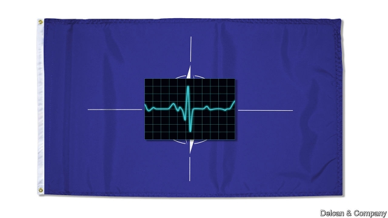
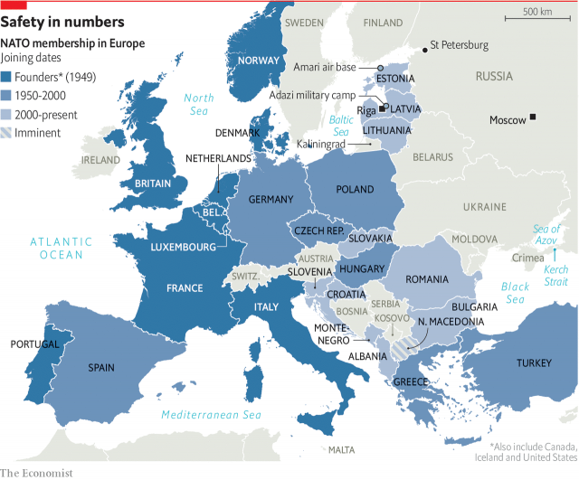
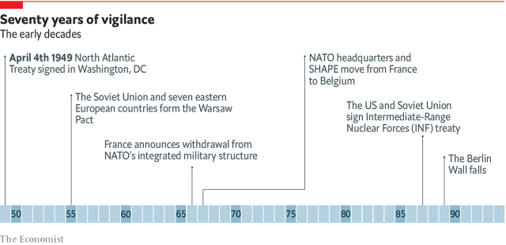

###### NATO at 70

# How NATO is shaping up at 70 

##### The Atlantic alliance has proved remarkably resilient, says Daniel Franklin. To remain relevant, it needs to go on changing 

 

> Mar 14th 2019 

REACHING 70 IS an extraordinary achievement for the North Atlantic Treaty Organisation. Most alliances die young. External threats change; national interests diverge; costs become too burdensome. Russia’s pact with Nazi Germany survived for only two years. None of the seven coalitions of the Napoleonic wars lasted more than five years. A study in 2010 by the Brookings Institution, a Washington think-tank, counted 63 major military alliances over the previous five centuries, of which just ten lived beyond 40; the average lifespan of collective-defence alliances was 15 years. 

“NATO is the strongest, most successful alliance in history”, says Jens Stoltenberg, the organisation’s secretary-general, “because we have been able to change.” It has expanded from 12 members at its birth to 29—soon to be 30 when North Macedonia joins, its dispute with Greece over its name now settled. Of the eight countries that made up its erstwhile rival, the Warsaw Pact, seven have become part of NATO, as have three former Soviet republics. The eighth one, the Soviet Union itself, has ceased to exist. 

For its first four decades NATO was busy deterring the Soviet threat. Its role was to keep “the Russians out, the Americans in and the Germans down”, as its first secretary-general, Lord Ismay, put it. But after communism collapsed, the alliance did not proclaim victory and shut up shop; instead it reinvented itself, helping to stabilise the new democracies of eastern Europe. 

Realising that it needed to go “out of area or out of business”, it then embarked on a period of far-flung crisis-management, from the Balkans (with interventions in Bosnia and Kosovo) to the Horn of Africa (where an anti-piracy mission ran from 2009 to 2016) and Afghanistan (where it still leads some 16,000 troops in Operation Resolute Support). NATO’s founders would have been stunned by such mission creep—as well as by the circumstances in which Article 5 of its treaty, which says that an armed attack against one member will be considered an attack against them all, was put to use. The only time the allies invoked this pledge was on September 12th 2001, the day after al-Qaeda’s terrorist attacks on America. 

After Russia’s annexation of Crimea in 2014 the alliance moved swiftly back to its core business of deterrence against its eastern neighbour. Now for the first time it is having to juggle invigorated collective defence and crisis management simultaneously. At 70, it is hardly settling for an easy life. 

Its birthday celebrations will be modest: just a one-day gathering of foreign ministers on April 4th in Washington, DC, where the North Atlantic Treaty was signed in 1949. NATO wants to avoid a repeat of the bruising confrontations that took place at its summit in Brussels last July, where America’s president, Donald Trump, berated his allies for not pulling their weight on defence. If they did not shape up, he said, his country might go its own way. Another damaging row is the last thing the organisation needs as it struggles with intimations of its own mortality. “We don’t have a guarantee that NATO will survive for ever,” says Mr Stoltenberg. 

At times Mr Trump has seemed to suggest that he would be happy to see it die. On the campaign trail he called it “obsolete”. Once in office, he initially avoided backing its collective-security pledge; instead, he seemed to regard NATO as just another deal, in which American taxpayers were getting ripped off. In January the New York Times reported that several times last year he privately said he wanted to pull the United States out of NATO. Such reports only fuel fears that he might be doing Russia’s bidding. Mr Trump calls these suspicions “insulting”. 

 

If he were to decide to abandon NATO he would face resistance in Congress, where bipartisan support for the alliance remains strong and control of the purse strings powerful. A record number of more than 50 senators and representatives attended the Munich Security Conference last month to show solidarity. Last July the Senate voted 97-2 to back NATO. In January the House of Representatives voted 357-22 in favour of the NATO Support Act, which would prohibit any use of federal funds for withdrawal. Though heartening for NATO, these votes highlight the sense of threat hanging over it. 

Yet its pharaonic new headquarters on the outskirts of Brussels projects the permanence of an organisation preparing for its next 70 years, not one about to perish. Opinion polls show solid public support for NATO in its member countries (with the significant exceptions of Turkey and Greece). Even in America, despite Mr Trump’s attacks, 64% of those polled by Pew Research Centre are favourable towards NATO, up from 49% in 2015, and a survey last year by the Chicago Council on Global Affairs showed that more Americans than at any point since polling began in 1974 favour increasing their country’s commitment to the alliance. 

NATO optimists offer three reasons for not fretting too much over Mr Trump. First, NATO is no stranger to crises, from Suez in 1956 to France quitting the integrated military command in 1966 and splits over the Iraq war in 2003. It has a record of resilience. 

Second, they point out that since becoming president, Mr Trump has said that the alliance is “no longer obsolete”, that he is “committed to Article 5” and that America will be “with NATO 100%”. True, he continues to lambast his allies for failing to pay their fair share of their own defence, but on this matter his bullying is justified and useful: the allies do need to spend more. 

Their third and strongest argument for remaining sanguine about Mr Trump is based on his deeds rather than his tweets. On his watch America has increased, not decreased, its defence efforts in Europe, with more equipment, more troops and more money. Funding for America’s military presence in Europe, under what is called the European Deterrence Initiative, has risen by 40%. 

This is part of NATO’s determined response to the increased threat from Russia. At summits in Wales in 2014, Warsaw in 2016 and last year in Brussels—even as the world focused on Mr Trump’s bolshiness—the allies took a series of decisions designed to restore robust territorial defence. They created a Very High Readiness Joint Task Force, prepared to move within days, and put combat-ready multinational battlegroups into the three Baltic countries as well as Poland. They committed themselves to a costly “Four 30s” initiative, with the aim of having 30 mechanised battalions, 30 air squadrons and 30 warships ready to move in no more than 30 days by 2020. To ensure swift movement of forces, they planned two new commands, in Norfolk, Virginia, and Ulm in Germany. 

 

Last autumn NATO tested its capabilities in Trident Juncture, its biggest exercise since the end of the cold war, which involved some 50,000 people in and around Norway. Gaps remain, but the erosion of defence capacity that NATO had allowed as a peace dividend after the collapse of communism is being reversed. 

This special report will run a health check on NATO. It will assess the alliance’s chances of surviving through its 70s and consider how it needs to change in order to remain vigorous to 100. In the short term the wild card remains Mr Trump. For two years the allies were reassured by the presence around him of NATO-friendly “adults in the room”, especially generals such as James Mattis, the defence secretary. These grown-ups could not prevent transatlantic rows over trade and the nuclear deal with Iran, which Mr Trump has abandoned, but they could exercise some restraint. They are now gone; Mr Mattis quit in December. His resignation letter pointedly stressed the importance of “treating allies with respect”. 

Even without Mr Trump, however, the cohesion and the democratic values that the alliance is supposed to share are under strain. It can still summon up solidarity, for example in response to Russia’s nerve-agent attack on Sergei Skripal, a Russian ex-spy, and his daughter Yulia in Salisbury in England. But divisions among the Europeans look worryingly wide. 

Britain, usually a NATO stalwart, is consumed by Brexit, and might even elect a seasoned NATO-basher, Labour’s Jeremy Corbyn, as its next prime minister. Nationalist governments in Hungary and Poland are at odds with their EU partners. France’s relations with Italy sank so low that it recently recalled its ambassador. 

 

Relations between America and strategically critical Turkey, which will soon be overtaking Germany as NATO’s second-most-populous country, have been strained, too. Turkey’s plan to buy a Russian air-defence system is a sore topic in Washington. The two countries have also been at odds over Turkey’s detention of an American pastor (now released) and over America’s refusal to extradite a Turkish cleric, Fethullah Gulen, whom President Recep Tayyip Erdogan blames for an attempted coup in Turkey in 2016. And they disagree over the fate of Kurds in Syria who fought alongside America but are seen as terrorists by Mr Erdogan. If relations were to sour badly, America could “devastate Turkey economically”, Mr Trump has said. Both sides seem to be working to avoid that. 

These are not the best of times for the allies to be tackling an issue as thorny as intermediate-range nuclear forces (INF). On February 1st America pulled out of the 31-year-old INF treaty banning land-based missiles with a range of 500-5,500km, in response to what it called clear Russian violation. NATO has backed America’s move, but the issue threatens to become as fraught as when American cruise and Pershing II missiles were being deployed in Europe in the 1980s to counter the Soviet Union’s mid-range nuclear arsenal. Now, as then, there is a risk of holes in America’s nuclear umbrella that could leave the European allies vulnerable. 

NATO has been very effective for 70 years, says Mike Pompeo, America’s secretary of state, who will host the anniversary meeting in Washington, “and we want to make sure that it continues to be effective for the next 70 years.” That will not be easy. The tectonic plates of geopolitics are shifting. A return to great-power rivalry is in prospect. Although Russia has a potent nuclear-tipped military force and an opportunistic willingness to disrupt the status quo, in the long run it is seen as a declining power. The emerging giant is China. The old Soviet Union peaked at less than 60% of America’s GDP and a population about a fifth bigger. In China, America faces a rival that has four times as many people and will soon outstrip its economy. As China rises, challenging America’s interests around the world, it will take up ever more of America’s attention and resources. That process started before the Trump presidency, and will continue and intensify far beyond it. 

How can the transatlantic alliance hold together as America becomes less focused on Europe and more immersed in Asia? That is a vital question, but so far NATO has barely started tackling it. 

-- 

 单词注释:

1.NATO['neitәj]:北大西洋公约组织, 北约组织 [经] 北大西洋公约组织 

2.alliance[ә'laiәns]:n. 联盟, 联合 [法] 同盟, 联盟, 联姻 

3.remarkably[ri'mɑ:kәbli]:adv. 显著地, 引人注目地, 非常地 

4.resilient[ri'ziliәnt]:a. 弹回的, 有弹力的 [医] 回弹的, 回能的 

5.daniel['dænjәl]:n. 丹尼尔（男子名） 

6.Franklin['fræŋklin]:[计] 富兰克林 

7.organisation[,ɔ: ^әnaizeiʃən; - ni'z-]:n. 组织, 团体, 体制, 编制 

8.diverge[dai'vә:dʒ]:vi. 分歧, 岔开 vt. 使岔开 

9.burdensome['bә:dnsәm]:a. 累赘的, 恼人的, 繁重的 [法] 难于负担的, 压抑的, 累赘的 

10.pact[pækt]:n. 契约, 协定, 条约 [化] 合同 

11.Nazi['nɑ:tsi]:n. 纳粹党人 a. 纳粹党的 

12.coalition[.kәuә'liʃәn]:n. 结合体, 结合, 联合 [经] 联合, 联盟 

13.Napoleonic[nәpәuli'ɔnik]:a. (像)拿破仑一世的,拿破仑一世式的,拿破仑一世时期的,拿破仑一家的 

14.Brooking[]:n. (Brooking)人名；(英、西)布鲁金 忍受（brook的现在分词形式） 容忍 

15.Washington['wɒʃiŋtn]:n. 华盛顿 

16.lifespan['laifspæn]:n. 预期生命期限；寿命；预期使用期限 

17.jen[]:n. 珍（女子名） 

18.Stoltenberg[]:n. (Stoltenberg)人名；(瑞典)斯托尔滕贝里；(挪)斯托尔滕贝格；(德)施托尔滕贝格 

19.Macedonia[,mæsi'dәunjә]:n. 马其顿 

20.erstwhile['ә:stwail]:adv. 以前, 往昔地 a. 以前的, 往昔的 

21.warsaw['wɔ:sɔ:]:n. 华沙（波兰首都） 

22.pact[pækt]:n. 契约, 协定, 条约 [化] 合同 

23.deter[di'tә:]:vt. 制止, 吓住, 威慑 

24.ismay[]: [人名] 伊斯梅; [地名] [美国] 伊斯梅 

25.reinvent[.ri:in'vent]:vt. 重新使用；彻底改造；重复发明（在不知他人已发明的情况下） 

26.stabilise['steibilaiz]:vt.vi. (使)稳定, (使)安定, (使)坚固 vt. 装稳定器 

27.embark[im'bɑ:k]:vi. 乘船, 着手, 从事, 上飞机 vt. 使上船, 使上飞机, 使从事 

28.Balkan['bɒ:lkәn]:a. 巴尔干的 

29.intervention[.intә'venʃәn]:n. 插入, 介入, 调停 [经] 干预 

30.bosnia['bɔzniә]:n. 波斯尼亚；波士尼亚 

31.Kosovo['kɔ:sәvәj]:科索沃[南斯拉夫自治省名] 

32.Afghanistan[æf'gænistæn]:n. 阿富汗 

33.resolute['rezәlu:t]:n. 果断的人 a. 坚决的, 刚毅的, 毅然的 

34.founder['faundә]:n. 创立者, 建立者 vt. 使沉没, 使摔倒, 弄跛, 浸水, 破坏 vi. 沉没, 摔到, 变跛, 倒塌, 失败 

35.stun[stʌn]:vt. 使昏迷, 使震惊, 打昏 n. 昏迷, 猛击 

36.ally['ælai. ә'lai]:n. 同盟者, 同盟国, 助手 vt. 使联盟, 使联合, 使有关系 vi. 结盟 

37.invoke[in'vәuk]:vt. 祈求, 恳求, 实行, 援引, 引起 [计] 调用; 请求 

38.pledge[pledʒ]:n. 诺言, 保证, 誓言, 抵押, 信物, 保人, 祝愿 vt. 许诺, 保证, 使发誓, 抵押, 典当, 举杯祝...健康 

39.terrorist['terәrist]:n. 恐怖分子 [法] 恐怖份子, 恐怖主义 

40.annexation[ænek'seiʃәn]:n. 合并, 附加, 附加物 [法] 兼并, 侵吞, 附加物 

41.Crimea[krai'miә]:n. 克里米亚, 克里米亚半岛 

42.swiftly['swiftli]:adv. 很快地, 即刻 

43.deterrence[di'tә:rәns]:n. 威慑, 威慑力量 [法] 威慑力量, 制止物 

44.juggle[dʒʌgl]:vi. 玩戏法, 行骗, 篡改 vt. 耍弄, 歪曲, 篡改 n. 玩戏法, 魔术, 欺骗 

45.invigorate[in'vigәreit]:vt. 使精力充沛, 鼓舞, 搞活, 使健壮 

46.simultaneously[simәl'teiniәsly; (?@) saim-]:adv. 同时发生, 一齐, 同时, 同时存在 

47.DC[]:直流电 [计] 数据单元, 数据中心, 数据代码, 数据通信, 数据控制, 数字控制, 直流 

48.confrontation[.kɔnfrʌn'teiʃәn]:n. 对抗；对质；面对 

49.Brussel[]:n. 布鲁塞尔（比利时首都） 

50.berate[bi'reit]:vt. 严责 

51.organisation[,ɔ: ^әnaizeiʃən; - ni'z-]:n. 组织, 团体, 体制, 编制 

52.intimation[.inti'meiʃәn]:n. 暗示, 提示, 通知 [法] 告知, 通知, 暗示 

53.mortality[mɒ:'tælәti]:n. 必死的命运, 死亡数目, 死亡率 [医] 必死性, 死亡率 

54.obsolete['ɒbsәli:t]:a. 荒废的, 成废物的, 陈旧的, 老式的 n. 废词, 废物 

55.initially[i'niʃәli]:adv. 最初, 开头 

56.taxpayer['tækspeiә]:n. 纳税人 [法] 纳税人, 纳税义务人 

57.rip[rip]:n. 裂痕, 破绽, 拉裂, 浪子, 巨浪 vi. 被拉开, 裂开, 猛冲 vt. 撕, 扯, 劈 

58.york[jɔ:k]:n. 约克郡；约克王朝 

59.privately[]:adv. 秘密地；私下地 

60.bipartisan[bai,pɑ:ti'zæn]:a. 两党连立的 

61.senator['senәtә]:n. 参议员, (某些大学的)理事 [法] 参议员, 上议员 

62.Munich['mju:nik]:n. 慕尼黑 

63.solidarity[.sɒli'dæriti]:n. 团结, 团结一致, 共同一致 [法] 团结, 共同责任 

64.withdrawal[wið'drɒ:l]:n. 提款, 撤退, 退回, 撤消, 退隐, 戒毒过程 [医] 戒除, 脱瘾 

65.hearten['hɑ:tn]:vt. 使振作, 激励 vi. 振作 

66.pharaonic[]:a. （古埃及王）法老的; 像法老的; 暴君（般）的 

67.headquarter[,hed'kwɔ:tә]:vt. 将...的总部设在 

68.permanence['pә:mәnәns]:n. 永久, 持久, 固定性 [法] 永久性, 持久性 

69.perish['periʃ]:vi. 毁灭, 丧生, 凋谢, 颓丧, 死亡, 腐烂 vt. 毁坏, 使麻木, 使丧生, 耗尽 

70.pew[pju:]:n. 教堂长椅, 会众, 座位 vt. 为(教堂)安装座位, 把...围在一起 

71.Chicago[ʃi'kɑ:gәu]:n. 芝加哥 

72.optimist['ɔptimist]:n. 乐观者, 乐观主义者 

73.fret[fret]:n. 烦躁, 磨损, 焦急, 网状饰物 vi. 烦恼, 不满, 磨损 vt. 使烦恼, 腐蚀, 使磨损, 使起波纹 

74.Suez['sju(:)iz]:n. 苏伊士 

75.Iraq[i'rɑ:k]:n. 伊拉克 

76.resilience[ri'ziliәns]:n. 弹回, 有弹力, 恢复力 [化] 回弹; 弹性; 弹回性; 回能; 弹能 

77.lambast[]:vt. 鞭打, 狠打, 严厉责骂 [机] 害草净 

78.bully['buli]:n. 欺凌弱小者, 土霸 vt. 威胁, 恐吓, 欺负 vi. 欺负 a. 特好的, 第一流的 adv. 十分 

79.sanguine['sæŋgwin]:a. 血红色的, 满怀希望的, 乐观的 n. 血红色, 红粉笔 vt. 用血沾污, 血染 

80.tweet[twi:t]:vi. 啁啾 n. 小鸟叫声 

81.deterrence[di'tә:rәns]:n. 威慑, 威慑力量 [法] 威慑力量, 制止物 

82.wale[weil]:n. 隆起的伤痕, 鞭痕, 凸条纹, 精华, 选择 vt. 在...上留下鞭痕, 织成棱纹, 挑选, 撑住 vi. 挑选 

83.sery[]:n. (Sery)人名；(俄)谢雷；(科特)塞里 

84.robust[rәu'bʌst]:a. 健康的, 强健的, 要用力气的, 坚定的, 粗野的 [计] 健壮性 

85.territorial[.teri'tɒ:riәl]:a. 领土的, 土地的, 地方的, 区域性的 n. 本土自卫队队员 

86.readiness['redinis]:n. 预备, 准备, 敏捷 

87.multinational[.mʌlti'næʃәnl]:a. 多国的, 跨国公司的 n. 跨国公司 

88.battlegroup[]:na. 战斗群 [网络] 战场；战斗大队；战斗部队 

89.Baltic['bɒ:ltik]:a. 波罗的海的 

90.Poland['pәulәnd]:n. 波兰 

91.mechanise['mekәnaiz]:vt. 使机械化, 用机器 

92.battalion[bә'tæljәn]:n. 营, 军队, 集团 

93.squadron['skwɒdrәn]:n. 骑兵营, 分遣队, 小舰队 

94.warship['wɒ:ʃip]:n. 军舰, 战船 

95.Norfolk['nɒ:fәk]:n. 诺福克(英格兰郡名) 

96.Virginia[vә'dʒinjә]:n. 弗吉尼亚 

97.Ulm[jlm]:乌尔姆[德意志联邦共和国南部城市](或译乌耳姆) 

98.capability[.keipә'biliti]:n. 能力, 性能, 约束力 [化] 能力 

99.Trident['traidnt]:n. 三齿鱼叉, 三叉戟, 三叉线 a. 三叉的, 三齿的 

100.juncture['dʒʌŋktʃә]:n. 接合, 连接, 接缝 

101.Norway['nɒ:wei]:n. 挪威 

102.erosion[i'rәuʒәn]:n. 腐蚀, 冲蚀, 侵蚀 [化] 磨耗; 侵蚀 

103.dividend['dividend]:n. 被除数, 股利 [计] 被除数 

104.reassure[.ri:ә'ʃuә]:vt. 使...安心, 向...再保证 [法] 重新保证, 再保险, 使清除疑虑 

105.jame[]: 灰岩井 

106.matti[]:n. (Matti)人名；(法、意、芬、以、瑞典)马蒂 

107.transatlantic[.trænsәt'læntik]:a. 横渡大西洋的, 大西洋彼岸的, 美国的 

108.Iran[i'rɑ:n]:n. 伊朗 

109.pointedly[]:adv. 指向地；尖锐地 

110.cohesion[kәu'hi:ʒәn]:n. 结合, 黏聚, 内聚 [计] 内聚性 

111.summon['sʌmәn]:vt. 召唤, 召集, 号召, 振奋, 唤起, 鼓起 [经] 传唤, 传讯 

112.Sergei[]:塞奇（人名） 

113.yulia[]:[网络] 尤利娅；尤莉娅；尤利亚 

114.salisbury['sɔ:lzbәri]:n. 索尔兹伯里市（津巴布韦, 原罗得西亚首都） 

115.worryingly['wʌrɪɪŋlɪ]:adv. 焦虑地, 烦恼地 

116.stalwart['stɒ:lwәt]:n. 健壮的人 a. 高大结实的, 坚定的 

117.Brexit[]:[网络] 英国退出欧盟 

118.jeremy['dʒerimi]:n. 杰里米（男子名） 

119.Corbyn[]:科尔宾（人名） 

120.nationalist['næʃәnәlist]:n. 国家主义者, 民族主义者 

121.Hungary['hʌŋgәri]:n. 匈牙利 

122.odds[ɒdz]:n. 可能性, 几率, 机会, 胜算, 不平等 

123.EU[]:[化] 富集铀; 浓缩铀 [医] 铕(63号元素) 

124.strategically[strә'ti:dʒikәli]:adv. 在战略上, 颇策略地 

125.detention[di'tenʃәn]:n. 阻止, 监禁, 拘留 [医] 隔离, 拘留, 滞留, 停滞 

126.pastor['pæstә]:n. 牧师 

127.extradite['ekstrәdait]:vt. 引渡, 获取(逃犯等)的引渡 [法] 引渡, 使被引渡 

128.Turkish['tә:kiʃ]:n. 土耳其语 a. 土耳其的, 土耳其人的, 土耳其语的 

129.cleric['klerik]:a. 牧师的, 教士的 

130.gulen[]:[网络] 居伦；葛兰 

131.recep[]:n. (Recep)人名；(土)雷杰普 

132.tayyip[]:[网络] 塔伊普 

133.erdogan[]:[网络] 埃尔多安；土耳其总理埃尔多安；艾尔多安 

134.coup['ku:]:n. 砰然的一击, 妙计, 出乎意料的行动, 政变 [医] 发作, 中, 击 

135.Kurd[kuәd]:n. 库尔德人 

136.Syria['siriә]:n. 叙利亚 [经] 叙利亚 

137.devastate['devәsteit]:vt. 毁坏 [法] 使荒废, 毁灭, 掠夺 

138.economically[i:kә'nɔmikәli]:adv. 节约地, 不浪费地, 节省地, 节俭地, 在经济上, 在经济学上 

139.tackle['tækl]:n. 工具, 复滑车, 滑车, 装备, 扭倒 vt. 固定, 处理, 抓住 vi. 扭倒 

140.thorny['θɒ:ni]:a. 多刺的, 令人苦恼的 

141.inf[]:abbr. 中程核力量（Intermediate-range Nuclear Forces） 

142.violation[.vaiә'leiʃәn]:n. 违反, 违背, 妨碍 [法] 违犯, 违背, 违反 

143.fraught[frɒ:t]:a. 含有...的, 伴着...的, 充满...的 

144.cruise[kru:z]:n. 巡航, 巡弋, 漫游 v. 巡航, 巡弋, 漫游 

145.persh[]:abbr. perishable 易腐坏的（东西） 

146.ii[]:abbr. 微光（Image Intensification） 

147.deploy[di'plɒi]:v. 展开, 配置 

148.arsenal['ɑ:snәl]:n. 兵工厂, 军械库 [机] 兵工厂 

149.vulnerable['vʌlnәrәbl]:a. 易受伤害的, 有弱点的, 易受影响的, 脆弱的, 成局的 [医] 易损的 

150.mike[maik]:vi. 偷懒, 游手好闲 n. 休息, 游手好闲, 扩音器, 话筒 

151.pompeo[]:n. (Pompeo)人名；(意)蓬佩奥 

152.tectonic[tek'tɒnik]:a. 构造的, 建筑的 [医] 整形的, 整复的, 成形的 

153.geopolitic[,dʒi:әjpә'litik]:a. 地理政治学的 

154.rivalry['raivlri]:n. 竞争, 对抗 [医] 拮抗 

155.potent['pәutnt]:a. 有力的, 有说服力的, 有效的 [医] 有力的, 有性交能力的 

156.opportunistic[.ɒpәtju:'nistik]:a. 机会主义的, 投机取巧的 

157.disrupt[dis'rʌpt]:a. 分裂的, 中断的 vt. 使分裂, 使瓦解 

158.statu[]:[网络] 状态查看；雕像；特级雪花白 

159.quo[]:vt. [古]说 

160.les[lei]:abbr. 发射脱离系统（Launch Escape System） 

161.outstrip[.aut'strip]:vt. 追过, 胜过, 凌驾 

162.presidency['prezidәnsi]:n. 总统职权, 总裁职位 

163.intensify[in'tensifai]:vt. 加强 vi. 强化 

164.immerse[i'mә:s]:vt. 沉浸, 使陷入 [医] 浸[入] 

