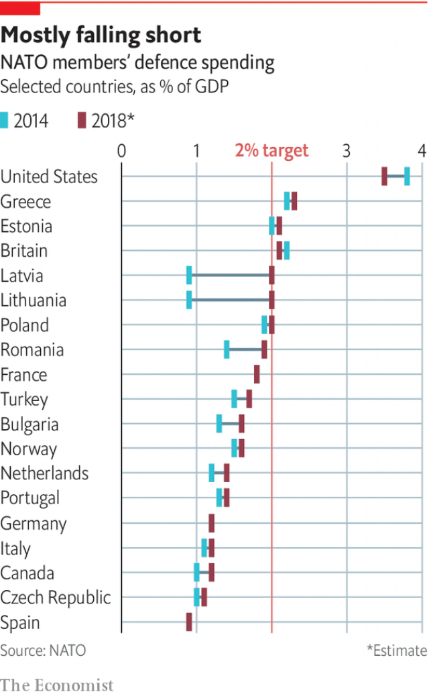
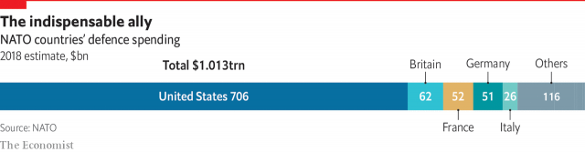

###### Spending

# NATO members’ promise of spending 2% of their GDP on defence is proving hard to keep 

##### Germany is in the crosshairs for not spending enough on defence 

 

> Mar 14th 2019 

THE PRESIDENT did not mince his words. “We cannot continue to pay for the military protection of Europe while the NATO states are not paying their fair share and living off the fat of the land. We have been very generous to Europe and it is now time for us to look out for ourselves.” A tweet from Donald Trump? In fact the words were John F. Kennedy’s, speaking to his National Security Council in 1963. Complaints about the Europeans’ failure to spend enough on their own defence are almost as old as the alliance itself. But Mr Trump’s attacks have been angrier and more sustained. He links complaints about the perceived NATO rip-off with gripes about trade, where he thinks the European Union is “killing us”. “We pay for LARGE portions of other countries [sic] military protection,” he tweeted last November, “hundreds of billions of dollars, for the great privilege of losing hundreds of billions of dollars with these same countries on trade.” 

The allies may not like the bullying (and could argue with the economics), but on the matter of military spending Mr Trump has a point. At their summit in Wales in 2014, NATO leaders agreed to a guideline of spending no less than 2% of national GDP on defence, of which at least 20% should go on major equipment, including research and development. At the time only three countries met the 2% target; all the rest pledged to “move towards” it by 2024. 

Now eight countries more or less pass the 2% test, and 15 meet the 20% target for major equipment. Taken together, the 2018 defence budgets of NATO’s European members would have needed to be $102bn bigger (an extra 38%) to reach 2% of GDP, according to the International Institute for Strategic Studies (IISS). Still, their spending has been rising significantly since 2015. At the World Economic Forum in Davos in January, Mr Stoltenberg said that since 2016 members other than the United States had spent an extra $41bn in real terms and that, based on their national plans, by the end of 2020 the figure would be $100bn. If his remarks were designed to catch Mr Trump’s attention, it worked. “Now we have secured more than $100bn of increase in defence spending from NATO allies,” the president boasted a couple of weeks later in his state-of-the-union speech. “They said it couldn’t be done.” 

“You should note that Vladimir Putin sees that increase,” says Mr Pompeo. But he also stresses that “there remains tremendous work to be done.” It is not even clear that Mr Trump will be satisfied with 2%. At the Brussels summit last year he caused a stir by mentioning a figure of 4% of GDP. (The United States spends 3.5%, though this pays not just for the territory covered by NATO but for America’s global role; the IISS calculates that only 5.6% of its defence outlays go directly on Europe, a figure that leaves out its nuclear umbrella and the reinforcements it would send in a crisis.) Whatever the aim, it is the big countries that count, and several of these fall woefully short of 2%, including Canada, Italy and Spain (see chart). But the most notable laggard is Germany, which has the largest economy. 

 

Germany spends just 1.24% of its GDP on defence. It has promised only that the share will rise to 1.5% by 2025. Even that may be optimistic, since the spending is not “plumbed in” to actual budget plans, notes Claudia Major of SWP, a think-tank in Berlin. She expects the number to be 1.3% by 2024. 

The Germans have lots of excuses. A coalition government makes it hard to agree on higher defence spending. Germany’s economy is so large that even a modest increase in the share of GDP going on defence translates into a lot more money. The country hosts facilities that are important for America’s wider role, including its Africa Command in Stuttgart and a state-of-the-art military hospital near Landstuhl where Americans wounded in Afghanistan and Iraq are treated. Besides, the 2% target is a crude one, measuring input not output, so it should not be taken too literally. 

Yet it is what Germany signed up to in 2014, and it does need to spend more. Last year’s annual report to the federal parliament on the state of the country’s armed forces was devastating. It pointed to “major gaps in personnel and materiel in all areas of the Bundeswehr”. All six of its submarines were out of action. At times not one of its 14 Airbus A400M transport planes was flying. This year’s report was scarcely better, urging “immediate action”. The contingent that took part in the recent Trident Juncture exercise had to plunder all sorts of gear from other units, according to Julie Smith, an American expert on transatlantic security currently at the Robert Bosch Academy in Berlin. “It’s just hard to fathom how it got this bad, for a country of its size and resources,” she says. 

Another puzzle is Germany’s embrace of Nord Stream 2, a pipeline that by the end of this year is due to bring it Russian gas. Because this bypasses Ukraine, it leaves that country open to pressure from Russia. Mr Trump says it will also make Germany “a captive of Russia”. The Germans suspect that his true motive is to sell them American gas, but the project has many other critics. 

Despite Russia’s deployment in Kaliningrad of nuclear-capable missiles that can reach Berlin in less than five minutes, Germans do not seem to feel unduly threatened. As Jan Techau of the German Marshall Fund in Berlin puts it: “We have exactly the kind of armed forces we want: basically unusable.” 

 

What can be done? Mr Trump’s ire is not the best incentive for Germany to tackle its gaps in military spending: only 10% of Germans are confident that he will do the right thing in world affairs, according to Pew Research Centre. But politicians could do more to explain the need for extra resources, and they could be more creative, tackling problems of civilian infrastructure that also pose problems for military mobility. Germany’s rail system is “completely inadequate” for moving troops at scale, says Ben Hodges of CEPA. “We don’t need more German tanks, we need more German trains.” Counting such investment could help nudge Germany towards 2%. 

One way to make European defence spending go further would be to improve collaboration between member countries, cutting duplication and reaping economies of scale. Angela Merkel, the German chancellor, has asked why Europe needs 160 weapons systems when America has 50 or 60, not to mention all the replication of training and support staff across the continent. Initiatives to do better are at last under way. One, called permanent structured co-operation, or PESCO, aims to attract commitments to projects identified in a Co-ordinated Annual Review on Defence, or CARD. 

The EU has also launched a European Defence Fund. From 2020 it hopes to have €500m a year to invest in joint research projects and €1bn a year (leveraged to perhaps €5bn with the help of national financing) for collaborative development and buying equipment. Crucially, this has been plugged into the machinery of the European Commission. But Britain, a European defence giant, could find itself relegated to third-country status after Brexit. And Germany has inhibitions about arms exports, evident in its recent willingness to all but ground Saudi Arabia’s Eurofighter Typhoon fleet by blocking parts. That makes it tricky to work with the more gung-ho French. More collaboration may improve matters, but at best slowly. Meanwhile, what if Mr Trump, or a successor, were to carry out the threat to quit? 

-- 

 单词注释:

1.NATO['neitәj]:北大西洋公约组织, 北约组织 [经] 北大西洋公约组织 

2.crosshair['krɔ:sheə]: 十字准线, 瞄准线 

3.mince[mins]:n. 切碎物 vt. 切碎, 矫揉做作地说 vi. 碎步走, 装腔作势 

4.cannot['kænɒt]:aux. 无法, 不能 

5.tweet[twi:t]:vi. 啁啾 n. 小鸟叫声 

6.john[dʒɔn]:n. 盥洗室, 厕所, 嫖客 

7.alliance[ә'laiәns]:n. 联盟, 联合 [法] 同盟, 联盟, 联姻 

8.gripe[graip]:n. 紧握, 柄, 把手, 控制 vt. 抓紧, 抱住, 使肠痛, 激怒 vi. 肠绞痛, 抱怨 

9.ally['ælai. ә'lai]:n. 同盟者, 同盟国, 助手 vt. 使联盟, 使联合, 使有关系 vi. 结盟 

10.bully['buli]:n. 欺凌弱小者, 土霸 vt. 威胁, 恐吓, 欺负 vi. 欺负 a. 特好的, 第一流的 adv. 十分 

11.wale[weil]:n. 隆起的伤痕, 鞭痕, 凸条纹, 精华, 选择 vt. 在...上留下鞭痕, 织成棱纹, 挑选, 撑住 vi. 挑选 

12.guideline['gaidlain]:n. 指导路线, 方针, 指标 [经] 指导路线, 方针, 准则 

13.les[lei]:abbr. 发射脱离系统（Launch Escape System） 

14.pledge[pledʒ]:n. 诺言, 保证, 誓言, 抵押, 信物, 保人, 祝愿 vt. 许诺, 保证, 使发誓, 抵押, 典当, 举杯祝...健康 

15.iiss[]:abbr. International Institute for Strategic Studies 国际战略问题研究所 

16.significantly[]:adv. 值得注目地；意味深长地 

17.forum['fɒ:rәm]:n. 论坛, 公开讨论的广场, 法庭, 讨论会 [法] 讨论会, 专题讨论, 公共论坛 

18.davo[]:abbr. Dynamic Analogue of Vocal Tract 声道动态模拟（设备） 

19.Stoltenberg[]:n. (Stoltenberg)人名；(瑞典)斯托尔滕贝里；(挪)斯托尔滕贝格；(德)施托尔滕贝格 

20.Vladimir[vlɑ'dimɪr]:n. 弗拉基米尔（古罗斯弗拉基米尔-苏兹达里公国的古都） 

21.putin['putin]:n. 普京（人名） 

22.pompeo[]:n. (Pompeo)人名；(意)蓬佩奥 

23.Brussel[]:n. 布鲁塞尔（比利时首都） 

24.outlay['autlei]:n. 费用, 经费, 支出 vt. 花费 

25.reinforcement[.ri:in'fɒ:smәnt]:n. 加强, 增援, 补充, 援军, 加固物 [化] 补强; 加强件 

26.woefully[]:adv. 悲伤地；不幸地；使人痛苦地 

27.Spain[spein]:n. 西班牙 

28.notable['nәutәbl]:n. 著名人士, 值得注意之事物 a. 值得注意的, 显著的 

29.laggard['lægәd]:n. 迟钝者, 落后者 a. 迟钝的, 落后的 

30.plumb[plʌm]:n. 铅锤, 垂直 a. 垂直的 vt. 使垂直, 探测 vi. 成垂直 

31.claudia['klɔ:djә]:n. 克劳迪娅（女子名） 

32.swp[]:abbr. safe working pressure 安全工作压力; sweep 清扫; sweeping 扫除; steam working pressure 蒸汽工作压力 

33.Berlin[bә:'lin]:n. 柏林, (软质)柏林毛线 

34.coalition[.kәuә'liʃәn]:n. 结合体, 结合, 联合 [经] 联合, 联盟 

35.stuttgart['stut^ɑ:t]:n. 斯图加特（德国城市） 

36.landstuhl[]: [地名] [德国] 兰施图尔 

37.Afghanistan[æf'gænistæn]:n. 阿富汗 

38.Iraq[i'rɑ:k]:n. 伊拉克 

39.literally['litәrәli]:adv. 逐字地, 按照字面上地, 不夸张地 

40.devastate['devәsteit]:vt. 毁坏 [法] 使荒废, 毁灭, 掠夺 

41.materiel[mәtiәri'el]:n. 物料, 军品 

42.Bundeswehr['bundәs,veiә]:联邦德国国防军 

43.airbus['eәbʌs]:空中客车 

44.contingent[kәn'tindʒәnt]:a. 或许发生的, 附随的, 偶然发生的 n. 偶然事件, 分遣队 

45.Trident['traidnt]:n. 三齿鱼叉, 三叉戟, 三叉线 a. 三叉的, 三齿的 

46.juncture['dʒʌŋktʃә]:n. 接合, 连接, 接缝 

47.plunder['plʌndә]:n. 抢夺, 掠夺品, 战利品 v. 掠夺, 抢劫, 抢夺 

48.julie[]:n. 朱莉（女子名） 

49.smith[smiθ]:n. 铁匠, 金属品工匠 [机] 锻造工, 上手 

50.transatlantic[.trænsәt'læntik]:a. 横渡大西洋的, 大西洋彼岸的, 美国的 

51.currently['kʌrәntli]:adv. 现在, 当前, 一般, 普通 [计] 当前 

52.Robert['rɔbәt]:[法] 警察 

53.bosch[bɔ:ʃ]:n. 博世（德国公司名） 

54.fathom['fæðәm]:n. 英寻(长度单位,合6英尺) vt. 测量深度, 看穿, 彻底了解 vi. 测深 

55.nord[nɔ:d]:n. 北方, 北部 

56.bypass['baipɑ:s]:n. 旁路 vt. 省略, 绕过, 忽视, 回避 

57.ukraine[ju(:)'krein]:n. 乌克兰（原苏联一加盟共和国, 现已独立） 

58.deployment[]:[计] 展开 

59.KALININGRAD[kә'linin^ræd]:加里宁格勒 

60.unduly[.ʌn'dju:li]:adv. 不适当地, 过度地 [法] 过分的, 过度的, 不正当的 

61.Marshall['mɑ:ʃәl]:n. 马歇尔（姓氏, 男子名, 等于Mar'shal） 

62.unusable[]:[计] 不可用的 

63.ire[aiә]:n. 忿怒 [电] 美国无线电工程师学会 

64.incentive[in'sentiv]:n. 动机 a. 激励的 

65.tackle['tækl]:n. 工具, 复滑车, 滑车, 装备, 扭倒 vt. 固定, 处理, 抓住 vi. 扭倒 

66.pew[pju:]:n. 教堂长椅, 会众, 座位 vt. 为(教堂)安装座位, 把...围在一起 

67.infrastructure['infrәstrʌktʃә]:n. 基础结构, 基础设施 [经] 基础设施 

68.mobility[mәu'biliti]:n. 可动性, 流动性, 机动性 [化] 迁移率 

69.inadequate[in'ædikwәt]:a. 不充分的, 不适当的 [法] 不充分的, 不适当的 

70.ben[ben]:n. 内室 [医] 贝昂(俗名,一般指辣木Moringa oleifera,有时也指一些不同属的植物) 

71.hodge[hɔdʒ]:n. 霍奇（男子名, 等于Roger） 

72.CEPA[]:[化] 耦合电子对近似 

73.nudge[nʌdʒ]:n. 用肘轻推, 推动, 讨厌家伙 

74.collaboration[kә.læbә'ræʃәn]:n. 合作, 勾结 [法] 通敌卖国者, 奸细 

75.duplication[.dju:pli'keiʃәn]:n. 副本, 复制 [医] 重迭, 双折, 复制 

76.angela['ændʒilә]:n. 安吉拉（女子名） 

77.merkel[]: [人名] 默克尔; [地名] [美国] 默克尔 

78.chancellor['tʃɑ:nsәlә]:n. 大臣, 总理, 首相, 大使馆/领事馆的一等秘书, 司法官, 大学校长 

79.replication[.repli'keiʃәn]:n. 回答, 反响, 复制, 第二次答辩, 折转, 弯回 [化] 复制 

80.EU[]:[化] 富集铀; 浓缩铀 [医] 铕(63号元素) 

81.collaborative[kә'læbәreitiv]:a. 合作的, 协作的 

82.crucially[ˈkru:ʃɪəlɪ]:adv. 至关重要地, 关键地 

83.machinery[mә'ʃi:nәri]:n. 机器, 机械装置, 机构 [化] 机械 

84.relegate['religeit]:vt. 驱逐, 使降低地位, 把...归类, 把...委托给 [法] 流放, 判流放刑, 驱逐 

85.statu[]:[网络] 状态查看；雕像；特级雪花白 

86.Brexit[]:[网络] 英国退出欧盟 

87.inhibition[.inhi'biʃәn]:n. 禁止, 抑制, 压抑 [计] 禁止 

88.saudi['sajdi]:a. 沙乌地阿拉伯（人或语）的 

89.Eurofighter[]:[网络] 欧洲战斗机；欧洲战机；欧洲战机集团 

90.tricky['triki]:a. 狡猾的, 机敏的 

91.successor[sәk'sesә]:n. 继承者, 接任者 [计] 后继 

