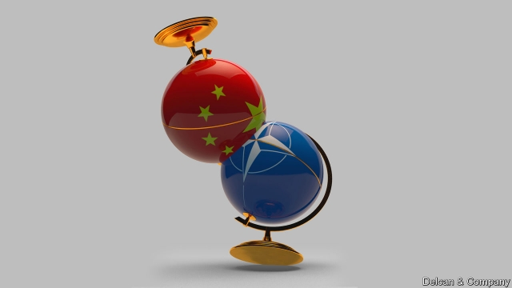

###### The next three decades

# What NATO needs to do to live to its 100th birthday 

##### A new transatlantic bargain could help the allies reach a century 

 

> Mar 14th 2019 

THE TRANSATLANTIC alliance deserves a resounding “happy birthday”. It kept the peace for 40 years of cold war, protected western Europe from communism, helped stabilise central Europe after the Soviet Union’s collapse and enabled unprecedented prosperity. It has shown admirable openness, adaptability and commitment. “We’re incredibly complacent about the continuous delivery of peace and stability in our lives, and a hell of a lot of that depends on NATO,” says Sir Adam Thomson, a former British ambassador to NATO, now with the European Leadership Network, a London-based think-tank. “We tend to take it for granted.” 

In many respects the alliance looks stronger than ever. It will soon have 30 members, encompassing more than 930m people. Together they produce around half the world’s GDP and account for about 55% of global defence spending. The allies are getting on with a long to-do list drawn up at last year’s summit, from ambitious readiness plans to new command centres. 

Yet as this special report has pointed out, NATO is also deeply troubled. Douglas Lute and Nicholas Burns, two former American ambassadors to NATO, say Donald Trump has “hurtled the alliance into its most worrisome crisis in memory”. In a thorough assessment of “NATO at Seventy” for Harvard Kennedy School’s Belfer Centre, they set out a daunting array of the challenges it faces. The greatest of them is “the absence of strong, principled American presidential leadership for the first time in its history”. 

Still, in some ways Mr Trump has done NATO a favour by concentrating minds on the need for the allies to spend more, and do more, for their own defence. And he has been right to highlight the German problem. To update Lord Ismay’s aphorism, NATO now needs Germany to be up, not down. 

Mr Trump has also been an antidote to complacency. He has provoked the alliance into re-examining the fundamental reason for its existence, prompting Congress to spring to its defence and ministers to write editorials explaining why the world still needs NATO. He has set off a frenzy of thinking about the future of European defence. If anyone had started to wonder whether NATO mattered any more, Mr Trump (with more than a little help from Mr Putin) has ensured that it will continue to receive attention. 

By keeping Europe secure, NATO serves America’s interests. Its defenders say that Mr Trump’s transactional approach is wrong-headed. Yes, America’s allies should do more, but their contribution adds to American strength, providing forces, firepower and valuable bases. In a coming era of great-power rivalry, it would be folly to give this up. America has many allies, in NATO and in Asia, which makes it quite different from China and Russia, says Mr Burns: “They have none.” 

These are good reasons for expecting NATO to survive Mr Trump. But beyond the storms of his presidency, the geopolitical climate is anyway changing. If NATO wants to remain strong in the decades ahead, it needs to start preparing now. That will involve still more adaptation, none of it easy. Three areas stand out. 

One is speed. Having to co-ordinate 30 countries makes quick decisions harder, yet they will become ever more vital. Streamlining NATO’s bureaucracy should help, but it is not enough. James Stavridis, who served as supreme allied commander for Europe, says that if he could wave a magic wand, decisions in the North Atlantic Council (NAC), where members vote, could be reached with a three-quarters majority rather than unanimously. In some circumstances, even that would be too slow: it can take three hours to get the NAC together. “If you have to convene the North Atlantic Council as a missile is flying to Manchester, it’s bye-bye Manchester,” notes Sandy Vershbow, a former NATO deputy secretary-general. Clear protocols for responses are needed, too. 

Second, the alliance should take a hard look at its priorities. Currently it finds itself doing both beefed-up collective defence and crisis-management at the same time. It risks being pulled in too many directions so as to keep its diverse membership on board. Sooner rather than later it should confront tough strategic choices. Which missions could it drop? How much attention should it pay to areas of rising strategic importance, such as the Arctic? Should it continue to keep the door open to new members, or has its expansion reached its practical limits for now? 

The third shift in thinking is the one likely to matter most if NATO is to maintain its relevance: adjusting to China’s rise. As America’s strategic priorities pivot further towards the Pacific, what are the implications for the transatlantic alliance? The European allies are only just starting to become aware of how America’s emerging rivalry with China could affect them—through wariness of Chinese 5G telecoms technology, for example, or of infrastructure investments through President Xi Jinping’s Belt and Road Initiative. Not all member countries are equally concerned about this, but they should be in no doubt about its future significance. 

Small initial steps for NATO could include gestures such as opening a diplomatic dialogue with China and flying the flag in friendly countries in the Pacific, including Australia and Japan. The more global-minded European allies, notably France and Britain, are becoming more involved in freedom-of-navigation and overflight operations in the Pacific. 

But eventually a clearer division of labour between Europeans and Americans will need to be considered. Stephen Walt of Harvard Kennedy School says there could be a time for “a new transatlantic bargain” between America and its European allies: America agrees to stay on in Europe, but at a reduced level of engagement; the Europeans agree to up their game in their own region and take on board America’s concerns over China on trade and intellectual property. At the moment the chances for such a grand agreement look slim. It presupposes a shared view of the world that does not exist. Europe and America are at odds on many fronts. Mr Trump has described the EU as a “foe” on trade. The Europeans are making efforts to get round America’s extraterritorial reach over sanctions on Iran. 

And where would the leadership for an ambitious new division of labour come from? NATO’s big players are all distracted: America by the Trump show, Britain by Brexit, France by protests and Italy’s populists, Germany by the end of the Merkel era and Turkey by its temptations to wander away from Europe. In such circumstances, just staying together as allies looks like a heroic task. 

Still, it would be foolish to underestimate NATO’s ability to reinvent itself. It has done so before. If it wants to be in rude health at 100, this septuagenarian is due for another metamorphosis. 

-- 

 单词注释:

1.NATO['neitәj]:北大西洋公约组织, 北约组织 [经] 北大西洋公约组织 

2.transatlantic[.trænsәt'læntik]:a. 横渡大西洋的, 大西洋彼岸的, 美国的 

3.ally['ælai. ә'lai]:n. 同盟者, 同盟国, 助手 vt. 使联盟, 使联合, 使有关系 vi. 结盟 

4.transatlantic[.trænsәt'læntik]:a. 横渡大西洋的, 大西洋彼岸的, 美国的 

5.alliance[ә'laiәns]:n. 联盟, 联合 [法] 同盟, 联盟, 联姻 

6.resound[ri'zaund]:vi. 回响, 鸣响, 反响, 驰名, 被传遍 vt. 使回响, 传颂 

7.stabilise['steibilaiz]:vt.vi. (使)稳定, (使)安定, (使)坚固 vt. 装稳定器 

8.unprecedented[.ʌn'presidentid]:a. 空前的 [经] 空前的, 无前例的 

9.openness['әupәnnis]:n. 公开；宽阔；率真 

10.adaptability[ә.dæptә'biliti]:n. 适应性 [计] 自适应性; 适应性 

11.incredibly[in'kredәbli]:adv. 不能相信地 

12.complacent[kәm'pleisnt]:a. 满足的, 自满的, 得意的 

13.Adam['ædәm]:n. 亚当 [计] 自动直接存取管理 

14.thomson['tɔmsn]:n. 汤姆森（①姓氏 ②Sir George Paget, 1892-1975, 英国物理学家, 曾获1937年诺贝尔物理学奖 ③Sir Joseph John, 1856-1940, 英国物理学家, 曾获1906年诺贝尔物理学奖） 

15.encompass[in'kʌmpәs]:vt. 围绕, 完成, 包括, 包含, 环绕, 包围 

16.ambitious[æm'biʃәs]:a. 有野心的, 抱负不凡的, 雄心勃勃的 

17.readiness['redinis]:n. 预备, 准备, 敏捷 

18.douglas['dʌ^lәs]:n. 道格拉斯（男子名）；道格拉斯（英国马恩岛首府） 

19.lute[lu:t]:n. 鲁特诗琴, 封泥 vt. 用封泥封, 弹诗琴表达 vi. 弹诗琴 

20.nicholas['nikәlәs]:n. 尼古拉斯（男子名） 

21.hurtle['hә:tl]:vi. 猛冲, 碰撞, 突进 vt. 猛撞, 猛投 n. 投掷, 碰撞, 碰撞声 

22.worrisome['wʌrisәm]:a. 令人烦恼的, 麻烦的, 劳碌命的 

23.Harvard['hɑ:vәd]:n. 哈佛大学 

24.kennedy['kenidi]:n. 肯尼迪（姓氏, 美国第35任总统） 

25.belfer[]:[网络] 贝尔弗；贝尔法；哈佛大学贝尔弗尔 

26.daunt[dɒ:nt]:vt. 威吓, 难倒, 使气馁 

27.array[ә'rei]:n. 排列, 衣服, 大批, 军队 vt. 布署, 打扮, 排列 [计] 数组; 阵列 

28.principled['prinsәpld]:a. 原则的, 有原则的, 原则性的 

29.presidential[.prezi'denʃәl]:a. 总统制的, 总统的, 首长的, 统辖的 [法] 总统的, 议长的, 总经理的 

30.update[ʌp'deit]:vt. 更新, 使现代化 n. 更新 [计] 更新 

31.aphorism['æfәrizm]:n. 格言, 警语 

32.antidote['æntidәut]:n. 解毒剂, 解毒药 [化] 解毒药 

33.complacency[kәm'pleisәnsi]:n. 满足, 自鸣得意, 自满 

34.provoke[prә'vәuk]:vt. 激怒, 惹起, 诱导 [法] 刺激, 煽动, 激怒 

35.frenzy['frenzi]:n. 疯狂, 狂暴, 狂怒 [医] 暴怒, 狂乱 

36.putin['putin]:n. 普京（人名） 

37.defender[di'fendә]:n. 防卫者, 防护者, 辩护者 [法] 辩护人, 保护人 

38.transactional[]:a. 交易型的；事务性的；事务处理的 

39.firepower['faiәpauә]:n. 火力 

40.rivalry['raivlri]:n. 竞争, 对抗 [医] 拮抗 

41.folly['fɒli]:n. 愚蠢, 荒唐事, 讽刺剧 

42.presidency['prezidәnsi]:n. 总统职权, 总裁职位 

43.geopolitical[,dʒi(:)әupә'litikәl]:[计] 地理的 

44.streamline['stri:mlain]:n. 流线, 流线型 vt. 使成流线型, 使合理化 

45.bureaucracy[bjuә'rɒkrәsi]:n. 官僚, 官吏 [法] 官僚主义, 官僚政治, 官僚机构 

46.jame[]: 灰岩井 

47.stavridis[]:[网络] 最高统帅史塔伏瑞迪斯 

48.wand[wɒnd]:n. 棒, 棍, 杖 

49.NAC[]:abbr. 网络准入控制（Network Admission Control）；全国航空委员会（National Air Council）；负导纳变换器（Negative Admittance Converter）；北大西洋公约理事会（North Atlantic Council） 

50.unanimously[]:adv. 全体一致, 无异议, 一致同意 

51.convene[kәn'vi:n]:vt. 集合, 召集, 召唤 vi. 聚集, 集合 

52.Manchester['mæntʃestә]:n. 曼彻斯特 

53.vershbow[]: [人名] 弗什博 

54.protocol['prәutәkɒl]:n. 草案, 礼仪, 协议 v. 拟定 [计] 协议, 协议列表实用程序 

55.currently['kʌrәntli]:adv. 现在, 当前, 一般, 普通 [计] 当前 

56.membership['membәʃip]:n. 会员的资格, 全体会员, 会员数目 [法] 会员资格, 成员资格, 会籍 

57.confront[kәn'frʌnt]:vt. 使面对, 对抗, 遭遇, 使对质, 比较 [法] 对证, 使对质, 比较 

58.pivot['pivәt]:n. 枢轴, 支点, 旋转运动, 中枢, 关键人物 a. 枢轴的, (如)在枢轴上转动的 vi. 在枢轴上转动, 随着转移 vt. 装枢轴于, 以...为中心旋转 [计] 程序员交互验证和编制工具, 数据透视表 

59.wariness['wєәrinis]:n. 谨慎, 注意, 小心 

60.telecom['telәkɔm]:telecommunication 电信 

61.infrastructure['infrәstrʌktʃә]:n. 基础结构, 基础设施 [经] 基础设施 

62.equally['i:kwәli]:adv. 相等地, 同样地, 平等地 

63.diplomatic[.diplә'mætik]:a. 外交的, 老练的 [法] 外交的, 外交上的, 文献上的 

64.notably['nәjtbәli]:adv. 显著地, 著名地, 尤其, 特别 

65.overflight['әuvәflait]:n. 飞越上空 

66.stephen['sti:vn]:n. 斯蒂芬（男子名） 

67.Walt[wɔ:lt]:n. 沃尔特（人名） 

68.engagement[in'geidʒdmәnt]:n. 诺言, 约会, 婚约, 交战 [医] 衔接 

69.presuppose[.pri:sә'pәuz]:vt. 预先假定, 预料, 以...为先决条件 

70.odds[ɒdz]:n. 可能性, 几率, 机会, 胜算, 不平等 

71.EU[]:[化] 富集铀; 浓缩铀 [医] 铕(63号元素) 

72.foe[fou]:n. 仇敌, 反对者, 敌人, 对手 

73.extraterritorial['ekstrә,teri'tɔ:riәl]:a. 治外法权 [法] 治外法权的 

74.sanction['sæŋkʃәn]:n. 核准, 制裁, 处罚, 约束力 vt. 制定制裁规则, 认可, 核准, 同意 

75.Iran[i'rɑ:n]:n. 伊朗 

76.Brexit[]:[网络] 英国退出欧盟 

77.Populist['pɔpjulist]:n. 民粹派的成员 

78.merkel[]: [人名] 默克尔; [地名] [美国] 默克尔 

79.underestimate[.ʌndәr'estimeit]:n. 低估 vt. 低估, 看轻 

80.reinvent[.ri:in'vent]:vt. 重新使用；彻底改造；重复发明（在不知他人已发明的情况下） 

81.septuagenarian[septjjәdʒi'neәriәn]:a. 七十至七十九岁的 n. 七十至七十九岁的人 

82.metamorphosis[.metә'mɒ:fәsis]:n. 蜕变, 变质, 变形 [医] 变态, 变形, 变质 

