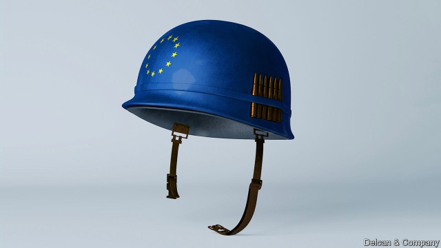

###### European defence

# What would happen if America left Europe to fend for itself? 

##### Time to start thinking the unthinkable 

 

> Mar 14th 2019 

WHY, A STRATEGIST from Mars might wonder, do Europeans doubt their ability to defend themselves against Russia without American help? The total GDP of NATO’s European members is more than ten times that of Russia, which has an economy about the size of Spain’s. They spend three-and-a-half times as much on defence as Russia, which has lately had to cut its budget sharply because of a broader squeeze on its economy. True, Russia has 13 times as many nuclear warheads as western Europe has, but surely Britain and France, the two nuclear powers, have more than enough to deter an attack? 

For decades Europeans did not need to worry about the Martian’s question, because America’s commitment to their defence was not in doubt. That has changed. “The times when we could unconditionally rely on others are past,” Angela Merkel told the European Parliament in November. She echoed the call of France’s president, Emmanuel Macron, for “a true European army”. In January the two leaders signed a treaty between France and Germany which includes a mutual-security pledge similar to NATO’s Article 5 (as well as Article 42.7 of the European Union’s Lisbon treaty). 

This is sensitive territory. Mr Macron’s talk of a European army, and of “strategic autonomy”, irritates Americans. It is only prudent for Europeans to start hedging their bets against over-reliance on America, but hedging can be costly, and they have to be careful lest the hedge become a wedge, as François Heisbourg of the Fondation pour la Recherche Stratégique, a think-tank, pithily puts it. 

Still, Mr Trump’s ambivalence about allies is almost an invitation to think through the implications of an end to Pax Americana. Suppose one morning a tweet announces that the United States is leaving NATO. Under Article 13 of the alliance’s founding treaty, a country can cease to be a member one year after notifying the government of the United States. So, bizarrely, Mr Trump would be serving notice on himself. An optimistic version of what happens next, apart from howls of protest, is that Europe makes a concerted effort to organise its own defence. Call it Europe United. 

The conventional wisdom on Europe’s ability to protect its interests may be too defeatist, suggests Kori Schake of the IISS. The middle powers, in which she includes countries like Britain, France, Italy and the Netherlands, have been talking themselves into “exquisite uselessness”, but they have impressive capabilities. And, she argues, “the high-end American way of war is not the only way of war.” 

Yet the Europeans would immediately face institutional hurdles. Compared with Russia’s top-down system, command and control is hard enough in consensus-bound NATO. It would be a bigger challenge for Europeans alone, especially if they did not inherit NATO’s command structure. The EU may want to take the lead, but military thinking is not in its DNA. Besides, an EU-only alliance would be a pale shadow of NATO: after Brexit, non-EU countries will account for fully 80% of NATO defence spending. 

There would be gaps in capabilities, too. How bad these were would depend on the mission, and how many operations were under way at the same time. The European-led interventions in Libya and Mali exposed dependence on America in vital areas such as air-to-air refuelling and intelligence, surveillance and reconnaissance. A detailed look at the sort of scenarios Europe might face would help to identify other gaps, and what it would take to fill them. Bastian Giegerich of the IISS, who is starting to work on such assessments, reckons that realistically the gap-filling could take 15 years or so. That is a long time for places like Poland and the Baltic countries that feel under threat. Fear and mistrust could quickly conspire to make narrow national interests trump efforts to maintain European unity. Hence a second, perhaps likelier, version of what might follow an American withdrawal: Europe Divided. 

Jonathan Eyal of the Royal United Services Institute in London imagines a frenzy of activity, a cacophony of summits—and a renationalisation of defence strategies. Lots of countries would seek bilateral deals. In central Europe he would expect an alliance between Poland and Romania to guarantee the eastern border. The Russians and Chinese would not sit idly by, he says, but would play their own games with the Greeks, Hungarians and others. 

It is these games of mistrust that the American security guarantee has largely helped to avoid. They could all too easily resurface. “Establishing a purely European defence”, warns Michael Rühle, a long-time NATO official, “would overwhelm the Europeans politically, financially and militarily.” 

That is why a third way forward for Europe looks more attractive: what might be called Europe Upgraded. This would involve the Europeans doing a lot more to improve their capacity in defence, but in ways that would help persuade the Americans to stay in: less loose talk about a European army, more effort to develop capabilities currently lacking. 

Europe Upgraded sounds like an easy option, but it is not. It would demand cash, creativity and care. A serious push to plug the gaps in Europe’s capabilities would not be cheap. European governments, especially the big ones, would have to find a way to sell far larger defence budgets to their voters. 

As for creativity, the European Intervention Initiative, championed by Mr Macron and launched last year, is an example of the sort of innovation that could help. It is inclusive: its ten members include Finland, not part of NATO, and Britain, soon to be out of the EU. The aim is to foster a common strategic culture that will help Europe respond more nimbly to crises in its neighbourhood without calling for American help. 

The care is needed to make sure a more robust Europe is seen as supporting NATO rather than undermining it. America is suspicious of any duplication of NATO’s efforts, such as the creation of rival headquarters. And bigger spending on defence could trigger disputes over industrial protectionism, especially if broader trade rows between Europe and America rumble on. 

Even as the allies grapple with different visions of the future, a nuclear elephant has entered the room. Last October America declared (without warning the Europeans) that it was leaving the INF treaty, claiming a blatant violation by Russia, and served formal notice in February. Russia has since responded by pulling out too, threatening to develop new missiles. To make matters worse, the New START treaty, which limits strategic nuclear warheads and has strong verification provisions, is up for renewal in 2021. 

A new nuclear-arms race would be a nightmare for NATO. In Berlin, Claudia Major is “enormously worried” that arguments over INF could divide Germany, Europe and the transatlantic alliance. Radek Sikorski fears that Russia’s missiles will leave Europe “defenceless” if it lacks a proportionate response to a first use of nuclear weapons by Russia, giving the Russians time to get where they want to by using conventional forces. 

NATO has been here before. In the 1980s concern that Russian SS-20 intermediate-range missiles would “decouple” the European allies from America led to a dual-track approach: pursuit of arms control along with deployment of American cruise and Pershing II missiles in several European countries. The deployment went ahead despite mass protests, but the INF treaty signed in 1987 resulted in their removal and a long period of relative nuclear calm. 

America is keen to maintain alliance solidarity, and officials say there are no plans to deploy intermediate-range missiles. There are other tools in the kit to keep Europe coupled. These include submarine-launched nuclear cruise missiles, currently in development, and new low-yield warheads for existing Trident missiles. A strengthening of missile defences would ramp up tensions with Russia. 

The abandonment of the INF treaty is the most urgent reason to ask questions about the nuclear future. But the broader doubts about the strength of America’s commitment to defend Europe are also stirring things up. Like it or not, for the first time this century Europeans are having to brace themselves for a serious debate about the role of nuclear weapons on their continent. 

Taboos could tumble. In a paper last November for the Finnish Institute of International Affairs, a French expert, Bruno Tertrais, suggested a range of “realistic” scenarios for expanding French and British nuclear protection, with or without NATO. Maximilian Terhalle, of the University of Winchester, and Mr Heisbourg recently argued that France should extend its nuclear umbrella to its European partners, including Germany. They acknowledge that “great leadership skills” would be needed to win support for this at home while not “prompting the withdrawal of US nuclear weapons from Europe”. 

The context for this debate extends far beyond Europe. Russia’s deployment of its 9M729 missiles is in part a response to the growing muscle of other countries, notably China, which is not bound by the INF treaty. President Trump has floated the idea of broader arms-control efforts also involving China and others, though there is little sign of Chinese interest. The INF question is an early indicator of how China’s rise might affect the future of the alliance. 

-- 

 单词注释:

1.fend[fend]:vt. 击退, 保护, 供养 

2.unthinkable[.ʌn'θiŋkәbl]:a. 不能考虑的, 不能想像的, 想像不到的, 不合理的 

3.strategist['strætidʒist]:n. 战略家 

4.mar[mɑ:]:vt. 损毁, 损伤, 糟蹋 n. 三月 

5.warhead['wɒ:hed]:n. 弹头 

6.deter[di'tә:]:vt. 制止, 吓住, 威慑 

7.unconditionally[ˌʌnkən'dɪʃənəlɪ]:adv. 无条件地 

8.angela['ændʒilә]:n. 安吉拉（女子名） 

9.merkel[]: [人名] 默克尔; [地名] [美国] 默克尔 

10.emmanuel[i'mænjuәl]:n. 以马内利（耶稣基督的别称）；伊曼纽尔（男子名, 等于Immanuel） 

11.macron['mækrәn]:n. 长音符号 

12.pledge[pledʒ]:n. 诺言, 保证, 誓言, 抵押, 信物, 保人, 祝愿 vt. 许诺, 保证, 使发誓, 抵押, 典当, 举杯祝...健康 

13.Lisbon['lizbәn]:n. 里斯本(葡萄牙首都) 

14.autonomy[ɒ:'tɒnәmi]:n. 自治, 自治权 [医] 自主性 

15.irritate['iriteit]:vt. 激怒, 使发怒, 使兴奋, 使发炎 vi. 引起不快 

16.prudent['pru:dnt]:a. 审慎的, 三思而后行的, 精明的, 节俭的 

17.wedge[wedʒ]:n. 楔子, 楔形物, 起因, 导致分裂的东西 vt. 楔住, 挤进, 楔入 vi. 楔入, 挤进 

18.heisbourg[]:[网络] 海斯堡；战略家埃斯堡 

19.fondation[]:[网络] 艺文基金会；肯爱协会 

20.La[lɔ:, lɑ:]:[医] 镧(57号元素) 

21.recherche[]:a. 精选的, 罕见的, 珍奇的 

22.pithily['piθili]:adv. 简洁有力地 

23.ambivalence[æm'bivәlәns]:n. 矛盾情绪 [医] 矛盾情绪(两种情感互相冲突) 

24.ally['ælai. ә'lai]:n. 同盟者, 同盟国, 助手 vt. 使联盟, 使联合, 使有关系 vi. 结盟 

25.PAX[pæks]:n. 圣像牌, (大弥撒中的)接吻礼, 和平女神 interj. 算了吧 [计] 内部自动变换机; 专用自动交换机 

26.americana[ә,meri'kɑ:nә]:n. 美国文物；美国文献 

27.tweet[twi:t]:vi. 啁啾 n. 小鸟叫声 

28.NATO['neitәj]:北大西洋公约组织, 北约组织 [经] 北大西洋公约组织 

29.bizarrely[bɪ'zɑ:lɪ]: 古怪地; 怪诞地 

30.concerted[kәn'sә:tid]:a. 商定的, 协定的, 一致的 [法] 一致的, 协力的, 共同的 

31.defeatist[di'fi:tist]:n. 失败主义者 

32.kori['kɔri]: [人名] 科里，科丽（女名） 

33.schake[]:[网络] 假的 

34.iiss[]:abbr. International Institute for Strategic Studies 国际战略问题研究所 

35.Netherlands['neðәlәndz]:n. 荷兰 

36.exquisite['ekskwizit]:a. 精致的, 细腻的, 敏锐的 

37.uselessness['ju:sləsnəs]:n. 无用 

38.capability[.keipә'biliti]:n. 能力, 性能, 约束力 [化] 能力 

39.institutional[.insti'tju:ʃәnәl]:a. 制度的, 公共机构的, 学会的 [法] 组织机构的, 制度的, 公共机构的 

40.hurdle['hә:dl]:n. 障碍, 跳栏, 临时活动篱笆 vt. 用篱笆围, 越过, 克服 

41.EU[]:[化] 富集铀; 浓缩铀 [医] 铕(63号元素) 

42.DNA[]:脱氧核糖核酸 [计] 无效数据, 数字网络体系结构, 分布式网络体系结构 

43.alliance[ә'laiәns]:n. 联盟, 联合 [法] 同盟, 联盟, 联姻 

44.Brexit[]:[网络] 英国退出欧盟 

45.fully['fuli]:adv. 十分地, 完全地, 充分地 

46.intervention[.intә'venʃәn]:n. 插入, 介入, 调停 [经] 干预 

47.Libya['libiә]:n. 利比亚 

48.Mali['mɑ:li]:n. 马里 

49.dependence[di'pendәns]:n. 依赖, 依存, 信赖 [医] 依赖(如对药物的依赖,即瘾或癖), 从属, 偏利共生 

50.refuel[ri:'fju:әl]:v. 补给燃料 

51.surveillance[sә:'veilәns]:n. 监视, 监督 [电] 侦测 

52.reconnaissance[ri'kɒnisәns]:n. 侦察, 勘察队 [电] 勘查 

53.scenario[si'nɑ:riәu]:n. 剧本提纲, 情节, 剧本, 方案, 事态 [计] 方案 

54.bastian[]:巴斯蒂安（人名） 

55.reckon['rekәn]:vt. 计算, 总计, 估计, 认为, 猜想 vi. 数, 计算, 估计, 依赖, 料想 

56.realistically[riә'listikli]:adv. 写实地, 逼真地, 现实地 

57.Poland['pәulәnd]:n. 波兰 

58.Baltic['bɒ:ltik]:a. 波罗的海的 

59.mistrust[.mis'trʌst]:n. 不信任, 疑惑 v. 不信任, 疑惑 

60.quickly['kwikli]:adv. 很快地 

61.conspire[kәn'spaiә]:vi. 阴谋, 协力, 共谋 vt. 图谋 

62.jonathan['dʒɔnәθәn]:n. 乔纳森（男子名） 

63.eyal[]:n. (Eyal)人名；(以)埃亚勒 

64.frenzy['frenzi]:n. 疯狂, 狂暴, 狂怒 [医] 暴怒, 狂乱 

65.cacophony[kæ'kɒfәni]:n. 不愉快的音调, 不协和音, 杂音 

66.renationalisation[]:[网络] 重新国有化；重新国家化；重新民族国家化 

67.bilateral[bai'lætәrәl]:a. 有两边的, 双边的, 双方的 [医] 两侧的 

68.Romania[rәu'meinjә]:n. 罗马尼亚 

69.idly['aidli]:adv. 懒惰地, 空闲地 

70.Hungarian[hʌŋ'gєәriәn]:a. 匈牙利的, 匈牙利人的, 匈牙利语的 n. 匈牙利人, 匈牙利语 

71.resurface[ri:'sә:fis]:vi. 重铺路面 vi. 重新露面 

72.michael['maikl]:n. 迈克尔（男子名） 

73.Rühle[]:[地名] 吕勒 ( 德 ) 

74.overwhelm[.әuvә'hwelm]:vt. 淹没, 受打击, 制服, 压倒, 使不知所措 [法] 打翻, 倾覆, 覆盖 

75.politically[]:adv. 政治上 

76.financially[]:adv. 金融上；财政上 

77.militarily['militərili; ,mili'teәrili]:adv. 在军事上 

78.upgrade['ʌpgreid]:n. 上坡, 升级, 上升 adv. 往上 vt. 使升级, 提升, 改良品种 vi. 升级 [计] 升级 

79.les[lei]:abbr. 发射脱离系统（Launch Escape System） 

80.currently['kʌrәntli]:adv. 现在, 当前, 一般, 普通 [计] 当前 

81.creativity[.kri:ei'tiviti]:n. 创造力, 创造性 

82.voter['vәutә]:n. 选民, 投票人 [法] 选民, 选举人, 投票人 

83.intervention[.intә'venʃәn]:n. 插入, 介入, 调停 [经] 干预 

84.innovation[.inәu'veiʃәn]:n. 改革, 创新 [法] 创新, 改革, 刷新 

85.Finland['finlәnd]:n. 芬兰 

86.foster['fɒstә]:a. 收养的, 养育的 vt. 养育, 抚育, 培养, 鼓励, 抱(希望) 

87.nimbly['nimbli]:adv. 敏捷地, 机敏地 

88.robust[rәu'bʌst]:a. 健康的, 强健的, 要用力气的, 坚定的, 粗野的 [计] 健壮性 

89.undermine[.ʌndә'main]:vt. 在...下面挖, 渐渐破坏, 暗地里破坏 [法] 暗中破坏, 以阴谋中伤伤害 

90.duplication[.dju:pli'keiʃәn]:n. 副本, 复制 [医] 重迭, 双折, 复制 

91.creation[kri:'eiʃәn]:n. 创造, 创作物, 发明 [化] 产生 

92.headquarter[,hed'kwɔ:tә]:vt. 将...的总部设在 

93.trigger['trigә]:n. 触发器, 扳机 vt. 触发, 发射, 引起 vi. 松开扳柄 [计] 切换开关 

94.protectionism[prә'tekʃәnizm]:n. 贸易保护主义, 贸易保护制 [经] 保护(贸易)主义, 保护(贸易)制 

95.rumble['rʌmbl]:n. 隆隆声, 辘辘声 vi. 发隆隆声, 辘辘响 vt. 使隆隆响, 低沉地说 

96.grapple[græpl]:v. 抓住, 掌握 n. 抓住, 系紧, 掌握, 与...扭打 

97.inf[]:abbr. 中程核力量（Intermediate-range Nuclear Forces） 

98.blatant['bleitәnt]:a. 喧嚣的, 吵闹的, 俗丽的, 炫耀的 

99.violation[.vaiә'leiʃәn]:n. 违反, 违背, 妨碍 [法] 违犯, 违背, 违反 

100.verification[.verifi'keiʃәn]:n. 证实, 查证, 证明属实 [计] 验证 

101.renewal[ri'nju:әl]:n. 更新, 革新, 复兴, 恢复, 修补, 补充, 继续, 重订, 重申, 续借 [经] 更新, 换新, 重申 

102.nightmare['naitmєә]:n. 梦魇, 恶梦, 可怕的事物(或情景、人物) [医] 梦魇, 恶梦 

103.Berlin[bә:'lin]:n. 柏林, (软质)柏林毛线 

104.claudia['klɔ:djә]:n. 克劳迪娅（女子名） 

105.enormously[i'nɒ:mәsli]:adv. 非常地, 巨大地 

106.transatlantic[.trænsәt'læntik]:a. 横渡大西洋的, 大西洋彼岸的, 美国的 

107.radek[]:n. (Radek)人名；(波)拉德克；(俄)拉杰克 

108.Sikorski[]:n. (Sikorski)人名；(德、波、俄、瑞典)西科尔斯基 

109.defenceless[di'fenslis]:a. 无防御的, 没有保护的, 无助的, 无防备的 

110.proportionate[prә'pɒ:ʃәnit]:a. 相称的, 成比例的, 适当的 vt. 使相称, 使成比例 

111.decouple[di'kʌpl]:[计] 去耦, 退耦, 分离 

112.deployment[]:[计] 展开 

113.cruise[kru:z]:n. 巡航, 巡弋, 漫游 v. 巡航, 巡弋, 漫游 

114.persh[]:abbr. perishable 易腐坏的（东西） 

115.ii[]:abbr. 微光（Image Intensification） 

116.solidarity[.sɒli'dæriti]:n. 团结, 团结一致, 共同一致 [法] 团结, 共同责任 

117.deploy[di'plɒi]:v. 展开, 配置 

118.kit[kit]:n. 装备, 工具箱, 成套工具 [计] 成套部件; 成套零件 

119.Trident['traidnt]:n. 三齿鱼叉, 三叉戟, 三叉线 a. 三叉的, 三齿的 

120.ramp[ræmp]:n. 斜坡, 坡道, 敲诈 vi. 狂跳乱撞, 乱冲, 敲诈, 蔓延 vt. 使有斜面, 敲诈 

121.abandonment[ә'bændәmәnt]:n. 放弃, 抛弃, 放纵 [经] 委付, 废弃, 放弃(采矿权) 

122.brace[breis]:n. 支柱, 曲柄, 支撑, 一对 vt. 紧缚, 支撑, 激励 vi. 打起精神 [计] 花括号 

123.taboo[tә'bu:]:n. 禁忌, 禁止接近, 禁止使用 a. 禁忌的, 忌讳的 vt. 禁忌, 忌讳, 禁止 

124.Finnish['finiʃ]:n. 芬兰语 a. 芬兰的, 芬兰人的, 芬兰语的 

125.bruno['bru:nәu]:n. 布鲁诺（男子名） 

126.realistic[riә'listik]:a. 现实的, 逼真的, 现实主义的, 实在论的 

127.Maximilian[,mæksi'miliәn]:马克西米利安(姓氏, 男子名, 昵称Max) 

128.Winchester['wintʃistә]:[计] 温彻斯特 

129.withdrawal[wið'drɒ:l]:n. 提款, 撤退, 退回, 撤消, 退隐, 戒毒过程 [医] 戒除, 脱瘾 

130.context['kɒntekst]:n. 上下文, 背景, 来龙去脉 n. 上下文 [计] 上下文 

131.notably['nәjtbәli]:adv. 显著地, 著名地, 尤其, 特别 

132.indicator['indikeitә]:n. 指示器, 指示剂, 指标 [计] 指示器 

