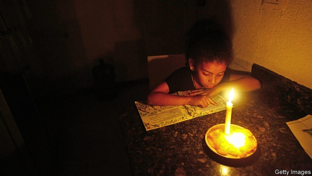

###### Lights out, but not curtains

# A blackout deepens Venezuela’s woes 

##### The regime blames Yanqui saboteurs. Others blame the regime’s incompetence 

 

> Mar 14th 2019 

THE SCENE by the polluted Guaire river that flows through central Caracas was dystopian. Residents from the nearby San Agustín slum had heard that a drainage pipe was leaking into the stream. They scrambled down its concrete banks with plastic containers to catch the water before it mixed with the sewage. 

On March 11th Caracas’s 2m people had been without water for four days. That was an effect of the longest power cut ever to hit Venezuela, which affected all 23 states. At least 40 people died, many in the decrepit hospitals. They included several premature babies, whom nurses had tried to save by hand-pumping ventilators for hours on end. Power eventually returned to Caracas, but as The Economist went to press the blackout continued in parts of the country. 

Nicolás Maduro, Venezuela’s dictator, blamed it on sabotage by “imperialists” seeking to topple his government. In a televised address on March 12th he claimed that the “demonic” government of the United States had used electromagnetic waves from mobile devices to disable the power system. The chief prosecutor has called for the supreme court to investigate whether Juan Guaidó, recognised by most Western and Latin American democracies as Venezuela’s interim president, had a hand in sabotaging the power grid. 

The United States is leading an international campaign to remove Mr Maduro, who has demolished democracy and wrecked the economy. It wants Mr Guaidó to succeed him. (Mr Maduro’s re-election last year was rigged. The constitution says that, in the absence of a legitimate president, the job goes to the leader of the national assembly, ie, Mr Guaidó, pending an election.)  

But there is no evidence that the United States turned out Venezuela’s lights. Incompetence and corruption probably caused the blackout. It is thought to have started with a bush fire close to a transmission line from the Guri hydroelectric plant, which supplies 80% of Venezuela’s electricity. That shut down the line, overloading the other two that deliver power from the plant, causing it to crash, too. The complex process of restarting the system was botched, probably by inexperienced workers. Almost half the skilled employees of the state-run electricity monopoly Corpolec, whose salaries are worth just a few dollars a month, have emigrated, said Alí Briceño, executive secretary of Venezuela’s electrical industry union. 

Brilliant Venezuelan hackers and the armed forces repelled the supposed saboteurs, Mr Maduro said. He promised that running water and power would soon return, but advised people nonetheless to buy torches and water tanks.  

That is good advice. Venezuela’s economy, which has shrunk by 50% since Mr Maduro succeeded Chávez in 2013, will now shrink faster. The United States, which had been the main cash buyer of oil, Venezuela’s biggest export, imposed sanctions on PDVSA, the state oil company, in January. “Very significant” measures are planned for financial institutions that support the regime, says Elliott Abrams, the United States’ special envoy for Venezuela. The government of India, an alternative customer for Venezuela’s oil, has, under American pressure, said it will ask importers to buy less. The power cut deepens these woes. It shut down the main port for oil tankers, bringing exports to a halt. 

Mr Guaidó and his American backers hope that economic chaos will force a change of regime. But the army continues to support Mr Maduro, as do Russia and China. The government has replaced some of its lost oil income with sales of gold, some of it fresh-mined. 

Few people turned out for a protest called by Mr Guaidó on March 12th. Despair is sapping the will to resist. As she waded through the Guaire river in search of clean water, Gladys Cisneros said she feels like a victim of a political game she does not understand. “They are not harming Maduro,” she lamented. “They are not harming Guaidó. But they are hurting me.” 

-- 

 单词注释:

1.blackout['blækaut]:n. 灯火管制, 暂时的意识丧失, 灯火熄灭, 删除 [计] 电网掉电 

2.woe[wәu]:n. 悲哀, 悲痛, 苦痛 

3.regime[rei'ʒi:m]:n. 政权, 当权期间, 政体, 社会制度, 体制, 情态 [医] 制度, 生活制度 

4.yanqui['jɑ:ŋki]:n. （西）美国人 a. 美国的；美国人的 

5.saboteur[.sæbә'tә:]:n. 从事破坏活动者, 阴谋破坏者 [法] 破坏者, 破坏份子, 怠工者 

6.incompetence[in'kɔmpitәns]:n. 不胜任, 不够格, 不合格, 不适合, 无能力, 不熟练, 无资格 [医] 机能不全, 闭锁不全, 关闭不全 

7.caracas[kә'rækәs]:n. 加拉加斯（委内瑞拉首都） 

8.dystopian[dis'tәjpiәn]:a. 反面乌托邦的,反面假想国的  n. 反面乌托邦的鼓吹者(或描写者) 

9.san[sɑ:n]:abbr. 存储区域网（Storage Area Networking） 

10.drainage['dreinidʒ]:n. 排水 [医] 引流[法], 导液[法], 排水[设备] 

11.scramble['skræmbl]:n. 攀缘, 爬行, 抢夺, 混乱, 紧急起飞 vi. 攀缘, 杂乱蔓延, 争夺, 拼凑, 匆忙 vt. 攀登, 扰乱, 使混杂 

12.sewage['sju:idʒ]:n. 脏水, 污水 [医] 污水, 污物 

13.Venezuela[,vene'zweilә]:n. 委内瑞拉 

14.decrepit[di'krepit]:a. 衰老的 

15.premature[.premә'tjuә]:a. 早产的, 过早的, 不成熟的 n. 早产儿, 过早发生的事物 

16.ventilator['ventileitә]:n. 通风设备, 送风机, 换气扇 [医] 通风机 

17.economist[i:'kɒnәmist]:n. 经济学者, 经济家 [经] 经济学家 

18.maduro[mә'duәrәu]:a. 色深味浓的烟草做的, (雪茄)色深味浓的 

19.dictator['dikteitә]:n. 命令者, 独裁者 

20.sabotage['sæbәtɑ:ʒ]:n. 怠工, 破坏活动, 破坏 vi. 从事破坏活动 vt. 妨害, 破坏 

21.imperialist[im'piәriәlist]:n. 帝国主义者, 皇帝统治的拥护者, 皇帝派的人 a. 帝国主义的 

22.topple['tɒpl]:vt. 推翻, 颠覆 vi. 倒塌, 摇摇欲坠 

23.televise['telivaiz]:v. 用电视播放, 播映 

24.demonic[di'mɒnik]:a. 恶魔的, 有魔力的 

25.electromagnetic[ilektrәj'mæ^nitik]:a. 电磁的, 由电磁石产生的 [电] 电磁的 

26.prosecutor['prɒsikju:tә]:n. 实行者, 告发者, 公诉人 [法] 原告, 起诉人, 检举人 

27.juan[hwɑ:n]:n. 胡安（男子名） 

28.interim['intәrim]:a. 暂时的, 临时的, 间歇的 n. 过渡时期 

29.grid[grid]:n. 格子, 栅格 [计] 网格 

30.demolish[di'mɒliʃ]:vt. 毁坏, 破坏, 粉碎 

31.rig[rig]:n. 装备, 帆装 vt. 装配, 装扮, 给船装帆, 垄断, 操纵 

32.legitimate[li'dʒitimәt]:a. 合法的, 正当的, 婚生的 vt. 认为正当, 立为嫡嗣, 使合法 

33.pending['pendiŋ]:a. 未决定的, 待决的, 行将发生的, 向外伸出的 prep. 在等待...之际, 直到...时为止, 在...期间, 在...过程中 

34.incompetence[in'kɔmpitәns]:n. 不胜任, 不够格, 不合格, 不适合, 无能力, 不熟练, 无资格 [医] 机能不全, 闭锁不全, 关闭不全 

35.corruption[kә'rʌpʃәn]:n. 腐败, 堕落, 贪污 [计] 论误 

36.guri[]: [地名] [韩国] 九里 

37.hydroelectric[.haidrәui'lektrik]:a. 水力电气的 [医] 水电的, 水电治疗的 

38.overload[.әuvә'lәud]:vt. 超载, 过载, 超过负荷 n. 超载, 负荷过多 

39.restart[.ri:'stɑ:t]:v. 重新开始, 重新启动 [计] 重新启动 

40.botch[bɒtʃ]:v. 拙笨地修补, 糟蹋 n. 拙笨的修补, 难看的补缀 

41.inexperience[.inik'spiәriәns]:n. 无经验, 不熟练 

42.monopoly[mә'nɒpәli]:n. 垄断, 专卖权, 独占事业 [经] 垄断, 专利品, 垄断(权)独占 

43.emigrate['emigreit]:v. (使)移居, (使)移民 

44.venezuelan[,venә'zweilәŋ]:a. 委内瑞拉的；委内瑞拉人的 

45.hacker['hækә]:[计] 计算机窃贼, 计算机新技术挑战者, 黑客 

46.repel[ri'pel]:vt. 逐退, 抵制, 使厌恶, 抗御 vi. 使厌恶, 相互排斥 

47.nonetheless[,nʌnðә'les]:conj. 然而, 尽管, 不过 adv. 不过, 仍然, 尽管如此, 然而 

48.buyer['baiә]:n. 买主, 买方 [经] 买主, 买方, 买手 

49.sanction['sæŋkʃәn]:n. 核准, 制裁, 处罚, 约束力 vt. 制定制裁规则, 认可, 核准, 同意 

50.pdvsa[]: 委内瑞拉石油公司总部所在地：委内瑞拉主要业务：炼油 

51.Elliott[]:n. 艾略特（姓氏） 

52.abram['eibrәm]:n. 艾布拉姆（男子名, 等于Abraham） 

53.envoy['envɒi]:n. 外交使节, 特使 [法] 使者, 代表, 使节 

54.importer[im'pɒ:tә]:n. 输入者, 进口商 [法] 进口商, 输入者 

55.backer['bækә]:n. 援助者, 支持者 [经] 背书人, 支持人 

56.chao[]:n. 钞（货币） 

57.sap[sæp]:n. 树液, 体液, 活力, 坑道, 消弱, 警棍 vt. 使排出体液, 使伤元气, 使衰竭, 挖坑道逼近, 逐渐侵蚀 vi. 挖坑道, 消弱 [计] 共享汇编程序, 结构分析程序, 符号汇编程序, 服务器广告协议 

58.wade[weid]:vi. 跋涉 vt. 涉水 n. 跋涉, 浅滩 

59.gladys[]:n. 格拉迪斯（女子名） 

60.cisneros[]: [人名] 西斯内罗斯; [地名] [哥伦比亚] 锡斯内罗斯 

61.lament[lә'ment]:n. 悲叹, 悔恨, 恸哭, 挽歌, 悼词 vt. 哀悼 vi. 悔恨, 悲叹 

