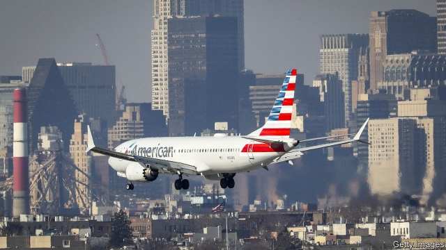

###### Brexit and Parliament

# Business this week 

 

> Mar 14th 2019 

The crash of an Ethiopian Airlines jet, killing all 157 people on board, raised safety questions about Boeing’s 737  MAX 8 aircraft. It was the second time a MAX 8 has crashed within five months, with what appear to be similar problems on take-off. As a precaution the EU stopped the plane from flying, as did many countries, including Australia, China and, eventually, America. Amid reports that the aircraft’s software may be at fault, Boeing was forced to ground the entire global fleet of 737 MAX 8s. See article. 

Turkey’s economy fell into recession at the end of 2018. For the whole of 2018 the economy grew by 2.6%, the weakest pace in a decade and far below the 7.4% recorded in 2017 in the wake of the government’s construction-led stimulus. The economy took a hit last year from a run on the lira, caused in part by uncertainty about the political independence of the central bank. See article. 

China’s exports declined by almost 21% in February compared with the same month last year, a much worse showing than most economists had forecast. Imports fell by 5.2%. The Chinese new-year celebrations may have had a distorting effect. China’s overall trade surplus for the month narrowed sharply, to $4.1bn. See article. 

Another big monthly drop in German industrial production led to more concern about the euro zone’s economy. The European Central Bank recently slashed its forecast for growth this year to 1.1% from a previous projection of 1.7% and pushed back any rise in interest rates until at least the end of the year. It also announced a new programme of cheap loans for banks. See article. 

In a grim week for economic news, American employers added just 20,000 jobs to the payrolls in February, far below the 311,000 that were created in January. Still, February marked the 101st consecutive month of job growth, a record streak. See article. 

Ned Sharpless, the director of America’s National Cancer Institute, was appointed the acting commissioner of the Food and Drug Administration, following the surprise announcement by Scott Gottlieb that he is standing down for personal reasons. In one of his final acts Mr Gottlieb this week issued regulations that in effect will stop convenience stores and petrol stations from selling a wide range of flavoured e-cigarettes. 

In a deal that highlights its shift away from making high-end chips for the video-game industry, Nvidia agreed to buy Mellanox, which provides technologies for artificial intelligence, machine learning and data analytics, for $6.9bn. Mellanox was founded in Israel, where companies that produce AI-related technology are flourishing. 

Volkswagen ramped up its plans for electric cars, announcing that it intends to launch almost 70 new models over the next decade, instead of the 50 it had planned. It now expects battery-powered vehicles to account for 40% of its sales by 2030, making it the largest car firm that is committed to electrification by some distance. The switch to electric cars, which need fewer workers to make than the gas-guzzling sort, threatens jobs. This is likely to provoke a confrontation with the firm’s powerful unions. See article. 

Renault, Nissan and Mitsubishi Motors created a new “consensus based” structure for their alliance, as they try to move on from the arrest of Carlos Ghosn for alleged financial wrongdoing (Mr Ghosn denies the charges). The new board replaces an arrangement where Mr Ghosn sat at the pinnacle of the alliance. It is chaired by Jean-Dominique Senard, Renault’s new chairman. The CEOs of the three carmakers are the board’s other members. Mr Senard will not, however, also become Nissan’s chairman, settling instead for vice-chairman. The cross-company stakes that each carmaker holds stay the same. 

Barrick Gold dropped its $18bn hostile bid for Newmont Mining, ending a short but fierce takeover battle in which each side criticised the other’s management strategy. The pair are instead to create the world’s largest goldmining site in a joint venture in Nevada. 

Levi Strauss filed for an IPO on the New York Stock Exchange, which could see the inventor of blue jeans valued at up to $6.2bn. The 165-year-old clothier was taken private in 1985 after 14 years as a public company on the stockmarket. 

As Tesla prepared to launch its newest vehicle, the Model Y, Elon Musk’s lawyers filed a defence against the Securities and Exchange Commission’s claim that he was in contempt of court for tweeting misleading company information, which would contravene last year’s settlement with the regulator. The filing accuses the SEC of trampling on Mr Musk’s right to free speech. Tesla, meanwhile, made a sharp U-turn and said it would not close most of its showrooms after all. 

-- 

 单词注释:

1.Brexit[]:[网络] 英国退出欧盟 

2.Ethiopian[.i:θi'әupiәn]:a. 埃塞俄比亚的 n. 埃塞俄比亚人 

3.MAX[mæks]:[计] 最大 

4.EU[]:[化] 富集铀; 浓缩铀 [医] 铕(63号元素) 

5.amid[ә'mid]:prep. 在其间, 在其中 [经] 在...中 

6.boe[bəu]:abbr. back outlet eccentric 后偏心（轮）出口 

7.recession[ri'seʃәn]:n. 后退, 凹处, 衰退, 归还 [医] 退缩 

8.stimulus['stimjulәs]:n. 刺激, 激励, 刺激品 [医] 刺激特, 刺激 

9.lira['liәrә]:n. 里拉 

10.uncertainty[.ʌn'sә:tnti]:n. 不确定, 不可靠, 不确定的事物 [化] 不确定度 

11.economist[i:'kɒnәmist]:n. 经济学者, 经济家 [经] 经济学家 

12.distort[dis'tɒ:t]:vt. 扭曲, 歪曲 [法] 歪区, 曲解, 纂改 

13.euro['juәrәu]:n. 欧元（欧盟的统一货币单位） 

14.slash[slæʃ]:v. 猛砍, 乱砍 n. 猛砍, 乱砍, 删减 [计] 斜线 

15.projection[prә'dʒekʃәn]:n. 发射, 计划, 突出部分, 设计, 推测 [计] 投影 

16.grim[grim]:a. 冷酷的, 坚强的, 残忍的, 可怕的, 讨厌的 

17.payroll['peirәul]:n. 工资名单, 饷金名单, 发放的工资总额 [计] 工资表, 工资单 

18.consecutive[kәn'sekjutiv]:a. 连续的, 联贯的 [计] 连续的; 连接的 

19.NED[ned]:牛津大词典 

20.Sharpless[]:n. (Sharpless)人名；(英)沙普利斯 

21.commissioner[kә'miʃәnә]:n. 委员, 理事, 行政长官 [法] 委员, 政府的特派员, 地方地官 

22.scott[skɔt]:n. 斯科特（男子名） 

23.Gottlieb[]:戈特利布（人名） 

24.chip[tʃip]:n. 屑片, 薄片, 碎片 vt. 削, 切, 削成碎片, 使摔倒, 凿 vi. 削下屑片 [计] 孔屑; 组件; 晶片; 芯片 

25.nvidia[]:恩威迪亚（芯片厂方） 

26.datum['deitәm]:n. 论据, 材料, 资料, 已知数 [医] 材料, 资料, 论据 

27.analytic[.ænә'litik]:a. 分析的, 善于分析的, 解析的 [医] 分析的 

28.Israel['izreil]:n. 以色列, 以色列后裔, 犹太人 

29.volkswagen['fɔ:lks,vɑ:^әn]:n. 大众汽车（财富500强公司之一） 

30.ramp[ræmp]:n. 斜坡, 坡道, 敲诈 vi. 狂跳乱撞, 乱冲, 敲诈, 蔓延 vt. 使有斜面, 敲诈 

31.electrification[i.lektrifi'keiʃәn]:n. 起电, 带电, 电气化 [化] 起电 

32.provoke[prә'vәuk]:vt. 激怒, 惹起, 诱导 [法] 刺激, 煽动, 激怒 

33.confrontation[.kɔnfrʌn'teiʃәn]:n. 对抗；对质；面对 

34.renault[rә'nәu]:n. 法国雷诺公司；雷诺（姓氏） 

35.nissan[]:n. 尼桑（日产汽车名） 

36.Mitsubishi[mi'tsubiʃi]:[经] 三菱 

37.alliance[ә'laiәns]:n. 联盟, 联合 [法] 同盟, 联盟, 联姻 

38.carlo[]:n. 卡洛（男子名） 

39.ghosn[]:[网络] 戈森 

40.allege[ә'ledʒ]:vt. 宣称, 主张, 提出, 断言 [法] 断言, 指称, 指证 

41.wrongdoing['rɒŋ'du:iŋ]:n. 干坏事, 坏事 

42.pinnacle['pinәkl]:n. 小尖塔, 尖峰, 高峰, 极点 vt. 造小尖塔, 置于尖顶上 

43.ceo[]:abbr. 首席执行官；执行总裁（chief executive officer） 

44.carmaker['kɑ:,meikә(r)]:n. 汽车制造商 

45.barrick[]:n. (Barrick)人名；(英)巴里克 

46.newmont[]:[网络] 纽蒙特；纽蒙特矿业公司；纽蒙特公司 

47.takeover[]:n. 接管, 接收 [经] 接收 

48.criticise['kritisaiz]:v. 批评, 吹毛求疵, 非难 

49.goldmine[]:n. 金矿, 成功的企业, 赢得巨利的活动 

50.Nevada[ni'vædә]:n. 内华达 

51.levi['li:vai]:n. 利瓦伊（男子名） 

52.strauss[]:n. 施特劳斯（奥国作曲家） 

53.ipo[]:abbr. 首次公开募股（Initial Public Offerings）；初次公开发行（Initial Public Offering） 

54.york[jɔ:k]:n. 约克郡；约克王朝 

55.jean[dʒi:n]:n. 牛仔裤, 牛仔布, 斜纹棉布 

56.clothier['klәuðiә]:n. 布商, 衣商 

57.stockmarket[s'tɒkmɑ:kɪt]: 证券市场; 证券交易所; 证券行情 

58.Tesla['teslә]:[电] 特斯拉 

59.Y[wai]:[计] 原型 [医] 钇(39号元素) 

60.elon[i'lɔn]:n. 埃伦（可溶性显影剂粉末） 

61.tweet[twi:t]:vi. 啁啾 n. 小鸟叫声 

62.misleading[mis'li:diŋ]:a. 引入歧途的, 使人误解的, 骗人的 [法] 误写姓名的, 误称的, 令人误解的 

63.contravene[,kɔntrә'vi:n]:vt. 违反, 触犯, 否认, 反驳, 抵触, 与...冲突 [法] 触法, 违反, 否定 

64.regulator['regjuleitә]:n. 调整者, 校准者, 校准器, 调整器, 标准钟 [化] 调节剂; 调节器 

65.SEC[sek]:[计] 秒, 辅助 [化] 尺寸排阻色谱法 

66.trample['træmpl]:n. 践踏(声), 蹂躏 v. 践踏, 无视 

67.showroom['ʃәuru:m]:n. 陈列室 [经] 样品间, 陈列室 

