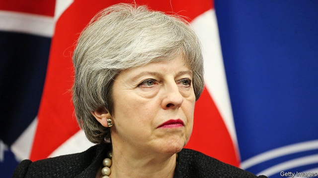

###### Brexit and Parliament

# Politics this week 

 

> Mar 14th 2019 

The British government’s draft Brexit deal was again roundly defeated in Parliament. The prime minister, Theresa May, had won assurances from Brussels that the “backstop”, which would keep Britain in the EU’s customs union to avoid a hard border in Ireland, was temporary, but this failed to satisfy Brexiteers. MPs also voted against a no-deal Brexit. See article. 

Two German journalists were forced to leave Turkey after President Recep Tayyip Erdogan’s government refused to renew their accreditation. Mr Erdogan has successfully tamed Turkey’s media. He has now trained his sights on the foreign press. 

Estonia’s prime minister, Juri Ratas, invited the anti-immigrant EKRE party to coalition talks, reversing a promise not to deal with the group. 

Finland’s government resigned ahead of a general election next month. 

Protests continued in Algeria, where the ailing president, Abdelaziz Bouteflika, dropped his bid for a fifth term and postponed an election scheduled for April 18th. A conference tasked with sorting out Algeria’s political future is expected to be led by Lakhdar Brahimi, a veteran diplomat. Most Algerians believe Mr Bouteflika, who can hardly speak or walk, is a figurehead for a ruling cabal of generals and businessmen. See article. 

The UN said that at least 535 and as many as 900 people were killed in fighting between two communities in the Democratic Republic of Congo in December. Investigators found that village chiefs helped plan the killings and that regional officials had not done enough to prevent the violence, despite warnings. 

The ruling party in Nigeria, the All Progressives Congress, took an early lead in state elections, strengthening the hand of Muhammadu Buhari, who won re-election as president in February. International observers said the poll was marred by violence. 

A malfunction at a hydroelectric dam in eastern Venezuela plunged most of the country into darkness for days, paralysing hospitals and destroying food stocks. Nicolás Maduro, the socialist dictator, blamed a Yanqui imperialist “electromagnetic attack”. Others blamed the government’s incompetence and corruption. America, one of many democracies that recognises Mr Maduro’s rival, Juan Guaidó, as the interim president, withdrew its remaining diplomatic staff. It also revoked the visas of 77 officials connected to Mr Maduro. See article. 

Two former police officers were arrested in Brazil for the murder last March of Marielle Franco, a councilwoman in Rio de Janeiro. One of the suspects used to live in the same building as President Jair Bolsonaro and his daughter dated one of Mr Bolsonaro’s sons. The other appears in a photo with Mr Bolsonaro taken before he was president. The detective in charge of the investigation said that these facts were “not significant at this time”. Mr Bolsonaro said he had posed with thousands of policemen. See article. 

Five pupils and two teachers were shot dead by two former students at a school on the outskirts of São Paulo. One shooter then killed the other and turned the gun on himself. 

India’s Election Commission announced that voting for a new parliament will take place in seven phases in April and May. There will be 1m polling stations for the country’s 900m-odd eligible voters. Narendra Modi’s Bharatiya Janata Party is seeking a second five-year term in government. The results will be announced on May 23rd. See article. 

A court in Australia sentenced George Pell, a cardinal and former senior Vatican official, to six years in prison for molesting two altar boys in 1996, when he was Archbishop of Melbourne. Mr Pell is the most senior member of the Catholic hierarchy to have been found guilty of sexual abuse. 

Police in Kazakhstan arrested Serikzhan Bilash, a Chinese-born activist trying to raise awareness of the internment of perhaps 1m ethnic Uighurs in Xinjiang province in China. The authorities said Mr Bilash had been “inciting ethnic hatred”. His supporters contend the government arrested him to maintain good relations with China. 

Separately, an official in Xinjiang said the mass detention camps there may be phased out. “Trainees in the centres will be fewer and fewer and, one day, the centres will disappear when society no longer needs them,” he said. 

America’s secretary of state, Mike Pompeo, accused China of using “coercive means” to block access to energy reserves in the South China Sea worth $2.5trn. China’s foreign ministry called his remarks “irresponsible”. 

Donald Trump presented a $4.75trn budget to Congress, which calls for a 5% increase in defence spending and cuts to a wide range of social programmes. It also seeks $8.6bn for his border wall. Democrats said it was dead on arrival, though that has been the case with presidential budgets for many years now. See article. 

California’s governor, Gavin Newsom, issued a moratorium on executions in the state, beefing up a court-ordered moratorium that has been in place since 2006. 

Paul Manafort received an additional sentence of 43 months for conspiring to sway witnesses. That comes on top of the 47 months Mr Trump’s former campaign chief recently received for tax and bank fraud. After his sentencing, New York state filed separate charges against Mr Manafort. 

Milwaukee, a city renowned for its beer, beat Houston and Miami to host the Democratic convention next year. Meanwhile, Beto O’Rourke threw his hat into the ring to be the party’s presidential candidate; he came a close second in the Senate race in Texas last year. See article. 

Nancy Pelosi, the Democratic Speaker of the House, said that she would not support an effort to impeach Donald Trump. She said: “He’s just not worth it.” 

-- 

 单词注释:

1.Brexit[]:[网络] 英国退出欧盟 

2.politic['pɒlitik]:a. 精明的, 明智的, 策略的 

3.roundly['raundli]:adv. 圆圆地, 直率地, 严厉地, 全面地 

4.theresa[ti'ri:zә]:n. 特丽萨（女子名） 

5.assurance[ә'ʃuәrәns]:n. 保证, 把握, 信心, 保险 [经] 保证, 担保, 保险 

6.Brussel[]:n. 布鲁塞尔（比利时首都） 

7.backstop['bækstɒp]:n. 挡球网, 接球手 [电] 背向停止 

8.Brexiteers[]:支持英国退欧的人（Brexiteer的复数） 

9.MP[]:国会议员, 下院议员 [计] 宏处理程序, 维护程序, 线性规划, 微程序, 多处理器 

10.recep[]:n. (Recep)人名；(土)雷杰普 

11.tayyip[]:[网络] 塔伊普 

12.accreditation[ә.kredi'teiʃәn]:n. 委派, 信托, 鉴定合格 [法] 立案, 备案, 任命 

13.erdogan[]:[网络] 埃尔多安；土耳其总理埃尔多安；艾尔多安 

14.juri[]: [人名]树里 

15.rata[]: ——见 pro rata 

16.coalition[.kәuә'liʃәn]:n. 结合体, 结合, 联合 [经] 联合, 联盟 

17.Algeria[æl'dʒiәriә]:n. 阿尔及利亚 

18.ailing['eiliŋ]:a. 生病的 [医] 患病的, 病痛的 

19.abdelaziz[]:n. (Abdelaziz)人名；(阿拉伯)阿卜杜勒-阿齐兹 

20.bouteflika[]:[网络] 布特弗利卡；阿尔及利亚总统布特弗利卡；布特佛里卡 

21.lakhdar[]: [地名] [阿尔及利亚] 拉赫达尔 

22.brahimi[]:[网络] 卜拉希米 

23.diplomat['diplәmæt]:n. 外交官, 有外交手腕的人 [法] 外交家, 外交官, 有权谋的人 

24.Algerian[æl'dʒiәriәn]:a. 阿尔及利亚的 n. 阿尔及利亚人 

25.figurehead['figәhed]:n. 装饰船头的人像, 傀儡领袖 

26.cabal[kә'bæl]:n. 秘密结社, (尤指政治上的)阴谋 vi. 策划阴谋 

27.UN[ʌn]:pron. 家伙, 东西 [经] 联合国 

28.Congo['kɔŋ^әu]:n. 刚果, 刚果河, 工夫茶 [建] 刚果, 直接刚果红 

29.investigator[in'vestigeitә]:n. 调查者, 审查者 [法] 审查员, 侦查员, 调查员 

30.killing['kiliŋ]:n. 谋杀, 杀戮 a. 杀害的, 疲惫的, 迷人的 

31.regional['ri:dʒәnәl]:a. 地方的, 地域性的 [医] 区的, 部位的 

32.Nigeria[nai'dʒiriә]:n. 尼日利亚 

33.buhari[]:[网络] 布哈里 

34.mar[mɑ:]:vt. 损毁, 损伤, 糟蹋 n. 三月 

35.malfunction[.mæl'fʌŋʃәn]:n. 故障, 失灵, 疾病 vi. 发生故障, 不起作用 [计] 故障 

36.hydroelectric[.haidrәui'lektrik]:a. 水力电气的 [医] 水电的, 水电治疗的 

37.Venezuela[,vene'zweilә]:n. 委内瑞拉 

38.paralyse['pærәlais]:vt. 使麻痹, 使瘫痪, 使无力, 使气馁, 终止 [医] 使麻痹, 使瘫痪 

39.maduro[mә'duәrәu]:a. 色深味浓的烟草做的, (雪茄)色深味浓的 

40.dictator['dikteitә]:n. 命令者, 独裁者 

41.yanqui['jɑ:ŋki]:n. （西）美国人 a. 美国的；美国人的 

42.imperialist[im'piәriәlist]:n. 帝国主义者, 皇帝统治的拥护者, 皇帝派的人 a. 帝国主义的 

43.electromagnetic[ilektrәj'mæ^nitik]:a. 电磁的, 由电磁石产生的 [电] 电磁的 

44.incompetence[in'kɔmpitәns]:n. 不胜任, 不够格, 不合格, 不适合, 无能力, 不熟练, 无资格 [医] 机能不全, 闭锁不全, 关闭不全 

45.corruption[kә'rʌpʃәn]:n. 腐败, 堕落, 贪污 [计] 论误 

46.juan[hwɑ:n]:n. 胡安（男子名） 

47.interim['intәrim]:a. 暂时的, 临时的, 间歇的 n. 过渡时期 

48.diplomatic[.diplә'mætik]:a. 外交的, 老练的 [法] 外交的, 外交上的, 文献上的 

49.revoke[ri'vәuk]:vt. 撤回, 废除 vi. 藏牌 n. 藏牌 [计] 取消权限程序 

50.Brazil[brә'zil]:n. 巴西 

51.marielle[]:n. (Marielle)人名；(法)马里耶勒 

52.franco['fræŋkәu]:a. 免费的 [经] 全部费用在内价, 运费准免的 

53.councilwoman['kajnsәl,wjmәn]:[法] 女议员 

54.rio[]:n. 里约（巴西共和国的旧首都） 

55.de[di:]:[化] 非对映体过量 [医] 铥(69号元素铥的别名,1916年Eder离得的假想元素) 

56.Janeiro[]:n. （葡）一月 

57.jair[]:[网络] 睚珥；贾伊尔；睢珥 

58.paulo[]:n. 保罗（男子名） 

59.shooter['ʃu:tә]:n. 射手, 狩猎者, 手枪 

60.eligible['elidʒәbl]:a. 有资格当选的, 合格的 n. 有资格者, 合格者, 适任者 

61.voter['vәutә]:n. 选民, 投票人 [法] 选民, 选举人, 投票人 

62.narendra[]:[网络] 纳伦德拉；纳兰德；纳然陀 

63.Bharatiya[]:[网络] 巴拉蒂亚 

64.Janata['dʒʌnətɑ:]:n. （印度）人民团体；人民党（印度联合政党） 

65.george[dʒɔ:dʒ]:n. 乔治（男子名）；自动操纵装置；英国最高勋爵勋章上的圣乔治诛龙图 

66.pell[pel]:n. 一卷羊皮纸 

67.cardinal['kɑ:dinәl]:n. 红衣主教, 鲜红色 a. 主要的, 深红色的 

68.Vatican['vætikәn]:n. 梵蒂冈, 罗马教廷 [法] 梵蒂冈, 罗马教廷 

69.molest[mә'lest]:vt. 妨碍, 干扰, 调戏 [法] 调戏, 作弄, 恶意干涉 

70.altar['ɒ:ltә]:n. 圣坛, 祭坛 

71.archbishop['ɑ:tʃ'biʃәp]:n. 大主教 

72.Melbourne['melbәn]:n. 墨尔本 

73.hierarchy['haiәrɑ:ki]:n. 等级制度, 僧侣统治, 等级体系 [计] 分级结构; 分层结构; 新闻组, 新闻组分层 

74.Kazakhstan[ˌkæzək'stæn]:n. 哈萨克斯坦（原苏联加盟共和国之一, 已于1991年宣布独立） 

75.activist['æktivist]:n. 激进主义分子 

76.awareness[ә'weәnis]:n. 意识, 认识 [计] 识别, 议定, 明白 

77.internment[in'tә:nmәnt]:n. 拘留 [法] 拘留, 收容, 禁闭 

78.ethnic['eθnik]:a. 人种的, 种族的 [医] 人种的 

79.Uighur[]:n. 维吾尔族人, 维吾尔语, 维吾尔人 

80.incite[in'sait]:vt. 刺激, 激励, 引诱 [法] 鼓动, 煽动 

81.supporter[sә'pɒ:tә]:n. 支持者, 后盾, 迫随者, 护身织物 [法] 支持者, 赡养者, 抚养者 

82.contend[kәn'tend]:vi. 奋斗, 斗争, 竞争 vt. 为...斗争 

83.detention[di'tenʃәn]:n. 阻止, 监禁, 拘留 [医] 隔离, 拘留, 滞留, 停滞 

84.trainee[trei'ni:]:n. 实习生, 新兵, 受培训者 [经] 学徒工, 培训人员 

85.mike[maik]:vi. 偷懒, 游手好闲 n. 休息, 游手好闲, 扩音器, 话筒 

86.pompeo[]:n. (Pompeo)人名；(意)蓬佩奥 

87.coercive[kәu'ә:siv]:a. 强制的, 强压的, 强迫的 [法] 强制的, 强迫的, 强行的 

88.irresponsible[.iri'spɔnsәbl]:a. 不负责任的；不可靠的 

89.democrat['demәkræt]:n. 民主人士, 民主主义者, 民主党党员 [经] 民主党 

90.presidential[.prezi'denʃәl]:a. 总统制的, 总统的, 首长的, 统辖的 [法] 总统的, 议长的, 总经理的 

91.gavin[]:n. 加文（男子名） 

92.newsom[]: [人名] [英格兰人姓氏] 纽瑟姆 Newsome的变体 

93.moratorium[.mɒrә'tɒ:riәm]:n. 延期偿付, 暂停 [法] 延期偿付, 延缓履行, 延期偿还期 

94.execution[.eksi'kju:ʃәn]:n. 实行, 完成, 执行, 死刑 [计] 执行 

95.paul[pɔ:l]:n. 保罗（男子名） 

96.manafort[]:[网络] 马纳福特 

97.conspire[kәn'spaiә]:vi. 阴谋, 协力, 共谋 vt. 图谋 

98.fraud[frɒ:d]:n. 欺骗, 欺诈, 诡计, 骗子 [经] 欺诈, 舞弊, 骗子 

99.york[jɔ:k]:n. 约克郡；约克王朝 

100.milwaukee[mil'wɔ:ki,(:)]:n. （美国）密尔沃基 

101.renowned[ri'naund]:a. 有名的, 有声誉的 

102.Houston['hju:stәn]:n. 休斯敦 

103.Miami[mai'æmi]:n. 迈阿密 

104.beto[]:n. (Beto)人名；(英)贝托 

105.Texas['teksәs]:n. 德克萨斯 

106.nancy['nænsi]:n. 女性化的男人 a. 女性化的, 同性恋的 

107.pelosi[]:佩洛西 

108.impeach[im'pi:tʃ]:vt. 控告, 怀疑, 检举, 弹劾 [法] 控告, 检举, 弹劾 

